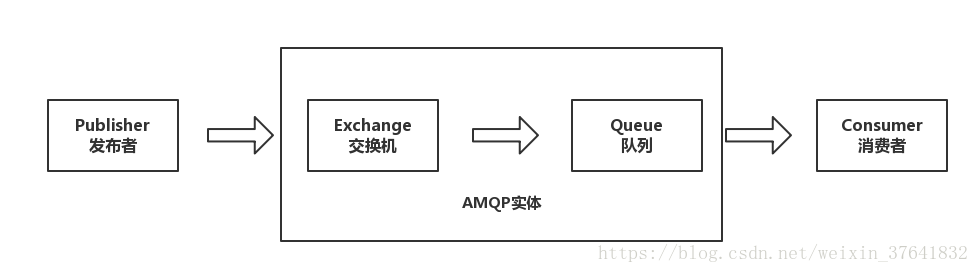
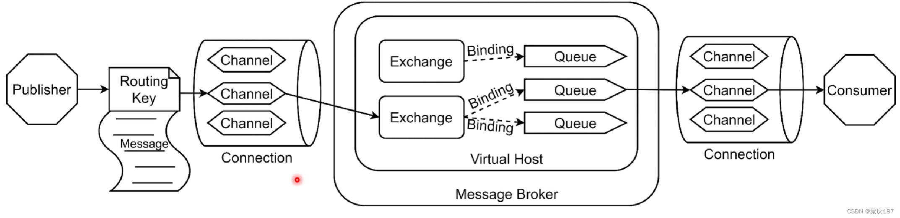

### 一、AMQP 是什么

AMQP（Advanced Message Queuing Protocol，高级消息队列协议）是一个进程间传递异步消息的网络协议。

### 二、AMQP模型

> AMQP 是一个集中式的消息队列协议
>
> 发送者无需关注向哪个队列发送, 接受者也无需关注重那个丢列接收.
>
> 路由由消息队列完成

rabbitmq 的实现

> 
>
> rabbitmq 增加了 virtual-host . 不过, 感觉这是一个馊主意. 如果要做物理忘了隔离,为啥不直接新起一个进程呢 ?

### AMQP 工作过程

- 发布者发布带有路由的消息

- 交换机根据路由转发到指定队列

- 消费者从队列中收到消息并处理

> 实际上, 这就是一个局域网内交换机的工作流程

#### 确认机制

amqp 包含了一个确认机制, 当消息从消息队列重给消费者后,不会立即删除,直到收到消费者的确认后才完全删除.

#### 无法路由

一个消息无法被路由是会被返回给发布者并丢弃.
或者消费者执行了延期操作,消息会被放到一个死信队列中.

#### 交换机的工作方式

| name                        | 说明 | inet 类比 |
| --------------------------- | ---- | --------- |
| 直接交换机(direct exchange) |      | 单播      |
| 扇形交换机(fanout exchange) |      | 广播      |
| 主题交换机(topic exchange)  |      | 订阅      |
| 头交换机(headers exchange)  |      | 多播      |

交换机状态:

- 持久
- 暂存. 重启后不存在了

- 默认交换机
  一个空字符串为 name 的直接交换机. 每新建一个队列时都会默认绑定到默认交换机上, 路由 key 与队列名相同
- 直接交换机
  根据路由键直接将消息投送到对应绑定的队列.
- 主题交换机
  直接交换机按照 key 严格匹配. 主题交换机是按照 key 模糊匹配.
  `'` 匹配一个.   `#` 匹配多个
- 头交换机.
  直接交换是按照路由 key 匹配的. 头交换机是按照头属性值匹配. 可以看作是路由的另一种体现形式.

- 扇形交换机
  忽略路由规则, 将消息路由到绑定它身上的所有队列.

> channel 与交换机的绑定其实就类似于局域网组网.

交换机小结

| 类型 | 路由规则 |
| ---- | -------- |
|Default|	自动命名的直交换机|
|Direct	|Routing Key==Binding Key，严格匹配|
|Fanout	|把发送到该 Exchange 的消息路由到所有与它绑定的 Queue 中|
|Topic	|Routing Key==Binding Key，模糊匹配|
|Headers	|根据发送的消息内容中的 headers 属性进行匹配|

Routing Key, Binding Key 

Routing Key 是生产者发送的路由规则.
Binding Key 是消费者接受消息的路由.

#### 队列

用于存储将被应用程序消费的消息

- name
- durable 重启后,队列是否保留 (持久化队列)
- auto-delete 最后一个消费者退订后自动被删除
- arguments

#### 消费者

两种方式消费

- push. 消息推送到应用. 消息订阅/注册
  消费者可以是独享消费者(一个消息被处理一次), 也可以是共享消费者
- pull. 应用主动获取消息

#### 消息机制

##### 消息确认

消息处理可能会失败, 消费者可能会崩溃, 也可能有网络问题. 队列中的消息不能发送完成后立马丢弃, 而是应该等待消费者正确处理消息后再删除.

- 自动确认: 消息队列将消息发送给应用后立即删除
- 显示确认: 只有收到应用的确认后才删除

##### 消息拒绝

消费者收到消息后,处理过程可能成功,也可能失败. 失败时可以发送一条`拒绝消息`通知消息队列将消息重新返回队列.

##### 消息预读

消息队列在收到确认前消费者能一次读多少消息

##### 消息属性

> Content type（内容类型）
> Content encoding（内容编码）
> Routing key（路由键）
> Delivery mode (persistent or not)
> 投递模式（持久化 或 非持久化）
> Message priority（消息优先权）
> Message publishing timestamp（消息发布的时间戳）
> Expiration period（消息有效期）
> Publisher application id（发布应用的 ID

有些属性是被 AMQP 代理所使用的，但是大多数是开放给接收它们的应用解释器用的。有些属性是可选的也被称作消息头（headers）。他们跟 HTTP 协议的 X-Headers 很相似。消息属性需要在消息被发布的时候定义。

> 感觉大部分不是很有用

消息主体

AMQP 的消息除属性外，也含有一个有效载荷 - Payload（消息实际携带的数据），它被 AMQP 代理当作不透明的字节数组来对待。

消息代理不会检查或者修改有效载荷。消息可以只包含属性而不携带有效载荷。它通常会使用类似 JSON 这种序列化的格式数据，为了节省，协议缓冲器和 MessagePack 将结构化数据序列化，以便以消息的有效载荷的形式发布。AMQP 及其同行者们通常使用 “content-type” 和 “content-encoding” 这两个字段来与消息沟通进行有效载荷的辨识工作，但这仅仅是基于约定而已。
消息持久化

消息能够以持久化的方式发布，AMQP 代理会将此消息存储在磁盘上。如果服务器重启，系统会确认收到的持久化消息未丢失。

简单地将消息发送给一个持久化的交换机或者路由给一个持久化的队列，并不会使得此消息具有持久化性质：它完全取决与消息本身的持久模式（persistence mode）。将消息以持久化方式发布时，会对性能造成一定的影响（就像数据库操作一样，健壮性的存在必定造成一些性能牺牲）。

#### 其他

##### 连接

AMQP 连接通常是长连接。AMQP 是一个使用 TCP 提供可靠投递的应用层协议。AMQP 使用认证机制并且提供 TLS（SSL）保护。当一个应用不再需要连接到 AMQP 代理的时候，需要优雅的释放掉 AMQP 连接，而不是直接将 TCP 连接关闭。

##### 通道

有些应用需要与 AMQP 代理建立多个连接。无论怎样，同时开启多个 TCP 连接都是不合适的，因为这样做会消耗掉过多的系统资源并且使得防火墙的配置更加困难。AMQP 0-9-1 提供了通道（channels）来处理多连接，可以把通道理解成共享一个 TCP 连接的多个轻量化连接。

在涉及多线程 / 进程的应用中，为每个线程 / 进程开启一个通道（channel）是很常见的，并且这些通道不能被线程 / 进程共享。

一个特定通道上的通讯与其他通道上的通讯是完全隔离的，因此每个 AMQP 方法都需要携带一个通道号，这样客户端就可以指定此方法是为哪个通道准备的。

##### 虚拟主机

支持在一个消息队列上实现环境隔离 (可以是用户, 用户组, 交换机, 队列等). 逻辑上构建虚拟主机. 客户端在发送消息时可以指定虚拟主机, 这样消息就只会在指定的范围内进行路由

