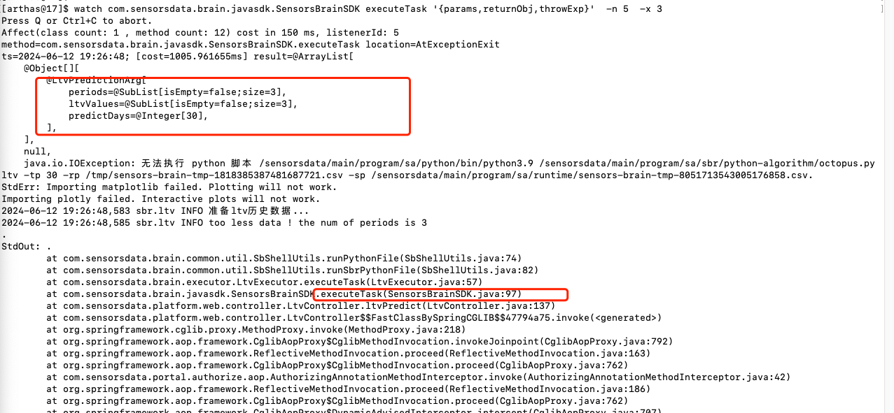
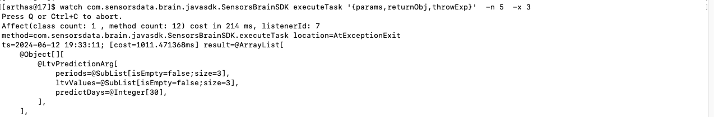
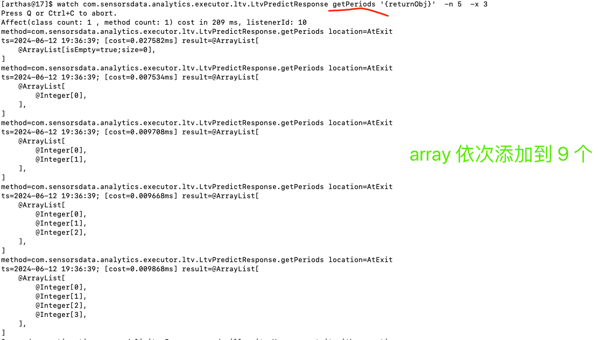
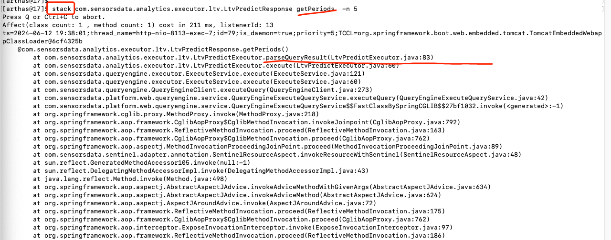
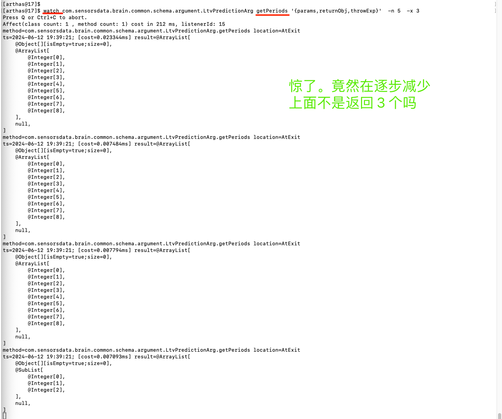
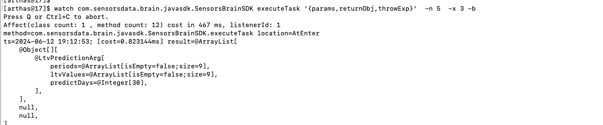
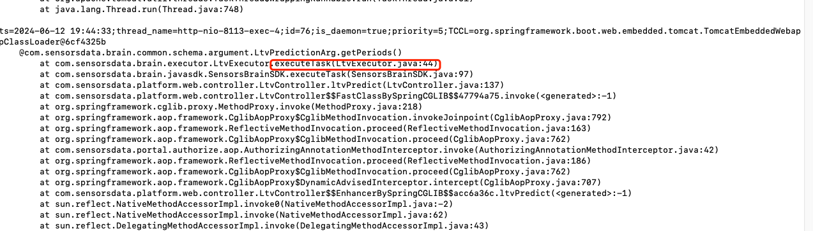
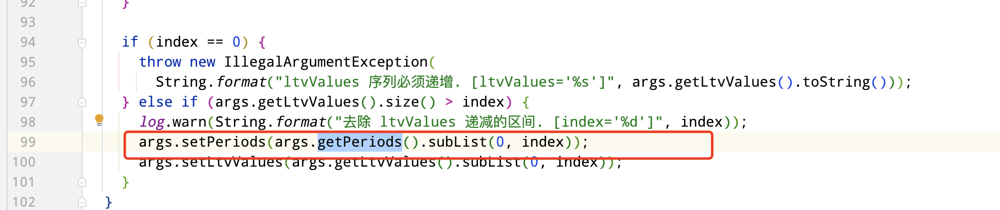
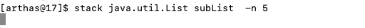
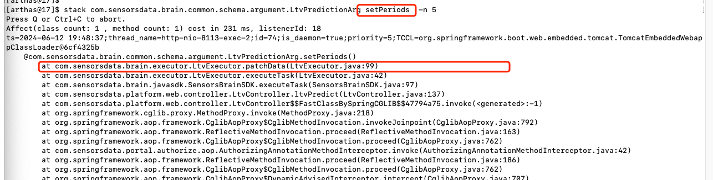

起因:

如上图. periods 中只有 3 条数据,数据校验时抛出异常.

诡异的是,通过直接执行对应的 sql. 命名有 9 条数据, 为啥传参时只有 3 条数据.

**代码超级简单**

```java

@AllArgsConstructor
@Getter
@Setter
@ToString
public class LtvPredictionArg {
    // 时间点
    private List<Integer> periods;
    // ltv 的真实值
    private List<Double> ltvValues;
    // 预测的时间范围，从 0 开始，包含截止日期. eg. 比如 predictDays=120 时，将会返回 LTV0 ~ LTV120 的值.
    private Integer predictDays;
}

@Getter
@Setter
public class LtvPredictResponse extends QueryResponse {
  private List<Integer> periods = new ArrayList<>();
  private List<Double> ltvValues = new ArrayList<>();
  private Integer predictDays;
}


// 查结果. arthas 看是 9 条数据
LtvPredictResponse ltvPredictResponse =
        queryEngineService.executeQuery(ltvMapper.tLtvPredictRequest2LtvPredictRequest(ltvPredictRequest));
    if (ltvPredictResponse != null) {
      // md, get,set 一把就变成了 3 条数据
      LtvPredictionArg arg = new LtvPredictionArg(ltvPredictResponse.getPeriods(), ltvPredictResponse.getLtvValues(),
          ltvPredictRequest.getPredictDays());
      try {
        // 执行的时候报错了
        LtvPredictionResult res = sensorsBrainSDK.executeTask(arg);
        tLtvPredictResponse.setResult(ltvMapper.ltvPredictionResult2TLtvPredictResult(res));
        tLtvPredictResponse.setStatus(LtvPredictStatus.fromIndex(res.getCode()).toString());
        tLtvPredictResponse.setIsDone(true);
        ....
      }
```


// watch  构造函数


// watch exec 函数




甚至怀疑是 java 的 bug 了. 为啥经过构造函数数据就变成 3 条了.

并且, get 是个 ArrayList, 为啥这里就是一个 SubList. 

> 其实, 早点意识到这个问题就能很快找到在哪里被改了成 3 条了. 下面分析.


百思不得其解

watch get 方法可以知道, response 肯定是对的




通过 stack 也可以印证这一点.




在 watch 报错的那个类的 get 方法,一看,竟然在减小. 而且,最初也是 9 个.




破案了.传参进去就9 个,那为啥 之前 arthas 观察到的是 3 个?

> md, 跟 arthas 实现的有关, 默认是返回这个函数执行完后入参的现场
>
> https://arthas.aliyun.com/doc/watch.html#%E5%8F%82%E6%95%B0%E8%AF%B4%E6%98%8E
>
> 因此,加 -b 查看函数调用前的传参


看结果 9 个,果然是这样.




那么.啥时候被删除的

显然,看看什么时候减小的堆栈就行了






原来如此


注意上面的 sublist , 其实, 最一开始对这个东西感到疑问,直接 stack sublist 的堆栈可能直接就能定位了.

直接 stack 可能找不到, 毕竟,太底层了,调这个函数的有一大堆.



不过,可以知道的是, 最终变成了 sublist 一定有个地方调了 set 方法

果不其然,一次命中




总结:

函数式编程还是🐂的