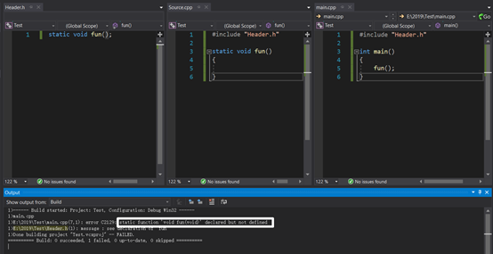
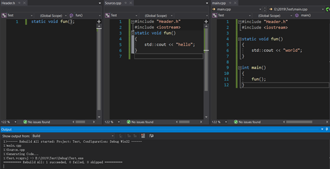
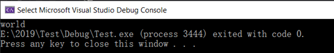
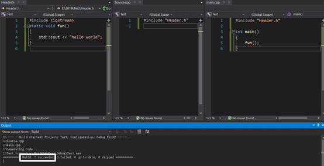
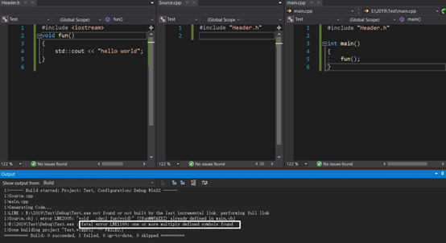
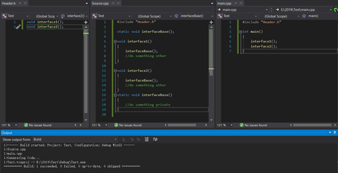

# [对c语言中static函数的理解](https://www.cnblogs.com/XiaoXiaoShuai-/p/12008646.html)

　　先看看前两篇博客：**[个人对头文件的理解](https://www.cnblogs.com/XiaoXiaoShuai-/p/12008602.html)、****[对声明和定义的理解](https://www.cnblogs.com/XiaoXiaoShuai-/p/12008629.html)。**　

　　static 函数只在定义该static函数的cpp中可见，在其他cpp中是不可见的。

　　举个例子，我建立了一个project，该project中有三个文件，一个头文件，和两个cpp文件。文件内容如下：

　　在build该project时会出错，错误提示是fun()函数声明了却未定义。

　　为什么编译器没有找到fun()函数的定义呢？我明明在Source.cpp中定义了fun()函数呀。

　　原因很简单：static函数的**作用域很小**，**只在本****cpp****中有效**，**而非**在整个project中都有效。所以在main.cpp中无法找到fun()函数的定义。

　　根据此特性，我们可以进行一些看似行不通的操作，比如下面这个：

 

　　咦，居然build成功了，这是为啥？我之前明明说过每个函数至多只能定义一次，这儿明明定义了“两次”。

　　我们先来看看最后输出的结果是啥？是“hello“还是”world“？

 

　　答案是“world“，即main()函数中所使用的fun()函数采用的是在main.cpp中fun()函数的定义。

　　根据刚才的结论，由于static函数的作用域只在本cpp中，因此Source.cpp和main.cpp中的fun()函数的作用域并没有冲突。之前所说的函数至多只能被定义一次，实际上完整的说法应该是：在**同一个作用域**下，函数至多被定义一次。道理正如：一个世界上不存在两片相同的树叶，但是在另一个平行世界中，却可能存在着和我们世界相同的树叶。（要想知道根本原因的话还是得看看csapp里面关于link的这部分内容）。

　　main.cpp中为fun()函数找到的定义自然是main.cpp中fun()的定义，而非Source.cpp中fun()函数的定义，因此，最后输出为“world“就可以解释的通了。

 

　　下面讨论两种情况

　　一、若是将static函数的完整定义写在头文件中会怎么样？结果是每个包含该头文件的cpp都可以使用该函数的定义。

 

　　二、若是将非static函数的完整定义写在头文件中会怎么样？结果是：若有多个cpp文件包含该头文件，在link时，会因该函数被重复定义而失败。

 

**那么****static****函数的真正用法是啥？**

  先说说头文件的作用：头文件的作用实际上就是声明接口（函数），包含该头文件的cpp（用户）可以调用头文件中所声明的接口（函数）。

  前面说过，static函数的定义只在定义该函数的cpp中有效。下面讨论两种情况：

　　第一种情况：某 static fun()函数在a.h中被声明，然后a.cpp包含了a.h并对static fun()函数作出了定义。此时有一个b.cpp出现了，它也包含了a.h，然后它就看到了fun()函数，它以为fun()函数是别人已经写好的接口，然后它就调用fun()函数，结果会如何？link失败，情况与上面的例子相同。**因此static函数的声明不应该放在头文件中。**

> 实际上 a.cpp 实现的 static fun() 和 a.h 中定义的 static fun() 都不是同一个

　　第二种情况：将static函数的定义放在头文件中，build会出问题么？不会，但是有必要这么做么？没必要。这样做的效果是让每个包含该头文件的cpp文件都能够使用该接口（函数），既然目的是让每个cpp文件都能够使用该接口，就没必要将该函数设置为static函数了。将其设置为非static函数，在某个头文件中声明，然后随便在某个cpp文件中定义不是更好么？如果将static函数定义在头文件中，会增加compile的工作量，因为每个包含该头文件的cpp文件都需要对该函数进行编译。**因此****static****的定义不应该放在头文件中。**

　　那么只剩下一种选择：**将static函数的声明和定义都放在cpp文件中。**

**使用static函数的正确姿势：**

　　其实static函数的真正作用在于数据隐藏（类似与c++类中的private属性），因为它只在定义它的cpp文件中是可见的嘛。

　　比如说有这么一种情况，库的制作者向用户提供了两个接口interface1()和interface2()，这两个函数都调用了interfaceBase()这个函数，但是制作者并不想将interfaceBase()展示给用户（可能是怕用户用interfaceBase()函数搞破坏吧），同时interfaceBase()这个函数又只在定义这两个函数的cpp文件中使用。那么应该怎样做呢？

　　首先肯定应该将interface1()和interface2()的声明放在某头文件中，为了提供接口嘛，然后在定义这两个个接口的cpp文件中定义一个static属性的interfaceBase()函数。最终如图所示：

 

　　但是我将一个非static函数的声明和定义都放在cpp文件中也能够达到隐藏接口的目的呀，那么使用static函数有什么优势呢？

　　**这又得从作用域说起了**，普通函数的作用域是整个**project**，而static函数的作用域仅限于本cpp。如果你在两个cpp文件中都定义了fun()函数，那么肯定会产生link错误。但是你如果在两个cpp文件中定义的是static fun()函数，那么就能避免link错误。

　　**因此使用****static****函数可以使函数重名。**

　　**综上：如果某个函数只在某个cpp中使用，并且不希望将这个函数暴露给外界，那么就应该将它定义为static函数，定义在cpp中。**

 

补充一种情况：

　　如果在a.cpp里面定义static void fun()，在b.cpp里面定义了void fun();编译时不会产生链接冲突，当在a,cpp里面调用fun()函数时，调用的是a.cpp中的static void fun()，而非b,cpp中void fun()。