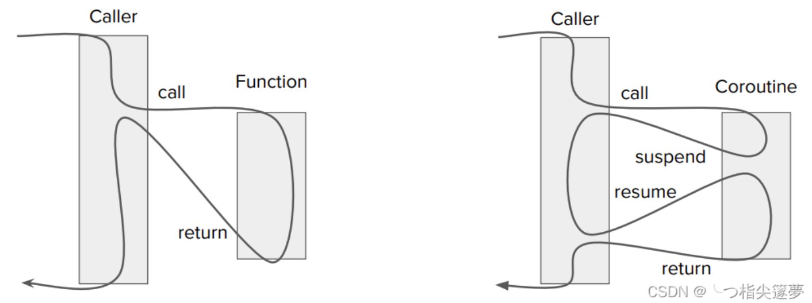

协程实际上是一种抽象的控制流. 所以,协程中调用的方法一定是非阻塞的, 否则,其实没啥意义.

- suspend 之前可以调用一个非阻塞 io.
- resume 可以 check 非阻塞 io 是否已经完成, 没有完成则继续 suspend, 否则可以继续执行后续的流程

类似的可以实现一个协程 `丐版 sleep`

- suspend 记录当前的时间
- resume 可以 check 是否满足条件. 满足条件的话再放行. 否则继续 suspend, 触发其他协程调度

异步接口在使用的时候必然发生轮询, 协程不过是把轮询交给了调度器