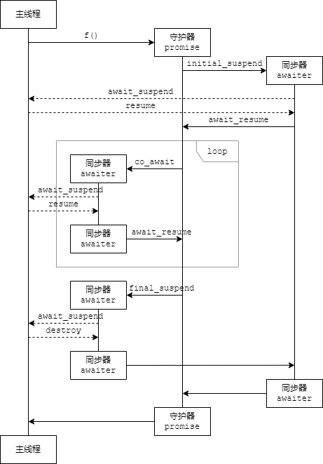
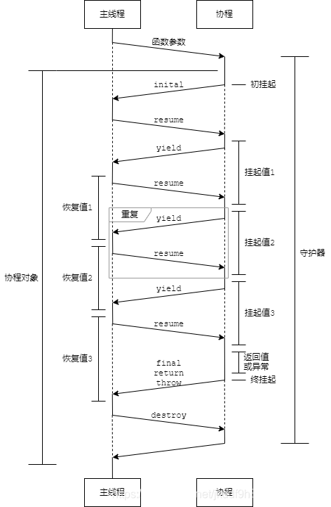

# [C++] C++20[协程](https://so.csdn.net/so/search?q=协程&spm=1001.2101.3001.7020)的几个特性补充

## 0. 前言

上文 [[C++\] C++20协程例子之惰性计算(附时序图)](https://blog.csdn.net/jkddf9h8xd9j646x798t/article/details/105803929) 已在目前MSVC的具体实现上, 大概描述了一个协程的整个工作流程.
 本文继续在MSVC的具体实现上, 简述各个阶段中的一些细节.

0.1 命名与定义

与上文同理, 本文依旧用守护器称呼promise_type, 用同步器称呼awaiter. 另外有时称co_yield作用的对象为挂起值或发送值, 外部给co_yield提供的对象称为恢复值或接收值. 返回值只用于称呼co_return和return作用的对象. 具体如下:

- 协程函数, 即含co_yield或co_return或co_await表达式的函数. 函数调用后返回一个协程对象.
- 守护器: 即promise_type的实例. 一个协程有且只有一个守护器
- 同步器, 即awaiter. 协程每次用co_await挂起时都要一个同步器.
- 协程对象, 即守护器调用get_return_object后的返回值, 也是协程函数被调用后的直接的返回值. 该返回值不同于协程运行结束后co_return的返回值.
- 协程中间对象, 即守护器, 同步器, 及协程对象.
- 挂起值, 发送值, 即co_yield表达式所作用的对象.
- 恢复值, 接收值, 即co_yield表达式的结果. 协程外部称恢复值, 协程内部称接收值.
- 返回值, 协程返回值, 即co_return表达式所作用的对象.
- 直接返回值, 协程函数直接返回值, 即协程对象.
- 主线程, 协程外部, 外部, 即建立并持有协程对象的外部的协程或主函数. (协程是可嵌套恢复的)
- 协程挂起, 挂起, 即协程暂停自身的运行, 并将运行权移交到协程外部.
- 协程恢复, 协程恢复, 即协程被外部通过调用其句柄的resume函数被唤醒, 并重获运行权.


## 1. 协程函数的近似实现

协程函数

```cpp
Lazy f(int a) {
	for(int i = 0; i < a; ++i) {
		co_yield i;
	}
	co_return 10;
}
```

近似实现如下

```c++
Lazy f(int a) {
	// 协程分配内存
	std::coroutine_traits<Lazy, int>::promise_type promise;
	// 按照C++标准 promise 应先构造再调用 initial_suspend 但 MSVC 的实际实现是颠倒的
	auto initial_awaiter = promise.initial_suspend();
	// initial_awaiter 在主线程栈上普通构造, 然后在协程栈上移动构造, 然后在主线程栈上析构, 最后实为协程栈上的对象
	promise::promise_type();
	auto __return__ = promise.get_return_object(); // __return__ 在主线程栈上普通构造
	// 该 __return__ 对象将在本协程函数挂起后给主线程函数作为协程函数的返回值
	co_await initial_awaiter; // 该 initial_awaiter 对象生命周期一直持续到协程结束
	
	try {
		for(int i = 0; i < a; ++i) {
			co_await promise.yield_value(i);
			// co_yield exp 转化为等价表达式 co_await promise.yield_value(exp)
		}
		promise.return_value(10);
		goto final_suspend;
		// co_return exp; 转化为等价表达式 promise.return_value(exp); goto final_suspend;
		// co_return; 转化为等价表达式 promise.return_void(); goto final_suspend;
	} catch(...) {
		promise.unhandled_exception();
		goto final_suspend;
	}

final_suspend:
	co_await promise.final_suspend();
	// initial_awaiter 析构
	// 实参 析构
	// promise 析构
	// 协程回收内存
}
```


### 2. co_await运算符的近似实现

co_await是一个新的单目运算符. 运算符可重载.
当其作用在对象上时, 例如下

```cpp
(co_await awaiter)
```

表达式近似实现如下

```c++
((awaiter.await_ready() ? : awaiter.await_suspend(this_coroutine_handle)), awaiter.await_resume())
```

整个表达式的类型由await_resume的返回类型决定.

当awaiter.await_ready返回false之后, 协程将自身挂起, 并将自身的句柄作为参数调用awaiter.await_suspend, 以方便未来恢复协程.
不管有没有调用awaiter.await_suspend挂起, 调用完awaiter.await_ready()返回true或者协程恢复后, 协程首先调用awaiter.await_resume, 取其返回值作为co_await表达式的结果.

### 3. 协程中间对象生命周期时序图



虚线为可选路径.
initial_suspend返回的同步器其生命周期会和守护器一起, 伴随整个协程的生命周期. 其余同步器只是中途的匆匆过客.
个人猜测initial_suspend返回的同步器生命周期过长应该是BUG, 未来可能会修复.
另外个人还猜测initial_suspend的调用以后可能会延后到守护器调用完构造函数之后.


#### 3.1 co_yield表达式所作用的对象(挂起值)的生命周期

co_yield rvalue 表达式等价展开为 co_await promise.yield_value(rvalue).
假设在这次求值中, 协程挂起过, 那么全过程运行如下:

    rvalue右值构造.
    调用promise.yield_value(rvalue), 返回一个同步器对象awaiter.
    调用awaiter.await_ready(), 返回false.
    调用awaiter.await_suspend(handle).
    协程挂起, 片刻后协程恢复.
    调用awaiter.await_resume()作为co_await表达式的结果.
    rvalue右值析构.

协程挂起时, 外部可以像访问左值引用一样随意访问该rvalue右值.

#### 3.2 co_return表达式所作用的对象(返回值)的生命周期

co_return rvalue 表达式等价展开为 promise.return_value(rvalue); goto final_suspend;.
在直到协程调用final_suspend试图做最后一次挂起前, 执行过程的顺序及细节如下:

    rvalue右值构造.
    调用promise.return_value(rvalue), 丢弃返回值.
    rvalue右值析构.
    调用promise.final_suspend(), 返回一个同步器对象awaiter.
    调用awaiter.await_ready(), 返回一个bool值.
    若返回的bool值为false, 调用awaiter.await_suspend(handle).

在协程做最后一次挂起前, rvalue右值析构了!. 也就是说, 想让return_value去只记录rvalue右值的地址, 然后在
final_suspend时挂起, 让外部访问该右值, 这是不可以的.
要让外部访问rvalue右值, 唯一的办法是在return_value中移动或复制rvalue.

##### 3.2.1 占位对象aligned_storage

下面提示一个C++用于存储任意值的占位对象. aligned_storage, 通过模板参数可以设定该对象具有不小于给的大小的任意大小, 并做内存对齐. 若将其置于其他对象内, 则其他对象初始化时可不对该占位对象做任何处理.
用法如下

    typename std::aligned_storage<sizeof(return_type)>::type return_value_buffer;

代码定义了一个名为return_type_buffer的对象, 其大小sizeof(return_type_buffer)大于等于sizeof(return_type), (多出来的空间是为了内存对齐).
我们可以在一个类内定义该任意值对象, 使得类初始化时, 不对该空间做任何处理(避免无谓的初始化和赋值移动).
稍后return_value接收并移动rvalue时, 可使用如下表达式(placement new, 置地new, 在给定空间上构建对象).

```c++
new(&return_value_buffer) return_type(std::move(rvalue));
```

使用以下表达式访问对象

```c++
*reinterpret_cast<const return_type*>(&return_value_buffer)
```

使用以下表达式析构对象

```c++
reinterpret_cast<return_type*>(&return_value_buffer)->~return_type();
```

另外亦可用联合体等实现不初始化对象.

#### 3.3 外部向协程发送的对象(恢复值)

为能让协程能直接访问恢复值, 而无需移动或复制, 外部向协程发送值后, 应立即恢复协程, 避免值析构.

#### 3.4 挂起值 恢复值 返回值 的生命周期时序图




### 4. co_yield表达式选择重载函数

co_yield exp 表达式的有等价展开式 co_await promise.yield_value(exp).
如果需要使用co_yield返回多种类型的对象, 可通过在守护器里提供多个yield_value函数重载来实现.
下面是重载的例子

		HandleDeliver yield_value(int v) noexcept {
			this->v = v;
			return HandleDeliver(handle);
		}
		HandleDeliver yield_value(float v) noexcept {
			this->v = (int)v;
			return HandleDeliver(handle);
		}

协程函数中co_yield现可接收float型对象:

    Lazy f() {
    	for(int i = 0; i < 5; ++i) {
    		co_yield i;
    	}
    	co_yield 3.14f;
    	co_return 10;
    }

4.1 co_return表达式不可重载

守护器类中, return_value不可重载, return_void和return_value亦不可共存(包括以模板形式).
同时, 一个协程函数不允许有return表达式.
### 5. 异常处理

出现异常时, 协程中自动生成的catch语句会接收异常对象, 并无参调用unhandled_exception.
unhandled_exception函数内部需用std::current_exception()获取该异常, 尔后可转移该异常或用std::rethrow_exception()重抛和重接异常.
下面是处理异常的一个例子.

```c++
			try {
				std::rethrow_exception(std::current_exception());
			} catch(std::exception& e) {
				std::cout << "exception in stack: " << e.what() << std::endl;
			} catch(...) {
				std::cout << "unknow exception" << std::endl;
				// 若不使用 std::current_exception 获取该异常, 则有内存泄漏风险, 特别是抛出的是在堆上创建的异常(throw new)
			}
```


注意, 协程栈上建立的异常对象不能抛到协程外, 栈上异常将在unhandled_exception调用结束后析构, 若需将异常抛到外部, 该异常需为在堆上创建(throw new). 由于unhandled_exception无法检测异常对象的大小信息, 因此栈上异常不宜移动, 对于栈上异常, unhandled_exception必须自行处理.

```c++
throw new std::exception(); // 可将其抛到协程外
throw std::exception(); // 不可抛到协程外, 该栈上异常将在 unhandled_exception 结束后析构
```

### 6. 协程销毁

调用final_suspend函数时, 函数若返回suspend_never()对象,(即协程库中await_ready恒返回true的对象), 则线程不被挂起, 协程连同守护器等正常销毁并回收内存, 最后转移运行权给主线程.
注意此时守护器已被析构, 最终获取到运行权的主线程无法读取协程中co_return等的返回值及其他遗留的数据.
final_suspend可返回suspend_always()(即协程库中await_ready恒返回false的对象)使线程临终时做最后一次挂起, 让主线程有机会读取遗留的数据(包括返回值, 异常等).
final_suspend返回suspend_always()做最后一次挂起之后,主线程需要且只能调用coroutine_handle<>.destroy将协程销毁,否则将导致内存泄漏.而且由于协程的运行已经结束,而且不能调用coroutine_handle<>.resume以试图恢复协程!
据标准, 协程调用suspend_always并挂起后, 调用coroutine_handle<>.resume的行为为UB行为.

#### 6.1 检查内存泄漏

可使用CRT提供的机制进行检查.
main函数第一行加上

```
	_CrtSetDbgFlag(_CRTDBG_ALLOC_MEM_DF | _CRTDBG_LEAK_CHECK_DF);
```

之后可在任意位置调用`_CrtDumpMemoryLeaks()`在调试窗口输出泄漏信息(能输出包括地址,大小,申请内存的new所在源码的位置,前16字节内容等), 若无内存泄漏则无输出.
 下面是一个内存泄漏的例子

```cpp
int main() {
	_CrtSetDbgFlag(_CRTDBG_ALLOC_MEM_DF | _CRTDBG_LEAK_CHECK_DF);

	new int[100];

	_CrtDumpMemoryLeaks();
	return 0;
}
```

### 7.协程句柄coroutine_handle

协程句柄对象的类型位于std::experimental命名空间. 以后可能会移动到std命名空间.

#### 7.1 协程的挂起时刻

协程通过守护器获取到同步器后, 调用await_suspend前完成自我挂起, 并将自身句柄传送给await_suspend. await_suspend函数可随意恢复其他协程(包括自己的协程), 而不必担心协程的恢复发生嵌套.

#### 7.2 协程句柄地址

标准里并未提到(或者我看漏了)同一个协程每次调用同步器的await_suspend函数进行挂起时, 给予的协程句柄是否都为同一个. 但测试中实际都为同一个, 即使是调用final_suspend返回的同步器的await_suspend函数进行挂起时, 给予的协程句柄依然为同一个. 由此可以断定同一个线程每次挂起时通过同步器给予的协程句柄都是同一个.
提取协程句柄的裸指针可调用address. 从裸指针重建协程句柄对象可使用coroutine_handle<>::from_address静态函数.
另外, 可使用coroutine_handle<promise_type>替换coroutine_handle<>获得一个可访问守护器的协程句柄类型. 亦可使用守护器重建协程句柄. 下面是一个在外部通过协程的守护器来恢复协程的例子.

    std::experimental::coroutine_handle<Lazy::promise_type>::from_promise(promise).resume();

### 7.3 从协程句柄恢复协程的运行

从主线程调用*resume*函数, 或直接使用`()`运算符即可. 例如下

```cpp
handle.resume() // 1
handle()        // 2
```

### 7.4 协程句柄与守护器

通过MSVC提供的头文件中的源码可以发现, 协程句柄的地址与守护器的地址差值是固定的, 也就是说, 一个守护器"陪伴"一个协程.
### 8. 协程的设计哲学

- 一个协程应至少有一个co_yield表达式(或co_await), 否则该协程与一普通函数功能相同, 没有协程的意义.
- 协程每次求值co_yield时(或co_await), 必然产生一对过程: 对外发送对象(有时为void), 和从外接收对象(有时为void).
- 协程可有返回值(有时为void).
- 协程每次挂起时(除initial_suspend), 必然有两个状态,
  - 要么是co_yield表达式求值中, 协程向外发送了对象, 并在等待接收对象中.
  - 要么是co_return结束了, 协程向外发送了返回值, 并等待销毁.
  - 要么是throw抛出了个异常, 协程向外发送了异常对象, 并等待销毁.
- 基于4, 一个协程挂起后, 外部为处理该协程, 首先要确认协程处于4.1, 还是4.2. 最简单的方法是给协程做终结标记.
- 协程co_yield挂起后, 外部处理该协程时, 要做的就是(编译器展开)
    - 首先, 接收co_yield发送的值(若非void).
    - 然后, 处理值
    - 最后, 向协程发送其可接收的值, 并恢复协程(建议).
- (见3.3 外部向协程发送的对象(恢复值))为能让协程能直接访问接收值, 而无需移动或复制, 外部向协程发送恢复值后, 应立即恢复协程, 避免恢复值析构.

### 9. 用于证明的测试代码与结果(部分)

给上文中所有函数都加上输出后, 得到如下结果.
其中函数名前的数字为this地址, await_suspend函数名后的数字为协程句柄的address返回的地址.

```
00735158 Lazy::promise_type::initial_suspend
006FF454 HandleDeliver::HandleDeliver
007351B8 HandleDeliver::HandleDeliver
006FF454 HandleDeliver::~HandleDeliver
00735158 Lazy::promise_type::promise_type
00735158 Lazy::promise_type::get_return_object
006FF7B0 Lazy::Lazy
007351B8 HandleDeliver::await_ready
007351B8 HandleDeliver::await_resume
f()
f(): 0
00735158 Lazy::promise_type::yield_value
00735178 HandleDeliver::HandleDeliver
00735178 HandleDeliver::await_ready
00735178 HandleDeliver::await_suspend 00735168
&result: 006FF7B0
>0
00735178 HandleDeliver::await_resume
00735178 HandleDeliver::~HandleDeliver
f(): 1
00735158 Lazy::promise_type::yield_value
00735178 HandleDeliver::HandleDeliver
00735178 HandleDeliver::await_ready
00735178 HandleDeliver::await_suspend 00735168
>1
00735178 HandleDeliver::await_resume
00735178 HandleDeliver::~HandleDeliver
f(): 2
00735158 Lazy::promise_type::yield_value
00735178 HandleDeliver::HandleDeliver
00735178 HandleDeliver::await_ready
00735178 HandleDeliver::await_suspend 00735168
>2
00735178 HandleDeliver::await_resume
00735178 HandleDeliver::~HandleDeliver
f(): 3
00735158 Lazy::promise_type::yield_value
00735178 HandleDeliver::HandleDeliver
00735178 HandleDeliver::await_ready
00735178 HandleDeliver::await_suspend 00735168
>3
00735178 HandleDeliver::await_resume
00735178 HandleDeliver::~HandleDeliver
f(): 4
00735158 Lazy::promise_type::yield_value
00735178 HandleDeliver::HandleDeliver
00735178 HandleDeliver::await_ready
00735178 HandleDeliver::await_suspend 00735168
>4
00735178 HandleDeliver::await_resume
00735178 HandleDeliver::~HandleDeliver
f() return
00735158 Lazy::promise_type::return_value
00735158 Lazy::promise_type::final_suspend
0073518C HandleDeliver::HandleDeliver
0073518C HandleDeliver::await_ready
0073518C HandleDeliver::await_suspend 00735168
0073518C HandleDeliver::~HandleDeliver
007351B8 HandleDeliver::~HandleDeliver
00735158 Lazy::promise_type::~promise_type
result.get_return(): 10
```

完整测试源码如下, 欢迎自行验证.

```c++
#include <iostream>
#include <experimental/coroutine>

class HandleDeliver {
	HandleDeliver() = delete;
	HandleDeliver(const HandleDeliver&) = delete;
	HandleDeliver& operator= (const HandleDeliver&) = delete;
	HandleDeliver& operator= (HandleDeliver &&) = delete;

private:
	std::experimental::coroutine_handle<>& phandle;
	bool is_ready;
public:
	HandleDeliver(std::experimental::coroutine_handle<>& phandle, bool is_ready=false) noexcept :
		phandle(phandle),
		is_ready(is_ready) {
		std::cout << this << " " << __FUNCTION__ << std::endl;
	}
	HandleDeliver(HandleDeliver &&self) noexcept :
		phandle(self.phandle) {
		std::cout << this << " " << __FUNCTION__ << std::endl;
	}
	~HandleDeliver() {
		std::cout << this << " " << __FUNCTION__ << std::endl;
	}
	bool await_ready() const noexcept {
		std::cout << this << " " << __FUNCTION__ << std::endl;
		return is_ready;
	}
	void await_suspend(std::experimental::coroutine_handle<> handle) noexcept {
		std::cout << this << " " << __FUNCTION__ << " " << handle.address() << std::endl;
		phandle = handle;
	}
	void await_resume() const noexcept {
		std::cout << this << " " << __FUNCTION__ << std::endl;
	}
};

class Lazy {
	Lazy() = delete;
	Lazy(const Lazy&) = delete;
	Lazy& operator= (const Lazy&) = delete;
	Lazy& operator= (Lazy &&) = delete;

public:
	class promise_type {
		promise_type(const promise_type&) = delete;
		promise_type(promise_type &&) = delete;
		promise_type& operator= (const promise_type&) = delete;
		promise_type& operator= (promise_type &&) = delete;

	private:
		std::experimental::coroutine_handle<> handle;
		int v;
		bool is_overed;

	public:
		HandleDeliver initial_suspend() noexcept {
			std::cout << this << " " << __FUNCTION__ << std::endl;
			return HandleDeliver(handle, false);
		}
		promise_type() noexcept : v(-1), is_overed(false) {
			std::cout << this << " " << __FUNCTION__ << std::endl;
		}
		Lazy get_return_object() noexcept {
			std::cout << this << " " << __FUNCTION__ << std::endl;
			return Lazy(*this);
		}
		HandleDeliver yield_value(int v) noexcept {
			std::cout << this << " " << __FUNCTION__ << std::endl;
			this->v = v;
			return HandleDeliver(handle);
		}
		HandleDeliver yield_value(float v) noexcept {
			std::cout << this << " " << __FUNCTION__ << std::endl;
			this->v = (int)v * 10;
			return HandleDeliver(handle);
		}
		void return_value(int v) noexcept {
			std::cout << this << " " << __FUNCTION__ << std::endl;
			this->v = v;
		}
		HandleDeliver final_suspend() noexcept {
			std::cout << this << " " << __FUNCTION__ << std::endl;
			is_overed = true;
			return HandleDeliver(handle);
		}
		void unhandled_exception() {
			try {
				std::rethrow_exception(std::current_exception());
			} catch(std::exception& e) {
				std::cout << "exception: " << e.what() << std::endl;
			} catch(...) {
				std::cout << "unknow exception" << std::endl;
			}
		}
		~promise_type() noexcept {
			std::cout << this << " " << __FUNCTION__ << std::endl;
		}

	public:
		void resume() const noexcept {
			handle.resume();
		}
		bool overed() const noexcept {
			return is_overed;
		}
		int value() const noexcept {
			return v;
		}
		void destroy() noexcept {
			handle.destroy();
		}
	};

private:
	class iterator_type {
		iterator_type() = delete;
		iterator_type(const iterator_type&) = delete;
		iterator_type& operator= (const iterator_type&) = delete;
		iterator_type& operator= (iterator_type &&) = delete;

	private:
		Lazy &z;

	public:
		explicit iterator_type(Lazy& z) noexcept : z(z) {}
		iterator_type(iterator_type &&self) noexcept : z(self.z) {}
		iterator_type& operator++ () noexcept {
			z._next();
			return *this;
		}
		bool operator!= (iterator_type const& other) const noexcept {
			return !z.is_overed;
		}
		int operator* () const noexcept {
			return z._get();
		}
	};

private:
	promise_type & promise;
	bool is_overed;
	int retv;

protected:
	bool _next() {
		if(is_overed) {
			return false;
		}
		promise.resume();
		// promise.rethrow_if_has_exception();
		if(promise.overed()) {
			retv = promise.value();
			promise.destroy();
			is_overed = true;
			return false;
		}
		return true;
	}
	int _get() const noexcept {
		if(is_overed) {
			return -1;
		} else {
			return promise.value();
		}
	}

public:
	explicit Lazy(promise_type& promise) noexcept :
		promise(promise),
		is_overed(false),
		retv() {
		std::cout << this << " " << __FUNCTION__ << std::endl;
	}
	Lazy(Lazy &&self) noexcept :
		promise(self.promise),
		is_overed(self.is_overed) {
		std::cout << this << " " << __FUNCTION__ << std::endl;
	}
	iterator_type begin() {
		return iterator_type(*this);
	}
	iterator_type end() {
		return iterator_type(*this);
	}
	int get_return() {
		if(is_overed) {
			return retv;
		} else {
			return -1;
		}
	}
};

Lazy f() {
	std::cout << "f()" << std::endl;
	for(int i = 0; i < 5; ++i) {
		std::cout << "f(): " << i << std::endl;
		co_yield i;
	}
	std::cout << "f() return" << std::endl;
	co_return 10;
}

int main() {
	_CrtSetDbgFlag(_CRTDBG_ALLOC_MEM_DF | _CRTDBG_LEAK_CHECK_DF);
	{
		Lazy result = f();
		std::cout << "&result: " << &result << std::endl;
		for(int i : result) {
			std::cout << ">" << i << std::endl;
		}
		std::cout << "result.get_return(): " << result.get_return() << std::endl;
	}
	_CrtDumpMemoryLeaks();
	getchar();
	return 0;
}
```


