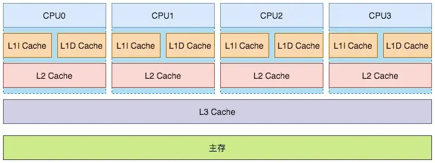
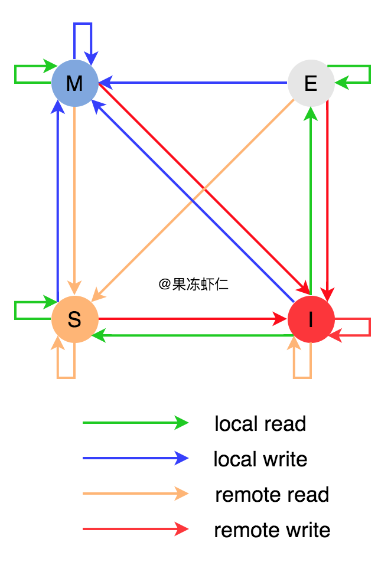

## **CPU架构**

## **缓存与主存**

解读缓存一致性（Cache Coherency），先看一下CPU的架构



图示一个4核CPU，有三个级别的缓存，分为是L1 Cache（一级缓存）、L2 Cache（二级缓存）、L3 Cache（三级缓存）

其中一级缓存有两部分组成：L1I Cache（一级指令缓存）和L1D Cache（一级数据缓存）。

越靠近CPU的缓存速度越快，单价也更昂贵。其中一级和二级如今都属于片内缓存（在CPU核内，早期L2缓存是片外的）独立归属给各个CPU，而**三级缓存是CPU间共享的**。

查询缓存的时候也是由近及远，优先从一级缓存去查找，找到就结束查找，找不到则再去二级缓存查找。二级缓存找不到去三级缓存查找。三级缓存还找不到就去主存（Main Memory）查找。这里说的主存，就是我们平常说的内存。

内存是DRAM（Dynamic RAM），缓存是SRAM（Static RAM）。

## **缓存行**

CPU操作缓存的单位是”缓存行“（cacheline），也就是说如果CPU要读一个变量x，那么其实是读变量x所在的整个缓存行。

### **缓存行大小**

好了，既然我们知道了CPU读写缓存的单位是缓存行，那么缓存行的大小是多少呢？

查看机器缓存行大小的方法有很多，在Linux上你可以查看如下文件确认缓存行大小：

```
# L1D Cache
cat /sys/devices/system/cpu/cpu0/cache/index0/coherency_line_size

# L1I Cache
cat /sys/devices/system/cpu/cpu0/cache/index1/coherency_line_size

# L2 Cache
cat /sys/devices/system/cpu/cpu0/cache/index2/coherency_line_size

# L3 Cache
cat /sys/devices/system/cpu/cpu0/cache/index3/coherency_line_size
```

或者用getconf命令：

```text
# L1D Cache
getconf LEVEL1_DCACHE_LINESIZE

# L1I Cache
getconf LEVEL1_ICACHE_LINESIZE

# L2 Cache
getconf LEVEL2_CACHE_LINESIZE

# L3 Cache
getconf LEVEL3_CACHE_LINESIZE
```

一般会看到：64。表示的是64字节。

注意，单核CPU上，可能没有L3缓存。比如我在腾讯云买的最低配云主机……

## **MESI**

并发场景下（比如多线程）如果操作相同变量，如何保证每个核中缓存的变量是正确的值，这涉及到一些”缓存一致性“的协议。其中应用最广的就是MESI协议（当然这并不是唯一的缓存一致性协议）。


## **状态介绍**

在缓存行的元信息中有一个Flag字段，它会表示4种状态，分为对应如下所说的M、E、S、I状态。

| 状态           | 描述                                                         |
| -------------- | ------------------------------------------------------------ |
| M（Modified）  | 代表该缓存行中的内容被修改了，并且该缓存行只被缓存在该CPU中。这个状态的缓存行中的数据和内存中的不一样，在未来的某个时刻它会被写入到内存中（当其他CPU要读取该缓存行的内容时。或者其他CPU要修改该缓存对应的内存中的内容时 |
| E（Exclusive） | 代表该缓存行对应内存中的内容只被该CPU缓存，其他CPU没有缓存该缓存对应内存行中的内容。这个状态的缓存行中的内容和内存中的内容一致。该缓存可以在任何其他CPU读取该缓存对应内存中的内容时变成S状态。或者本地处理器写该缓存就会变成M状态 |
| S（Shared）    | 该状态意味着数据不止存在本地CPU缓存中，还存在别的CPU的缓存中。这个状态的数据和内存中的数据是一致的。当其他CPU修改该缓存行对应的内存的内容时会使该缓存行变成 I 状态 |
| I（Invalid）   | 代表该缓存行中的内容是无效的                                 |

## **总线嗅探机制**

CPU和内存通过总线（BUS）互通消息。

CPU感知其他CPU的行为（比如读、写某个缓存行）就是是通过嗅探（Snoop）线性中其他CPU发出的请求消息完成的，有时CPU也需要针对总线中的某些请求消息进行响应。这被称为”总线嗅探机制“。

这些消息类型分为请求消息和响应消息两大类，细分为6小类。


| 消息类型               | 请求/响应 | 描述                                                         |
| ---------------------- | --------- | ------------------------------------------------------------ |
| Read                   | 请求      | 通知其他处理器和内存，当前处理器准备读取某个数据。该消息内包含待读取数据的内存地址 |
| Read Response          | 响应      | 该消息内包含了被请求读取的数据。该消息可能是主内存返回的，也可能是其他高速缓存嗅探到Read 消息返回的 |
| Invalidate             | 请求      | 通知其他处理器删除指定内存地址的数据副本（缓存行中的数据）。所谓“删除”，其实就是更新下缓存行对应的FLAG（MESI那个） |
| Invalidate Acknowledge | 响应      | 接收到Invalidate消息的处理器必须回复此消息，表示已经删除了其高速缓存内对应的数据副本 |
| Read Invalidate        | 请求      | 此消息为Read 和 Invalidate消息组成的复合消息，主要是用于通知其他处理器当前处理器准备更新一个数据了，并请求其他处理器删除其高速缓存内对应的数据副本。接收到该消息的处理器必须回复Read Response 和 Invalidate Acknowledge消息 |
| Writeback              | 响应      | 消息包含了需要写入内存的数据和其对应的内存地址               |

## **状态流转**





### **记忆要点**

有些眼花缭乱，个人总结了一些要点，方便记忆。

- I 状态有5条外出的线（local read有两种可能的状态转移） 

- - 当其他CPU没有这个缓存行时，当前CPU从内存取缓存行更新到Cache，并把状态设置为E

  - 当其他CPU有这份数据时： 

  - - 如果其他CPU是M状态，则同步其缓存到主存，然后两个CPU状态再变为S
    - 如果其他CPU是S或E，则两个CPU状态都变为S


- MSE三个状态都是有4条外出的线（对应4种操作，只会流转到一个状态）
- 而想从其他状态流转到达E状态，比较刁钻。只能从 **I 状态**进行**local read**，并且**其他CPU没有该缓存行数据**时，三个限定条件（加粗部分）缺一不可。

### **举例**

假设CPU0、CPU1、CPU2、CPU3中有一个缓存行（包含变量x）都是S状态。

此时CPU1要对变量x进行写操作，这时候通过总线嗅探机制，CPU0、CPU2、CPU3中的缓存行会置为I状态（无效），然后给CPU1发响应（Invalidate Acknowledge），收到全部响应后CPU1会完成对于变量x的写操作，更新了CPU1内的缓存行为M状态，但不会同步到内存中。

接着CPU0想要对变量x执行读操作，却发现本地缓存行是I状态，就会触发CPU1去把缓存行写入（回写）到内存中，然后CPU0再去主存中同步最新的值。

## **Store Buffer**

当然前面的描述隐藏了一些细节，比如实际CPU1在执行写操作，更新缓存行的时候，其实并不会等待其他CPU的状态都置为I状态，才去做些操作，这是一个同步行为，效率很低。当前的CPU都引入了Store Buffer（写缓存器）技术，也就是在CPU和cache之间又加了一层buffer，在CPU执行写操作时直接写StoreBuffer，然后就忙其他事去了，等其他CPU都置为I之后，CPU1才把buffer中的数据写入到缓存行中。

## **Invalidate Queue**

看前面的描述，执行写操作的CPU1很聪明啦，引入了store buffer不等待其他CPU中的对应缓存行失效就忙别的去了。而其他CPU也不傻，实际上他们也不会真的把缓存行置为I后，才给CPU0发响应。他们会写入一个Invalidate Queue（无效化队列），还没把缓存置为I状态就发送响应了。

后续CPU会异步扫描Invalidate Queue，将缓存置为I状态。和Store Buffer不同的是，在CPU1后续读变量x的时候，会先查Store Buffer，再查缓存。而CPU0要读变量x时，则不会扫描Invalidate Queue，所以存在脏读可能。


## **L3 Cache在MESI中的角色**

L3 缓存是所有CPU共享的一个缓存。纵观刚才描述的MESI，好像涉及的都是CPU内的缓存更新，不涉及L3缓存，那么L3缓存在MESI中扮演什么角色呢？

其实在常见的MESI的状态流程描述中（我上文也是），所有提到”内存“的地方都是值得商榷的。比如我上一节举的例子中，CPU0中某缓存行是I，CPU1 中是M。当CPU0想到执行local read操作时，就会触发CPU1中的缓存写入到内存中，然后CPU0从内存中取最新的缓存行。其实准确来讲这里是不准确的，因为由于L3缓存的存在，这里其实是直接从L3缓存读取缓存行，而不直接访问内存。

个人猜测是如果描述MESI状态流转的时候引入L3缓存，会造成描述会极其复杂。所以一般的描述都好似有意地忽略了L3缓存。


