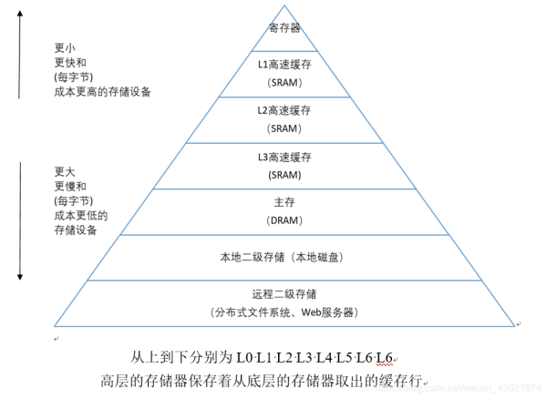
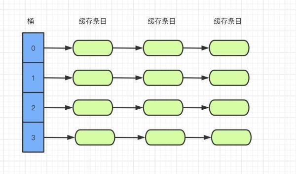
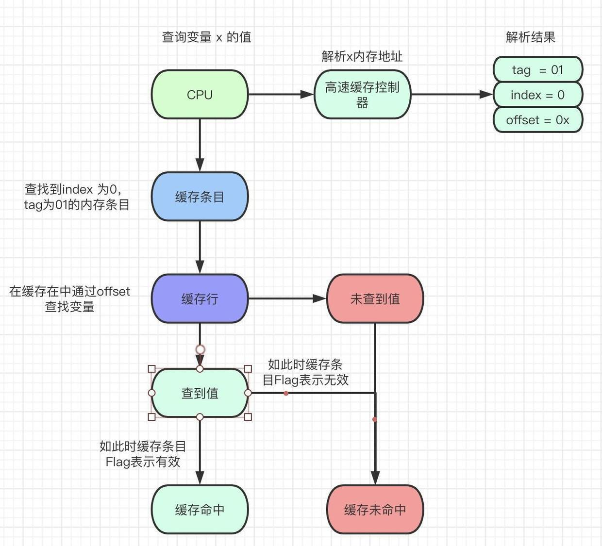
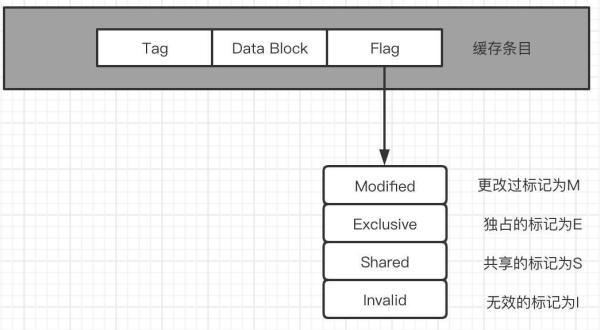
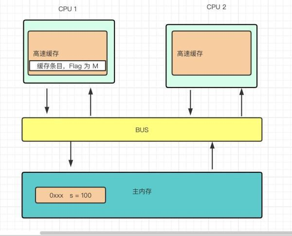
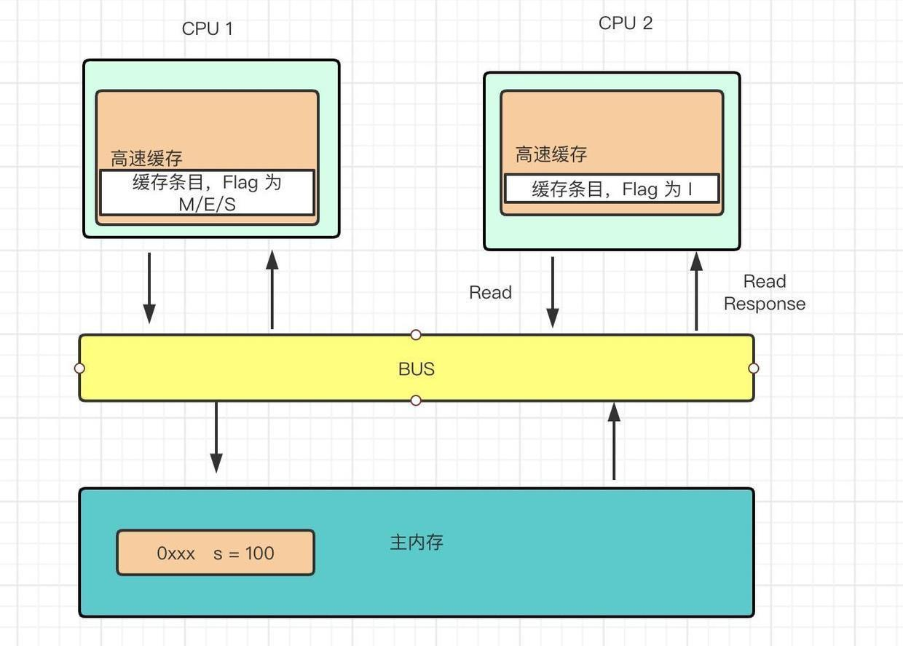
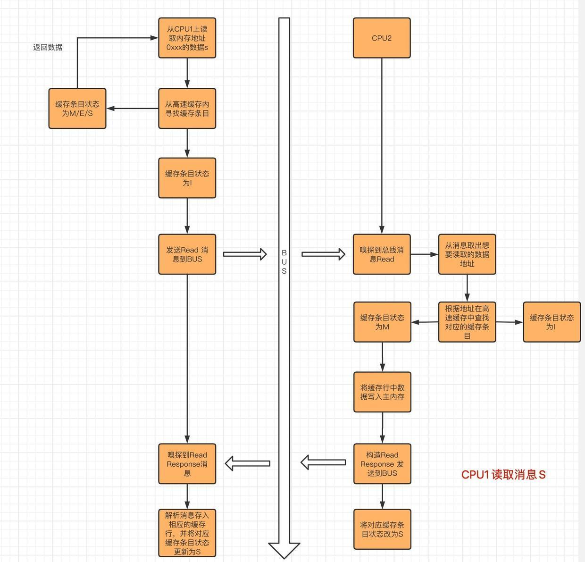
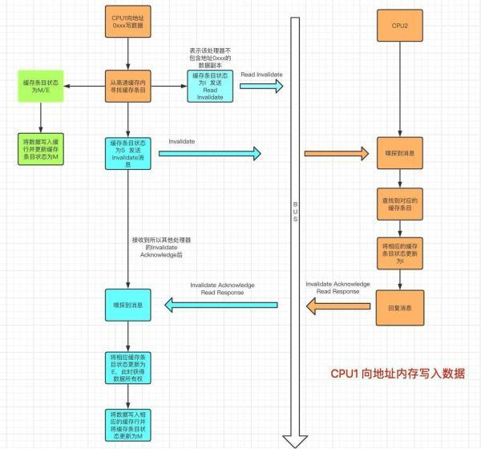
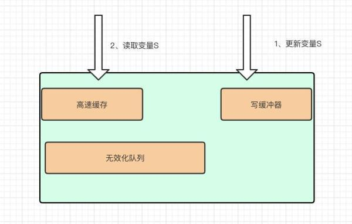
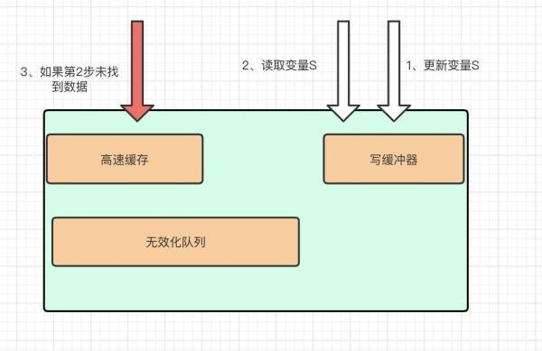

# 看懂这篇，才能说了解并发底层技术

文章来源：51cto我不秃头

# 零、开局

前两天我搞了两个每日一个知识点，对多线程并发的部分知识做了下概括性的总结。但通过小伙伴的反馈是，那玩意写的比较抽象，看的云里雾里晕晕乎乎的。所以又针对多线程底层这一块再重新做下系统性的讲解。

好了，回归正题。在多线程并发的世界里synchronized、volatile、JMM是我们绕不过去的技术坎，而重排序、可见性、内存屏障又有时候搞得你一脸懵逼。有道是知其然知其所以然，了解了底层的原理性问题，不论是日常写BUG还是面试都是必备神器了。

**先看几个问题点：**

1、处理器与内存之间是怎么交互的？

2、什么是缓存一致性协议？

3、高速缓存内的消息是怎么更新变化的？

4、内存屏障又和他们有什么关系？

如果上面的问题你都能倒背如流，那就去看看电影放松下吧！

# 一、高速缓存

目前的处理器的处理能力要远远的胜于主内存（DRAM）访问的效率，往往主内存执行一次读写操作所需的时间足够处理器执行上百次指令。所以为了填补处理器与主内存之间的差距，设计者们在主内存和处理器直接引入了高速缓存（Cache）。如图：

其实在现代处理器中，会有多级高速缓存。一般我们会成为一级缓存（L1 Cache）、二级缓存（L2 Cache）、三级缓存（L3 Cache）等，其中一级缓存一般会被集成在CPU内核中。如图：

# 内部结构

高速缓存存在于每个处理器内，处理器在执行读、写操作的时候并不需要直接与内存交互，而是通过高速缓存进行。

高速缓存内其实就是为应用程序访问的变量保存了一个数据副本。高速缓存相当于一个容量极小的散列表（Hash Table），其键是一个内存地址，值是内存数据的副本或是我们准备写入的数据。从其内部来看，其实相当于一个拉链散列表，也就是包含了很多桶，每个桶上又可以包含很多缓存条目（想想HashMap），如图：

# 缓存条目

在每个缓存条目中，其实又包含了Tag、Data Block、Flag三个部分，咱们来个小图：

- **Data Block : **也就是我们常常叨叨的缓存行（Cache Line）,她其实是高速缓存与主内存间进行数据交互的最小单元，里面存储着我们需要的变量数据。
- **Tag : **包含了缓存行中数据内存地址的信息（其实是内存地址的高位部分的比特）
- **Flag :** 标识了当前缓存行的状态（MESI咯）

**那么，我们的处理器又是怎么寻找到我们需要的变量呢？**

不多说，上图：

其实，在处理器执行内存访问变量的操作时，会对内存地址进行解码的(由高速缓存控制器执行)。而解码后就会得到tag、index 、offset三部分数据。

**index :** 我们知道高速缓存内的结构是一个拉链散列表，所以index就是为了帮我们来定位到底是哪个缓存条目的。

**tag :** 很明显和我们缓存条目中的Tag 一样，所以tag 相当于缓存条目的编号。主要用于，在同一个桶下的拉链中来寻找我们的目标。

**offset :** 我们要知道一个前提，就是一个缓存条目中的缓存行是可以存储很多变量的，所以offset的作用是用来确定一个变量在缓存行中的起始位置。

所以，在如果在高速缓存内能找到缓存条目并且定位到了响应得缓存行，而此时缓存条目的Flag标识为有效状态，这时候也就是我们所说的缓存命中（Cache Hit）,否则就是缓存未命中（Cache Miss）。

缓存未命有包括读未命中（Read Miss）和写未命中(Write Miss)两种,对应着对内存的读写操作。

**而在读未命中（Read Miss）** 产生时，处理器所需要的数据会从主内存加载并被存入高速缓存对应的缓存行中，此过程会导致处理器停顿（Stall）而不能执行其他指令。

# 二、缓存一致性协议

在多线程进行共享变量访问时，因为各个线程执行的处理器上的高速缓存中都会保存一份变量的副本数据，这样就会有一个问题，那当一个副本更新后怎么保证其它处理器能马上的获取到最新的数据。这其实就是缓存一致性的问题，其本质也就是怎么防止数据的脏读。

为了解决这个问题，处理器间出现了一种通信机制，也就是缓存一致性协议（Cache Coherence Protocol）。

# MESI是什么

缓存一致性协议有很多种，MESI（Modified-Exclusive-Shared-Invalid）协议其实是目前使用很广泛的缓存一致性协议，x86处理器所使用的缓存一致性协议就是基于MESI的。

我们可以把MESI对内存数据访问理解成我们常用的读写锁，它可以使对同一内存地址的读操作是并发的，而写操作是独占的。所以在任何时刻写操作只能有一个处理器执行。而在MESI中，一个处理器要向内存写数据时必须持有该数据的所有权。

MESI将缓存条目的状态分为了Modified、Exclusive、Shared、Invalid四种，并在此基础上定义了一组消息用于处理器的读、写内存操作。如图：

# MESI的四种状态

所以MESI其实就是使用四种状态来标识了缓存条目当前的状态，来保证了高速缓存内数据一致性的问题。那我们来仔细的看下四种状态

**Modified ：**

表示高速缓存中相应的缓存行内的数据已经被更新了。由于MESI协议中任意时刻只能有一个处理器对同一内存地址对应的数据进行更新，也就是说再多个处理器的高速缓存中相同Tag值得缓存条目只能有一个处于Modified状态。处于此状态的缓存条目中缓存行内的数据与主内存包含的数据不一致。

**Exclusive：**

表示高速缓存相应的缓存行内的数据副本与主内存中的数据一样。并且，该缓存行以独占的方式保留了相应主内存地址的数据副本，此时其他处理上高速缓存当前都不保留该数据的有效副本。

**Shared：**

表示当前高速缓存相应缓存行包含相应主内存地址对应的数据副本，且与主内存中的数据是一致的。如果缓存条目状态是Shared的，那么其他处理器上如果也存在相同Tag的缓存条目，那这些缓存条目状态肯定也是Shared。

**Invalid：**

表示该缓存行中不包含任何主内存中的有效数据副本，这个状态也是缓存条目的初始状态。

# MESI处理机制

前面说了那么多，都是MESI的基础理论，那么，MESI协议到底是怎么来协调处理器进行内存的读写呢？

其实，想协调处理必然需要先和各个处理器进行通信。所以MESI协议定义了一组消息机制用于协调各个处理器的读写操作。

我们可以参考HTTP协议来进行理解，可以将MESI协议中的消息分为请求和响应两类。处理器在进行主内存读写的时候会往总线（Bus）中发请求消息，同时每个处理器还会嗅探（Snoop）总线中由其他处理器发出的请求消息并在一定条件下往总线中回复响应得响应消息。

针对于消息的类型，有如下几种：

- **Read :** 请求消息，用于通知其他处理器、主内存，当前处理器准备读取某个数据。该消息内包含待读取数据的主内存地址。
- **Read Response:** 响应消息，该消息内包含了被请求读取的数据。该消息可能是主内存返回的，也可能是其他高速缓存嗅探到Read 消息返回的。
- **Invalidate：** 请求消息，通知其他处理器删除指定内存地址的数据副本。其实就是告诉他们你这个缓存条目内的数据无效了，删除只是逻辑上的，其实就是更新下缓存条目的Flag.
- **Invalidate Acknowledge：** 响应消息，接收到Invalidate消息的处理器必须回复此消息，表示已经删除了其高速缓存内对应的数据副本。
- **Read Invalidate:** 请求消息，此消息为Read 和 Invalidate消息组成的复合消息，作用主要是用于通知其他处理器当前处理器准备更新一个数据了，并请求其他处理器删除其高速缓存内对应的数据副本。接收到该消息的处理器必须回复Read Response 和 Invalidate Acknowledge消息。
- **Writeback:** 请求消息，消息包含了需要写入主内存的数据和其对应的内存地址。

**了解完了基础的消息类型，那么我们就来看看MESI协议是如何协助处理器实现内存读写的，看图说话：**

举例：假如内存地址0xxx上的变量s 是CPU1 和CPU2共享的**我们先来说下CPU上读取数据s**

**高速缓存内存在有效数据时：**

CPU1会根据内存地址0xxx在高速缓存找到对应的缓存条目，并读取缓存条目的Tag和Flag值。如果此时缓存条目的Flag 是M、E、S三种状态的任何一种，那么就直接从缓存行中读取地址0xxx对应的数据，不会向总线中发送任何消息。

**高速缓存内不存在有效数据时：**

1、如CPU2 高速缓存内找到的缓存条目状态为I时，则说明此时CPU2的高速缓存中不包含数据s的有效数据副本。

2、CPU2向总线发送Read消息来读取地址0xxx对应的数据s.

3、CPU1（或主内存）嗅探到Read消息，则需要回复Read Response提供相应的数据。

4、CPU2接收到Read Response消息时，会将其中携带的数据s存入相应的缓存行并将对应的缓存条目状态更新为S。

**从宏观的角度看，就是上面的流程了，我们再继续深入下，看看在缓存条目为I的时候到底是怎么进行消息处理的**

**说完了读取数据，我们就在说下CPU1是怎么写入一个地址为0xxx的数据s的**

MESI协议解决了缓存一致性的问题，但其中有一个问题，那就是需要在等待其他处理器全部回复后才能进行下一步操作，这种等待明显是不能接受的，下面就继续来看看大神们是怎么解决处理器等待的问题的。

# 三、写缓冲和无效化队列

因为MESI自身有个问题，就是在写内存操作的时候必须等待其他所有处理器将自身高速缓存内的相应数据副本都删除后，并接收到这些处理器回复的Invalidate Acknowledge/Read Response消息后才能将数据写入高速缓存。

为了避免这种等待造成的写操作延迟，硬件设计引入了写缓冲器和无效化队列。

# 写缓冲器（Store Buffer）

在每个处理器内都有自己独立的写缓冲器，写缓冲器内部包含很多条目（Entry）,写缓冲器比高速缓存还要小点。

**那么，在引入了写缓冲器后，处理器在执行写入数据的时候会做什么处理呢？还会直接发送消息到BUS吗？**

我们来看几个场景：

（注意x86处理器是不管相应的缓存条目是什么状态，都会直接将每一个写操作结果存入写缓冲器）

**1、如果此时缓存条目状态是E或者M：**

代表此时处理器已经获取到数据所有权，那么就会将数据直接写入相应的缓存行内，而不会向总线发送消息。

**2、如果此时缓存条目状态是S**

- 此时处理器会将写操作的数据存入写缓冲器的条目中，并发送Invalidate消息。
- 如果此时相应缓存条目的状态是I ，那就称之为写操作遇到了写未命中（Write Miss），此时就会将数据先写入写缓冲器的条目中，然后在发送Read Invalidate来通知其他处理器我要进行数据更新了。
- 处理器的写操作其实在将数据写入缓冲器时就完成了，处理器并不需要等待其他处理器返回Invalidate Acknowledge/Read Response消息
- 当处理器接收到其他处理器回复的针对于同一个缓存条目的Invalidate Acknowledge消息时，就会将写缓冲内对应的数据写入相应的缓存行中

通过上面的场景描述我们可以看出，写缓冲器帮助处理器实现了异步写数据的能力，使得处理器处理指令的能力大大提升。

# 无效化队列（Invalidate Queue）

其实在处理器接到Invalidate类型的消息时，并不会删除消息中指定地址对应的数据副本（也就是说不会去马上修改缓存条目的状态为I），而是将消息存入无效化队列之后就回复Invalidate Acknowledge消息了，主要原因还是为了减少处理器等待的时间。

所以不管是写缓冲器还是无效化队列，其实都是为了减少处理器的等待时间，采用了空间换时间的方式来实现命令的异步处理。

**总之就是，写缓冲器解决了写数据时要等待其他处理器响应得问题，无效化队列帮助解决了删除数据等待的问题。**

**但既然是异步的，那必然又会带来新的问题 -- 内存重排序和可见性问题。**

所以，我们继续接着聊。

# 存储转发（Store Fowarding）

通过上面内容我们知道了有了写缓冲器后，处理器在写数据时直接写入缓冲器就直接返回了。

那么问题就来了，当我们写完一个数据又要马上进行读取可咋办呢？话不多说，咱们还是举个例子来说，如图：

此时第一步处理器将变量S的更新后的数据写入到写缓冲器返回，接着马上执行了第二布进行S变量的读取。由于此时处理器对S变量的更新结果还停留在写缓冲器中，因此从高速缓存缓存行中读到的数据还是变量S的旧值。

为了解决这种问题，存储转发（Store Fowarding）这个概念上线了。其理论就是处理器在执行读操作时会先根据相应的内存地址从写缓冲器中查询。如果查到了直接返回，否则处理器才会从高速缓存中查找，这种从缓冲器中读取的技术就叫做存储转发。看图：

# 内存重排序和可见性的问题

由于写缓冲器和无效化队列的出现，处理器的执行都变成了异步操作。缓冲器是每个处理器私有的，一个处理器所存储的内容是无法被其他处理器读取的。

举个例子：

CPU1 更新变量到缓冲器中，而CPU2因为无法读取到CPU1缓冲器内容所以从高速缓存中读取的仍然是该变量旧值。

**其实这就是写缓冲器导致StoreLoad重排序问题**，而写缓冲器还会导致StoreStore重排序问题等。

为了使一个处理器上运行的线程对共享变量所做的更新被其他处理器上运行的线程读到，我们必须将写缓冲器的内容写到其他处理器的高速缓存上，从而使在缓存一致性协议作用下此次更新可以被其他处理器读取到。

处理器在写缓冲器满、I/O指令被执行时会将写缓冲器中的内容写入高速缓存中。但从变量更新角度来看，处理器本身无法保障这种更新的”及时“性。为了保证处理器对共享变量的更新可被其他处理器同步，编译器等底层系统借助一类称为内存屏障的特殊指令来实现。

内存屏障中的存储屏障（Store Barrier）会使执行该指令的处理器将写缓冲器内容写入高速缓存。

内存屏障中的加载屏障（Load Barrier）会根据无效化队列内容指定的内存地址，将相应处理器上的高速缓存中相应的缓存条目状态标记为I。

# 四、内存屏障

因为说了存储屏障（Store Barrier）和加载屏障（Load Barrier） ，所以这里再简单的提下内存屏障的概念。

**划重点：（你细品）**

处理器支持哪种内存重排序（LoadLoad重排序、LoadStore重排序、StoreStore重排序、StoreLoad重排序），就会提供相对应能够禁止重排序的指令，而这些指令就被称之为**内存屏障**（LoadLoad屏障、LoadStore屏障、StoreStore屏障、StoreLoad屏障）

**划重点：**

如果用X和Y来代替Load或Store,这类指令的作用就是禁止该指令左侧的任何 X 操作与该指令右侧的任何 Y 操作之间进行重排序（就是交换位置），确保指令左侧的所有 X 操作都优先于指令右侧的Y操作。

内存屏障的具体作用：

# 五、总结

其实从头看到尾就会发现，一个技术点的出现往往是为了填补另一个的坑。

为了解决处理器与主内存之间的速度鸿沟，引入了高速缓存，却又导致了缓存一致性问题

为了解决缓存一致性问题，引入了如MESI等技术，又导致了处理器等待问题

为了解决处理器等待问题，引入了写缓冲和无效化队列，又导致了重排序和可见性问题

为了解决重排序和可见性问题，引入了内存屏障，舒坦。。。