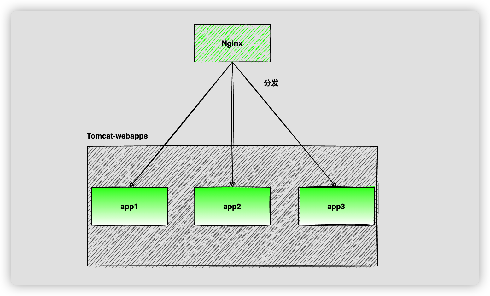

### 双亲委派

- 先在本地缓存中查找该类是否已经加载过，如果加载过就返回缓存中的。
- 如果没有加载过，委托给AppClassLoader是否加载过，如果加载过就返回。
- 如果AppClassLoader也没加载过，委托给ExtClassLoader去加载，这么做的目的就是：
  - 防止应用自己的类库覆盖了核心类库，因为WebAppClassLoader需要打破双亲委托机制，假如应用里自定义了一个叫java.lang.String的类，如果先加载这个类，就会覆盖核心类库的java.lang.String，所以说它会优先尝试用ExtClassLoader去加载，因为ExtClassLoader加载不到同样也会委托给BootstrapClassLoader去加载，也就避免了覆盖了核心类库的问题。
- 如果ExtClassLoader也没有查找到，说明核心类库中没有这个类，那么就在本地应用目录下查找此类并加载。
- 如果本地应用目录下还有没有这个类，那么肯定不是应用自己定义的类，那么就由AppClassLoader去加载。
  - 这里是通过Class.forName()调用AppClassLoader类加载器的，因为Class.forName()的默认加载器就是AppClassLoader。
- 如果上述都没有找到，那么只能抛出ClassNotFoundException了。

#### **为什么使用双亲委派模型**

**双亲委派模型是为了保证Java核心库的类型安全。**所有Java应用都至少需要引用java.lang.Object类，在运行时这个类需要被加载到Java虚拟机中。如果该加载过程由自定义类加载器来完成，可能就会存在多个版本的java.lang.Object类，而且这些类之间是不兼容的。

### Tomcat为什么要打破"双亲委派"？

Tomcat打破双亲委派机制的目的其实很简单，我们知道web容器可能是需要部署多个应用程序的，这在早期的部署架构中也经常见到，如上图。但是假设不同的应用程序可能会同时依赖第三方类库的不同版本。但是总不能要求同一个类库在web容器中只有一份吧？所以Tomcat就需要保证每个应用程序的类库都是相互隔离并独立的，这也是它为什么打破双亲委派机制的主要目的。

### Tomcat类加载概述

Tomcat的ClassLoader层级如下所示

.png)

- **CommonClassLoader(通用类加载器)**：主要负责加载${catalina.base}/lib定义的目录和jar以及${catalina.home}/lib定义的目录和jar，可以被Tomcat和所有的Web应用程序共同使用。
- **※WebAppClassLoader(web应用的类加载器)：**tomcat加载应用的核心类加载器，每个Web应用程序都有一个WebAppClassLoader，类库仅仅可以被此Web应用程序使用，对Tomcat和其他Web程序都不可见。

真正实现web应用程序之间的类加载器相互隔离独立的是WebAppClassLoader类加载器。它为什么可以隔离每个web应用程序呢？原因就是它打破了"双亲委派"的机制，如果收到类加载的请求，它会先尝试自己去加载，如果找不到在交给父加载器去加载，这么做的目的就是为了优先加载Web应用程序自己定义的类来实现web应用程序相互隔离独立的。

其实说白了就是谁先加载就是谁的:
系统的两个双亲类先加载，由于有缓存机制，这两个加在器还全局唯一，因此，加在的就是为例。
而每次自己创建一个新的类加载对象(tomcat)，且都有这个对象去加载的话，那么就合这个对象强相关。

或者说是作用域，全限定名之类的，由谁加载这个域（map 保存这 class）就是谁的.

所以，为什么说不通类加载器加载的 class 是不同的，很简单，因为他们是不同的对象，在内存中有不同的位置，没一个类加载器都有一个 map 保存自己加载的类对象。而 java 有是首先通过比较 hash(原生是地址) 码来比较两个对象是否相同。

