从 JavaConfig 中加载配置的 `AnnotationConfigApplicationContext` 启动方式如下：

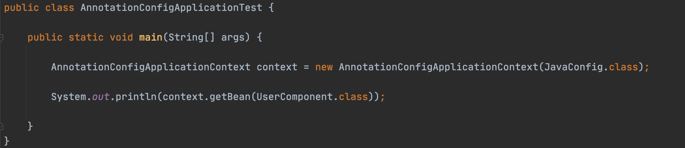

进去之后发现构造其实是调用的当前无参构造。

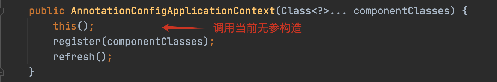


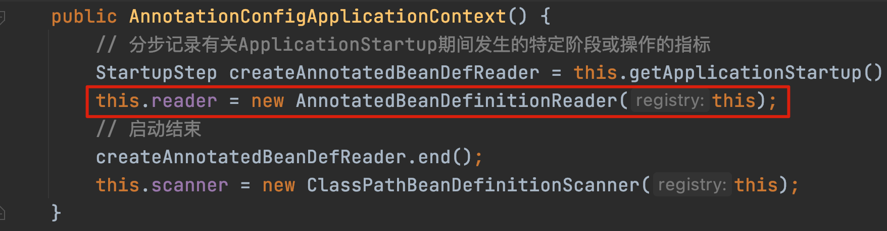

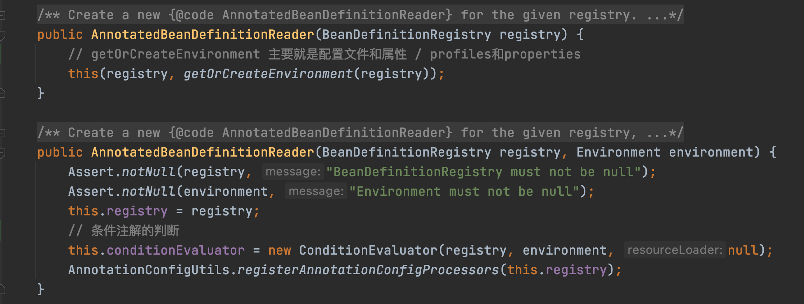


其中 `getOrCreateEnvironment(registry)` 会返回一个 `Environment` 用来表示当前的运行环境之类的。

`ConditionEvaluator` 是用来完成对 `@Conditional` 这个条件注解的判断。

这块可以参考官网：[Environment Abstraction 章节](https://docs.spring.io/spring-framework/docs/current/reference/html/core.html#beans-environment)

[Conditionally Include @Configuration Classes or @Bean Methods 章节](https://docs.spring.io/spring-framework/docs/current/reference/html/core.html#beans-java-conditional)

> **补充**
>
> BeanDefinitionRegistry：就是对 BeanDefinition 进行注册、移除、获取等操作的一个接口。
> 比如：registerBeanDefinition、removeBeanDefinition、containsBeanDefinition 看名字也能猜个大概意思。

#### registerAnnotationConfigProcessors[#](https://www.cnblogs.com/liuzhihang/p/source-spring-6.html#registerannotationconfigprocessors)

下面来看最后一行代码：

```java
AnnotationConfigUtils.registerAnnotationConfigProcessors(this.registry);
```

这个代码相对较长，还是以截图代替。


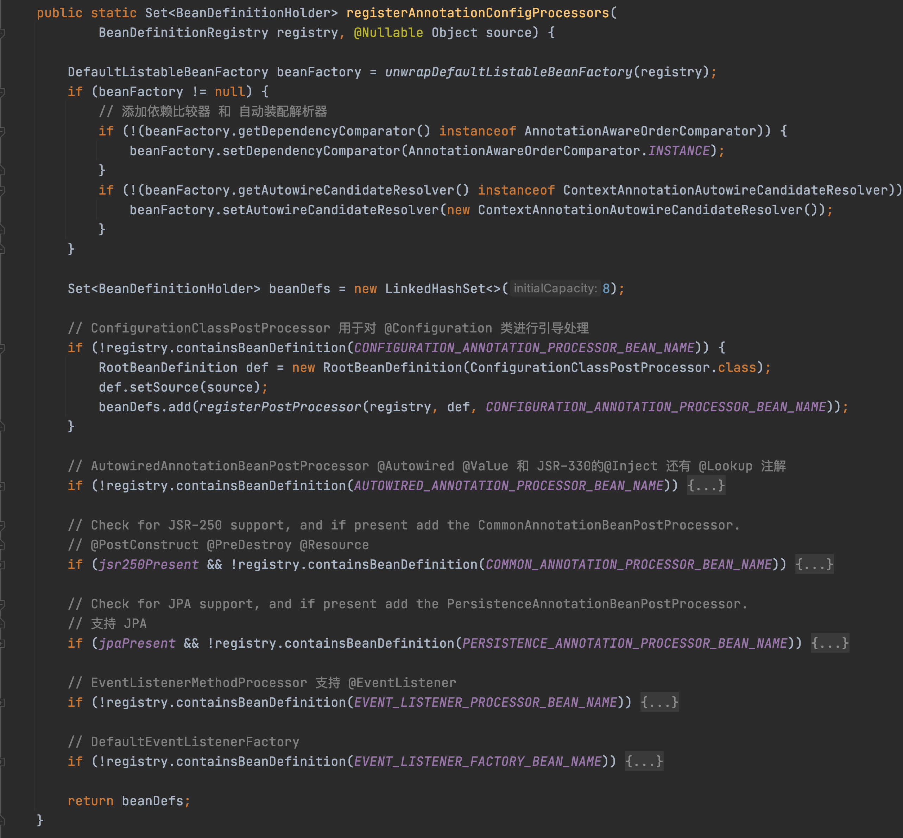


添加处理器时，下面收缩的代码和唯一展开的 `ConfigurationClassPostProcessor` 内部逻辑相同，都是调用 `registerPostProcessor` 方法，下面再介绍下这几个处理器的作用：

- ConfigurationClassPostProcessor 用于对 @Configuration 类进行引导处理。
- AutowiredAnnotationBeanPostProcessor 处理 @Autowired @Value 和 JSR-330的@Inject 还有 @Lookup 注解
- CommonAnnotationBeanPostProcessor 用来处理 @PostConstruct @PreDestroy @Resource。
- PersistenceAnnotationBeanPostProcessor 当支持 JPA 时添加这个。
- EventListenerMethodProcessor 支持 @EventListener。

#### registerPostProcessor[#](https://www.cnblogs.com/liuzhihang/p/source-spring-6.html#registerpostprocessor)


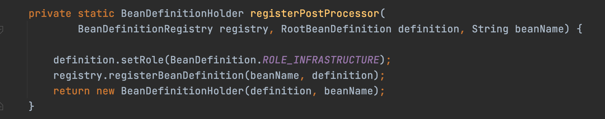

registerPostProcessor 方法有两个逻辑：

1. 将这几个 Processor 注册到 beanFactory；
2. 处理器封装为 BeanDefinitionHolder 对象。

BeanDefinitionHolder 就是封装了下 BeanDefinition ，说明这个 BeanDefinition 的持有者 name 是谁。

#### 大胆猜测[#](https://www.cnblogs.com/liuzhihang/p/source-spring-6.html#大胆猜测)

执行完这一行之后，在 AnnotationConfigApplicationContext 里面有了 这几个 BeanDefinition。


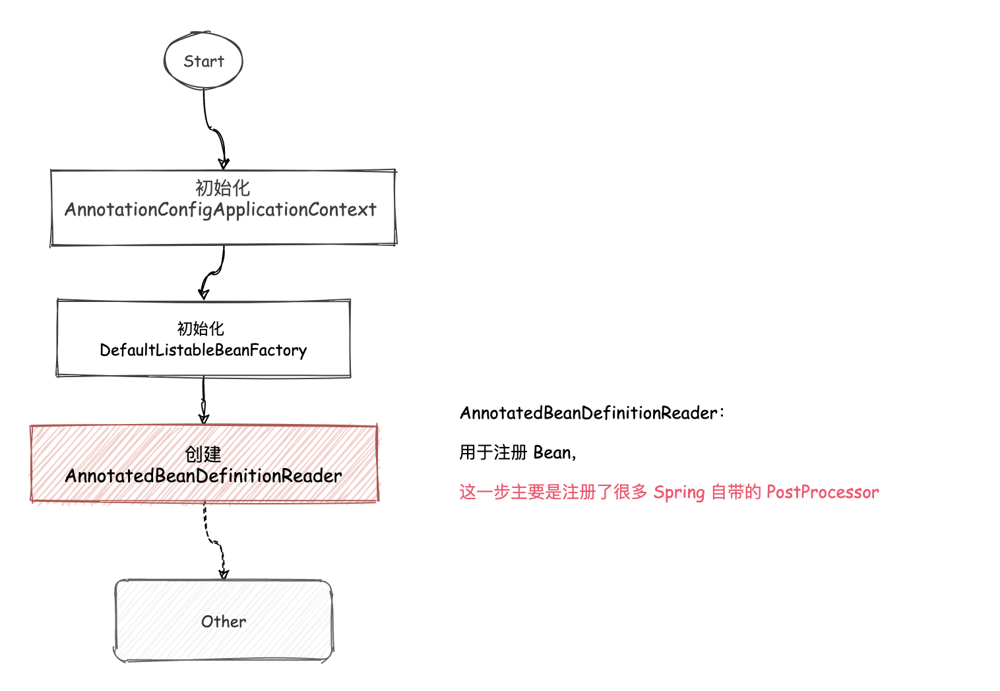

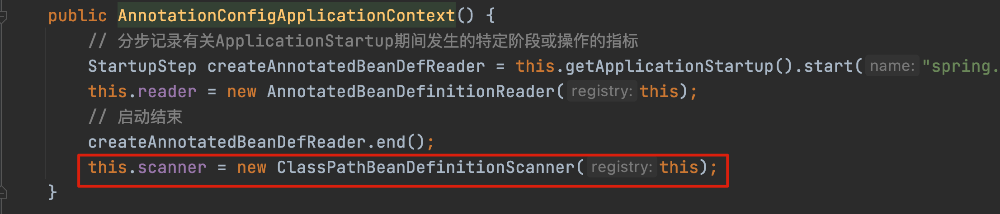


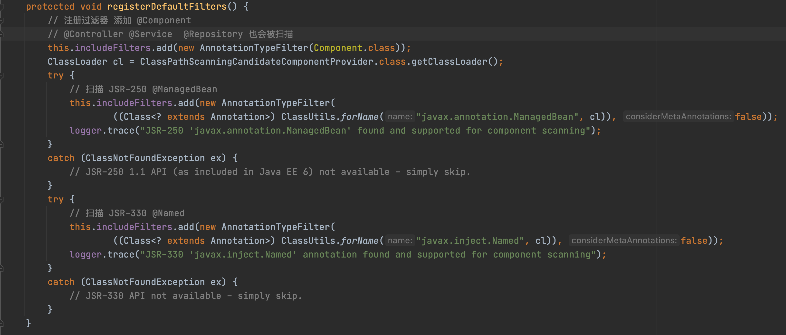

本步骤主要是添加过滤器，对 includeFilters 赋值。 注册过滤器 `@Component`，`@Controller` `@Service`、 `@Repository` 也会被添加进去。


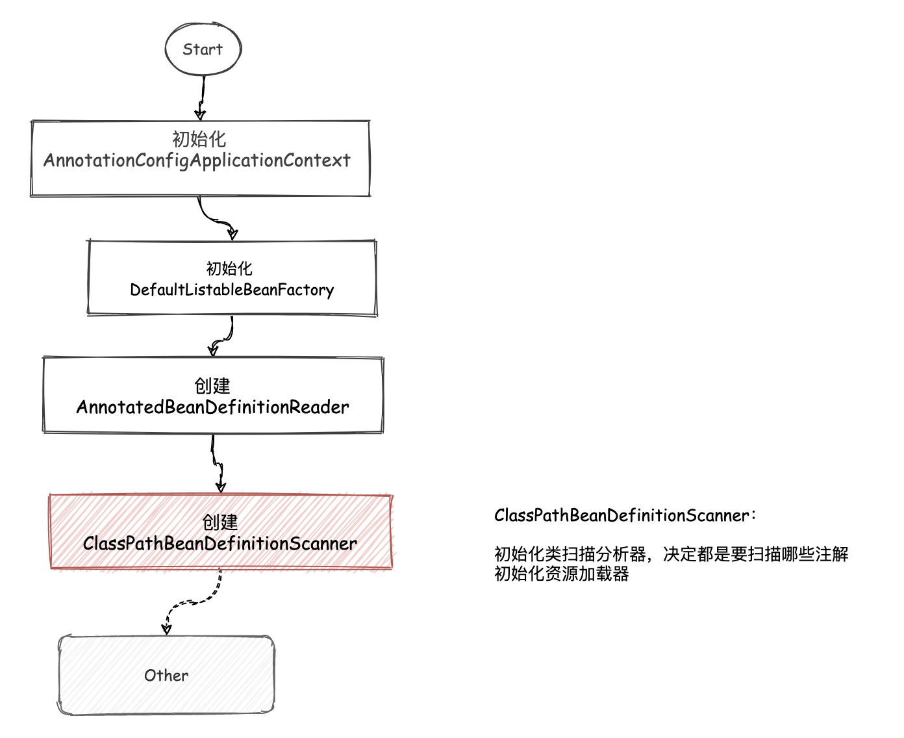


看完无参构造的源码及流程之后，后面将会执行 `AnnotatioinConfigApplicationContext::register` 方法。


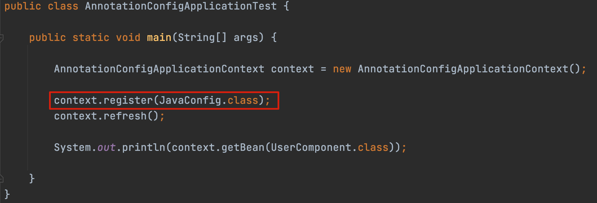


register 方法，入参是我们的配置类 `JavaConfig.class` ，下面跟着源码继续往下走！

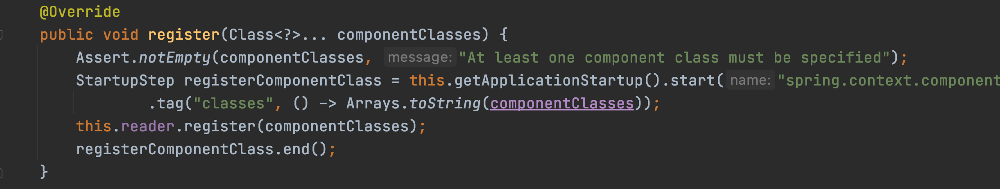

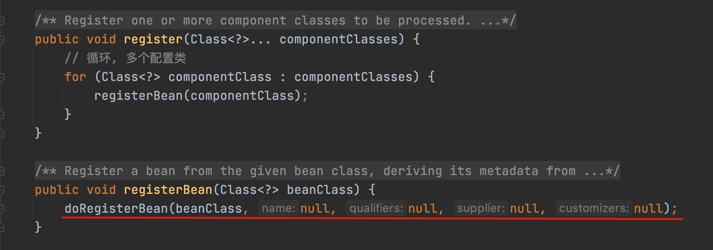


1. 循环，注册所有的配置类；
2. doRegisterBean 开始注册。

`doRegisterBean` 才是真正注册 Bean 的逻辑，从名字也可以有所猜测。下面开始进入 `doRegisterBean` 的源码阅读：

#### doRegisterBean[#](https://www.cnblogs.com/liuzhihang/p/source-spring-8.html#doregisterbean)

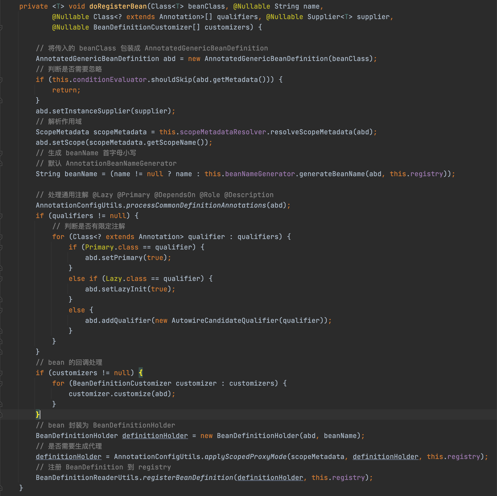


通过源码可以看出，这块主要流程：

1. 校验传入的 `JavaConfig.class` 的注解（是否需要忽略）；
2. 处理通用注解；
3. 封装为 BeanDefinitionHolder 后，注册到容器中。


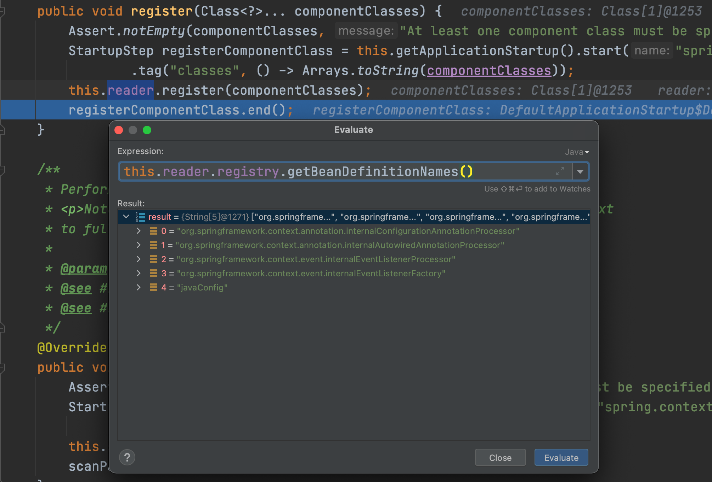


通过 debug 可以看出，在执行完 `register` 之后，相当于将 JavaConfig 作为一个 Bean 注册到容器中。


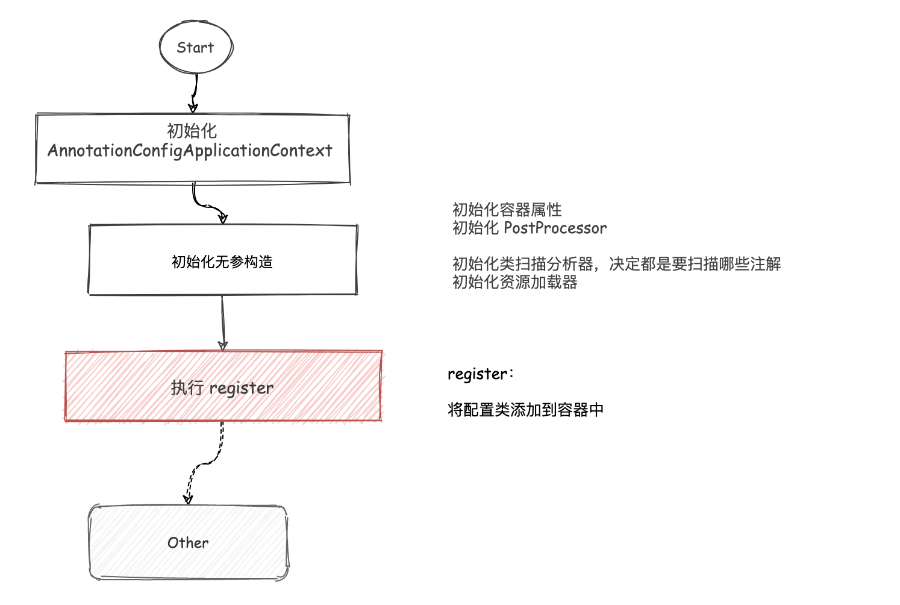


