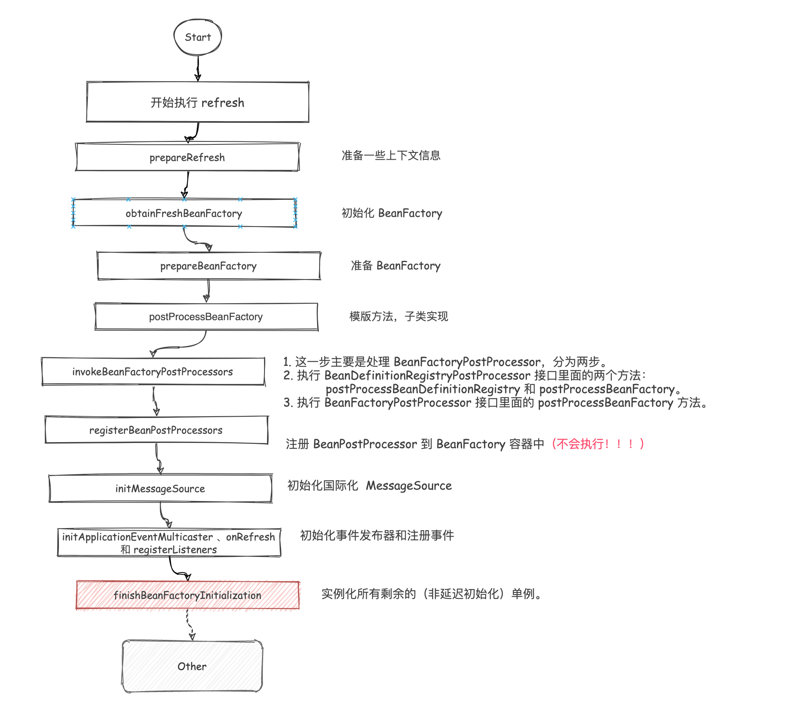

```java
protected void finishBeanFactoryInitialization(ConfigurableListableBeanFactory beanFactory) {
    // Initialize conversion service for this context.
    // 初始化类型转换器
    if (beanFactory.containsBean(CONVERSION_SERVICE_BEAN_NAME) &&
            beanFactory.isTypeMatch(CONVERSION_SERVICE_BEAN_NAME, ConversionService.class)) {
        beanFactory.setConversionService(
                beanFactory.getBean(CONVERSION_SERVICE_BEAN_NAME, ConversionService.class));
    }

    // Register a default embedded value resolver if no bean post-processor
    // (such as a PropertyPlaceholderConfigurer bean) registered any before:
    // at this point, primarily for resolution in annotation attribute values.
    // 主要用于注释属性值的解析
    if (!beanFactory.hasEmbeddedValueResolver()) {
        beanFactory.addEmbeddedValueResolver(strVal -> getEnvironment().resolvePlaceholders(strVal));
    }

    // Initialize LoadTimeWeaverAware beans early to allow for registering their transformers early.
    // 尽早初始化 LoadTimeWeaverAware Bean，以便尽早注册其转换器。
    String[] weaverAwareNames = beanFactory.getBeanNamesForType(LoadTimeWeaverAware.class, false, false);
    for (String weaverAwareName : weaverAwareNames) {
        getBean(weaverAwareName);
    }

    // Stop using the temporary ClassLoader for type matching.
    // 停止使用临时的ClassLoader进行类型匹配。
    beanFactory.setTempClassLoader(null);

    // Allow for caching all bean definition metadata, not expecting further changes.
    // 设置 beanDefinition 元数据 不可以再修改
    beanFactory.freezeConfiguration();

    // Instantiate all remaining (non-lazy-init) singletons.
    // 实例化单例 bean
    beanFactory.preInstantiateSingletons();
}
```


这里重点关注最后一行

```
beanFactory.preInstantiateSingletons();
```

#### preInstantiateSingletons[#](https://www.cnblogs.com/liuzhihang/p/source-spring-15.html#preinstantiatesingletons)

这块进入的是类 `DefaultListableBeanFactory` 类的源码。

```java
public void preInstantiateSingletons() throws BeansException {
    if (logger.isTraceEnabled()) {
        logger.trace("Pre-instantiating singletons in " + this);
    }

    // Iterate over a copy to allow for init methods which in turn register new bean definitions.
    // While this may not be part of the regular factory bootstrap, it does otherwise work fine.
    // 将 beanDefinitionNames 放到集合中
    List<String> beanNames = new ArrayList<>(this.beanDefinitionNames);

    // Trigger initialization of all non-lazy singleton beans...
    // 遍历
    for (String beanName : beanNames) {
        // 获取 bd 信息, 因为可能 定义了 parentBeanDefinition
        RootBeanDefinition bd = getMergedLocalBeanDefinition(beanName);
        // 非抽象, 单例, 且不是懒加载
        if (!bd.isAbstract() && bd.isSingleton() && !bd.isLazyInit()) {
            // 判断是否为 FactoryBean
            if (isFactoryBean(beanName)) {
                // FactoryBean 需要添加前缀 & ,通过 getBean(&beanName) 获取的是 FactoryBean 本身
                Object bean = getBean(FACTORY_BEAN_PREFIX + beanName);
                if (bean instanceof FactoryBean) {
                    FactoryBean<?> factory = (FactoryBean<?>) bean;
                    // 判断是否需要初始化
                    boolean isEagerInit;
                    if (System.getSecurityManager() != null && factory instanceof SmartFactoryBean) {
                        isEagerInit = AccessController.doPrivileged(
                                (PrivilegedAction<Boolean>) ((SmartFactoryBean<?>) factory)::isEagerInit,
                                getAccessControlContext());
                    }
                    else {
                        isEagerInit = (factory instanceof SmartFactoryBean &&
                                ((SmartFactoryBean<?>) factory).isEagerInit());
                    }
                    // 需要初始化
                    if (isEagerInit) {
                        getBean(beanName);
                    }
                }
            }
            else {
                getBean(beanName);
            }
        }
    }

    // Trigger post-initialization callback for all applicable beans...
    // 如果 Bean 实现了 SmartInitializingSingleton,
    // 在这里会统一调用 afterSingletonsInstantiated 方法
    for (String beanName : beanNames) {
        Object singletonInstance = getSingleton(beanName);
        if (singletonInstance instanceof SmartInitializingSingleton) {
            StartupStep smartInitialize = this.getApplicationStartup().start("spring.beans.smart-initialize")
                    .tag("beanName", beanName);
            SmartInitializingSingleton smartSingleton = (SmartInitializingSingleton) singletonInstance;
            if (System.getSecurityManager() != null) {
                AccessController.doPrivileged((PrivilegedAction<Object>) () -> {
                    smartSingleton.afterSingletonsInstantiated();
                    return null;
                }, getAccessControlContext());
            }
            else {
                smartSingleton.afterSingletonsInstantiated();
            }
            smartInitialize.end();
        }
    }
}
```

上面方法中通过循环 `beanNames` 进行初始化 Bean。


### 总结[#](https://www.cnblogs.com/liuzhihang/p/source-spring-15.html#总结)

这里主要介绍了 Bean 的创建过程，主要是对整个过程有个大概的了解和熟悉，针对过程画图如下：

