三级缓存的概念

>**singletonObjects：** 一级缓存，存储单例对象，Bean 已经实例化，初始化完成。
>
>**earlySingletonObjects：** 二级缓存，存储 singletonObject，这个 Bean 实例化了，还没有初始化。
>
>**singletonFactories：** 三级缓存，存储 singletonFactory。


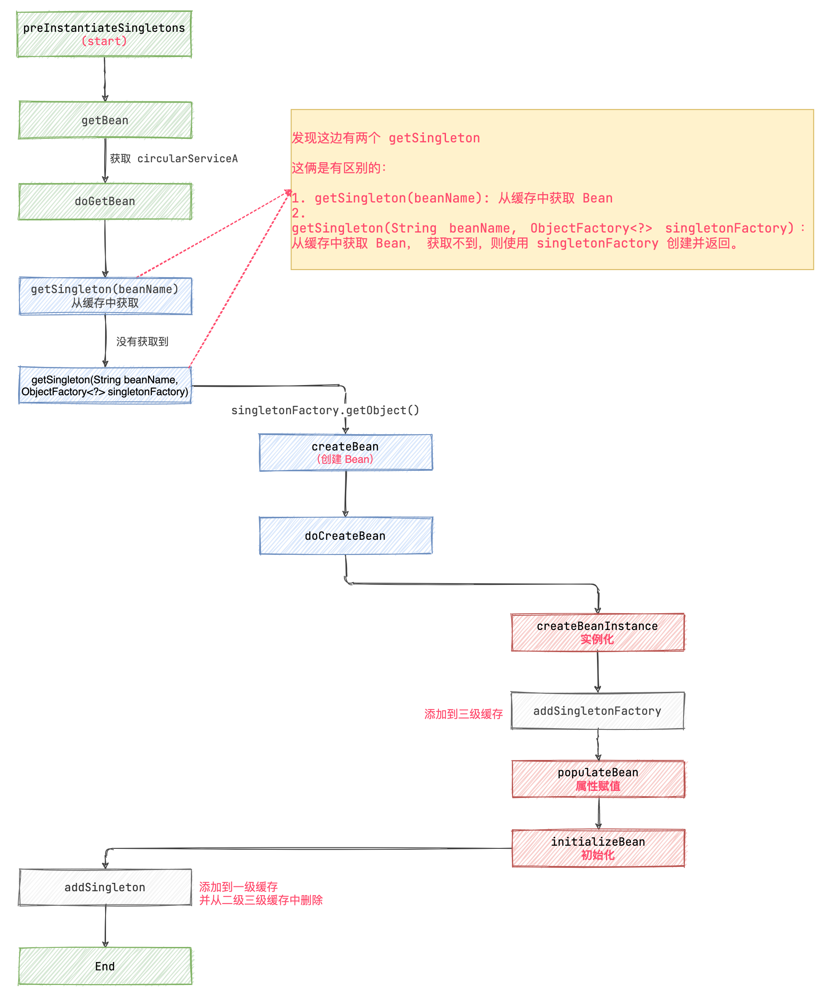

通过上面的流程，可以看出 Spring 在创建 Bean 的过程中重点是在 AbstractAutowireCapableBeanFactory 中的以下三个步骤：

1. **实例化 createBeanInstance：** 其中实例化 Bean 并对 Bean 进行赋值，像例子中的 `fieldA` 字段在这里就会赋值。
2. **属性注入 populateBean：** 可以理解为对 Bean 里面的属性进行赋值。(会依赖其他 Bean)
3. **初始化 initializeBean：** 执行初始化和 Bean 的后置处理器。

> 实例化赋值源码可以阅读：
>
> BeanUtils.instantiateClass(constructorToUse)

#### 如果要依赖其他 Bean 呢？[#](https://www.cnblogs.com/liuzhihang/p/spring-circular-dependence-2.html#如果要依赖其他-bean-呢)

那如果 CircularServiceA 依赖了其他 Bean 呢？

```java
@Service
public class CircularServiceA {

    private String fieldA = "字段 A";

    @Autowired
    private CircularServiceB circularServiceB;

}
@Service
public class CircularServiceB {

}
```

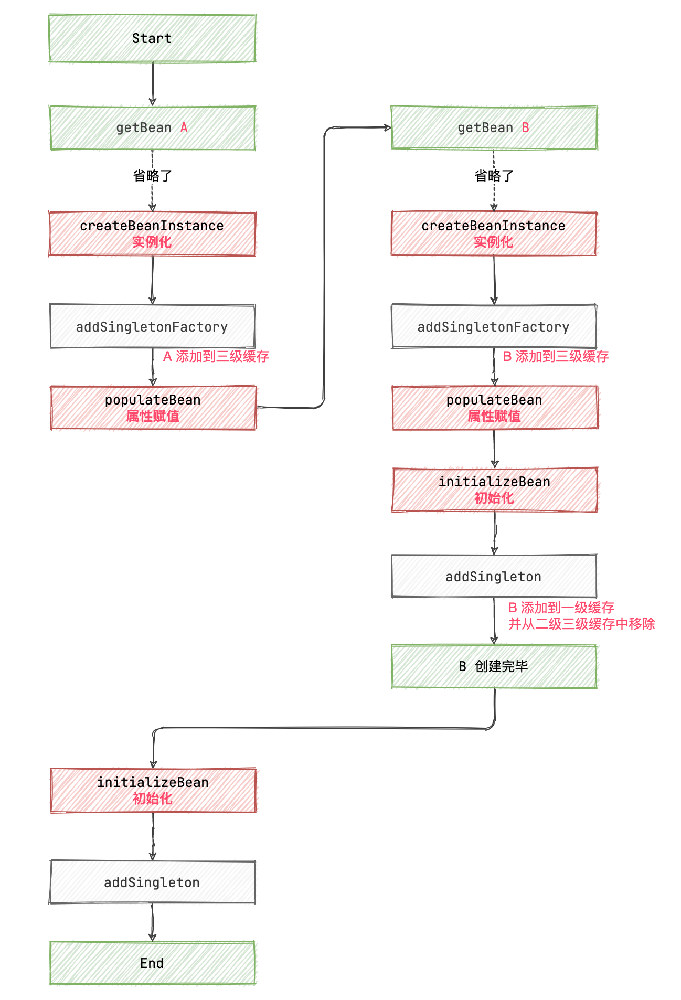


当 A 依赖了 B 的时候，在 `createBeanInstance` 这一步，并不会对 B 进行属性赋值。

而是在 `populatedBean` 这里查找依赖项，并创建 B。

#### 循环依赖下的创建过程[#](https://www.cnblogs.com/liuzhihang/p/spring-circular-dependence-2.html#循环依赖下的创建过程)

循环依赖的场景，在上一篇文章已经有所讲解，这里仅仅画图说明一下。

```java
@Service
public class CircularServiceA {

    private String fieldA = "字段 A";

    @Autowired
    private CircularServiceB circularServiceB;

}
@Service
public class CircularServiceB {
    @Autowired
    private CircularServiceA circularServiceA;
}
```

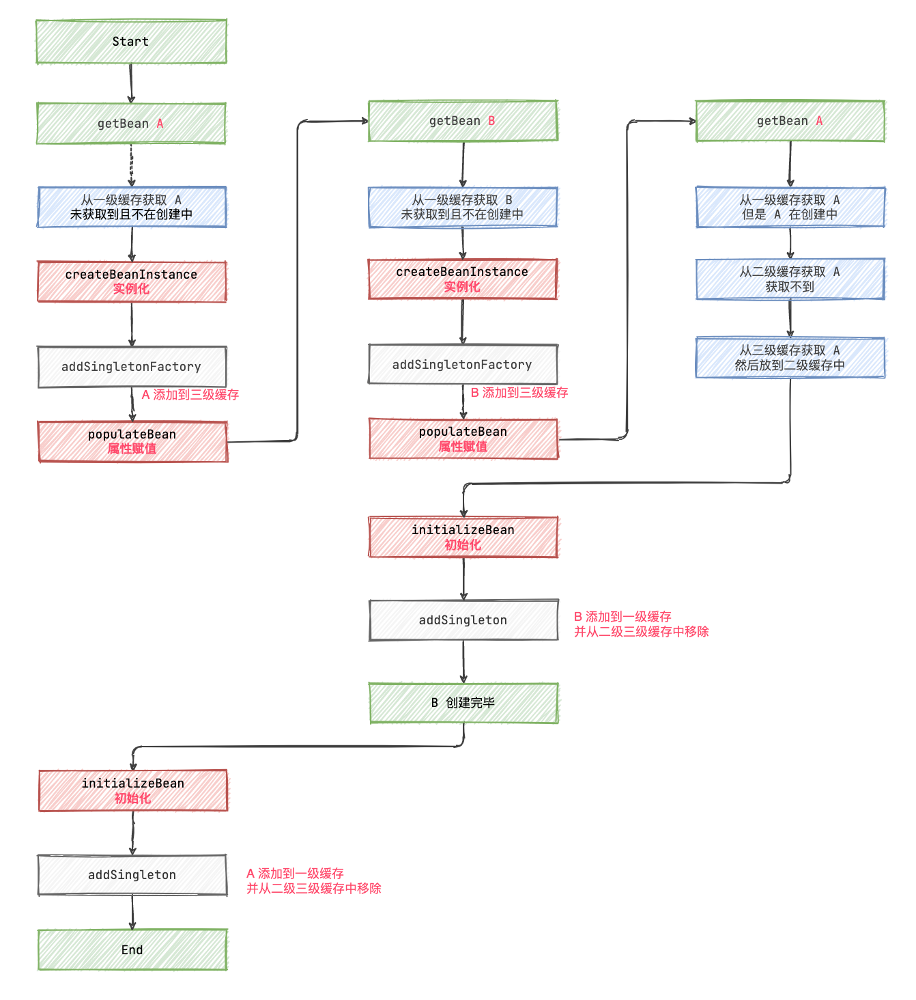


在 A 和 B 循环依赖的场景中：

B `populatedBean` 查找依赖项 A 的时候，从一级缓存中虽然未获取到 A，但是发现 A 在创建中。

此时，从三级缓存中获取 A 的 `singletonFactory` 调用工厂方法，创建 `getEarlyBeanReference` A 的早期引用并返回。

B 引用到 A ，B 就可以初始化完毕，然后 A 同样也可以初始化完毕了。


### 二级缓存能否解决循环依赖[#](https://www.cnblogs.com/liuzhihang/p/spring-circular-dependence-2.html#二级缓存能否解决循环依赖)

通过上面的图，仔细分析一下，其实把二级缓存拿掉，在 B 尝试获取 A 的时候直接返回 A 的实例，是不是也是可以的？

答案是：可以的！

但是为什么还是用三级缓存呢？

网上的很多资料说是和动态代理有关系，那就从动态代理的方面继续往下分析分析。

### 动态代理的场景[#](https://www.cnblogs.com/liuzhihang/p/spring-circular-dependence-2.html#动态代理的场景)

在 JavaConfig（配置类） 上添加 `@EnableAspectJAutoProxy` 注解，开启 AOP ，通过 Debug 循序渐进看一看动态代理对循环依赖的影响。

#### 动态代理下，Bean 的创建过程[#](https://www.cnblogs.com/liuzhihang/p/spring-circular-dependence-2.html#动态代理下bean-的创建过程)

```java
@Service
public class CircularServiceA {
    private String fieldA = "字段 A";

    public void methodA() {
        System.out.println("方法 A 执行");
    }
}
@Aspect
@Component
public class AspectA {

    @Before("execution(public void com.liuzhihang.circular.CircularServiceA.methodA())")
    public void beforeA() {
        System.out.println("beforeA 执行");
    }
}
```

只有 A 的情况下，给 A 添加切面，开始 Debug。

前面的流程都相同，在 initializeBean 开始出现差异。

这一步需要初始化 Bean 并执行 Bean 的后置处理器。

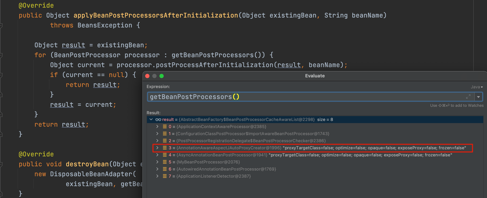

其中有一个处理器为： `AnnotationAwareAspectJAutoProxyCreator` 其实就是加的注解切面，会跳转到 `AbstractAutoProxyCreator 类的 postProcessAfterInitialization 方法`

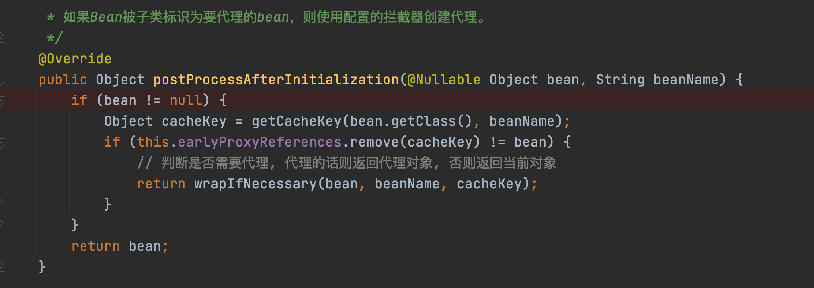

如图所示：wrapIfNecessary 方法会判断是否满足代理条件，是的话返回一个代理对象，否则返回当前 Bean。

后续调用 `getProxy` `、createAopProxy` 等等，最终执行到下面一部分。

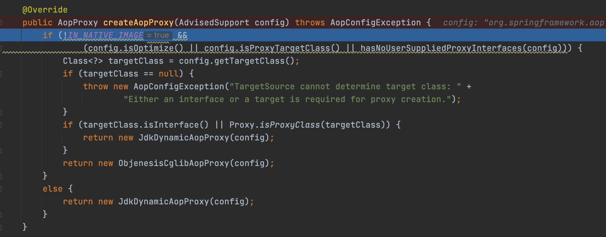

最终会执行到这里，AOP 代理相关的就不细看了。

一路放行，直到 initializeBean 执行结束。

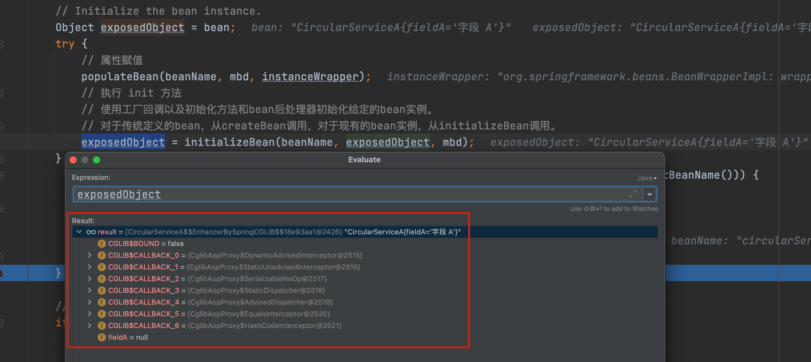

此时发现：A 被替换为了代理对象。

所以 doCreateBean 返回，以及后面放到一级缓存中的都是代理对象

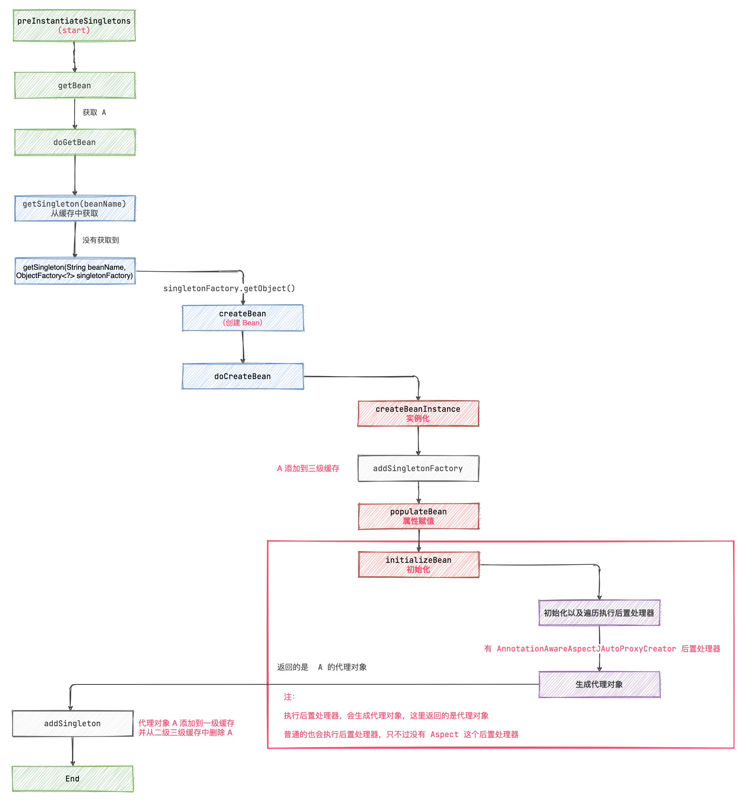


#### 有循环依赖的动态代理[#](https://www.cnblogs.com/liuzhihang/p/spring-circular-dependence-2.html#有循环依赖的动态代理)

这一次把循环依赖打开：

```java
@Service
public class CircularServiceA {

    private String fieldA = "字段 A";

    @Autowired
    private CircularServiceB circularServiceB;

    public void methodA() {

        System.out.println("方法 A 执行");

    }
}
@Aspect
@Component
public class AspectA {

    @Before("execution(public void com.liuzhihang.circular.CircularServiceA.methodA())")
    public void beforeA() {

        System.out.println("beforeA 执行");

    }

}
@Service
public class CircularServiceB {

    @Autowired
    private CircularServiceA circularServiceA;

    public void methodB() {

    }
}
@Aspect
@Component
public class AspectB {
    
    @Before("execution(public void com.liuzhihang.circular.CircularServiceB.methodB())")
    public void beforeB() {

        System.out.println("beforeB 执行");

    }

}
```

开始 Debug，前面的一些列流程，都和正常的没有什么区别。而唯一的区别在于，创建 B 的时候，需要从三级缓存获取 A。

此时在 `getSingleton` 方法中会调用：`singletonObject = singletonFactory.getObject();`

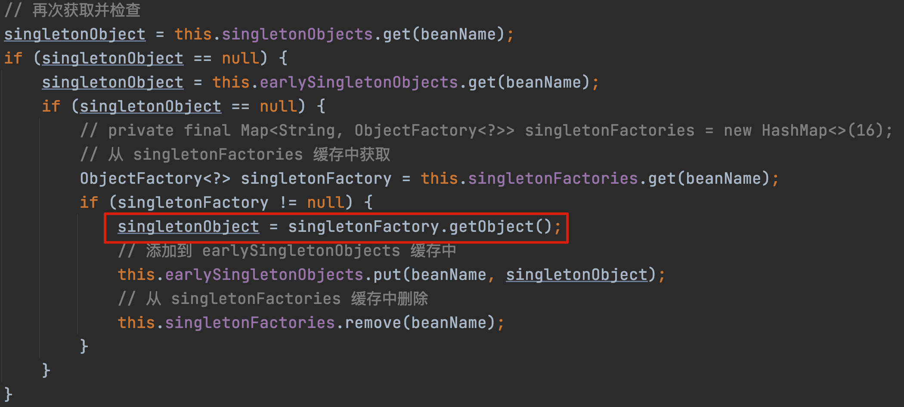


有时会比较疑惑 `singletonFactory.getObject()` 调用的是哪里？

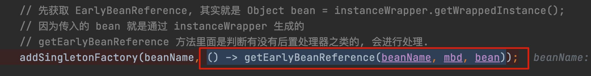


所以这一块调用的是 `getEarlyBeanReference`，开始遍历执行 `BeanPostProcessor`。

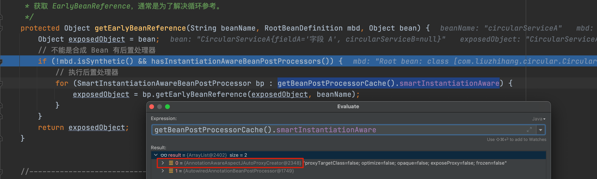

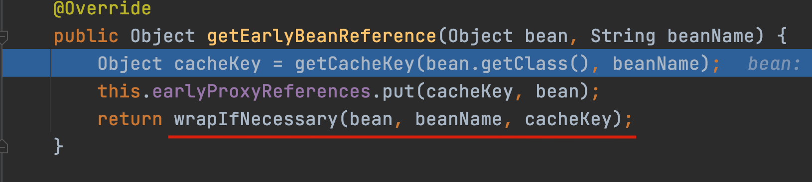


看到 `wrapIfNecessary` 就明白了吧！这块会获取一个`代理对象`。

**也就是说此时返回，并放到二级缓存的是一个 A 的代理对象。**

这样 B 就创建完毕了！

到 A 开始初始化并执行后置处理器了！因为 A 也有代理，所以 A 也会执行到 `postProcessAfterInitialization` 这一部分！

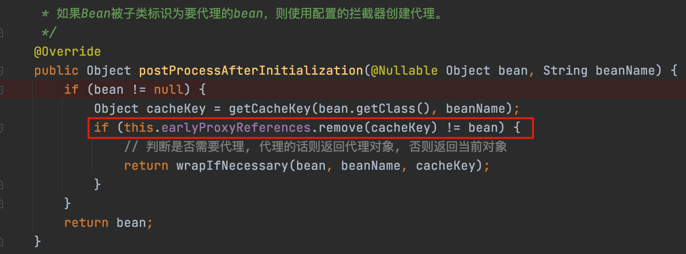


但是在执行 `wrapIfNecessary` 之前，会先判断代理对象缓存是否有 A 了。

```
this.earlyProxyReferences.remove(cacheKey) != bean
```

但是这块获取到的是 A 的代理对象。肯定是 false 。 所以不会再生成一次 A 的代理对象。

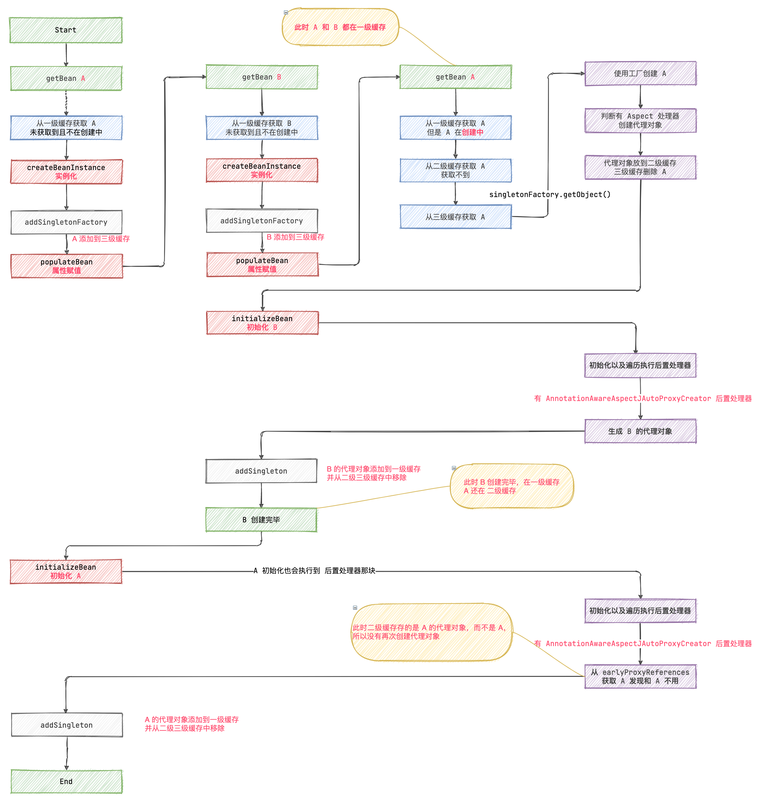


### 总结[#](https://www.cnblogs.com/liuzhihang/p/spring-circular-dependence-2.html#总结)

可以看到，循环依赖下，有没有代理情况下的区别就在：

```
singletonObject = singletonFactory.getObject();
```

在循环依赖发生的情况下 B 中的 A 赋值时：

1. 无代理：getObject 直接返回原来的 Bean
2. 有代理：getObject 返回的是代理对象

然后都放到**二级缓存**。


#### 为什么要三级缓存?[#](https://www.cnblogs.com/liuzhihang/p/spring-circular-dependence-2.html#为什么要三级缓存)

1. 假设去掉三级缓存

去掉三级缓存之后，Bean 直接创建 `earlySingletonObjects`， 看着好像也可以。

如果有代理的时候，在 `earlySingletonObjects` 直接放代理对象就行了。

但是会导致一个问题：**在实例化阶段就得执行后置处理器，判断有 AnnotationAwareAspectJAutoProxyCreator 并创建代理对象**。

这么一想，是不是会对 Bean 的生命周期有影响。

同样，先创建 `singletonFactory` 的好处就是：**在真正需要实例化的时候，再使用 singletonFactory.getObject() 获取 Bean 或者 Bean 的代理**。相当于是延迟实例化。


> bean 的代理发生在初始化阶段,如果没有三级缓存,就需要放在实例化阶段. 有无动态代理,生命周期是不一样的.		没啥影响,只是写代码可维护性比较差.


