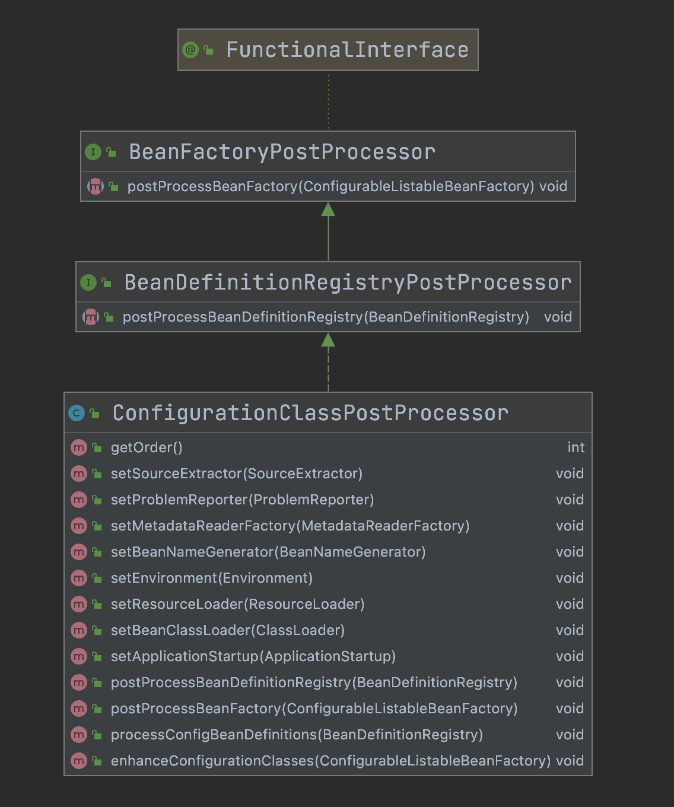
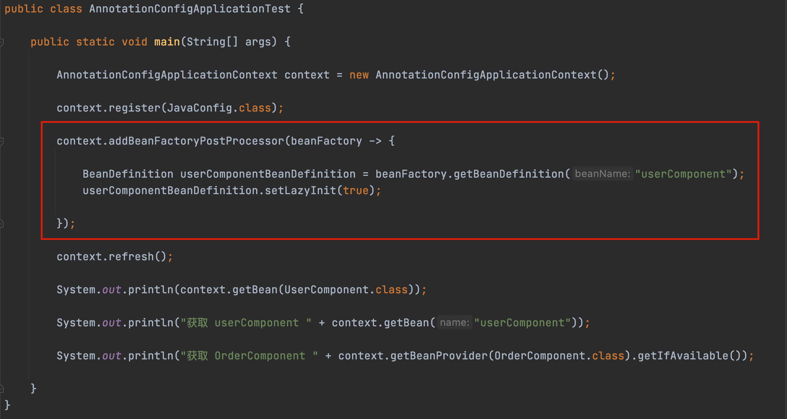
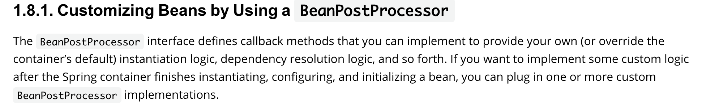
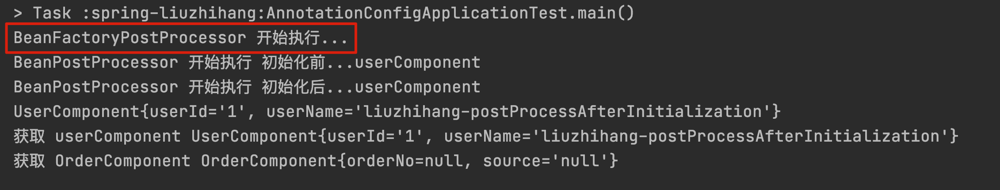
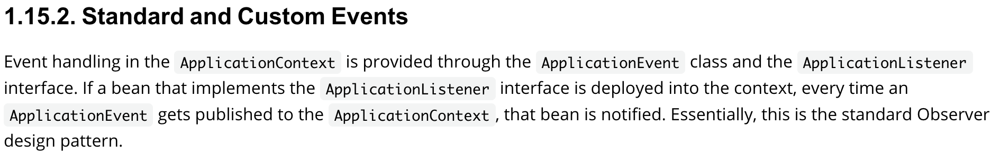
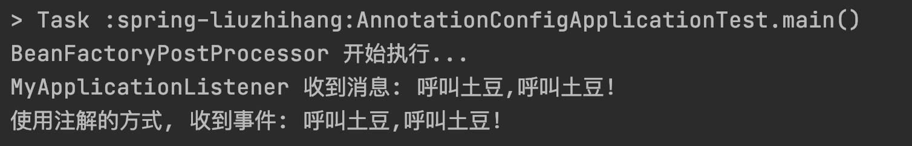
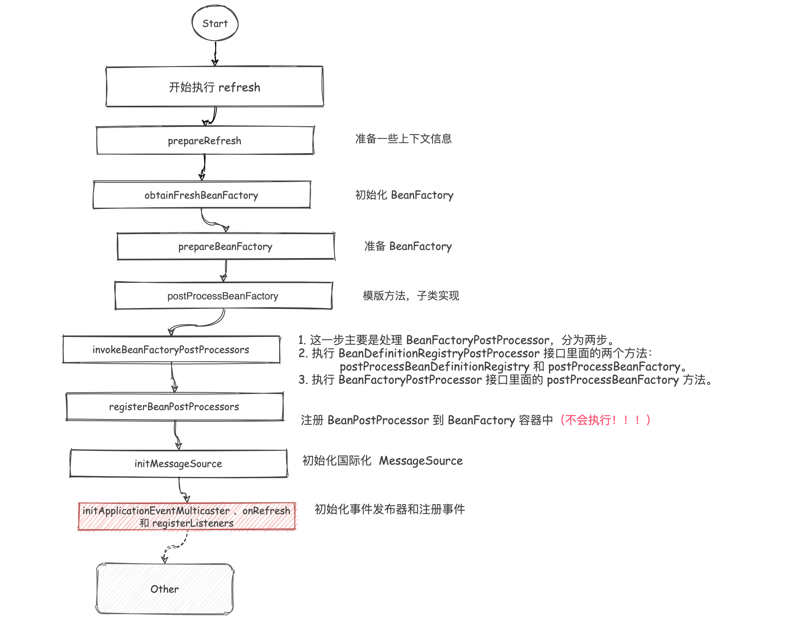

```java
public class PaidComponent {

	public PaidComponent() {
		System.out.println("PaidComponent 无参构造被调用");
	}
}

@Component
public class PaidComponentFactoryBean implements FactoryBean<PaidComponent> {
	@Override
	public PaidComponent getObject() throws Exception {
		System.out.println("PaidComponentFactoryBean 的 getObject 方法被调用");
		return new PaidComponent();
	}

	@Override
	public Class<?> getObjectType() {
		return PaidComponent.class;
	}
}

public class AnnotationConfigApplicationTest {

	public static void main(String[] args) {

		AnnotationConfigApplicationContext context = new AnnotationConfigApplicationContext();

		context.register(JavaConfig.class);


		context.refresh();

		// 返回 PaidComponent
		System.out.println(context.getBean("paidComponentFactoryBean"));
		// 返回 PaidComponent
    System.out.println(context.getBean(PaidComponent.class));
		// 返回 PaidComponentFactoryBean
		System.out.println(context.getBean("&paidComponentFactoryBean"));

	}
}

```


### 源码[#](https://www.cnblogs.com/liuzhihang/p/source-spring-9.html#源码)

```java
public void refresh() throws BeansException, IllegalStateException {
    // 加锁
    synchronized (this.startupShutdownMonitor) {
        StartupStep contextRefresh = this.applicationStartup.start("spring.context.refresh");

        // 准备一些上下文
        prepareRefresh();

        // 获取准备后的 beanFactory  DefaultListableBeanFactory
        ConfigurableListableBeanFactory beanFactory = obtainFreshBeanFactory();

        // 准备 BeanFactory
        prepareBeanFactory(beanFactory);

        try {
            // 允许在上下文子类中对bean工厂进行后处理。
            postProcessBeanFactory(beanFactory);

            StartupStep beanPostProcess = this.applicationStartup.start("spring.context.beans.post-process");

            // 在上下文中调用注册为 beanFactory 后置处理器
            // 就是实现了 BeanFactoryPostProcessor 的 bean
            invokeBeanFactoryPostProcessors(beanFactory);

            // 注册后置处理的Bean到容器当中
            // 就是扩展了 BeanPostProcessor 的 Bean
            registerBeanPostProcessors(beanFactory);
            beanPostProcess.end();

            // 为此上下文初始化消息源。
            // 初始化国际化工具 MessageSource
            initMessageSource();

            // 为此上下文初始化事件广播器。
            initApplicationEventMulticaster();

            // 在特定上下文子类中初始化其他特殊bean。子类可以自己实现
            onRefresh();

            // 检查并注册监听器。
            registerListeners();

            // 实例化所有剩余的（非延迟初始化）单例。
            finishBeanFactoryInitialization(beanFactory);

            // 最后一步: 完成此上下文的刷新，调用 LifecycleProcessor 的 onRefresh（）方法并发布
            finishRefresh();
        }

        catch (BeansException ex) {
            if (logger.isWarnEnabled()) {
                logger.warn("Exception encountered during context initialization - " +
                        "cancelling refresh attempt: " + ex);
            }

            // 销毁已创建的单例以避免资源悬挂。
            destroyBeans();

            // 重置活动状态
            cancelRefresh(ex);

            // Propagate exception to caller.
            throw ex;
        }

        finally {
            // Reset common introspection caches in Spring's core, since we
            // might not ever need metadata for singleton beans anymore...
            resetCommonCaches();
            contextRefresh.end();
        }
    }
}
```

源码就是密密麻麻的一大堆，源码上有相应的注释。


```java
// 获取 bean工厂
protected final void refreshBeanFactory() throws BeansException {
    // 如果存在 BeanFactory 则销毁 Bean 并关闭 BeanFactory
    if (hasBeanFactory()) {
        destroyBeans();
        closeBeanFactory();
    }
    try {
        // 创建一个默认的 BeanFactory
        DefaultListableBeanFactory beanFactory = createBeanFactory();
        beanFactory.setSerializationId(getId());
        // 设置属性
        customizeBeanFactory(beanFactory);
        // 加载 Bean 信息
        loadBeanDefinitions(beanFactory);

        this.beanFactory = beanFactory;
    }
    catch (IOException ex) {
        throw new ApplicationContextException("I/O error parsing bean definition source for " + getDisplayName(), ex);
    }
}
```


```java
// prepareBeanFactory 注册各种系统依赖的 bean
protected void prepareBeanFactory(ConfigurableListableBeanFactory beanFactory) {
    // Tell the internal bean factory to use the context's class loader etc.
    // 设置beanFactory的类加载器
    beanFactory.setBeanClassLoader(getClassLoader());
    // spring.spel.ignore 属性控制是否解析 SpEL 表达式
    if (!shouldIgnoreSpel) {
        beanFactory.setBeanExpressionResolver(new StandardBeanExpressionResolver(beanFactory.getBeanClassLoader()));
    }
    // 设置属性解析器
    beanFactory.addPropertyEditorRegistrar(new ResourceEditorRegistrar(this, getEnvironment()));

    // Configure the bean factory with context callbacks.
    // 添加到后置处理器列表, 新创建的 ApplicationContextAwareProcessor 入参为当前 ApplicationContext
    beanFactory.addBeanPostProcessor(new ApplicationContextAwareProcessor(this));

    // 忽略自动装配
    // 默认情况下 只有BeanFactoryAware 被忽略 要忽略其他类型，需要单独设置
    beanFactory.ignoreDependencyInterface(EnvironmentAware.class);
    beanFactory.ignoreDependencyInterface(EmbeddedValueResolverAware.class);
    beanFactory.ignoreDependencyInterface(ResourceLoaderAware.class);
    beanFactory.ignoreDependencyInterface(ApplicationEventPublisherAware.class);
    beanFactory.ignoreDependencyInterface(MessageSourceAware.class);
    beanFactory.ignoreDependencyInterface(ApplicationContextAware.class);
    beanFactory.ignoreDependencyInterface(ApplicationStartup.class);

    // BeanFactory interface not registered as resolvable type in a plain factory.
    // MessageSource registered (and found for autowiring) as a bean.
    // 注册自动装配的类
    beanFactory.registerResolvableDependency(BeanFactory.class, beanFactory);
    beanFactory.registerResolvableDependency(ResourceLoader.class, this);
    beanFactory.registerResolvableDependency(ApplicationEventPublisher.class, this);
    beanFactory.registerResolvableDependency(ApplicationContext.class, this);

    // Register early post-processor for detecting inner beans as ApplicationListeners.
    beanFactory.addBeanPostProcessor(new ApplicationListenerDetector(this));

    // Detect a LoadTimeWeaver and prepare for weaving, if found.
    // 是否需要类加载期间织入  增加Aspectj的支持
    if (!IN_NATIVE_IMAGE && beanFactory.containsBean(LOAD_TIME_WEAVER_BEAN_NAME)) {
        beanFactory.addBeanPostProcessor(new LoadTimeWeaverAwareProcessor(beanFactory));
        // Set a temporary ClassLoader for type matching.
        beanFactory.setTempClassLoader(new ContextTypeMatchClassLoader(beanFactory.getBeanClassLoader()));
    }

    // Register default environment beans.
    // 注册其他的 bean
    if (!beanFactory.containsLocalBean(ENVIRONMENT_BEAN_NAME)) {
        beanFactory.registerSingleton(ENVIRONMENT_BEAN_NAME, getEnvironment());
    }
    if (!beanFactory.containsLocalBean(SYSTEM_PROPERTIES_BEAN_NAME)) {
        beanFactory.registerSingleton(SYSTEM_PROPERTIES_BEAN_NAME, getEnvironment().getSystemProperties());
    }
    if (!beanFactory.containsLocalBean(SYSTEM_ENVIRONMENT_BEAN_NAME)) {
        beanFactory.registerSingleton(SYSTEM_ENVIRONMENT_BEAN_NAME, getEnvironment().getSystemEnvironment());
    }
    if (!beanFactory.containsLocalBean(APPLICATION_STARTUP_BEAN_NAME)) {
        beanFactory.registerSingleton(APPLICATION_STARTUP_BEAN_NAME, getApplicationStartup());
    }
}
```


```java
// postProcessBeanFactory
在执行 prepareBeanFactory 之后，当看到 postProcessBeanFactory(beanFactory); 方法的时候就很疑惑， 因为这个是需要子类实现的，只是作为一个模板方法，子类实现之后，可以在里面添加自己的逻辑。
不过,一般都是空的,除非自定义了一些 context
  
```




BeanFactoryPostProcessor 操作的是 BeanDefinition ，即元数据。但是同样可以通过获取到 BeanFactory 进行实例化 Bean，但是官网很不建议这样使用。

bean 工厂处理器,修改 beanDefinition 的元数据

看一个 demo

```java
// 修复 bean 的内容
@Component
public class MyBeanFactoryPostProcessor implements BeanFactoryPostProcessor {

    @Override
    public void postProcessBeanFactory(ConfigurableListableBeanFactory beanFactory) throws BeansException {

        // 修改 BeanDefinition 信息
        BeanDefinition userComponentBeanDefinition = beanFactory.getBeanDefinition("userComponent");
        userComponentBeanDefinition.setLazyInit(true);

        // 修改 Bean 的信息
        // xxx 非常不推荐 beanFactory.getBean 过早的实例化 Bean
        UserComponent bean = beanFactory.getBean(UserComponent.class);
        bean.setUserName("liuzhihang-01");
            
    }
}

```

当然除了实现 BeanFactoryPostProcessor 接口，还有其他接口可以实现：


#### 使用 BeanDefinitionRegistryPostProcessor[#](https://www.cnblogs.com/liuzhihang/p/source-spring-11.html#使用-beandefinitionregistrypostprocessor)

BeanDefinitionRegistryPostProcessor 继承了 BeanFactoryPostProcessor，同时扩展了增加了 `postProcessBeanDefinitionRegistry` 方法。可以支持在 BeanDefinition 注册之后 Bean 实例化之前对 BeanDefinition 进行操作。

```java
@Component
public class MyBeanDefinitionRegistryPostProcessor implements BeanDefinitionRegistryPostProcessor {
    @Override
    public void postProcessBeanFactory(ConfigurableListableBeanFactory beanFactory) throws BeansException {
        // 修改 BeanDefinition 信息
        BeanDefinition userComponentBeanDefinition = beanFactory.getBeanDefinition("userComponent");
        userComponentBeanDefinition.setLazyInit(true);

        // 修改 Bean 的信息
        // xxx 非常不推荐 beanFactory.getBean 过早的实例化 Bean
        UserComponent bean = beanFactory.getBean(UserComponent.class);
        bean.setUserName("liuzhihang-01");
    }

    @Override
    public void postProcessBeanDefinitionRegistry(BeanDefinitionRegistry registry) throws BeansException {

        // 注册一个 BeanDefinition
        BeanDefinitionBuilder builder = BeanDefinitionBuilder.genericBeanDefinition(OrderComponent.class);

        AbstractBeanDefinition orderComponentBeanDefinition = builder.getBeanDefinition();

        registry.registerBeanDefinition("orderComponent", orderComponentBeanDefinition);

    }
}
```

#### 如何修改字段属性[#](https://www.cnblogs.com/liuzhihang/p/source-spring-11.html#如何修改字段属性)

在 Spring 文档上说明，非常不建议在 BeanFactoryPostProcessor 中实例化 Bean，那这时候想修改 Bean 的信息，改如何操作？

其实可以通过获取到 `MutablePropertyValues` 后进行操作：

```java
@Component
public class MyBeanFactoryPostProcessor implements BeanFactoryPostProcessor {

    @Override
    public void postProcessBeanFactory(ConfigurableListableBeanFactory beanFactory) throws BeansException {

        // 修改 BeanDefinition 信息
        BeanDefinition userComponentBeanDefinition = beanFactory.getBeanDefinition("userComponent");
        userComponentBeanDefinition.setLazyInit(true);

        MutablePropertyValues userComponentPropertyValues = userComponentBeanDefinition.getPropertyValues();

        userComponentPropertyValues.addPropertyValue("userName", "liuzhihang-02");

        // 修改 Bean 的信息
        // xxx 非常不推荐 beanFactory.getBean 过早的实例化 Bean
        // UserComponent bean = beanFactory.getBean(UserComponent.class);
        // bean.setUserName("liuzhihang-01");

    }
}
```

### invokeBeanFactoryPostProcessors[#](https://www.cnblogs.com/liuzhihang/p/source-spring-11.html#invokebeanfactorypostprocessors)

看完前面，我想已经知道了 BeanFactoryPostProcessor 是做什么用的了，而这一步的主要作用就是实例化所有的 BeanFactoryPostProcessor。

进入源码：

```java
protected void invokeBeanFactoryPostProcessors(ConfigurableListableBeanFactory beanFactory) {
    PostProcessorRegistrationDelegate.invokeBeanFactoryPostProcessors(beanFactory, getBeanFactoryPostProcessors());

    // Detect a LoadTimeWeaver and prepare for weaving, if found in the meantime
    // (e.g. through an @Bean method registered by ConfigurationClassPostProcessor)
    if (!IN_NATIVE_IMAGE && beanFactory.getTempClassLoader() == null && beanFactory.containsBean(LOAD_TIME_WEAVER_BEAN_NAME)) {
        beanFactory.addBeanPostProcessor(new LoadTimeWeaverAwareProcessor(beanFactory));
        beanFactory.setTempClassLoader(new ContextTypeMatchClassLoader(beanFactory.getBeanClassLoader()));
    }
}
```

其中 getBeanFactoryPostProcessors 方法获取的是自己添加的 BeanFactoryPostProcessor。这句话是什么意思呢？

```java
public List<BeanFactoryPostProcessor> getBeanFactoryPostProcessors() {
    return this.beanFactoryPostProcessors;
}
```

看源码，就是直接从 beanFactoryPostProcessors 获取的，那如何向其中添加呢？





其实调用容器的 `addBeanFactoryPostProcessor` 方法即可。

继续阅读重点代码 `invokeBeanFactoryPostProcessors` ：

注意注意，这块代码非常长！

```java
public static void invokeBeanFactoryPostProcessors(
        ConfigurableListableBeanFactory beanFactory, List<BeanFactoryPostProcessor> beanFactoryPostProcessors) {

    // Invoke BeanDefinitionRegistryPostProcessors first, if any.
    Set<String> processedBeans = new HashSet<>();

    // 判断是否为 BeanDefinitionRegistry
    // debug 发现 这里传入的是 DefaultListableBeanFactory
    // DefaultListableBeanFactory 实现了 BeanDefinitionRegistry
    if (beanFactory instanceof BeanDefinitionRegistry) {
        BeanDefinitionRegistry registry = (BeanDefinitionRegistry) beanFactory;

        // 创建了两个 List 集合, 用来存放处理器
        // BeanDefinitionRegistryPostProcessor 是 BeanFactoryPostProcessor 的子接口
        // BeanDefinitionRegistryPostProcessor 还可以额外处理 BeanDefinition, 添加 BeanDefinition
        // 用法可以参考示例
        List<BeanFactoryPostProcessor> regularPostProcessors = new ArrayList<>();
        List<BeanDefinitionRegistryPostProcessor> registryProcessors = new ArrayList<>();

        // 循环 beanFactoryPostProcessors
        // beanFactoryPostProcessors 是使用 API context.addBeanFactoryPostProcessor 添加进来的
        for (BeanFactoryPostProcessor postProcessor : beanFactoryPostProcessors) {

            // BeanDefinitionRegistryPostProcessor 要单独添加到 registryProcessors
            if (postProcessor instanceof BeanDefinitionRegistryPostProcessor) {
                BeanDefinitionRegistryPostProcessor registryProcessor =
                        (BeanDefinitionRegistryPostProcessor) postProcessor;

                // 处理 Bean 的信息
                registryProcessor.postProcessBeanDefinitionRegistry(registry);
                registryProcessors.add(registryProcessor);
            } else {
                regularPostProcessors.add(postProcessor);
            }
        }

        // Do not initialize FactoryBeans here: We need to leave all regular beans
        // uninitialized to let the bean factory post-processors apply to them!
        // Separate between BeanDefinitionRegistryPostProcessors that implement
        // PriorityOrdered, Ordered, and the rest.
        // 上面循环是执行的我们调用 API 添加的 BeanDefinitionRegistryPostProcessor
        // 下面执行 Spring 自己的 BeanDefinitionRegistryPostProcessor 集合
        // 先执行实现了 PriorityOrdered接口的，然后是 Ordered 接口的，最后执行剩下的
        List<BeanDefinitionRegistryPostProcessor> currentRegistryProcessors = new ArrayList<>();

        // First, invoke the BeanDefinitionRegistryPostProcessors that implement PriorityOrdered.
        // 第一步先调用 BeanDefinitionRegistryPostProcessors 它实现了PriorityOrdered
        // 在初始化 reader 时 在注册了 ConfigurationClassPostProcessor 到容器里面
        // BeanDefinitionRegistryPostProcessor 实现了 BeanDefinitionRegistryPostProcessor
        String[] postProcessorNames =
                beanFactory.getBeanNamesForType(BeanDefinitionRegistryPostProcessor.class, true, false);
        for (String ppName : postProcessorNames) {
            if (beanFactory.isTypeMatch(ppName, PriorityOrdered.class)) {
                // 添加 bean
                currentRegistryProcessors.add(beanFactory.getBean(ppName, BeanDefinitionRegistryPostProcessor.class));
                // 这里只添加了名字 后面用来判断谁已经执行过了
                processedBeans.add(ppName);
            }
        }
        // 排序
        sortPostProcessors(currentRegistryProcessors, beanFactory);
        registryProcessors.addAll(currentRegistryProcessors);

        // 循环执行 processors 的 postProcessBeanDefinitionRegistry 方法
        // 这个得在仔细看
        // debug 看到 执行完这一步我另一个加 @Component 注解的类 注册到 Registry 里面了
        invokeBeanDefinitionRegistryPostProcessors(currentRegistryProcessors, registry, beanFactory.getApplicationStartup());
        // 清除
        currentRegistryProcessors.clear();

        // Next, invoke the BeanDefinitionRegistryPostProcessors that implement Ordered.
        // 处理实现 Ordered 的 processor
        postProcessorNames = beanFactory.getBeanNamesForType(BeanDefinitionRegistryPostProcessor.class, true, false);
        for (String ppName : postProcessorNames) {
            // 只有不包含的才执行, 执行完之后会添加进 processedBeans
            if (!processedBeans.contains(ppName) && beanFactory.isTypeMatch(ppName, Ordered.class)) {
                currentRegistryProcessors.add(beanFactory.getBean(ppName, BeanDefinitionRegistryPostProcessor.class));
                processedBeans.add(ppName);
            }
        }
        // 同上
        sortPostProcessors(currentRegistryProcessors, beanFactory);
        registryProcessors.addAll(currentRegistryProcessors);
        invokeBeanDefinitionRegistryPostProcessors(currentRegistryProcessors, registry, beanFactory.getApplicationStartup());
        currentRegistryProcessors.clear();

        // Finally, invoke all other BeanDefinitionRegistryPostProcessors until no further ones appear.
        // 最后执行其他
        boolean reiterate = true;
        while (reiterate) {
            reiterate = false;
            postProcessorNames = beanFactory.getBeanNamesForType(BeanDefinitionRegistryPostProcessor.class, true, false);
            for (String ppName : postProcessorNames) {
                // 只有不包含的才执行, 执行完之后会添加进 processedBeans
                if (!processedBeans.contains(ppName)) {
                    currentRegistryProcessors.add(beanFactory.getBean(ppName, BeanDefinitionRegistryPostProcessor.class));
                    processedBeans.add(ppName);
                    reiterate = true;
                }
            }
            sortPostProcessors(currentRegistryProcessors, beanFactory);
            registryProcessors.addAll(currentRegistryProcessors);
            invokeBeanDefinitionRegistryPostProcessors(currentRegistryProcessors, registry, beanFactory.getApplicationStartup());
            currentRegistryProcessors.clear();
        }

        // Now, invoke the postProcessBeanFactory callback of all processors handled so far.
        // 上面处理的都是 postProcessBeanDefinitionRegistry 是在 -> BeanDefinitionRegistryPostProcessor 中
        // 下面开始处理 postProcessBeanFactory  -> 是在 BeanFactoryPostProcessor 中
        invokeBeanFactoryPostProcessors(registryProcessors, beanFactory);
        invokeBeanFactoryPostProcessors(regularPostProcessors, beanFactory);
    } else {
        // Invoke factory processors registered with the context instance.
        // 不是 BeanDefinitionRegistry 则是普通 BeanFactory 直接执行 beanFactoryPostProcessors 即可
        invokeBeanFactoryPostProcessors(beanFactoryPostProcessors, beanFactory);
    }

    // Do not initialize FactoryBeans here: We need to leave all regular beans
    // uninitialized to let the bean factory post-processors apply to them!

    // 第二部分
    // 上面执行的是 BeanDefinitionRegistryPostProcessor
    // 下面开始执行 BeanFactoryPostProcessor
    String[] postProcessorNames =
            beanFactory.getBeanNamesForType(BeanFactoryPostProcessor.class, true, false);

    // Separate between BeanFactoryPostProcessors that implement PriorityOrdered,
    // Ordered, and the rest.
    // 按照顺序执行
    List<BeanFactoryPostProcessor> priorityOrderedPostProcessors = new ArrayList<>();
    List<String> orderedPostProcessorNames = new ArrayList<>();
    List<String> nonOrderedPostProcessorNames = new ArrayList<>();
    for (String ppName : postProcessorNames) {
        if (processedBeans.contains(ppName)) {
            // skip - already processed in first phase above
            // 说明上面已经执行了, 下面忽略
        } else if (beanFactory.isTypeMatch(ppName, PriorityOrdered.class)) {
            priorityOrderedPostProcessors.add(beanFactory.getBean(ppName, BeanFactoryPostProcessor.class));
        } else if (beanFactory.isTypeMatch(ppName, Ordered.class)) {
            orderedPostProcessorNames.add(ppName);
        } else {
            nonOrderedPostProcessorNames.add(ppName);
        }
    }

    // First, invoke the BeanFactoryPostProcessors that implement PriorityOrdered.
    // 执行实现 PriorityOrdered 的
    sortPostProcessors(priorityOrderedPostProcessors, beanFactory);
    invokeBeanFactoryPostProcessors(priorityOrderedPostProcessors, beanFactory);

    // Next, invoke the BeanFactoryPostProcessors that implement Ordered.
    List<BeanFactoryPostProcessor> orderedPostProcessors = new ArrayList<>(orderedPostProcessorNames.size());
    for (String postProcessorName : orderedPostProcessorNames) {
        orderedPostProcessors.add(beanFactory.getBean(postProcessorName, BeanFactoryPostProcessor.class));
    }
    sortPostProcessors(orderedPostProcessors, beanFactory);
    invokeBeanFactoryPostProcessors(orderedPostProcessors, beanFactory);

    // Finally, invoke all other BeanFactoryPostProcessors.
    List<BeanFactoryPostProcessor> nonOrderedPostProcessors = new ArrayList<>(nonOrderedPostProcessorNames.size());
    for (String postProcessorName : nonOrderedPostProcessorNames) {
        nonOrderedPostProcessors.add(beanFactory.getBean(postProcessorName, BeanFactoryPostProcessor.class));
    }
    invokeBeanFactoryPostProcessors(nonOrderedPostProcessors, beanFactory);

    // Clear cached merged bean definitions since the post-processors might have
    // modified the original metadata, e.g. replacing placeholders in values...
    // 清空不必要的元数据信息
    beanFactory.clearMetadataCache();
}
```

上面总体可以分为两部分：

1. 执行 BeanDefinitionRegistryPostProcessor 接口里面的两个方法：postProcessBeanDefinitionRegistry 和 postProcessBeanFactory。
2. 执行 BeanFactoryPostProcessor 接口里面的 postProcessBeanFactory 方法。

以第一部分为例：

1. 首先判断传入的 BeanFactory 是否为 BeanDefinitionRegistry
   1. 声明两个 List 集合，regularPostProcessors 用来存储 BeanFactoryPostProcessor，registryProcessors 用来存储 BeanDefinitionRegistryPostProcessor
      1. 循环 beanFactoryPostProcessors，这个就是我们使用 API 方式添加进来的 BeanFactoryPostProcessor。
      2. 在循环中 BeanDefinitionRegistryPostProcessor 的 postProcessBeanDefinitionRegistry 会被执行，也就是说我示例的那个添加 BeanDefinition 演示的方法会被执行。
   2. 开始执行 Spring 自己的 BeanDefinitionRegistryPostProcessor， 处理顺序为 PriorityOrdered, Ordered, and the rest
      1. 循环，将对应的 BeanDefinitionRegistryPostProcessor 添加到 currentRegistryProcessors 集合和processedBeans集合表示为已经处理。
      2. 排序后添加到第一步的 registryProcessors 中。
      3. 调用 invokeBeanDefinitionRegistryPostProcessors 执行所有的 Processor 里面的 postProcessBeanDefinitionRegistry 方法
   3. 执行完 1 和 2 之后，所有的 postProcessBeanDefinitionRegistry 已经被执行完了，但是两个集合（registryProcessors、regularPostProcessors）里面的 postProcessBeanFactory 方法还没有被执行。最后会循环执行。
2. 如果不是 BeanDefinitionRegistry 类型，则直接执行传入的 beanFactoryPostProcessors 即可。

#### BeanFactoryPostProcessor 作用[#](https://www.cnblogs.com/liuzhihang/p/source-spring-11.html#beanfactorypostprocessor-作用)

BeanFactoryPostProcessor 主要作用是在注册 BeanDefinition 之后，在 Bean 初始化之前，修改 BeanDefinition 的信息。

BeanFactoryPostProcessor 有个实现叫 BeanDefinitionRegistryPostProcessor，它可以额外的注册新的 BeanDefinition 到容器中。

#### 流程概述[#](https://www.cnblogs.com/liuzhihang/p/source-spring-11.html#流程概述)

1. 这一步主要是处理 BeanFactoryPostProcessor，分为两步。
2. 执行 BeanDefinitionRegistryPostProcessor 接口里面的两个方法：postProcessBeanDefinitionRegistry 和 postProcessBeanFactory。
3. 执行 BeanFactoryPostProcessor 接口里面的 postProcessBeanFactory 方法。

 **修改 beandefine 不如注册的时候注册对**


# [registerBeanPostProcessors ](https://www.cnblogs.com/liuzhihang/p/source-spring-12.html)


前面通过 invokeBeanFactoryPostProcessors 这一步了解到了什么是 BeanFactoryPostProcessor ，以及 BeanFactoryPostProcessor 的使用及作用，并通过 invokeBeanFactoryPostProcessors 这一步源码，对 BeanFactoryPostProcessor 的加载流程有了进一步了解。

现在就一起进入下一个环节：

```
registerBeanPostProcessors(beanFactory);
```

这一步主要的作用是加载 BeanPostProcessor，从名字也可以看出，只是加载，并没有执行。

不过，在进入源码之前，依然是结合官网，先了解以下几个问题：

1. 什么是 BeanPostProcessor？
2. BeanPostProcessor 是如何使用的？
3. BeanPostProcessor 有什么用？

### 什么是 BeanPostProcessor ？[#](https://www.cnblogs.com/liuzhihang/p/source-spring-12.html#什么是-beanpostprocessor-)

[](https://cdn.jsdelivr.net/gh/liuzhihang/oss/pic/article/PqDpkg-Wujih5.png)

如截图所示，在官网 [1.8.1 Customizing Beans by Using a BeanPostProcessor](https://docs.spring.io/spring-framework/docs/current/reference/html/core.html#beans-factory-extension-bpp) 中介绍， `BeanPostProcessor` 接口定义回调方法，可以实现这些方法，从而在 Bean 实例化期间修改 Bean 的属性。

### BeanPostProcessor 是如何使用的?[#](https://www.cnblogs.com/liuzhihang/p/source-spring-12.html#beanpostprocessor-是如何使用的)

```java
@Component
public class MyBeanPostProcessor implements BeanPostProcessor {


	@Override
	public Object postProcessBeforeInitialization(Object bean, String beanName) throws BeansException {

		if (bean instanceof UserComponent) {

			System.out.println("BeanPostProcessor 开始执行 初始化前..." + beanName);

			UserComponent userComponent = (UserComponent) bean;
			userComponent.setUserName("liuzhihang-postProcessBeforeInitialization");

			return userComponent;

		}

		return bean;
	}

	@Override
	public Object postProcessAfterInitialization(Object bean, String beanName) throws BeansException {


		if (bean instanceof UserComponent) {

			System.out.println("BeanPostProcessor 开始执行 初始化后..." + beanName);

			UserComponent userComponent = (UserComponent) bean;
			userComponent.setUserName("liuzhihang-postProcessAfterInitialization");

			return userComponent;

		}

		return bean;
	}
}
```

如代码所示，只需要声明一个自己的 MyBeanPostProcessor 来实现 `BeanPostProcessor` 并重写其方法：

postProcessBeforeInitialization ：在 Bean 实例后调用初始化方法之前进行处理。

postProcessAfterInitialization ：在 Bean 实例化后调用初始化方法之后进行处理。

并且在测试时可以发现，BeanPostProcessor 修改的属性会覆盖 BeanFactoryPostProcessor，至于原因可以阅读下 [Spring 源码学习 11：invokeBeanFactoryPostProcessors](https://mp.weixin.qq.com/s/6VrVDg4m6yi7V4rZZB-6tA) 这篇文章，相信对 BeanFactoryPostProcessor 有了一定的了解之后，一定会有自己的答案。

当然我个人的理解就是 BeanFactoryPostProcessor 是在 Bean 实例化之前，是通过修改元数据从而修改的 Bean 的元素信息。

这块也可以通过代码进行验证。

[](https://cdn.jsdelivr.net/gh/liuzhihang/oss/pic/article/mHNyKC-SBWUcw.png)

可以看出，执行顺序是

```
BeanFactoryPostProcessor#postProcessBeanFactory`
->
`BeanPostProcessor#postProcessBeforeInitialization`
->
`BeanPostProcessor#postProcessAfterInitialization
```

所以，后面修改的属性，会覆盖之前修改的属性。

至于 `BeanPostProcessor` 是如何修改属性的，在这里先不做介绍，继续进入本节的主角 `registerBeanPostProcessors 源码分析`

### registerBeanPostProcessors 源码[#](https://www.cnblogs.com/liuzhihang/p/source-spring-12.html#registerbeanpostprocessors-源码)

在 Spring refresh 方法中，执行 registerBeanPostProcessors 主要作用是将 BeanPostProcessor 注册到容器中，源码如下:

```java
protected void registerBeanPostProcessors(ConfigurableListableBeanFactory beanFactory) {
    PostProcessorRegistrationDelegate.registerBeanPostProcessors(beanFactory, this);
}
```

这里调用了 `PostProcessorRegistrationDelegate` 类的静态方法，继续跟进：

```java
public static void registerBeanPostProcessors(
        ConfigurableListableBeanFactory beanFactory, AbstractApplicationContext applicationContext) {

    // 查找 BeanPostProcessor 类型的 Bean 的名称集合, 就是获取所有继承了 BeanPostProcessor 的类
    String[] postProcessorNames = beanFactory.getBeanNamesForType(BeanPostProcessor.class, true, false);

    // Register BeanPostProcessorChecker that logs an info message when
    // a bean is created during BeanPostProcessor instantiation, i.e. when
    // a bean is not eligible for getting processed by all BeanPostProcessors.
    //  注册一个 BeanPostProcessorChecker，用来记录 bean 在 BeanPostProcessor 实例化时的信息。
    int beanProcessorTargetCount = beanFactory.getBeanPostProcessorCount() + 1 + postProcessorNames.length;
    beanFactory.addBeanPostProcessor(new BeanPostProcessorChecker(beanFactory, beanProcessorTargetCount));

    // Separate between BeanPostProcessors that implement PriorityOrdered,
    // Ordered, and the rest.
    // 四个集合 区分实现不同接口的 BeanPostProcessors
    List<BeanPostProcessor> priorityOrderedPostProcessors = new ArrayList<>();
    List<BeanPostProcessor> internalPostProcessors = new ArrayList<>();
    List<String> orderedPostProcessorNames = new ArrayList<>();
    List<String> nonOrderedPostProcessorNames = new ArrayList<>();
    for (String ppName : postProcessorNames) {
        if (beanFactory.isTypeMatch(ppName, PriorityOrdered.class)) {
            BeanPostProcessor pp = beanFactory.getBean(ppName, BeanPostProcessor.class);
            priorityOrderedPostProcessors.add(pp);
            if (pp instanceof MergedBeanDefinitionPostProcessor) {
                internalPostProcessors.add(pp);
            }
        } else if (beanFactory.isTypeMatch(ppName, Ordered.class)) {
            orderedPostProcessorNames.add(ppName);
        } else {
            nonOrderedPostProcessorNames.add(ppName);
        }
    }

    // First, register the BeanPostProcessors that implement PriorityOrdered.
    // 排序后执行 实现 PriorityOrdered 的 BeanPostProcessors
    sortPostProcessors(priorityOrderedPostProcessors, beanFactory);
    registerBeanPostProcessors(beanFactory, priorityOrderedPostProcessors);

    // Next, register the BeanPostProcessors that implement Ordered.
    List<BeanPostProcessor> orderedPostProcessors = new ArrayList<>(orderedPostProcessorNames.size());
    for (String ppName : orderedPostProcessorNames) {
        BeanPostProcessor pp = beanFactory.getBean(ppName, BeanPostProcessor.class);
        orderedPostProcessors.add(pp);
        if (pp instanceof MergedBeanDefinitionPostProcessor) {
            internalPostProcessors.add(pp);
        }
    }
    sortPostProcessors(orderedPostProcessors, beanFactory);
    registerBeanPostProcessors(beanFactory, orderedPostProcessors);

    // Now, register all regular BeanPostProcessors.
    List<BeanPostProcessor> nonOrderedPostProcessors = new ArrayList<>(nonOrderedPostProcessorNames.size());
    for (String ppName : nonOrderedPostProcessorNames) {
        BeanPostProcessor pp = beanFactory.getBean(ppName, BeanPostProcessor.class);
        nonOrderedPostProcessors.add(pp);
        if (pp instanceof MergedBeanDefinitionPostProcessor) {
            internalPostProcessors.add(pp);
        }
    }
    registerBeanPostProcessors(beanFactory, nonOrderedPostProcessors);

    // Finally, re-register all internal BeanPostProcessors.
    sortPostProcessors(internalPostProcessors, beanFactory);
    registerBeanPostProcessors(beanFactory, internalPostProcessors);

    // Re-register post-processor for detecting inner beans as ApplicationListeners,
    // moving it to the end of the processor chain (for picking up proxies etc).
    beanFactory.addBeanPostProcessor(new ApplicationListenerDetector(applicationContext));
}
```

代码中添加了相应的注释，相信读过上一篇文章（invokeBeanFactoryPostProcessors 源码）的小伙伴，一定会感觉非常熟悉，这个方法的逻辑和上面基本一致，都是声明集合，排序，注册到 BeanFactory 中。

不过还是有区别的：

```
registerBeanPostProcessors 这一步仅仅将 BeanPostProcessor 注册到 BeanFactory 中，并没有执行！！！
```


# [initMessageSource ](https://www.cnblogs.com/liuzhihang/p/source-spring-13.html)

国际化相关的东西,略


# [Spring 源码学习 14：initApplicationEventMulticaster、onRefresh 和 registerListeners](https://www.cnblogs.com/liuzhihang/p/source-spring-14.html)

### 前言[#](https://www.cnblogs.com/liuzhihang/p/source-spring-14.html#前言)

上一篇介绍了国际化的使用以及初始化消息源的源码，接下来接着往下阅读，将进入 initApplicationEventMulticaster 、onRefresh 和 registerListeners 的相关操作逻辑。

这一部分主要是初始化事件广播器以及注册监听器。而 onRefresh 部分则需要子类去实现。 所以本文主要介绍以下几个部分：

1. 什么是 Spring 事件？
2. 监听器是如何使用的？

### 什么是 Spring 事件？[#](https://www.cnblogs.com/liuzhihang/p/source-spring-14.html#什么是-spring-事件)



这块的介绍在官网 [1.15.2. Standard and Custom Events](https://docs.spring.io/spring-framework/docs/current/reference/html/core.html#context-functionality-events) 部分有介绍。

> Spring 通过 ApplicationEvent 类和 ApplicationListener 接口提供 ApplicationContext 中的事件处理。如果将实现 ApplicationListener 接口的 bean 部署到上下文中，则每次将 ApplicationEvent 发布到 ApplicationContext 时，都会通知该 bean。本质上，这是标准的观察者设计模式。

归纳下来主要就是三个部分: 事件、事件发布者、事件监听器。

1. 事件：ApplicationEvent，要自定义事件，则需要创建一个类继承 ApplicationEvent。
2. 事件发布者：ApplicationEventPublisher 和 ApplicationEventMulticaster，因为 ApplicationContext 实现了 ApplicationEventPublisher，所以事件发布可以直接使用 ApplicationContext。
3. 事件监听器：ApplicationListener，通过创建一个实现了 ApplicationListener 并注册为 Spring bean 的类来接收消息。

Spring 也提供了也有一些内置的监听器，可以在官网查看，这里就不做介绍了。

### 使用监听器[#](https://www.cnblogs.com/liuzhihang/p/source-spring-14.html#使用监听器)

简单来说主要分为以下几个部分：

1. 注册事件
2. 注册监听器
3. 发布事件

在接口调用发布事件时，监听器就会做出相应的操作。

#### 1. 注册事件[#](https://www.cnblogs.com/liuzhihang/p/source-spring-14.html#1-注册事件)

创建 `MyApplicationEvent` 类并继承 `ApplicationEvent`

```java
public class MyApplicationEvent extends ApplicationEvent {

	private static final long serialVersionUID = 5366526231219883438L;
	private String message;

	/**
	 * Create a new {@code ApplicationEvent}.
	 *
	 * @param source the object on which the event initially occurred or with
	 *               which the event is associated (never {@code null})
	 */
	public MyApplicationEvent(Object source, String message) {
		super(source);
		this.message = message;
	}

	public String getMessage() {
		return message;
	}
}
```

#### 2. 注册监听器[#](https://www.cnblogs.com/liuzhihang/p/source-spring-14.html#2-注册监听器)

```java
@Component
public class MyApplicationListener implements ApplicationListener<MyApplicationEvent> {

	@Override
	public void onApplicationEvent(MyApplicationEvent event) {

		System.out.println("MyApplicationListener 收到消息: " + event.getMessage());

	}
}
```

当然这里也可以使用注解 `@EventListener` 的方式来使用。

```java
@Component
public class MyAnnotationApplicationListener {

	@EventListener(classes = MyApplicationEvent.class)
	public void myApplicationEventListener(MyApplicationEvent event) {

		System.out.println("使用注解的方式, 收到事件: " + event.getMessage());
	}
}
```

#### 3. 使用[#](https://www.cnblogs.com/liuzhihang/p/source-spring-14.html#3-使用)

因为 AnnotationConfigApplicationContext 实现了 ApplicationContext ， 而 ApplicationContext 实现了 ApplicationEventPublisher，所以这块传入当前 context 是没有问题的。

```java
public class AnnotationConfigApplicationTest {

	public static void main(String[] args) {

		AnnotationConfigApplicationContext context = new AnnotationConfigApplicationContext();

		context.register(JavaConfig.class);


		context.refresh();

		MyApplicationEvent myApplicationEvent = new MyApplicationEvent(context, "呼叫土豆,呼叫土豆!");

		context.publishEvent(myApplicationEvent);

	}
}
```

日志输出：



### 源码部分[#](https://www.cnblogs.com/liuzhihang/p/source-spring-14.html#源码部分)

#### initApplicationEventMulticaster[#](https://www.cnblogs.com/liuzhihang/p/source-spring-14.html#initapplicationeventmulticaster)

这块和上面初始化消息源类似，都是查找指定名称的 Bean ，如果找不到，则自己使用默认的。

```java
protected void initApplicationEventMulticaster() {
    ConfigurableListableBeanFactory beanFactory = getBeanFactory();

    // 是否包含 applicationEventMulticaster Bean
    if (beanFactory.containsLocalBean(APPLICATION_EVENT_MULTICASTER_BEAN_NAME)) {
        this.applicationEventMulticaster =
                beanFactory.getBean(APPLICATION_EVENT_MULTICASTER_BEAN_NAME, ApplicationEventMulticaster.class);
        if (logger.isTraceEnabled()) {
            logger.trace("Using ApplicationEventMulticaster [" + this.applicationEventMulticaster + "]");
        }
    }
    else {
        // 使用  SimpleApplicationEventMulticaster 创建一个 事件发布器
        SimpleApplicationEventMulticaster simpleApplicationEventMulticaster = new SimpleApplicationEventMulticaster(beanFactory);
        simpleApplicationEventMulticaster.setApplicationStartup(getApplicationStartup());
        this.applicationEventMulticaster = simpleApplicationEventMulticaster;
        beanFactory.registerSingleton(APPLICATION_EVENT_MULTICASTER_BEAN_NAME, this.applicationEventMulticaster);
        if (logger.isTraceEnabled()) {
            logger.trace("No '" + APPLICATION_EVENT_MULTICASTER_BEAN_NAME + "' bean, using " +
                    "[" + this.applicationEventMulticaster.getClass().getSimpleName() + "]");
        }
    }
}
```

#### onRefresh[#](https://www.cnblogs.com/liuzhihang/p/source-spring-14.html#onrefresh)

这块需要子类去实现，我这里通过断电，暂时没有进去。所以就不介绍了。

#### registerListeners[#](https://www.cnblogs.com/liuzhihang/p/source-spring-14.html#registerlisteners)

```java
protected void registerListeners() {
    // 添加实现ApplicationListener作为侦听器的bean。
    // 不会影响其他侦听器，可以将它们添加为非bean。

    // Register statically specified listeners first.
    // 先注册静态指定的监听器
    for (ApplicationListener<?> listener : getApplicationListeners()) {
        getApplicationEventMulticaster().addApplicationListener(listener);
    }

    // Do not initialize FactoryBeans here: We need to leave all regular beans
    // uninitialized to let post-processors apply to them!
    // 只是添加 并没有执行
    String[] listenerBeanNames = getBeanNamesForType(ApplicationListener.class, true, false);
    for (String listenerBeanName : listenerBeanNames) {
        getApplicationEventMulticaster().addApplicationListenerBean(listenerBeanName);
    }

    // Publish early application events now that we finally have a multicaster...
    // 发布早期的时间,并且将 earlyApplicationEvents 设置为空
    Set<ApplicationEvent> earlyEventsToProcess = this.earlyApplicationEvents;
    this.earlyApplicationEvents = null;
    if (!CollectionUtils.isEmpty(earlyEventsToProcess)) {
        for (ApplicationEvent earlyEvent : earlyEventsToProcess) {
            getApplicationEventMulticaster().multicastEvent(earlyEvent);
        }
    }
}
```

### 总结[#](https://www.cnblogs.com/liuzhihang/p/source-spring-14.html#总结)

这篇文章主要内容是介绍 Spring 事件的使用，同时简单介绍了 initApplicationEventMulticaster 、onRefresh 和 registerListeners 部分的源码。

