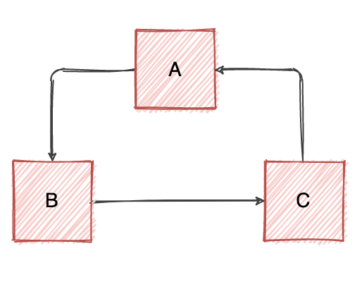
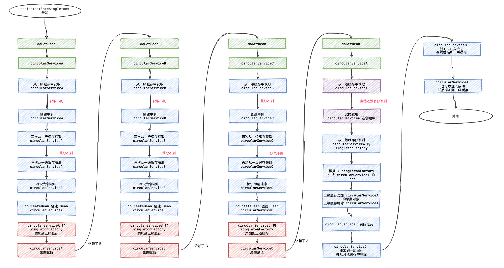
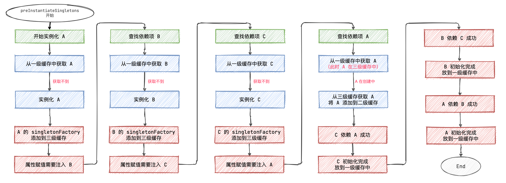

> Spring IoC 容器会在运行时检测到**构造函数注入**循环引用，并抛出 BeanCurrentlyInCreationException。
>
> 所以要避免构造函数注入，可以使用 setter 注入替代。

根据官方文档说明，Spring 会自动解决基于 setter 注入的循环依赖。

当然在咱们工作中现在都使用 `@Autowired` 注解来注入属性。

> PS: @Autowired 是通过反射进行赋值。

这里从我们最经常使用的场景切入，看 Spring 是如何解决循环依赖的？

#### 代码[#](https://www.cnblogs.com/liuzhihang/p/spring-circular.html#代码)

```java
@Service
public class CircularServiceA {

    @Autowired
    private CircularServiceB circularServiceB;
}

@Service
public class CircularServiceB {

    @Autowired
    private CircularServiceC circularServiceC;
}

@Service
public class CircularServiceC {

    @Autowired
    private CircularServiceA circularServiceA;

}
```

这里有 A、B、C 三个类，可以看到发生了循环依赖：



### Spring 是如何解决循环依赖的[#](https://www.cnblogs.com/liuzhihang/p/spring-circular.html#spring-是如何解决循环依赖的)

在 [Spring 单例 Bean 的创建](https://mp.weixin.qq.com/s/qZ4xXlqpNzsdHkvFm02Yuw) 中介绍介绍了使用三级缓存。

> singletonObjects： 一级缓存，存储单例对象，Bean 已经实例化，初始化完成。
>
> earlySingletonObjects： 二级缓存，存储 singletonObject，这个 Bean 实例化了，还没有初始化。
>
> singletonFactories： 三级缓存，存储 singletonFactory。



当然，这里看着比较长，可以简化一下：




```java
getSingleton(beanName);	// 缓存中拿不到
getSingleton(beanName,()->createBean(xxx)); // 根据工厂创建 bean
addSingletonFactory(beanName,()->getEarlyBeanRefrence(beanName,xxx));  // 添加获取半成品 bean 的方法.
// 当允许循环引用时,下次调用到 getSingleton(beanName) 的时候就可以根据上面添加的 lambda 获取到半成品 bean
```


p.s.

在设计上,

```java
getBean(beanName);//   获取 bean
getBean(beanFactoryName);//  获取 bean
getBean(&beanName);//			获取这个 bean 的工厂.
```

也就是说, **singletonFactory.getObject()**; 获取的实际上是由这个工厂生产的 **bean**

起的名字乱七八糟


