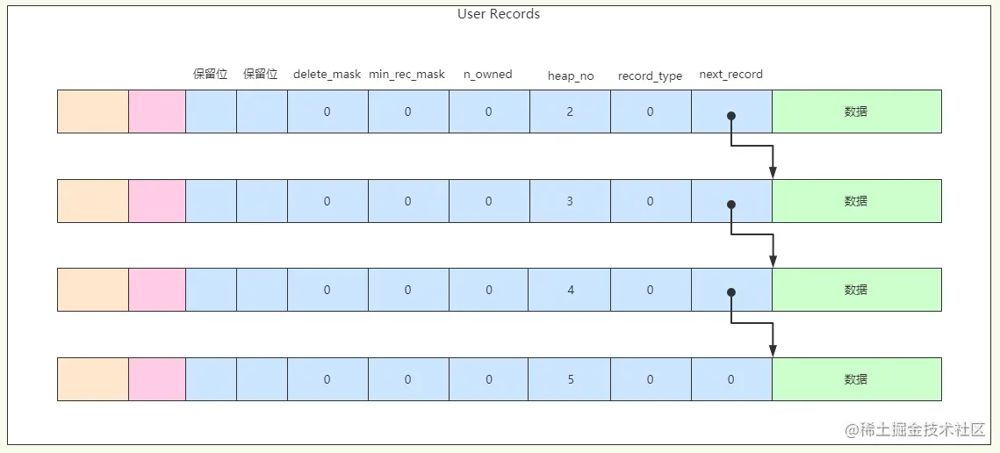

#### 基本思想

将数据划分成若干页,以页为单位作为磁盘和内存之间交互的基本单位.默认 16kb. mysql --initialize 初始化时设置大小,运行时不可改变

### InnoDB 行格式 四种

> create table 表名(...) row_format=行格式名

##### compact 格式

`变长字段长度列表  |  null 值列表  |  记录头信息  |  列 1  |  列 2  |  ...`

基本上可以看作是行的数据+value 构成

**变长字段长度列表**,字面意思,没啥好说的,这里提一个优化点:

- 变成字段长度表按照逆序排列,这样跟数据段就可以对应上了 
  len1 len2  ...  v2 v1. 可以两边向中间读取

- len 可能占一个或两个字节,具体的编码方式跟 google protocol 编码一样,用第一个位是 0 还是 1 标识是否是一个完成的长度

- 只存非 null 的值

**null 值列表** 

- 用比特位表示是否是 null,也是逆序排放
  1 0 0 ... v3 v2 v1 : 代表 v1 是 null,v2,v3 非 null

- 必须是整数个字节,不够则补充,比如,只有 3 个字段,则需要额外补充 5 位凑够 8 位(1 字节)

**记录头信息**

- 固定 5 个字节,即 40 位,混个脸熟吧,太多了...

#### 真实数据/数据字段

一般情况,除了自己定义的列以外,mysql 还会增加 3 个隐藏列(在最前面添加):

- row_id:没有主键且没有非 null 的 unique 键的话会默认加,用于唯一标识一条记录(隐藏主键)

- trx_id:事务 id,必须得

- roll_pointer: 回归指针

以上三个值都是固定字段且非 null,因此只会出现在数据字段

InnoDB 选择主键策略:默认使用用户定义的,如果没有则选取一个非 null 的 unique 键

补充,char(N) 是否是变长数据取决于数据表字符集,如果是 ascii 就是定长;如果是 utf 那么就是变长. 很好理解,因为 utf 本身就是变长编码格式

#### redundant 格式

这是一种比较老的格式了，了解即可

|字段长度偏移列表|记录头信息|数据段|

- 计算长度偏移列表

  > 1. 每个字段都会计算**长度**   (包括隐藏字段)
  > 2. 这里的长度并不是直接计算 len，而是通过相邻的两个偏移量之间的差值来计算一个字段的长度，这种看起来存储效率比较高，但是，不太直观，不想 compact 那种直接存储 len 来的直接
  > 3. 长度偏移量也是逆序排列的
  >
  > e.g. 比如 (row_id,trx_id,roll_pointer,c1) 四个列构成的元组，那么他的存放方式为
  >
  > 顺序排列则为 06 0c 13 17， 逆序排列为 17 13 0c 06
  >
  > 这里代表的含义 row_id 占 6 个字节，trx_id 占 0c-06=6个字节，roll_pointer 占 13-0c=7个字节，c1 占 17-13 占 4 个字节
  >
  > 
  >
  > 其实，这样记录还是有很大好处的，这里记录的刚好是 end，那么 file_end - end_i 就可以得到倒数第 i 个位置的 beg，就可以直接读取数据了。
  >
  > 
  >
  > redundant 的长度列表设计缺点：每个 end_i 占用的字节长度是一样的，要不是 1 字节，要不是是 2 字节，这个取决于总的数据长度是否大于 127 字节。2 字节最多记录 32767 个字节，超多的部分会存在**溢出页**中。(因为他搞了一个标志位，所以存储长度就被压缩了)

- 记录头信息

  > 6 字节，共 48 位，也是记录一些标志性信息

- null 值处理

  > null 的偏移量为 1：用第一个 bit 位作为标志位

  感觉把 元数据 放在中间不太好： 怎么快速定位到一条记录的元数据呢？[todo]() 
  读完 char(M) 之后，发现，redunant 根本没有变长这一说，因此，他的元数据可以从 end + value_size 直接定位到

- char(M)

  > 和 compact 不同，redundant 做的比较傻，utf8mb3 char(m) 固定 3m 字节，utf8mb4 char(M) 固定 4m 字节。 相当于原址申请空间了。 不过，这样肯定会造成很大的浪费

- 没有变长，这个就是 不compact 的原因吧

#### dynamic格式、compressed 格式

mysql5.7 之后 dynamic 格式就是默认格式了 `show variables like '%row%'`,

dynamic 与 compact 不同点在于处理溢出数据会把该列的全部数据都放在溢出页中，compress 则是在此基础上做了一个列压缩。

#### 溢出列

记录：   。。。|移除列地址|。。。

#### 总结

- 页是磁盘和内存交互的基本单位，InnoDB 管理的基本单位，默认 16kb

### InnoDB 数据页结构

##### InnoDB 数据页的样子

其中 `File Header、Page Header、File Trailer` 的大小是固定的，分别为 `38、56、8字节`。`User Records、Free Space、Page Directory` 这些部分为实际的行记录存储空间，因此大小是动态的。

#### 记录头信息

| 名称         | 大小(bit) | 描述                                                         |
| ------------ | --------- | ------------------------------------------------------------ |
| 预置位 1     | 1         |                                                              |
| 预置位 2     | 1         |                                                              |
| delete_mask  | 1         | 是否被删除。这样做的主要目的是，以后如果有新纪录插入表中，可以复用这些已删除记录的存储空间。  另外的一个原因就是和 undo 有关 |
| min_rec_mask | 1         | 标记为 B+ 树每层的最小记录                                   |
| n_owned      | 4         | 当前拥有几个记录                                             |
| heap_no      | 13        | 索引堆中该记录的排序记录                                     |
| record_typ   | 3         | 记录类型：普通记录，B+树内节点，B+树最小/大记录等            |
| next_redord  | 16        | 下一条记录的相对位置                                         |

##### compact 行记录的样子

##### B+ 树与页的样子

- `n_owned`

表示当前记录拥有的记录数，页中的数据其实还会分为多个组，每个组会有一个最大的记录，最大记录的 n_owned 就记录了这个组中的记录数。在后面介绍 Page Directory 时会看到这个属性的用途。

- `record_type`

记录类型：0 表示普通记录，1 表示B+树非叶子节点记录，2 表示最小记录，3 表示最大记录，1xx 表示保留

还是以前面索引结构图来看，上面两层的非叶子节点中的记录 record_type 都应该为 1。最底层的叶子节点应该就是普通记录，record_type 为 0。其实每个页还会有一个最小记录和最大记录，record_type 分别为 2 和 3，这个最小记录和最大记录其实就是后面要说的 Infimum 和 Supremum。

- `next_record`

表示从当前记录的真实数据到下一条记录的真实数据的地址偏移量，如果没有下一条记录就是 0。

数据页中的记录看起来就像下图这样，按主键顺序排列后，`heap_no` 记录了当前记录在本页的位置，然后通过 `next_record` 连接起来。

注意 `next_record` 指向的是记录头与数据之间的位置偏移量。这个位置向左读取就是记录头信息，向右读取就是真实数据，而且之前说过`变长字段长度列表`和`NULL值列表`中都是按列逆序存放的，这时往左读取的标识和往右读取的列就对应上了，提高了读取的效率。

如果删除了其中一条记录，`delete_mask` 就设置为 1，标记为已删除，`next_record` 就会设置为 0。其实页中被删除的记录会通过 next_record 形成一个垃圾链表，供以后插入记录时重用空间。

## File Header

record 相当于 B+ 树的每个 child 数据，这个相当于每个 B+ 树的节点了。

File Header 用来记录页的一些头信息，由8个部分组成，固定占用`38字节`。

主要先看下如下的一些信息：

- `FIL_PAGE_SPACE_OR_CHKSUM`

这个代表当前页面的校验和（checksum），每当一个页面在内存中修改了，在同步之前就要把它的校验和算出来。在一个页面被刷到磁盘的时候，首先被写入磁盘的就是这个 checksum。

- `FIL_PAGE_OFFSET`

每一个页都有一个单独的页号，InnoDB 通过页号来唯一定位一个页。

如某独立表空间 a.ibd 的大小为1GB，页的大小默认为16KB，那么总共有65536个页。FIL_PAGE_OFFSET 表示该页在所有页中的位置。若此表空间的ID为10，那么搜索页（10，1）就表示查找表a中的第二个页。

- `FIL_PAGE_PREV` 和 `FIL_PAGE_NEXT`

InnoDB 是以页为单位存放数据的，InnoDB 表是索引组织的表，数据是按主键顺序存放的。数据可能会分散到多个不连续的页中存储，这时就会通过 FIL_PAGE_PREV 和 FIL_PAGE_NEXT 将上一页和下一页连起来，就形成了一个双向链表。这样就通过一个双向链表把许许多多的页就都串联起来了，而无需这些页在物理上真正连着。

- `FIL_PAGE_TYPE`

这个代表当前页的类型，InnoDB 为了不同的目的而设计了许多种不同类型的页。

InnoDB 有如下的一些页类型：

## Page Header

Page Header 用来记录数据页的状态信息，由14个部分组成，共占用`56字节`。

- `PAGE_N_DIR_SLOTS`

页中的记录会按主键顺序分为多个组，每个组会对应到一个槽（Slot），`PAGE_N_DIR_SLOTS` 就记录了 Page Directory 中槽的数量。

- `PAGE_HEAP_TOP`

PAGE_HEAP_TOP 记录了 `Free Space` 的地址，这样就可以快速从 Free Space 分配空间到 User Records 了。

- `PAGE_N_HEAP`

本页中的记录的数量，包括最小记录（Infimum）和最大记录（Supremum）以及标记为删除（delete_mask=1）的记录。

- `PAGE_FREE`

已删除的记录会通过 `next_record`连成一个单链表，这个单链表中的记录空间可以被重新利用，PAGE_FREE 指向第一个标记为删除的记录地址，就是单链表的头节点。

- `PAGE_GARBAGE`

标记为已删除的记录占用的总字节数。

- `PAGE_N_RECS`

本页中记录的数量，不包括最小记录和最大记录以及被标记为删除的记录，注意和 PAGE_N_HEAP 的区别。

## Infimum 和 Supremum

InnoDB 每个数据页中有两个虚拟的行记录，用来限定记录的边界。`Infimum记录`是比该页中任何主键值都要小的记录，`Supremum记录` 是比改页中何主键值都要大的记录。这两个记录在页创建时被建立，并且在任何情况下不会被删除。

并且由于这两条记录不是我们自己定义的记录，所以它们并不存放在页的`User Records`部分，他们被单独放在一个称为`Infimum + Supremum`的部分。

Infimum 和 Supremum 都是由`5字节`的记录头和`8字节`的一个固定的部分组成，最小记录的固定部分就是单词 `infimum`，最大记录的固定部分就是单词 `supremum`。由于不存在可变长字段或可为空的字段，自然就不存在可变长度字段列表和NULL值列表了。

Infimum和Supremum记录的结构如下图所示。需要注意，Infimum 记录头的 `record_type=2`，表示最小记录；Supremum 记录头的 `record_type=3`，表示最大记录。

加上 Infimum 和 Supremum 记录后，页中的记录看起来就像下图的样子。Infimum 记录头的 next_record 指向该页主键最小的记录，该页主键最大的记录的 next_record 则指向 Supremum，Infimum 和 Supremum就构成了记录的边界。同时注意，记录头中 `heap_no` 的顺序， Infimum 和 Supremum 是排在最前面的。

## User Records 和 Free Space

`User Records`就是实际存储行记录的部分，`Free Space`明显就是空闲空间。

在一开始生成页的时候，并没有`User Records`这个部分，每当插入一条记录，就会从`Free Space`部分中申请一个记录大小的空间到`User Records`部分，当 Free Space 部分的空间用完之后，这个页也就使用完了。

## Page Directory

首先我们要知道，InnoDB 的数据是索引组织的，`B+树`索引本身并不能找到具体的一条记录，只能找到该记录所在的页，页是存储数据的最小基本单位。

如下图，如果我们要查找 ID=32 的这行数据，通过索引只能定位到第 17 页。

定位到页之后我们可以通过最小记录`Infimum`的记录头的`next_record`沿着链表一直往后找，就可以找到 ID=32 这条记录了。

但是可以想象，沿着链表顺序查找的性能是很低的。所以，页中的数据其实是分为多个组的，这看起来就形成了一个子目录，通过子目录就能缩小查询的范围，提高查询性能了。

`Page Directory` 翻译过来就是页目录，这部分存放的就是一个个的槽（Slot），页中的记录分为了多个组，槽就存放了每个组中最大的那条记录的相对位置（记录在页中的相对位置，不是偏移量）。这个组有多少条记录，就通过最大记录的记录头中的 `n_owned` 来表示。

对于分组中的记录数是有规定的：`Infimum记录` 所在的分组只能有 1 条记录，`Supremum记录` 所在的分组中的记录条数只能在 `1~8` 条之间，中间的其它分组中记录数只能在是 `4~8` 条之间。

`Page Directory` 的生成过程如下：

- 初始情况下一个数据页里只有`Infimum`和`Supremum`两条记录，它们分属于两个组。Page Directory 中就有两个槽，分别指向这两条记录，且这两条记录的 `n_owned` 都等于 `1`。
- 之后每插入一条记录，都会从页目录中找到`主键值比本记录的主键值大并且差值最小的槽`，然后把该槽对应的记录的 `n_owned` 值加`1`，表示本组内又添加了一条记录，直到该组中的记录数等于`8条`。
- 在一个组中的记录数等于`8条`后再插入一条记录时，会将组中的记录拆分成两个组，一个组中`4条`记录，另一个`5条`记录。这个过程会在页目录中新增一个槽来记录这个新增分组中最大的那条记录的相对位置。
- 当记录被删除时，对应槽的最大记录的 n_owned 会减 1，当 n_owned 小于 4 时，各分组就会平衡一下，总之要满足上面的规定。

其实正常情况下，按照主键自增长新增记录，可能每次都是添加到 `Supremum` 所在的组，直到它的 `n_owned` 等于`8`时，再新增记录时就会分成两个组，一个组`4条`记录，一个组`5条`记录。还会新增一个槽，指向`4条`记录分组中的最大记录，并且这个最大记录的`n_owned`会改为`4`，`Supremum` 的`n_owned`就会改为`5`。

Page Directory 中槽（Slot）的数量就会记录到 `Page Header` 中的 `PAGE_N_DIR_SLOTS`。

我们可以通过下图来理解下 Page Directory 中槽（Slot）和分组中最大记录的关系。

- 首先，Slot0 指向 Infimum 记录，因为最小记录所在的分组只能有一条记录，它的 `n_owned=1`.
- 接着 Slot1、Slot2、Slot3 分别指向各自分组中的最大记录，且 `n_owned=4`，可以想象其实就是 `Supremum` 组分组而来的。
- 最后，Slot4 指向 `Supremum`，这是最大记录的组，经过分组后，它的 `n_owned=5`。

可以看到，页中的数据经过分组后在 Page Directory 中就形成了一个目录槽，每个槽就指向了分组中的最大记录，最大记录的记录头中的 `n_owned` 就记录了这个组中的记录数。

有了目录槽之后，InnoDB就会利用二叉查找迅速确定记录所在的槽，并找到该槽所在分组中主键值最小的那条记录，再通过最小记录的 next_record 遍历记录，就能快速定位到匹配的那条记录了。

二叉查找的时间复杂度很低，同时在内存中的查找很快，因此通常会忽略这部分查找所用的时间。

## File Trailer

前面介绍 `File Header` 时说过，在将页写入磁盘时，最先写入的便是 File Header 中的 `FIL_PAGE_SPACE_OR_CHKSUM` 值，就是页面的校验和。在写入的过程中，数据库可能发生宕机，导致页没有完整的写入磁盘。

为了校验页是否完整写入磁盘，InnoDB 就设置了 `File Trailer` 部分。File Trailer 中只有一个`FIL_PAGE_END_LSN`，占用`8字节`。FIL_PAGE_END_LSN 又分为两个部分，前`4字节`代表页的校验和；后`4字节`代表页面被最后修改时对应的日志序列位置（LSN），与File Header中的`FIL_PAGE_LSN`相同。

默认情况下，InnoDB存储引擎每次从磁盘读取一个页就会检测该页的完整性，这时就会将 `File Trailer` 中的校验和、LSN 与 `File Header` 中的 `FIL_PAGE_SPACE_OR_CHKSUM`、`FIL_PAGE_LSN` 进行比较，以此来保证页的完整性。

