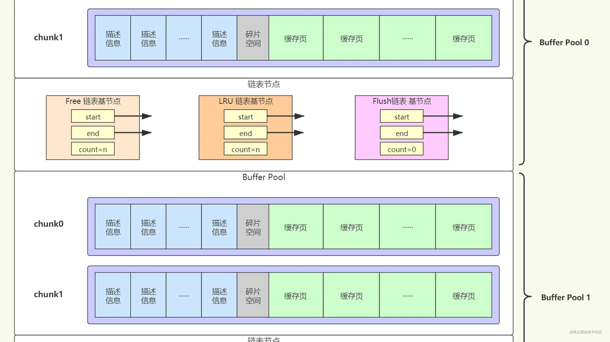
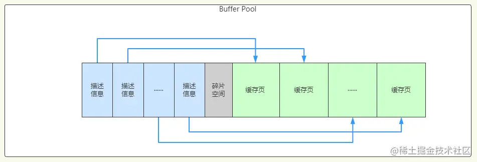
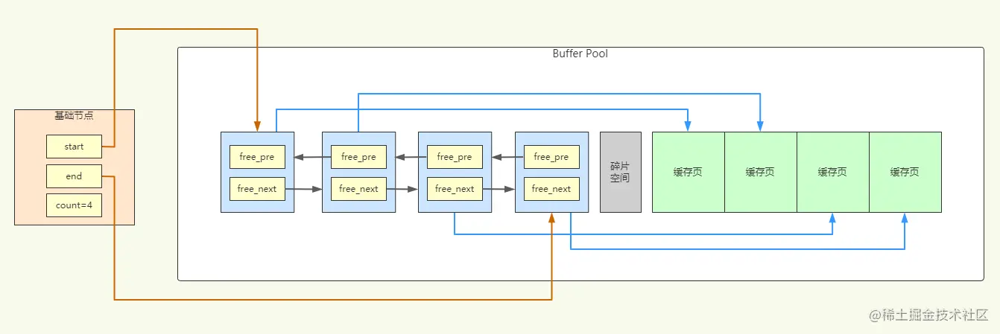
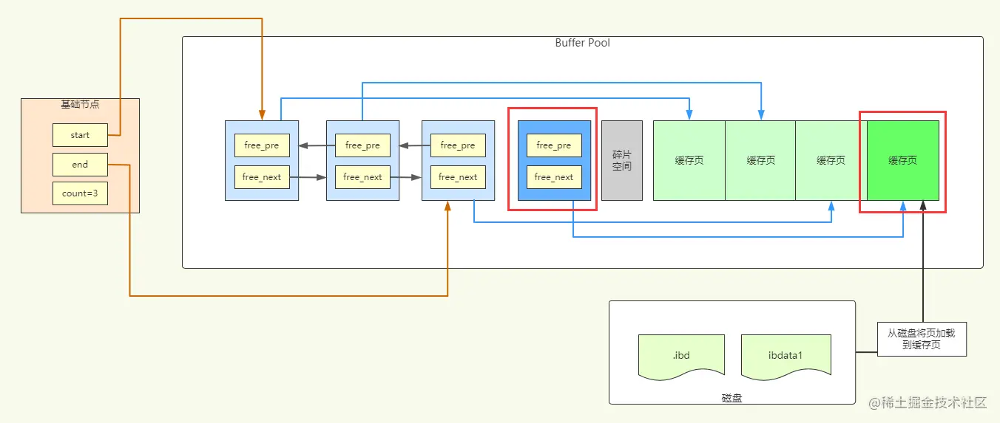
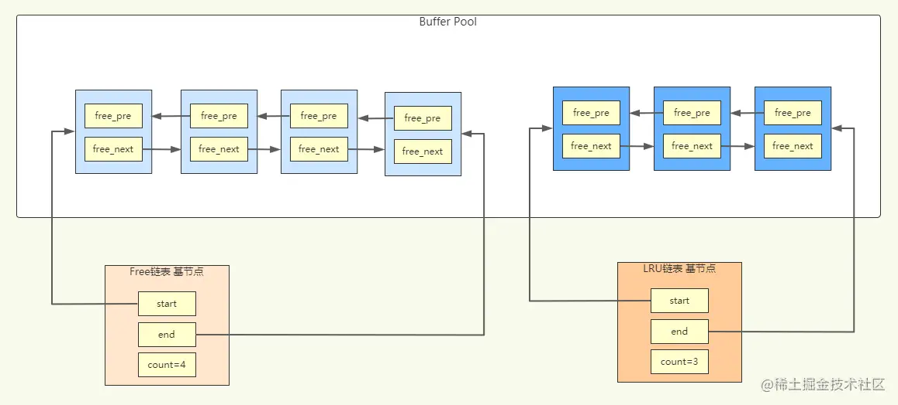
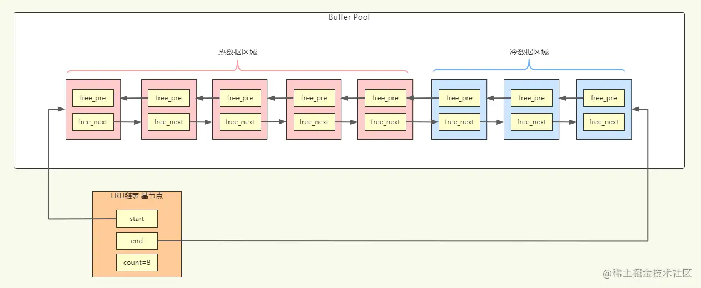
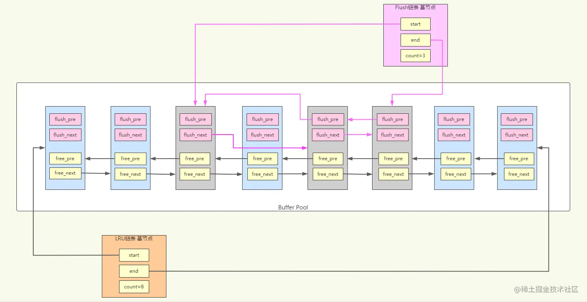
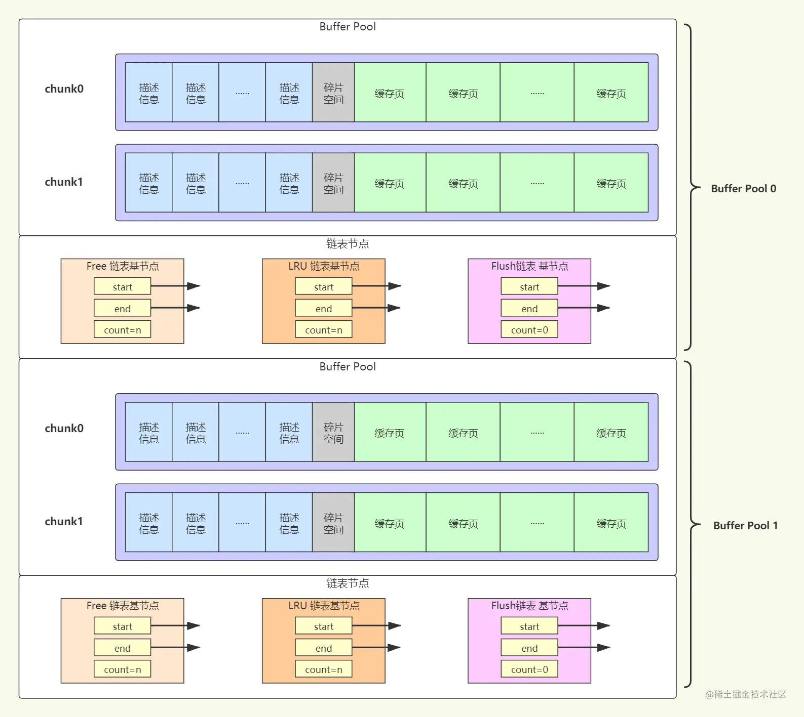

Buffer pool

由于CPU速度与磁盘速度之间的鸿沟，通常都会将数据加载到内存中来操作数据，以此提高数据库的整体性能。

InnoDB 设计了一个缓冲池（Buffer Pool），当需要访问某个页时，就会把这一页的数据全部加载到缓冲池中，这样就可以在内存中进行读写访问了。对于数据库中页的修改操作，也是先修改在缓冲池中的页，然后再以一定的频率刷新到磁盘上。有了缓冲池，就可以省去很多磁盘IO的开销了，从而提升数据库性能。

注意即使只访问页中的一条记录，也需要把整个页的数据加载到内存中。前面有说过，通过索引只能定位到磁盘中的页，而不能定位到页中的一条记录。将页加载到内存后，就可以通过页目录（Page Directory）去定位到某条具体的记录。

 buffer pool 结构

Buffer Pool 也是按页来划分的，默认和磁盘上的页一样，都是 `16KB` 大小。Buffer Pool 中不只缓存了数据页，还包括索引页、undo页、插入缓冲、自适应哈希索引、InnoDB存储的锁信息、数据字典信息等。

为了管理 Buffer Pool 中的缓存页，InnoDB 为每一个缓存页都创建了一些描述信息（元数据），用来描述这个缓存页。描述信息主要包括该页所属的表空间编号、页号、缓存页的地址、链表节点信息、锁信息、LSN信息等等。

这个描述信息本身也是一块数据，它们占用的内存大小都是相同的。在 Buffer Pool 中，每个缓存页的描述信息放在最前面，各个缓存页在后面。看起来就像下图这个样子。




另外需要注意下，每个描述数据大约相当于缓存页大小的 `5%`，也就是`800字节`左右的样子。而我们设置的 `innodb_buffer_pool_size` 并不包含描述数据的大小，实际上 Buffer Pool 的大小会超出这个值。比如默认配置 128MB，那么InnoDB在为 Buffer Pool 申请连续的内存空间时，会申请差不多 `128 + 128*5% ≈ 134MB` 大小的空间。

Buffer Pool 中划分缓存页的时候，会让所有的缓存页和描述数据块都紧密的挨在一起，前面是描述数据块，后面是缓存页，尽可能减少内存浪费。但是划分完后，可能还剩一点点的内存，这点内存放不下任何一个缓存页了，这就是图中的碎片空间了。


##### Free 链表

为了便于找到 buffer pool 中的空闲空间，描述信息实际上是会组装成一个空闲链表(双向链表)。

```c++
class{
  pre;			// 指向前一个描述信息
  next;			// 指向后一个描述信息
  data;			// 指向缓存页
}
```



有了这个 Free链表 之后，当需要从磁盘加载一个页到 Buffer Pool 时，就从 Free链表 中取出一个描述数据块，然后将页写入这个描述数据块对应的空闲缓存页中。并把一些描述数据写入描述数据块中，比如页的表空间号、页号之类的。最后，把缓存页对应的描述数据块从 Free链表 中移除，表示该缓存页已被使用了。

可以看到，从磁盘加载一个页到缓存页后，缓存页对应的描述信息块就从Free链表移除了。




##### 如何判断物理页是否被缓存

有些数据页被加载到 Buffer Pool 的缓存页中了，那怎么知道一个数据页有没有被缓存呢？

所以InnoDB还会有一个哈希表数据结构，它用 `表空间号+数据页号` 作key，value 就是缓存页的地址。

当使用一个数据页的时候，会先通过`表空间号+数据页号`作为key去这个哈希表里查一下，如果没有就从磁盘读取数据页，如果已经有了，就直接使用该缓存页。


## LRU 链表

前面已经知道 `Free链表`管理着所有空闲的缓存页，当使用了一个缓存页后，那个缓存页就从 Free链表 移除了，那它对应的控制块到哪里去了呢？

这时就有另外一个 `LRU 链表` 来管理已经使用了的缓存页。LRU链表与 Free链表的结构是类似的，都会有一个基础节点来指向链表的首、尾描述信息块，加入LRU链表中的描述信息块就通过 `free_pre` 和 `free_next` 两个指针连接起来行程一个双向链表。

例如查询数据的时候，首先从索引找到数据所在的数据页，再根据 表空间号+页号 去缓存页哈希表查找页是否已经在 Buffer Pool 中了，如果在就直接使用，不在就从磁盘加载页，然后从 Free链表 取出一个空闲页加入到 LRU链表，再把数据页放到缓存页中，并以表空间号+页号作为 key，缓存页地址作为 value，放入缓存页哈希表。

可以通过下图来理解 Free链表 和 LRU链表，注意缓存页没有画出，描述信息块是保存了缓存页的地址的




### 简单 LRU 链表

`LRU 链表`，就是所谓的 `Least Recently Used`，最近最少使用的意思。因为缓冲池大小是有限的，不可能一直加载数据到缓冲池中，对于一些频繁访问的数据可以一直留在缓冲池中，而一些很少访问的数据，当缓存页快用完了的时候，就可以淘汰掉一些。这时就可以使用 LRU链表 来管理已使用的缓存页，这样就可以知道哪些页最常使用，哪些页最少使用了。

按照正常对LRU链表的理解，一个新的数据页从磁盘加载到缓存页时，对应的描述信息块应该是放到 LRU链表 的头部，每次查询、修改了一个页，也将这个页对应的描述信息块移到 LRU链表 的头部，也就是说最近被访问过的缓存页都在 LRU 链表的头部。然后当 Free链表 用完了之后，就可以从 LRU链表的尾部找一些最少使用的页刷入磁盘，腾出一些空闲页来。

但是这种 LRU链表 有几个问题：

1、InnoDB 有一个`预读机制`，就是从磁盘上加载一个数据页的时候，可能连带着把这个数据页相邻的其它数据页都加载到缓存里去。虽然预读了其它页，但可能都没用上，但是这些页如果都往 LRU 头部放，就会导致原本经常访问的页往后移，然后被淘汰掉。这种情况属于加载到 Buffer Pool 中的页不一定被用到导致缓存命中率降低。

2、如果我们写了一个`全表扫描`的查询语句，一下就将整个表的页加载到了 LRU 的头部，如果表记录很多的话，可能 LRU 链表中之前经常被访问的页一下就淘汰了很多，而留下来的数据可能并不会被经常访问到。这种就是加载了大量使用频率很低的页到 Buffer Pool，然后淘汰掉使用频率很高的页，从而导致缓存命中率降低。

> 缓存命中率：假设一共访问了n次页，那么被访问的页已经在缓存中的次数除以n就是所谓的缓存命中率，缓存命中率肯定是越高越好


### 冷热数据分离的 LRU 链表

为了解决简单 LRU 链表的问题，InnoDB在设计 LRU 链表的时候，实际上是采取`冷热数据分离`的思想，LRU链表会被拆成两部分，一部分是`热数据`（又称`new列表`），一部分是`冷数据`（又称`old列表`）。如下图所示。



这个冷热数据的位置并不固定，是一个比例，由参数 `innodb_old_blocks_pct` 来控制，默认比例是 `37`，也就是冷数据占 `37%`，大约占 LRU链表 `3/8` 的样子。

```sql
mysql> SHOW VARIABLES LIKE 'innodb_old_blocks_pct';
+-----------------------+-------+
| Variable_name         | Value |
+-----------------------+-------+
| innodb_old_blocks_pct | 37    |
+-----------------------+-------+
```

基于冷热分离的LRU链表，这时新加载一个缓存页时，就不是直接放到LRU的头部了，而是放到`冷数据区域`的头部。那什么时候将冷数据区域的页移到热数据区域呢？也许你会认为访问了一次或几次页就会移到热数据区域的头部，其实不是这样的。

如果是预读机制加载了一些不用的页，慢慢的被淘汰掉就行了。但如果是全表扫描加载了大量的页进来，必然是会被读取至少一次的，而且一页包含很多条记录，可能会被访问多次。所以这时就将冷数据区域的页移到热数据区域也是不太合理的。

所以 InnoDB 设置了一个规则，在第一次访问冷数据区域的缓存页的时候，就在它对应的描述信息块中记录第一次访问的时间，默认要间隔`1秒`后再访问这个页，才会被移到热数据区域的头部。也就是从第一次加载到冷数据区域后，1秒内多次访问都不会移动到热数据区域，基本上全表扫描查询缓存页的操作1秒内就结束了。

这个间隔时间是由参数 `innodb_old_blocks_time` 控制的，默认是 `1000毫秒`。如果我们把这个参数值设置为0，那么每次访问一个页面时就会把该页面放到热数据区域的头部。

```sql
mysql> SHOW VARIABLES LIKE 'innodb_old_blocks_time';
+------------------------+-------+
| Variable_name          | Value |
+------------------------+-------+
| innodb_old_blocks_time | 1000  |
+------------------------+-------+
```

之后缓存页不够用的时候，就会优先从冷数据区域的尾部淘汰掉一些不常用的页，频繁访问的数据页还是会留在热数据区域，不会受到影响。而冷数据区域停留超过1秒的页，被再次访问时就会移到热数据区域的头部。

热数据区域中的页是每访问一次就移到头部吗？也不是的，热数据区域是最频繁访问的数据，如果频繁的对LRU链表进行节点移动操作也是不合理的。所以 InnoDB 就规定只有在访问了热数据区域的 `后3/4` 的缓存页才会被移动到链表头部，访问 `前1/4` 中的缓存页是不会移动的。

下面对冷热数据分离的LRU链表总结下：

- LRU链表分为冷、热数据区域，前 `63%` 为热数据区域，后 `37%` 为冷数据区域，加载缓存页先放到冷数据区域头部。
- 冷数据区域的缓存页第一次访问超过1秒后，再次访问时才会被移动到热数据区域头部。
- 热数据区域中，只有后 `3/4` 的缓存页被访问才会移到头部，前 `1/4` 被访问到不会移动。
- 淘汰数据优先淘汰冷数据区域尾部的缓存页。


Flush 链表（脏页面链表）

当我们执行增删改的时候，肯定是去更新了 Buffer Pool 中的某些缓存页，那这些被更新了的缓存页就和磁盘上的数据页不一致了，就变成了脏页。这些脏页最终肯定会被刷回到磁盘中，但并不是所有的缓存页都需要刷回到磁盘，因为有些页只是被查询了，但并没有被增删改过。

那怎么知道哪些页是脏页呢？这时就引入了另一个链表，`Flush 链表`。Flush链表 跟前面两个链表一样，也有一个基础节点，如果一个缓存页被修改了，就会加入到 Flush链表 中。但是不像 LRU链表 是从 Free链表 中来的，描述信息块中还有两个指针 `flush_pre`、`flush_next`用来连接形成 flush 链表，所以 Flush链表 中的缓存页一定是在 LRU 链表中的，而 LRU 链表中不在 Flush链表 中的缓存页就是未修改过的页。可以通过下图来理解 LRU 链表和 Flsuh链表。

可以看到，脏页既存在于 LRU链表 中，也存在于 Flush链表 中。LRU链表 用来管理 Buffer Pool 中页的可用性，Flush链表 用来管理将页刷新回磁盘，二者互不影响。




## 刷新脏页到磁盘

前面我们已经知道，LRU链表分为冷热数据区域，这样就可以在空闲缓存页不够的用的时候，可以将LRU链表尾部的磁盘页刷回磁盘，腾出一些空闲页来，还有 Flush链表 中的脏页，在某些时刻也会刷回磁盘中。那将脏页刷回磁盘的时机有哪些呢？

- 定时从 LRU链表 尾部刷新一部分脏页到磁盘

后台有专门的线程会定时从`LRU链表`尾部扫描一些缓存页，扫描的数量可以通过参数 `innodb_lru_scan_depth` 来设置。如果有脏页，就会把它们刷回磁盘，然后释放掉，不是脏页就直接释放掉，再把它们加回`Free链表`中。这种刷新页面的方式被称之为 `BUF_FLUSH_LRU`。

- 定时把 Flush链表 中的一些脏页刷回磁盘

后台线程会在MySQL不怎么繁忙的时候，将 Flush 链表中的一些脏页刷到磁盘，这样LRU热数据区域的一些脏页就会被刷回磁盘。这种刷新页面的方式被称之为 `BUF_FLUSH_LIST`。

- 没有空闲页的时候刷新页

前面两种方式是后台线程定时运行，并不是在缓存页满的时候才去刷新脏页，这种方式不会影响用户线程处理正常的请求。

但可能要加载一个数据页到 Buffer Pool 时，没有空闲页了，这时就会从 LRU链表 尾部找一个缓存页，如果是脏页就刷回磁盘，如果不是脏页就释放掉，然后放入Free链表中，再将数据页放入这个腾出来的空闲页中。如果要刷新脏页，这时就会降低处理用户请求的速度，毕竟和磁盘交互是很慢的。这种刷新单个页面到磁盘中的刷新方式被称之为 `BUF_FLUSH_SINGLE_PAGE`。


## Buffer Pool 配置调优

### 配置多个Buffer Pool来提升数据库的并发性能

多线程访问 Buffer Pool 的时候，会涉及到对同一个 Free、LRU、Flush 等链表的操作，例如节点的移动、缓存页的刷新等，那必然是会涉及到加锁的。

首先要知道，就算只有一个 Buffer Pool，多线程访问要加锁、释放锁，由于基本都是内存操作，所以性能也是很高的。但在一些高并发的生产环境中，配置多个 Buffer Pool，还是能极大地提高数据库并发性能的。

可以通过参数 `innodb_buffer_pool_instances` 来配置 Buffer Pool 实例数，通过参数 `innodb_buffer_pool_size` 设置所有 Buffer Pool 的总大小（单位`字节`）。每个 Buffer Pool 的大小就是 `innodb_buffer_pool_size / innodb_buffer_pool_instances`。

```sh
[server]
innodb_buffer_pool_size=2147483648
innodb_buffer_pool_instances=2
```

InnoDB 规定，当 `innodb_buffer_pool_size` 小于`1GB`的时候，设置多个实例是无效的，会默认把`innodb_buffer_pool_instances` 的值修改为`1`。

### 动态调整Buffer Pool大小

我们可以在运行时动态调整 `innodb_buffer_pool_size` 这个参数，但 InnoDB 并不是一次性申请 pool_size 大小的内存空间，而是以 `chunk` 为单位申请。一个 chunk 默认就是 `128M`，代表一片连续的空间，申请到这片内存空间后，就会被分为若干缓存页与其对应的描述信息块。

也就是说一个Buffer Pool实例其实是由若干个`chunk`组成的，每个chunk里划分了描述信息块和缓存页，然后共用一套 Free链表、LRU链表、Flush链表。



每个`chunk` 的大小由参数 `innodb_buffer_pool_chunk_size` 控制，这个参数只能在服务器启动时指定，不能在运行时动态修改。

```sql
mysql> SHOW VARIABLES LIKE 'innodb_buffer_pool_chunk_size';
+-------------------------------+-----------+
| Variable_name                 | Value     |
+-------------------------------+-----------+
| innodb_buffer_pool_chunk_size | 134217728 |
+-------------------------------+-----------+
```

### 合理设置 Buffer Pool 大小

在生产环境中安装MySQL数据库，首先我们一般要选择大内存的机器，那我们如何合理的设置 Buffer Pool 的大小呢？

比如有一台 32GB 的机器，不可能说直接给个30G，要考虑几个方面。首先前面说过，`innodb_buffer_pool_size` 并不包含描述块的大小，实际 Buffer Pool 的大小会超出 `innodb_buffer_pool_size` `5%` 左右。另外机器本身运行、MySQL运行也会占用一定的内存，所以一般 Buffer Pool 可以设置为机器的 `50%~60%` 左右就可以了，比如32GB的机器，就设置 `innodb_buffer_pool_size` 为 20GB。

另外，`innodb_buffer_pool_size` 必须是 `innodb_buffer_pool_chunk_size × innodb_buffer_pool_instances` 的倍数，主要是保证每一个Buffer Pool实例中包含的chunk数量相同。

比如默认 chunk_size=128MB，pool_size 设置 20GB，pool_instances 设置 16 个，那么 20GB / (128MB * 16) = 10 倍，这样每个 Buffer Pool 的大小就是 128MB * 10 = 1280MB。如果将 pool_instances 设置为 32 个，那么 20GB / (128MB * 32) = 5 倍，这样每个 Buffer Pool 的代销就是 128MB * 5 = 640MB


