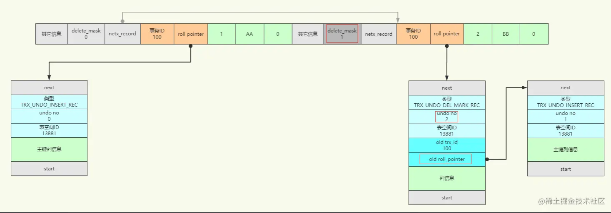

### 事务应该具有的四个特性：

- 原子性

- 隔离性

  > 多个事务执行不受影响
  > 这个总跟可串行化搞混，隔离性是事务的特性，可串行化是保证隔离性的一种手段

- 一致性

  > 这个更像是定义数据的约数条件，比如，性别只能是男火女，人民币最大面值是 100，这个更多的是靠业务代码去保证。

- 持久性

一次事务的执行就对应一个状态的转变


### 开启事务

```sql
(begin | start transaction) [read only,read write,with consistent snapshot];  -- begin 和 start transaction 含义相同

start transaction read only,with consistent snapshot; -- 开启一个只读的，一致性读的事务

commit; -- 提交
rollback; -- 手动回滚
```

默认情况下，每条 sql 都会自动提交，所以，每个 sql 都算是一个独立的事务。


### 隐式提交

当使用 start transcation 或者 begin 语句开启了一个事务，或者把系统变量: autocommit  的值设置为 OFF 时，事务就不会进行自动提交。

但是，某些语句执行时，会提交之前的 sql：

- 执行 定义或修改数据库对应的数据定义语言，ddl。如 create,alter,drop 等
- 当前事务没有提交又开启一个新事物
- 加锁。lock tables，unlocks tables 等锁定语句
- 加载数据的语句，如 load data
- mysql 的复制语句，如 start slave，stop slave，change maskter to 等
- 其他语句 ANALYZE TABLE CACHE INDEX， CHECK TABLE， FLUSH， LOAD INDEX INTO CACHE， OPTIMIZE TABLE ，REPAIR TABLE ，RESET 

### 保存点

rollback 默认全部回滚，因此，引入保存点

```sql
xxx
savepoint p1;
rollback to p1;    -- 只回滚到p1而不会全部回滚

release p1;        -- 删除保存点
```


## redo 日志

系统崩溃了，写在缓存中的数据没有落盘怎么办

先写修改日志，这样，即使系统崩溃，照着日志重新搞一遍就行了


## undo 日志

事务 id 分配时机

- 只读事务：只读事务不可以对普通表增删改查，但是可以对临时表增删改查，当第一次对临时表修改时会分配事务 id
- 读写事务：第一次对表增删改查时分配事务 id

##### 事务 id 如何生成

> **这个策略还是值得学一学的**，为了减少刷盘次数
>
> 服务器内存中维护一个全局递增变量，每分配一个就+1
> 当变量值为 256 的倍数时，刷盘(具体会刷到系统表空间页号为 5 的 max_trx_id中)
> 服务器重启时会将 max_trx_id读出来+256 作为新的值
>
> 这样不用每次都刷盘就能保证他是递增的，同时，就算系统崩溃也没问题。也不需要写日志啥的


#### 行记录隐藏列

在介绍InnoDB行记录格式这篇文章中，我们了解到行记录中会有三个隐藏列：

- `DB_ROW_ID`：如果没有为表显式的定义主键，并且表中也没有定义唯一索引，那么InnoDB会自动为表添加一个`row_id`的隐藏列作为主键。
- `DB_TRX_ID`：事务中对某条记录做增删改时，就会将这个事务的事务ID写入`trx_id`中。
- `DB_ROLL_PTR`：回滚指针，本质上就是指向 undo log 的指针。


#### Undo Log 类型

##### insert undo


> insert undo 中不需要保存以前的 undo log 指针，因为以前都没有。
> 同时，如果是后续插入，那么根据快照读的要求，这个事务 id 一定是比较大的，因此，此前开始的事务快照读是读不到的。
>
> 或者说，insert 的回归就对应的 delete，所以没有历史
> 额外的回滚信息，只需要记录主键即可

```sql
BEGIN;
INSERT INTO account(id,card,balance) VALUES (1, 'AA', 0),(2, 'BB', 0);
```

假设这个事务的事务ID为`100`，这条INSERT语句会插入两条数据，就会产生两个 undo log。插入记录的时候，会在行记录的隐藏列事务ID中写入当前事务ID，并产生 undo log，记录中的回滚指针会保存 undo log 的地址。而同一个页中的多条记录会通过`next_record`连接起来形成一个单链表，这块可以参考前面的行记录格式和数据页结构相关的文章。


##### delete undo


insert undo 没有索引列的信息可能是因为在插入事务提交之前，并不会向二级索引中插入数据？

和 insert undo 不同的是，delete undo 中包含了 旧事物的 txd_id 以及回滚指针，这两个东西刚好可以构建成一个链表，各种 version 的链表。
为什么还有索引列的信息，这个我认为是删除操作有关，delete 在事物提交前是不会真的执行删除的，只是先做了标记，第二步才会真正执行删除操作。用于删除中间状态什么的

```sql
BEGIN;
INSERT INTO account(id,card,balance) VALUES (1, 'AA', 0),(2, 'BB', 0);
DELETE FROM account WHERE id = 2;
```

因为是在同一个事务中，所以记录中的隐藏列`trx_id`没变，记录头中的`delete_mask`则标记为`1`了。然后生成了一个新的 undo log，并保存了记录中原本的`trx_id`和`roll_pointer`，所以这个新的 undo log 就指向了旧的 undo log，而记录中的 roll_pointer 则指向这个新的 undo log。注意 undo log 中的事务编号也在递增。





##### update undo

- 不更新主键

  > 在不更新主键的情况下，又可以细分为被更新的列占用的存储空间不发生变化和发生变化的情况。
  >
  > - 存储空间未发生变化
  >
  > 更新记录时，对于被更新的`每个列`来说，如果更新后的列和更新前的列占用的`字节数`都一样大，那么就可以进行**就地更新**，也就是直接在原记录的基础上修改对应列的值。
  >
  > - 存储空间发生变化
  >
  > 如果有`任何一个`被更新的列更新前和更新后占用的`字节数`大小不一致，那么就会先把这条旧的记录从聚簇索引页面中删除掉，然后再根据更新后列的值创建一条新的记录插入到页面中。注意这里的删除并不是将 `delete_mask` 标记为 `1`，而是真正的删除，从数据链表中移除加入到垃圾链表的头部。
  >
  > 如果新的记录占用的存储空间大小不超过旧记录占用的空间，就可以直接重用刚加入垃圾链表头部的那条旧记录所占用的空间，否就会在页面中新申请一段空间来使用。
  >
  > 不更新主键的这两种情况生成的 undo log 类型为 `TRX_UNDO_UPD_EXIST_REC`，大致结构如下图所示，与 `TRX_UNDO_DEL_MARK_REC` 相比主要是多了更新列的信息。
  >
  > 假设此时更新id=1的这条数据，各列占用的字节大小都未变化：
  >
  > ```SQL
  > BEGIN;
  > INSERT INTO account(id,card,balance) VALUES (1, 'AA', 0),(2, 'BB', 0);
  > DELETE FROM account WHERE id = 2;
  > UPDATE account SET card = 'CC' WHERE id = 1;
  > ```
  >
  > 

- 更新主键

  > 要知道记录是按主键大小连成一个单向链表的，如果更新了某条记录的主键值，这条记录的位置也将发生改变，也许就被更新到其它页中了。
  >
  > 这种情况下的更新分为两步：
  >
  > - 首先将原记录做标记删除，就是将 `delete_mask` 改为 `1`，还没有真正删除。
  > - 然后再根据更新后各列的值创建一条新记录，并将其插入到聚簇索引中。
  >
  > 所以这种情况下，会产生两条 undo log：
  >
  > - 第一步标记删除时会创建一条 `TRX_UNDO_DEL_MARK_REC` 类型的 undo log。
  > - 第二步插入记录时会创建一条 `TRX_UNDO_INSERT_REC` 类型的 undo log。
  >
  > 这两种类型的结构前面已经说过了。
  >
  > 此时再将id=1的主键更新：
  >
  > ```SQL
  > BEGIN;
  > INSERT INTO account(id,card,balance) VALUES (1, 'AA', 0),(2, 'BB', 0);
  > DELETE FROM account WHERE id = 2;
  > UPDATE account SET card = 'CC' WHERE id = 1;
  > UPDATE account SET id = 3 WHERE id = 1;
  > ```
  >
  > 更新主键后，原本的记录就被标记删除了，然后新增了一个 `TRX_UNDO_DEL_MARK_REC` 的 undo log。接着插入了一条新的id=3的记录，并创建了一个新的 `TRX_UNDO_INSERT_REC` 类型的 undo log。
  >
  > 
  >
  > 


## undo log 回滚

前面在一个事务中增删改产生的一系列 undo log，都有 `undo no` 编号的。在回滚的时候，就可以应用这个事务中的 undo log，根据 `undo no` 从大到小开始进行撤销操作。

例如上面的例子如果最后回滚了：

- 就会先执行第 5 号 undo log，删除 id=3 这条数据；
- 接着第4号 undo log，取消标记删除，将 id=1 这条数据的 `delete_mask` 改为 `0`；
- 接着第3号 undo log，将更新的列`card='CC'`还原为原来的`card='AA'`；
- 接着第2号 undo log，取消标记删除，将 id=2 这条数据的 `delete_mask` 改为 `0`；
- 接着第1号 undo log，删除 id=2 这条数据；
- 接着第0号 undo log，删除 id=1 这条数据；

可以看到，回滚时通过执行 undo log 撤销，就将数据还原为原来的样子了。

但需要注意的是，undo log 是`逻辑日志`，只是将数据库`逻辑地恢复`到原来的样子。所有修改都被逻辑地取消了，但是数据结构和页本身在回滚之后可能大不相同。因为同时可能很多并发事务在对数据库进行修改，因此不能将一个页回滚到事务开始的样子，因为这样会影响其他事务正在进行的工作。


## undo log 分类

前边介绍了几种类型的 undo log，它们其实被分为两个大类来存储：

- `TRX_UNDO_INSERT`

类型为 TRX_UNDO_INSERT_REC 的 undo log 属于此大类，一般由 INSERT 语句产生，或者在 UPDATE 更新主键的时候也会产生。

- `TRX_UNDO_UPDATE`

除了类型为 TRX_UNDO_INSERT_REC 的 undo log，其他类型的 undo log 都属于这个大类，比如  TRX_UNDO_DEL_MARK_REC 、 TRX_UNDO_UPD_EXIST_REC ，一般由 DELETE、UPDATE 语句产生。

之所以要分成两个大类，是因为不同大类的 undo log 不能混着存储，因为类型为`TRX_UNDO_INSERT_REC`的 undo log 在事务提交后可以直接删除掉，而其他类型的 undo log 还需要提供`MVCC`功能，不能直接删除。

`undo log` 是存放在`FIL_PAGE_UNDO_LOG`类型的页中，一个事务中可能会产生很多 undo log，也许就需要申请多个undo页，所以 InnoDB 将其设计为一个链表的结构，将`一个事务`中的多个undo页连接起来。

如果事务中还修改了临时表，InnoDB规定对普通表和临时表修改产生的 undo log 要分开存储，所以在一个事务中最多可能会有`4`个 undo 页面链表。

需要注意的是这些链表并不是事务一开始就分配好的，而是在需要某个类型的链表的时候才会去分配。


#### 复用 undo 页

如果有多个并发事务执行，为了提高 undo log 的写入效率，不同事务执行过程中产生的 undo log 会被写入到不同的 undo 页面链表中。也就是说一个事务最多可能单独分配4个链表，两个事务可能就8个链表。

但其实大部分事务都是一些短事务，产生的 undo log 很少，这些 undo log 只会占用一个页少量的存储空间，这样就会很浪费。于是 InnoDB 设计在事务提交后，在某些情况下可以重用这个事务的 undo 页面链表。

undo 链表可以被重用的条件：

- 在 undo 页面链表中只包含一个 undo 页面时，该链表才可以被下一个事务所重用。因为如果一个事务产生了很多 undo log，这个链表就可能有多个页面，而新事务可能只使用这个链表很少的一部分空间，这样就会造成浪费。
- 然后该 undo 页面已经使用的空间小于整个页面空间的 `3/4`时才可以被重用。

对于`TRX_UNDO_INSERT`类型的 `insert undo` 页面链表，这些 undo log 在事务提交之后就没用了，可以被清除掉。所以在某个事务提交后，重用这个链表时，可以直接覆盖掉之前的 undo log。

对于`TRX_UNDO_UPDATE`类型的 `update undo` 页面链表，这些 undo log 在事务提交后，不能立即删除掉，因为要用于`MVCC`。所以重用这个链表时，只能在后面追加 undo log，也就是一个页中可能写入多组 undo log。


#### 回滚段

`redo log` 是存放在重做日志文件中的，而 `undo log` 默认是存放在系统表空间中的一个特殊`段（segment）`中，这个段称为回滚段（`Rollback Segment`），链表中的页面都是从这个回滚段里边申请的。

为了更好的管理系统中的 undo 页面链表，InnoDB 设计了一个 `Rollback Segment Header` 的页面，每个`Rollback Segment Header`页面都对应着一个`Rollback Segment`。一个 Rollback Segment Header 页面中包含`1024`个`undo slot`，每个 undo slot 存放了 undo 链表头部的 undo 页的页号。

一个 Rollback Segment Header 只有 `1024` 个 undo slot，假设一个事务中只分配了`1`个undo链表，那最多也只能支持`1024`个并发事务同时执行，在现今高并发情况下，这显然是不够的。

所以InnoDB定义了`128`个回滚段，也就有`128`个 Rollback Segment Header，就有`128*1024=131072`个`undo slot`，也就是说最多同时支持`131072`个并发事务执行。

在系统表空间的第`5`号页面中存储了这`128`个`Rollback Segment Header`页面地址。

可以通过如下几个参数对回滚段做配置：

- `innodb_undo_directory`：undo log 默认存放在系统表空间中，也可以配置为独立表空间。可以通过这个参数设置独立表空间的目录，默认是数据目录。
- `innodb_undo_logs`：设置回滚段的数量，默认是`128`。但需要注意的是，针对临时表的回滚段数量固定为`32`个，那么针对普通表的回滚段数量就是这个参数值减去`32`，如果设置小于32的值，就只有`1`个针对普通表的回滚段。
- `innodb_undo_tablespaces`：设置undo表空间文件的数量，这样回滚段可以较为平均的分布到多个文件中。该参数默认为`0`，表示不创建undo独立表空间。

```sql
mysql> SHOW VARIABLES LIKE 'innodb_undo%';
+--------------------------+-------+
| Variable_name            | Value |
+--------------------------+-------+
| innodb_undo_directory    | .\    |
| innodb_undo_logs         | 128   |
| innodb_undo_tablespaces  | 0     |
+--------------------------+-------+
```


#### 宕机恢复

undo log 写入 undo 页后，这个页就变成脏页了，也会加入 Flush 链表中，然后在某个时机刷到磁盘中。

事务提交时会将 `undo log` 放入一个链表中，是否可以最终删除 undo log 及 undo log 所在页，是由后台的一个 `purge` 线程来完成的。

最后也是最为重要的一点是，`undo log` 写入 undo 页的时候也会产生 `redo log`，因为 `undo log` 也需要持久性的保护。

这里其实要说的的是前面 redo log 未解决的一个问题。

还是这张T1、T2并发事务的图，在图中箭头处，如果T1事务执行完成提交事务，此时 redo log 就会刷盘。而T2事务还未执行完成，但它的 `mtr_T2_1` 已经刷入磁盘了。如果此时数据库宕机了，T2事务实际是执行失败的。在重启数据库后，就会读取 `mtr_T2_1` 来恢复数据，而T2事务实际是未完成的，所以这里恢复数据就会导致数据有问题。


所以这时 undo log 就派上用场了，redo log 恢复时，同样会对 undo 页重做，`mtr_T2_1` 这段 redo log 对数据页重做后，由于T2事务未提交，就会用 undo log 来撤销这些操作。就解决了这个问题。


### redo

##### 典型的 redo 日志格式

\|type|space_id|page_number|data\|

type：redo 日志类型
space_id：表空间 ID
page_number: 页号
data: redo 日志具体内容


#### redo log 意义

通过前面的文章我们已经了解到**数据增删改的一个大致过程**如下：

- 先从索引中找到数据所在的`表空间ID`以及在表空间中的数据页的`页号`
- 然后通过`表空间ID+页号`作为Key，去`缓存页哈希表`中查找`Buffer Pool`是否已经加载了这个缓存页。如果已经加载了缓存页，就直接读取这个缓存页。
- 如果没有这个缓存页，就需要从磁盘表空间中加载数据页到内存，此时需要从`Free链表`获取一个空闲页加入`LRU链表`中，加载的数据页就会放到这个空闲的缓存页中。
- 接着在对应的缓存页中执行增删改操作，被修改过的缓存页就变成了脏页，会加入`Flush链表`中。
- 最后，后台线程会在一些时机将`LRU链表`尾部的冷数据和`Flush链表`中的脏页刷盘。

这个过程有个最大的问题就是，数据修改且事务已经提交了，但只是修改了Buffer Pool中的缓存页，数据并没有持久化到磁盘，如果此时数据库宕机，那数据不就丢失了！

但是也不可能每次事务一提交，就把事务更新的缓存页都刷新回磁盘文件里去，因为**缓存页刷新到磁盘文件里是`随机磁盘读写`，性能是很差**的，这会导致数据库性能和并发能力都很差。

所以此时就引入了一个 `redo log` 机制，在提交事务的时候，先把对缓存页的修改以日志的形式，写到 `redo log 文件`里去，而且保证写入文件成功才算事务提交成功。而且**`redo log`是`顺序写入`磁盘文件，每次都是`追加`到磁盘文件末尾去，速度是非常快的**。之后再在某个时机将修改的缓存页刷入磁盘，这时就算数据库宕机，也可以利用`redo log`来恢复数据。

这就是MySQL里经常说到的`WAL`技术，WAL 的全称是`Write-Ahead Logging`，它的关键点就是`先写日志，再写磁盘`。


##### mini-transcation

一条 sql 在执行的时候可能会产生很多 redo log，如果多个 redo 要作为一个原子操作则需要作为一组存储，即 mini-transcation（mtr）。


#### 写入 redo log

redo log 不是直接刷盘的，为了保证原子性，也不能直接刷盘，而是先写到内存中，再复制到文件内。

跟 `Buffer Pool` 类似的，服务器启动时，就会申请一块连续的内存空间，作为 `redo log block` 的缓冲区也就是 `redo log buffer`。然后这片内存空间会被划分成若干个连续的 `redo log block`，redo log 就是先写到 redo log buffer 中的 redo log block 中的。

一个 `redo log block` 固定 `512字节` 大小，由三个部分组成：`12字节`的header块头，`496字节`的body块体，`4字节`的trailer块尾。redo log 就是存放在 body 块体中，也就是一个块实际只有 `496字节` 用来存储 redo log。

可以通过启动参数`innodb_log_buffer_size`来指定`log buffer`的大小，该参数的默认值为`16MB`。

```sql
mysql> SHOW VARIABLES LIKE 'innodb_log_buffer_size';
+------------------------+----------+
| Variable_name          | Value    |
+------------------------+----------+
| innodb_log_buffer_size | 16777216 |
+------------------------+----------+
```

`redo log` 是以一个 `mtr` 为单位写入 block 中的，多个事务并发执行可能会有多组`mtr`，也就是说不同事务的 `mtr` 可能会交叉写入 block 中。

比如有两个事务T1、T2：

- T1 事务产生了两组日志：mtr_T1_1，mtr_T1_2
- T2 事务也产生了两组日志：mtr_T2_1，mtr_T2_2

看起来可能就像下图这样，两个事务中的两组`mtr`交叉写入block中，每个mtr的大小也不一样，有些大的mtr甚至会占超出一个block的大小。


刷盘时机

- log buffer 小于一半
- 事务提交   (redo log 刷失败了就是事务提交失败了)
- 后台刷新
- 关闭 mysql
- 计算 checkpoint

### 刷盘策略

在提交事务的时候，InnoDB会根据配置的策略来将 redo log 刷盘，这个参数可以通过 `innodb_flush_log_at_trx_commit` 来配置。

可以配置如下几个值：

- `0`：事务提交时不会立即向磁盘中同步 redo log，而是由后台线程来刷。这种策略可以提升数据库的性能，但事务的`持久性`无法保证。
- `1`：事务提交时会将 redo log 刷到磁盘，这可以保证事务的持久性，这也是默认值。其实数据会先写到操作系统的缓冲区（os cache），这种策略会调用 `fsync` 强制将 os cache 中的数据刷到磁盘。
- `2`：事务提交时会将 redo log 写到操作系统的缓冲区中，可能隔一小段时间后才会从系统缓冲区同步到磁盘文件。这种情况下，如果机器宕机了，而系统缓冲区中的数据还没同步到磁盘的话，就会丢失数据。

为了保证事务的`持久性`，一般使用默认值，将 `innodb_flush_log_at_trx_commit` 设置为`1`即可。


### MVCC

mvcc 要解决的是多线程执行的并发问题，最简单的方式，所有线程串行执行，性能较低。这个锁太大了，显然不同的线程访问的临界区不同，因此只在必要的范围内加锁即可，这样，从外界看他们依旧是串行的，即，可串行化。

事务的**隔离性**做的不好最终会**导致**事务的**一致性**出现问题。   [注意因果关系，就不会搞混概念了]()

##### 脏写

> 一个事务**修改**了另外一个修改但未提交的数据。       W1W0  下标代表先后循序

##### 脏读

> 一个事务**读取**了另外一个修改但未提交的数据           R1W0     写后读

##### 不可重复读

> 一个事务**修改**了另一个读取的数据							  W1R0	 读后写

##### 幻读

> ​																					   W1R0
>
> 一个事务先根据条件读取一些数据，另一个事物插入了符合筛选条件的数据
> 跟不可重复度的区别在于，不可重读读，两个事务修改的是同一个临界区，而幻读相当与新增了临界区


严格保证事务的隔离性就需要保证可串行化，但是，可串行化会导致性能很低，因此出现了**牺牲一部分隔离性来换取性能的做法**，即，设置了`四种隔离级别`

上文可以知道，隔离性做不好会导致一致性问题，按照一致性严重性排序为

**脏写 > 脏读 > 不可重复度 > 幻读**
脏写绝对不允许发生，因此，这个是必须解决的，因此，针对 4 中一致性问题有四种隔离级别

| 隔离级别 | 脏写（实际必须解决） | 脏读 | 不可重复读 | 幻读 |
| -------- | -------------------- | ---- | ---------- | ---- |
| 读未提交 | ok                   |      |            |      |
| 读已提交 | ok                   | ok   |            |      |
| 可重复读 | ok                   | ok   | ok         |      |
| 可串行化 | ok                   | ok   | ok         | ok   |


mysql 默认隔离级别：可重复度
虽然是可重复度，但是 mysql 通过 mvcc 避免了大部分的幻读

```sql
show variables like 'transaction_isolation'
select @@transaction_isolation
set global transaction isolation level (pepeatable read|read committed|read uncommitted|serializable)
set session transaction isolation level ...
-- 也可以直接 set transaction_isolation 变量
```

set session transaction 法语只能设置两种事务：global，session
而直接 set transaction_isolation 变量还支持：仅为下一个开启事务


#### read view

> `m_ids`：表示在生成`ReadView`时当前系统中活跃的读写事务的`事务id`列表。**新建事务(当前事务)与正在内存中commit 的事务不在活跃事务链表**
> `min_trx_id`：表示在生成`ReadView`时当前系统中活跃的读写事务中最小的`事务id`，也就是`m_ids`中的最小值。
>
> `max_trx_id`：表示生成`ReadView`时系统中应该分配给下一个事务的`id`值。
> 小贴士： 注意max_trx_id并不是m_ids中的最大值，事务id是递增分配的。比方说现在有id为1，2，3这三个事务，之后id为3的事务提交了。那么一个新的读事务在生成ReadView时，m_ids就包括1和2，min_trx_id的值就是1，max_trx_id的值就是4。
>
> `creator_trx_id`：表示生成该`ReadView`的事务的`事务id`。
> 小贴士： 我们前边说过，只有在对表中的记录做改动时（执行INSERT、DELETE、UPDATE这些语句时）才会为事务分配事务id，否则在一个只读事务中的事务id值都默认为0。

- 如果被访问版本的`trx_id`属性值与`ReadView`中的`creator_trx_id`值相同，意味着当前事务在访问它自己修改过的记录，所以该版本可以被当前事务访问。
- 如果被访问版本的`trx_id`属性值小于`ReadView`中的`min_trx_id`值，表明生成该版本的事务在当前事务生成`ReadView`前已经提交，所以该版本可以被当前事务访问。
- 如果被访问版本的`trx_id`属性值大于或等于`ReadView`中的`max_trx_id`值，表明生成该版本的事务在当前事务生成`ReadView`后才开启，所以该版本不可以被当前事务访问。
- 如果被访问版本的`trx_id`属性值在`ReadView`的`min_trx_id`和`max_trx_id`之间，那就需要判断一下`trx_id`属性值是不是在`m_ids`列表中，如果在，说明创建`ReadView`时生成该版本的事务还是活跃的，该版本不可以被访问；如果不在，说明创建`ReadView`时生成该版本的事务已经被提交，该版本可以被访问。

如果某个版本的数据对当前事务不可见的话，那就顺着版本链找到下一个版本的数据，继续按照上边的步骤判断可见性，依此类推，直到版本链中的最后一个版本。如果最后一个版本也不可见的话，那么就意味着该条记录对该事务完全不可见，查询结果就不包含该记录。
在`MySQL`中，`READ COMMITTED`和`REPEATABLE READ`隔离级别的的一个非常大的区别就是它们生成ReadView的时机不同。

- READ COMMITTED —— 每次读取数据前都生成一个ReadView
- REPEATABLE READ —— 在第一次读取数据时生成一个ReadView


### InnoDB 锁基本信息

> mysql 5.7 在 information_schema 库中
> 8.0 之后再 performance_schema库中
>
> > select * from data_locks; 
> > select * from data_lock_waits;
>
> 有很多字段，这里只说两个最重要的字段
>
> | trx_id      | is_waiting             |
> | ----------- | ---------------------- |
> | **事务 id** | 当前锁是否处于等待状态 |
>
> 首次加锁成功时，is_waiting=false。后续其他事务在加锁时，创建的锁 is_waiting=true，此时加锁失败需要等待。
> 事务结束后会释放锁，同时会看是否还有其他事务在等待加锁，如果有，则将对应锁的 is_waiting=false，然后再唤醒对应事务的线程


意向锁

意向锁主要用于解决行锁合表锁相互冲突的问题：表锁的含义是加锁后，就可以修改表的任意一行。行锁的含义是加锁后可以修改当前行。二者存在交集，所以是冲突的。

加表锁，原则上要保证当前表没有被加行锁才行，遍历活动线程，显然是一种方法，就是比较慢。因此，引入了一个"标记"，用于标识当前表被加了行锁。

首先获取一个他的父集合的锁，这样，行锁和表锁就有一个对应关系了。   归一化

所以，可以看到，意向锁实际上是用来区分表锁和行锁的，因此，行锁间他们是没有冲突的(事务 A 锁 A行，事务 B 锁 B 行，因此他们是兼容的，一行的读写情况不会影响其他行的读写情况)，**IX，IS是表级锁，不会和行级的X，S锁发生冲突。只会和表级的X，S发生冲突**


### InnoDB 行级锁

record lock：常规的行锁，分为读锁合写锁。

gap lock：间隙锁，为了较小幻读的可能，可以使用这种区间锁，锁住一定的区间。

next-key lock：行锁+间隙锁

插入意向锁：由于间隙锁被阻塞插入，引入了 insert intention lock 用于标识这种等待状态

隐式锁：通常 insert 操作不需要锁，因为它插入的是一个新的，但是有可能会遇到 gap lock 从而插一个意向锁。


#### 不同隔离级别下的 select 表现 （普通 select 快照读）

read uncommited：不加锁，直接读取最新版本
read commited：不加锁，每次都会生成一个 read view
pepeatable read：不加锁，只有第一次会生成 read view

serializable：

> autocommit=1，每次读取会加锁，即 select ... lock in share mode
> autocommit=0，无需加锁，只用 mvcc 控制即可，因为开启自动提交每个 sql 都是一个事务，数据库保证是串行的


匹配模式：

> 使用索引进行精确比配，如 a=1, a=1 and b=2。这种虽然实际上是区间索引 [1,1]，[1,1]and[2,2] （因为数据表中可能重复），但是 mysql 中称他为单点扫描。

唯一性搜索：

> 匹配模式中搜索的索引是 唯一索引，次数有且仅有一条数据 (查询条件中 where a is null 除外，因为 null 可能会有很多)
>
> 此时，索引区间只有一个值

#### 锁定语句加锁情况 (读当前)

> 1.select ... lock in share mode
> 2.select ... for update
> 3.update
> 4.delete

Innodb 的锁是基于索引的，因此，无索引就无锁。锁定语句加锁步骤：

> 1.从 B+ 树种定位到扫描区间的第一条记录
> 2.为该记录加锁
>            read committed 级别加普通行锁
>            repeatable read 加 next key lock
>            serializable          加 next key lock
> 3.尝试索引下推   (3,4实际上与加锁无关，这里只是加锁查找的过程)
> 4.如果读取的是二级索引，则进行回表，并给对应的聚簇索引加普通行锁
> 5.判断扫描区间是否找完
>            如果符合边界条件，则跳到 6；
>            否则，对于 read committed 时要释放锁，对于 可重复读以上的不释放锁，并返回查询结束
> 6.server 层判断其他搜索条件是否成立。锁的释放规则与 5 相同
> 7.如果还有符合查询区间的记录，则获取并重复 2


### 合并锁结构

> 同一个事务
> 访问同一个页面
> 同一种加锁类型
> 等待状态相同


### 幻读问题

只有 select 可以快照读，其他的加锁读都是读当前(如，update，insert，delete)
因此，只要 select 没有加间隙锁，其他事务修改边界数据，本事务再 update 数据/读当前，就一定会发生幻读。


两种幻读的例子：

| 事务 A                                                       | 事务 B                                  |
| ------------------------------------------------------------ | --------------------------------------- |
| begin                                                        |                                         |
| select * from test where id=5;    -- 空                      |                                         |
|                                                              | insert into test values(5,xxx); commit; |
| select * from test where id=5;   -- 快照读，空 (B的事务 id比较大，按照 read view 是读不到的) |                                         |
| update test set name='A' where id=5 -- 更新成功，由于发生更新，这条记录的事务 id 被重写成 A 的事务 id，根据 read view 的规则，后面就能读到了 |                                         |
| select * from test where id=5;    -- 查出一条记录            |                                         |

A 的两条 select 虽然是快照读，但是，由于 update 是读当前，因此，update 能成功，同时，成功后，事务 id 被写成了 A 的事务 id，因此，下面的快照读就能读出数据了。

> 正常情况下，事务B后发生，事务 B的事务 id 会比较大。

| 事务 A                                                       | 事务 B                                  |
| ------------------------------------------------------------ | --------------------------------------- |
| begin;  select * from test where id=5;    -- 空              |                                         |
|                                                              | insert into test values(5,xxx); commit; |
| select * from test where id=5 for update;  -- 读当前最新版本，能够读到 |                                         |
| select * from test where id=5;    -- 快照读，还是读不到      |                                         |

> for update 是读当前，是要加锁的，因此，在事务 B 提交之前，事务 A 是阻塞的
>
> 可以看到，读当前可以读到最新的，但是普通的读依旧是快照读，读不到数据。

总结：

- 针对快照读(普通 select 语句)，是通过 MVCC 方式解决
- 针对当前读，通过 next-key lock 的方式解决
- 只有发生读当前才会发生幻读

#### 如何解决

一上来就自行一个 select * from test where id=5 for update; 把想要筛选的先加锁。
这个锁在整个事务提交前不会释放，因此可以解决幻读问题。


### 死锁问题

两个事务都使用锁定语句，但是次序相反：

| T1                                                           | T2                                                           |
| ------------------------------------------------------------ | ------------------------------------------------------------ |
| BEGIN;                                                       | BEGIN;                                                       |
| SELECT * FROM account WHERE name = 'E' FOR UPDATE;           |                                                              |
|                                                              | SELECT * FROM account WHERE name = 'F' FOR UPDATE;           |
|                                                              | INSERT INTO account(card, name) VALUES ('F', 'F'); （blocked） |
| INSERT INTO account(card, name) VALUES ('E', 'E'); （Deadlock found when trying to get lock; try restarting transaction） |                                                              |
|                                                              | （Affected rows: 1）                                         |

事务T1先锁定读 `name='E'`，加的锁是 Gap Lock，锁住的是 `(D, H)` 这个间隙，事务T2也是一样的，但间隙锁之间是不会互相阻塞的。事务T2锁住了 `(D, H)`，但在插入数据时却阻塞住了，它是被T1事务加的 Gap Lock 给阻塞住的。接着事务T1又来插入数据，这时数据库就检测到死锁了，直接抛出死锁异常并重新开始了事务。然后事务T2就得以继续执行事务。

在上面这个示例中，两个事务都持有 `(D, H)` 这个间隙的 Gap Lock，但接下来的插入操作都要获取这个间隙的`插入间隙锁`，插入间隙锁和 Gap Lock 是冲突的，因此都要等待对方事务的 Gap Lock 释放，于是就造成了循环等待，导致死锁。


### 解决死锁

解决死锁问题最简单的一种方法是超时，即当两个事务互相等待时，当一个等待时间超过设置的某一阈值时，其中一个事务进行回滚，另一个等待的事务就能继续进行。在InnoDB存储引擎中，可以用参数`innodb_lock_wait_timeout`来设置超时的时间。

超时机制虽然简单，但是其仅通过超时后对事务进行回滚的方式来处理，或者说其是根据FIFO的顺序选择回滚对象。但若超时的事务所占权重比较大，如事务操作更新了很多行，占用了较多的 undo log，这时采用FIFO的方式，就显得不合适了，因为回滚这个事务的时间相对另一个事务所占用的时间可能会很多。

因此，除了超时机制，当前数据库还都普遍采用 wait-for graph（等待图）的方式来进行死锁检测，当检测到死锁后会选择一个最小（锁定资源最少得事务）的事务进行回滚。较之超时的解决方案，这是一种更为主动的死锁检测方式。可以通过参数 `innodb_deadlock_detect=on` 开启死锁检测，默认开启。

不过，解决死锁的最佳方式就是预防死锁的发生，我们平时编程中，可以通过一些手段来预防死锁的发生。

- 在编程中尽量按照固定的顺序来处理数据库记录，比如有两个更新操作，分别更新两条相同的记录，但更新顺序不一样，就有可能导致死锁；
- 在允许幻读和不可重复读的情况下，尽量使用 RC 事务隔离级别，可以避免 Gap Lock 导致的死锁问题；
- 更新表时，尽量使用主键更新；使用普通索引更新时，可能会锁住很多间隙。如果不同时事务使用不同索引来更新，也可能导致死锁。
- 避免长事务，尽量将长事务拆解，可以降低与其它事务发生冲突的概率；
- 设置锁等待超时参数，通过 `innodb_lock_wait_timeout` 设置合理的等待超时阈值。在一些高并发的业务中，可以将该值设置得小一些，避免大量事务等待，占用系统资源，造成严重的性能开销。


