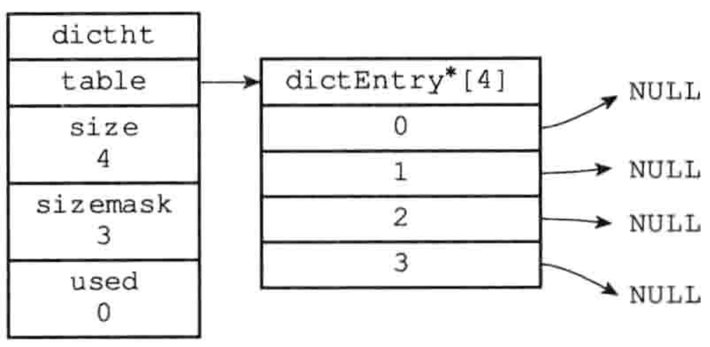
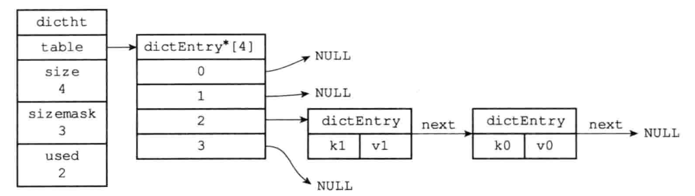
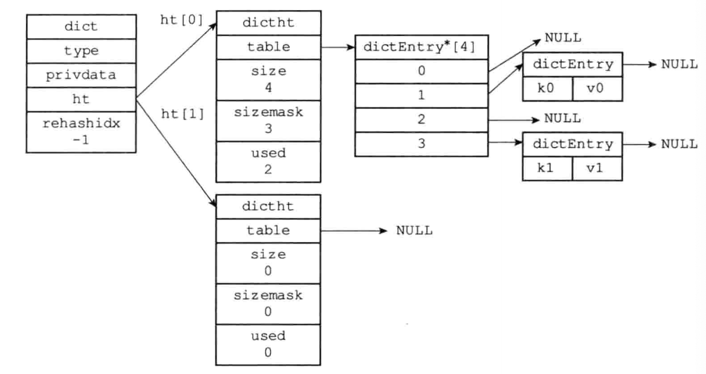

### string

```c
struct sdshdr{
  int len;
  int free;
  char buf[]; // 和 c 语言一样，以 \0 结尾   (空格结尾)
}
```

二进制安全：

c 语言字符串以空格为分隔符，所以不是二进制安全的。这个感觉吹的有点响，实际上跟 c++ string 是一样的。

redis 字符串的优点只能是相比于 c 语言字符串数组有优点，相比于其他语言，其实没啥特别之处。


### list

```c
typedef struct listNode{
  struct listNode* pre;
  struct listNode* next;
  void* value;
}listNode;

// 虽然仅适用 多个 listNode 结构就能组成链表，但是使用一个 list 来持有链表的话，结构更加清晰。
typedef struct list{
  listNode* head;
  listNode* tail;
  unsigned long len;
  // copy 函数。 除此以外，还有 free, == 的实现。不列举了
  void *(*dup)(void* per);
}

```

list 主要被用作为 列表键，发布订阅，慢查询，监视器等


### map

```c
// 哈希表
typedef struct dictht{
  // 哈希数组
  dict_entry** table;
  // 哈希表大小
  unsigned long size;
  // 哈希表大小掩码，总是 size-1
  unsigned long size_mask;
  unsigned long used;
} dictht;

typedef struct dict_entry{
  void* key;
  union{
    void* val;
    uint64 _tu64;
    int64 _ts64;
  } v;
  // 指向下一个哈希表节点，形成链表
  // 采用链地址发解决 hash 冲突，为了提高插入效率，使用头插法
  struct dict_entry* next;
}dict_entry;


// hash 表虽然能用，但是不方便，还需要封装成 map
typedef struct dict{
  // 类型特定函数
  dict_type* type;
  // 私有数据
  void* privdata;
  // 哈希表
  // 这里创建两个 hash 表,其中 ht[1] 相当与 rehash 的临时表。rehash 结束后 swap，然后释放空间
  dictht ht[2];
  // rehash 索引，不进行 rehash 时，值为-1
  int rehash_idx
}
```

##### 哈希表




##### 有冲突的情况



假设 k1 和 k0 两个 hash 值相等。



##### 负载因子：ht[0].used/ht[0].size

#### 什么时候 rehash

- 当系统没有执行 bgsave 或 bgrewriteaof 命令(**空闲**)，且负载因子大于 1
- 当系统正在执行 bgsave 或 bgrewriteaof 命令(**繁忙**)，且负载因子大于 5

以下是哈希表渐进式rehash的详细步骤： 

1）为ht[1]分配空间，让字典同时持有ht[0]和ht[1]两个哈希表。 

2）在字典中维持一个索引计数器变量rehashidx，并将它的值设置 为0，表示rehash工作正式开始。 

3）在rehash进行期间，每次对字典执行添加、删除、查找或者更新 操作时，程序除了执行指定的操作以外，还会顺带将ht[0]哈希表在 rehashidx索引上的所有键值对rehash到ht[1]，当rehash工作完成之后，程序将rehashidx属性的值增一。 

4）随着字典操作的不断执行，最终在某个时间点上，ht[0]的所有 键值对都会被rehash至ht[1]，这时程序将rehashidx属性的值设为-1，表示rehash操作已完成。 

渐进式rehash的好处在于它采取分而治之的方式，将rehash键值对所需的计算工作均摊到对字典的每个添加、删除、查找和更新操作上，从而避免了集中式rehash而带来的庞大计算量。

渐进式 hash 增删改查都会在 ht[0]，ht[1] 上操作，例如，先查 ht[0] 没查到时再查 ht[1]。新增时只在 ht[1]上新增。


