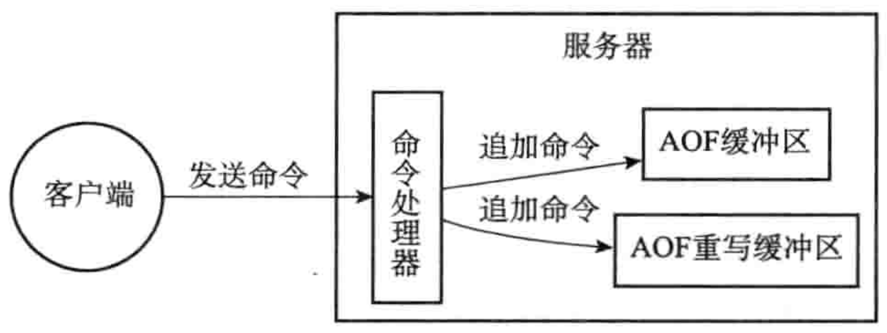

```c
struct redisServer{
  // 一个数组，保存服务器中的数据库
  redisDb* db;
  // 服务器数据库数量
  int dbnum;
}

struct redisDb{
  // kv
  dict* dict;
  // 用于保存带有过期时间的 kv
  dict* expires;
}
```


#### 过期键删除策略

- 定时删除

  > 通过定时器定时删除
  >
  > cpu 性能差，内存性能好。

- 惰性删除

  >每次获取的时候判断是否过期
  >
  >cpu 性能好，内存性能差。

- 定期删除

  > 以上两个的折中。通过限制删除时长合删除频率来控制。
  >
  > 每次运行都会重数据库中抽取一定数据随机检查，并删除其中的过期 key
  >
  > 全局变量current_db会记录当前activeExpireCycle函数检查的进度，并在下一次activeExpireCycle函数调用时，接着上一次的进度进行处理。比如说，如果当前activeExpireCycle函数在遍历10号数据库时返回了，那么下次activeExpireCycle函数执行时，将从11号数据库开始查找并删除过期键


AOF,RDB,和复制功能对过期键的处理

RDB：在生成 rdb 文件时，过期的 key 会被忽略。在装载时，主服务器会忽略过期 key，从服务器直接装载(因为同步 rdb 的时候会清空从服务器，所以无影响)

AOF：aof 是写日志的，所以，如果一个 key 因为过期被删除，只需要添加一个 del 即可，所以无影响。aof 重写时会忽略过期的 key

复制：从服务器无需关注 key 是否过期，客户端读取的时候直接返回。主服务器上发现一个 key 过期后会像从服务发送一个 del。总之，从服务器要和主服务器保持一致，不能私自删除，否则会造成不一致(因为是中心化的集群)


### RDB

save：同步保存
bgsave：后台保存

rdb 相当与内存数据直接保存磁盘，频率较低，redis 优先加载 aof 来回复数据。

带有条件的 save：save 100 1         100 秒内如果发生一次修改数据那么就执行 save


##### RDB 文件结构

| 字段       | 说明                                             |
| ---------- | ------------------------------------------------ |
| redis      | 固定位 "REDIS" 五个字符，用于判断是否是 RDB 文件 |
| db_version | 4 字节记录版本号                                 |
| databases  |                                                  |
| eof        | 1 字节表示 rdb 文件结束                          |
| check_sum  |                                                  |

databases 部分

| select_db                 | db_id | type              | key  | value |
| ------------------------- | ----- | ----------------- | ---- | ----- |
| 1 字节记录后面 db_id 长度 |       | value 类型 1 字节 |      |       |

这是一个最常见的，格式，如果有过期时间，还会多两个字段记录过期时间

##### 数据类型编码

跟大多数编码一样，感觉没啥特别的

| 类型        | 格式                                       |
| ----------- | ------------------------------------------ |
| int         | int_type value                             |
| string      | len char                                   |
| 压缩 string | zip_type_id compress_len origin_len value  |
| list、集合  | list_len item1 item2（item就是上面的类型） |
| map         | size k v k v ...                           |


### AOF持久化

aof 直接写的是指令，包括 select id。因为 单机 redis 是串行执行的，因此不用担心并发写写错库的问题。

```c
struct redisServer{
  // AOF 缓冲区
  sds aof_buf;
}
```

执行 redis 命令后，日志会定期追加到`aof_buf` 中，redis 会根据一下三种策略同步到磁盘

| appendfsync | 说明                                                 |
| ----------- | ---------------------------------------------------- |
| always      | 每个事件循环都将缓冲区的内容写到 aof 文件中          |
| evenysec    | 每秒刷盘                                             |
| no          | 由操作系统控制刷盘，速度最快，但是 os 崩溃会丢失数据 |

> 文件的写入与同步
>
> 在现代操作系统中，当用户调用write函数，将一些数据写入到文件的时候，操作系统通常会将写入数据暂时保存在一个内存缓冲区里面，等到缓冲区的空间被填满、或者超过了指定的时限之后，才真正地将缓冲区中的数据写入到磁盘里面。


### AOF 重写

aof_rewrite：同步重写，执行的过程中将阻塞

一般情况下可以采用后台重写 ，一样的 fork 一个进程，然后子进程去干事；父进程继续接收数据；
子进程写的一个问题是重写期间，依旧产生了很多命令，这些命令会写到父进程的 aof_buf 中。解决方案也比较简单，记录那些是重写期间产生的，待子进程写完快照的数据后，父进程接着写入重写期间的数据。




> 多少有点太麻烦了，不如准备两个文件，一个 rewrite_aof，一个 running_time_aof。子进程只需要将 快照写到 rewrite_aof中，父线程只需要往 running_time_aof 中写。操作完成后，原子替换就行了：子线程替换它的 rewrite_aof，父线程替换它的 running_time_aof
>
> 相当与不要 aof_重写缓冲区。这样的话，对于写非常非常频繁的比较好，因为，在 aof 重写期间，也可能会产生大量的数据，导致 aof 重写缓冲区落盘时也会阻塞。


### 事件

```python
def aeProcessEvents():
  # 获取到达时间距离当前时间最接近的时间事件
  time_event=aeSearchNearestTimer()
  # 计算最近接的时间距离当前还有多少毫秒
  remaind_ms=time_event.when-unix_ts_now()
  if(remaind_ms<0):
    remaind_ms=0
  # 创建 timeval
  timeval=create_timeval_with_ms(remaind_ms)
  #
  # 阻塞并等待文件事件的产生，阻塞时间由 timeval 决定
  aeApiPoll(timeval)
  # 处理所有已经产生的文件事件
  processFileEvents()
  # 处理所有已经到达的时间事件
  processTimeEvents()
```

> aeSearchNearestTimer，即使在最新的版本，这里依旧是采用遍历全部事件列表的方式找到最近的事件。
>
> 这样搞，应该不适合大规模并发场景。
>
> 不过，redis 中的事件无非就是客户端的增删改查。时间事件基本上就是 redis 自己用，比如定时 aof，rdb 等，所以，不是几万的 redis 客户端问题就一点不大


