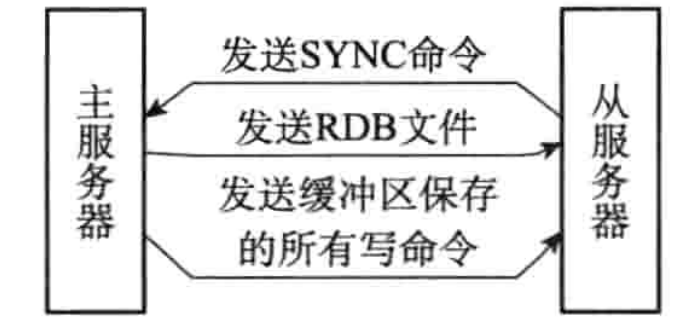
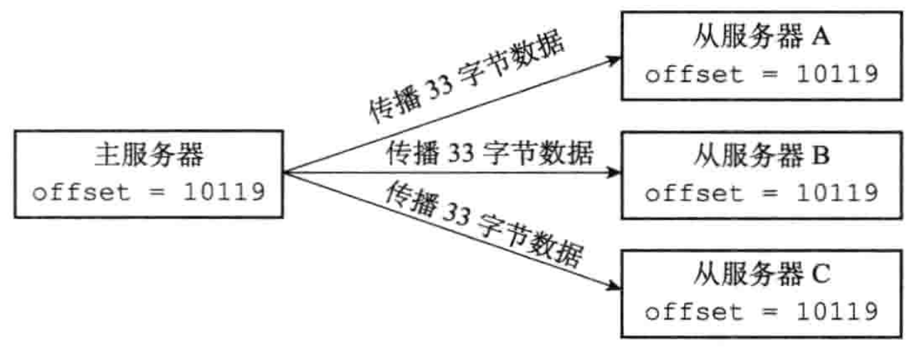
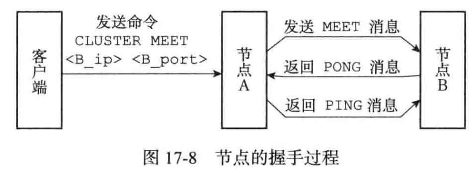

### 复制

slaveof：slaveof 127.0.0.2 0655 让当前服务器成为127.0.0.2:0655 的从服务器


#### 旧版复制功能实现

**同步：** 
从服务器向主服务器发送 sync
主服务器收到 sync 后执行 bgsave，并使用一个缓冲区记录从现在开始执行的所有写命令
bgsave 执行完后发送给从服务器，从服务器更新自己状态
主服务器将缓冲器内的记录发送给从服务器



**命令传播：**

同步相当与做一次全量更新，但是不可能一直都是这种同步，所以需要一种增量更新的方式：主服务器需要将后续自己收到的写命令发送给从服务器。


旧版复制的缺点：

旧版复制没有区分断线重新复制和从零重新复制，所有的都是上面的两步骤，实际上，断线复制只需要复制自己丢的那部分就行了。


如何解决断线重连的增量复制：积压缓冲区(**其实技术 tcp 协议抄的**)

- 主服务器的复制偏移量，从服务器上的复制偏移量
- 主服务器上的复制积压区
- 服务器的 id


##### 复制偏移量

复制的双方都维护一个自己的偏移量：主服务器传播 N 个数据就将自己的+N；从服务器接收 N 个数据就将自己+N。这里简化了 tcp 这种动态起始量，二者beg 都相等。所以，如果复制状态相等，那么他们的偏移量一定是相等的。



##### 复制积压缓冲区

服务器默认维护一个 1MB 的队列。数据发往从服务器的同时也会向队列中写。
从服务器每次执行 psync 时同时会携带自己的偏移量。如果偏移量在缓冲区内，那么只需增量发送即可，否则就自行全量同步(全量同步的过程与旧版相同)。

##### 服务器 id

服务器 id 是为了避免出现主服务器挂掉的问题：

每次同步，从服务器需要将自己保存的主服务器 id 发给主服务器，主服务器自己检查 id，如果从服务器的保存的 id 和自己的 id 不同，说明主服务器挂过一次，次数需要全量同步。如果相同，那么还尝试执行增量同步即可。


#### 哨兵

监视主服务器的状态以及在主服务挂掉之后将从服务器提升成主服务器，监视已下线的服务，当他重新上线时将他安排为从服务器。


#### 集群

如何连接其他节点： **cluster meet <ip> <port>**

保存节点信息的数据结构：每个节点用一个 clusterNode 记录自己的数据结构，同时还记录其他节点的数据结构

```c
struct clusterNode{
  // 节点创建时间
  mstime_c ctime;
  char name[40];
  int flag; // 记录角色,比如主节点还是从节点,以及是否下线
  uint64 config_epoch;
  char ip[];
  int port;
  culsterLink* other_node; // 其他节点构成的数组
}
struct clusterLink{
  mstime_t ctime;
  int fd;
  sds sndbuf; // 输出缓冲器，保存待发送给其他节点的消息
  sds rcvbuf; // 接收其他节点信息的缓冲区
  clusterNode* node; // 与之关联的其他节点，如果没有就是 null
}


struct culsterState{
  // 指向当前节点的指针
  clusterNode* myself;
  // 集群中当前的配置纪元,用于实现故障转移
  uint64_t currentEpoch;
  // 集群当前状态，是上线还是下线
  int state;
  // 集群中处理多个槽的节点的数量
  int size;
  // 集群节点名单
  dict* nodes;
}
```




A 与 B 握手之后会通过 gossip 协议传播给集群中的其他节点，让其他节点也与 B 进行握手。


#### 槽指派

替代一致性 hash 的一种方式，对于 redis 来说，一共划分了 16384 个分区(槽)。每个分区都有一个 redis 节点负责处理，如果没有，当前集群 down 了(处于下线状态)。

每个节点会将自己管理的槽发给其他节点，最终`集群中的每个节点都知道那个槽被分配给了那些节点`。


##### 在集群中执行命令

客户端向集群发送指令时，收到命令的节点会计算这个 key 所在的分区，如果归自己管理，那么执行。否则向客户端返回一个 moved 的错误信息，该信息指明了应该向哪里发。(类似于 DNS 的客户端轮询)

##### 重新分片

将一个分区下的 kv 转移到另一个分区下。


