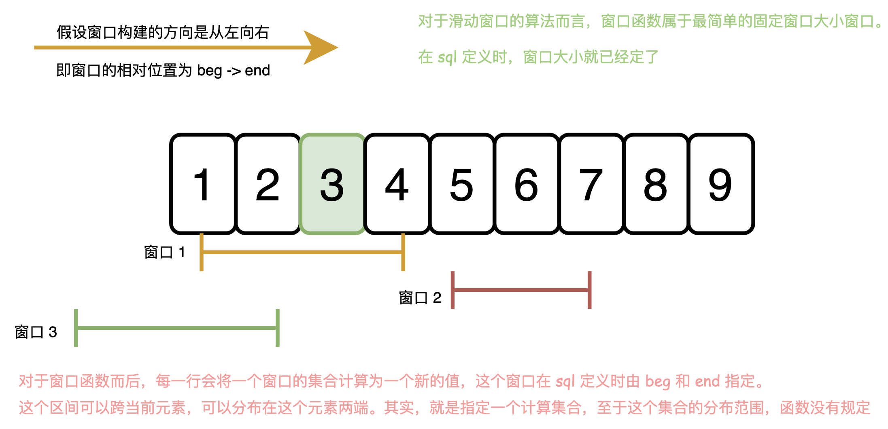

一般而言,实现一个窗口函数需要实现以下几个接口.

```c++
// 初始化
void init(Context* cxt, Val* val);
// 窗口前沿移动更新窗口状态
void update(Context* cxt, Val* val);
// 窗口后沿移动更新窗口状态
void remove(Context* ctx,Val* val);
// 获取当前行的值
Val* getValue(Context* cxt);
// 关闭
void close(Context* ctx);
```

虽然没有具体看过代码实现,不过,大致可以猜出主要流程:

从第一个元素开始, 根据偏移量关系, 首先计算出 beg, 和 end. 然后是扩充第一个区间.

然后是在 for 循环里面, 移动一个元素, 计算一下窗口,然后输出当前值.

```c++

auto ctx = new Context{};
init(ctx);
// 更新第一个窗口
for(auto index=beg;index<end;index++){
  update(ctx,get_value_if_exist(index));
}
for(int current=0;current<size;current++){
  update(get_value_if_exist(end++));
  auto val=getValue(ctx);
  remove(get_value_if_exist(beg++))
}
close(ctx);
```

其实,像标准的滑动窗口写法那样可能会更好一点, 不过,由于参考系不是 current, 写的时候可能比较不直观.

```rust
// 以 end 作为窗口的标志. 长度等于目标长度时输出.
// 这个的不好处,除了第一次, 里面的 if 横成立.
let mut beg=0;
let mut len=0;
let window_len = 10;
let current_index=0;
let ctx=Context::new();
init(ctx);
for end in 0..data_size+offset {  // offset 为 current 遍历到最后一个元素时, beg 和 current 的相对偏移量.
  let value= get_value_if_exist(end);
  update(ctx,value);
  len+=1;
  if len == window_len {
    output[current_index]=getValue(ctx);
    let beg_value=get_value_if_exist(beg++);
    len-=1;
    remove(ctx,beg_value);
  }
}
close(ctx);
```




