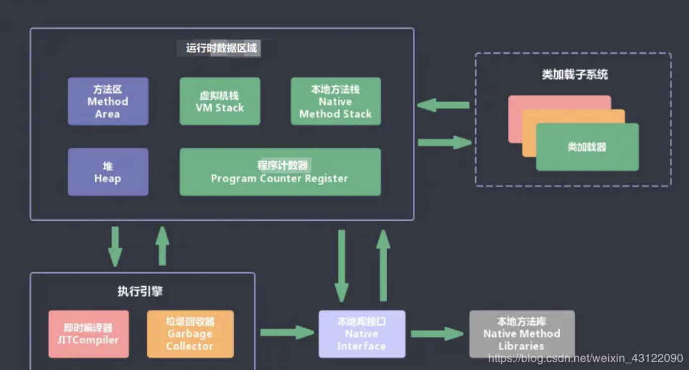

#### JVM 的组件

两个子系统:

- class loader				根据全限定名加载 class
- execution engine       执行 class 中的指令

两个组件:

- 运行时数据区 	  即 jvm 内存
- 本地接口               与其他编程语言交互的接口

#### Jvm 运行期数据区

- 程序计数器: 和 计算机体系结构中的不同, jvm 是指向当前指令. 字节码解析器来改变这个值, 来获取下一条要执行的指令.
- 栈
  - java 虚拟机栈,   java 函数栈
  - 本地方法栈,        native 函数栈
- 堆
- 方法区. 存储编译后的数据, 如类信息,常量,静态变量

#### JVM 程序计数器

保存当前执行的字节码指令的地址(行号). 线程是独立的,因此程序计数器是线程私有的.

保存每个线程正在执行的代码行号.

#### Java 虚拟机栈

虚拟机栈是每个 Java 函数执行过程中创建的, 用于保存每个线程执行过程中所依赖的环境. 因此是线程私有的.

java 的一个栈帧由以下几部分构成:

- 局部变量表
- 操作数栈         用于存放中间变量
- 动态链接
- 出口

局部变量表在编译期大小就确定了.

##### 什么是动态链接 ?

#### 本地方法栈

用于执行 c/c++ 代码的函数栈

#### java 堆

- java 堆是存放对象实例的内存空间. 被所有线程共享, 在虚拟机启动时创建
- 管理对象实例和数组
- 从内存回收上看可以分为新生代和老年代
- 从内存分配的角度上看,线程共享的 java 堆可能会被划分出多个线程私有的分配缓冲区

#### 方法区

方法区是所有线程共享的内存区域,用于存储编译后的代码和数据. 如类信息,常量,静态变量

静态变量在方法区,静态对象还在堆中

#### 直接内存

#### 垃圾收集系统

java 程序员无需管理内存释放问题, 对于没有引用指向的内存对象都属于内存垃圾, jvm 会定期进行收集垃圾对象,回收内存

#### java 中的内存泄漏

java 中的内泄漏更多的指长生命周期对象对象持有短声明周期对象,导致短声明周期对象虽然已经不在被使用了,但是,由于存在引用关系,不能被回收.

#### 垃圾回收

java 中,垃圾回收有一个低优先级的线程. 当虚拟机空闲或者当前堆内存不足时会触发执行. 扫描那些没有被引用的对象,进行回收.

- 当创建一个对象时,gc 就开始检测这个对象的地址.
- gc 采用有向图的方式记录堆中所有的对象. 通过可达性分析判断那些是垃圾对象.

可以通过调用 System.gc() 来手动执行垃圾回收. 但是会有性能问题, 同时 java 语言规范也不保证 gc 一定会执行.

#### Java 中的引用类型

#### todo

#### 如何判断对象是否可以回收

- 引用计数法: 创建对象时创建一个引用计数, 对象被引用时就+1,释放引用时-1. 当变成 0 是可以回收.    此方法不能解决循环引用问题.  shared_ptr 也有同样的问题.
- 可达性分析: 从 gc roots 开始 搜索所有能到到达的路径. 没有在此路径上的对象都是可以被回收的.

#### full gc

清理整个堆空间.  年轻代+老年代+永久代
由于清理的是整个堆空间,所有 full gc 执行速度非常慢. 出现 full gc 需要分析.

##### todo 怎么分析

#### JVM 垃圾回收算法有哪些

标记-清除: 先标记无用的,后统一清理. 缺点,效率不高,无法清理垃圾碎片.

复制算法: 将内存分层两部分,一部分用完后,将活对象复制到另一个上.

标记整理: 标记活对象, 将或对象移动到一端,然后清理另一端内存

分代算法: 按照活对象的生命周期将内存划分区块, 新生代采用复制算法, 老年代采用标记整理算法.

|           | 优点                                | 缺点                               |
| --------- | ----------------------------------- | ---------------------------------- |
| 标记-清除 | 简单; 无需复制                      | 存在内存碎片问题                   |
| 复制算法  | 运行高效, 无内存碎片问题            | 内存利用率低, 活对象频繁复制       |
| 标记整理  | 解决了标记-清除算法中的内存碎片问题 | 相对于标记-清除,存在部分对象的移动 |

#### jvm 中永久代是否存在垃圾回收

不会单独回收永久代, 当永久代满了后会触发full gc, 此时, 原来永久代中存在的东西可能会发生回收.

java 8 中已经移除永久代, 用元数据区替代

#### minor gc, major gc, full gc

minor gc : 新生代垃圾回收,一般是复制算法

major gc : 老年代垃圾回收,一般是标记整理

full gc : 回收整个堆

#### 什么是垃圾回收器

垃圾回收器是垃圾回收算法的具体实现.

#### java 内存分配策略

- 对象优先分配到 eden 区域
  eden 区域没有足够的空间时会进行一次 minor gc, 如果还不够就会启动担保机制在老年代中分配.
- 大对象直接分配到老年代
  minor gc 很频繁,大对象如果直接分配到新生代,会导致 eden 和 survivor 频繁发生内存复制.
- 长生命周期对象进入老年代
  每个对象都有一个年龄计数器. 对象在 eden 出生, 在 survivor 中存活, 存过或多轮 gc 后会被移入到老年代

#### java 类加载机制

- 加载
  class 文件读入内存.并转化成运行期数据结构.在堆中生成一个 java.lang.Class 对象.
  这一过程的最终结果是生产 class 对象,改对象是反射的基础
- 连接
  - 验证.  验证 class 文件 的格式, 规范. 是否能够被当前虚拟机加载
  - 准备.  static 变量分配内存并设置初始值.基本类型是 0,类引用是 null.
  - 解析.  符号引用替换成直接引用
- 初始化
  执行 `cinit()` 函数.     `cinit()`是编译器生成的函数(class init), 在 class 构造函数之前执行. 内容包括 执行类中变量的赋值,和静态语句块, 从上向下执行.
  首先调用父类,再调用子类.多线程环境中, **`cinit()` 函数会加锁**
  简单地说初始化过程就是在为静态变量赋值

#### 类加载机制

- 隐式加载
  当碰到 new 等方法生成对象实例时会触发加载
- 显示加载
  class.forname() 等方法

类加载是按需加载

#### 什么是类加载器

根据全限定名将 class 文件加载到内存中的类

主要有 4 种:

- 启动类加载器. 加载 java 的核心库. 无法被 java 程序直接引用
- 扩展类加载器. 加载扩展目录下的类 (`lib/ext`)
- 系统加载器. 根据 classpath 来加载类, 可以通过 `ClassLoader.getSystemClassLoader()` 获取
- 自定义加载器

####  委托模型

首先委派父类完成工作,父类无法完成时再又本类完成.

#### 常用 jvm 参数

`-`     标准VM 选项
`-X`   非标准,不保证都支持
`-XX` 实验选项

- -Xms 初始堆                 memory start
- -Xmx 最大堆                 memory max
- -Xmn 年轻代大小         memory new     (大多数对象 new 出来都在年轻代)
- -XX:newSIze=n 年轻代初始大小
- -XX:MaxNewSize=n 年轻代最大大小
- -XX:NewRatio=n 老年代和年轻代的比值
- -XX:SurvivorRatio=n  单个survivor 和 eden 的比值. 如 8,表示 2/8 因为有两个 survivor
- -Xss: 每个线程的栈大小.
- -XX: 线程栈大小
- -XX:PermSize=n 永久代大小初始值
- -XX:MaxPermSize 永久代最大值
-  
- -XX:LargrPageSizeInBytes=n 内存的内存页大小
- -XX:+DisableExolicitGC 禁用运行期显示调用 System.gc() . 默认启动

#### jvm 垃圾收集器设置

- XX:+UsexxxGC 使用 xxx 垃圾收集器
  - 如 XX:+UseG1GC

