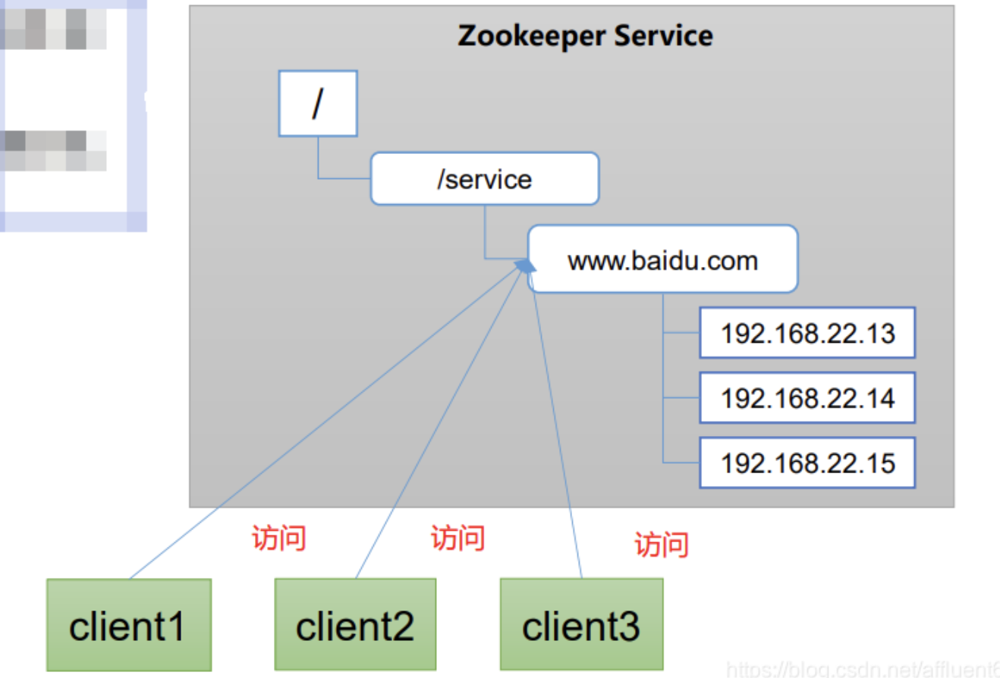
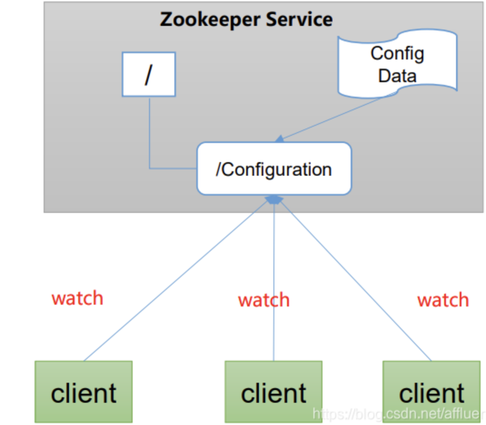
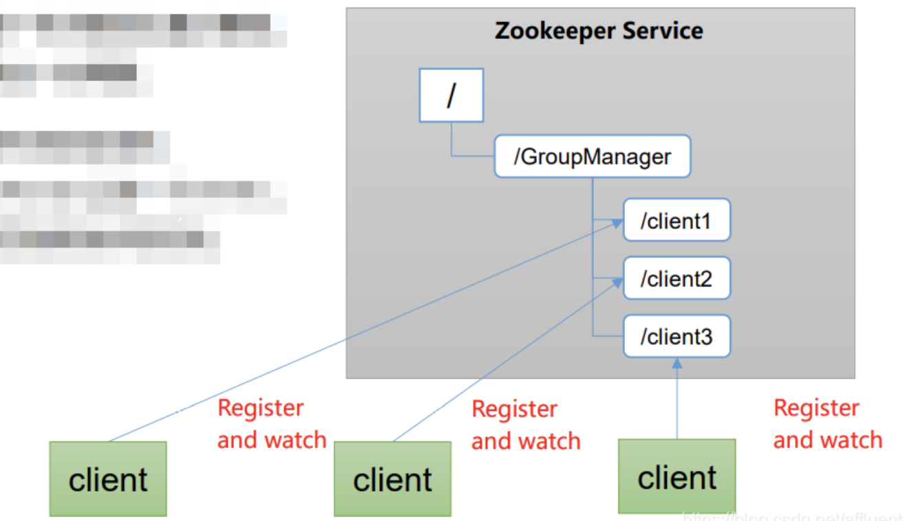
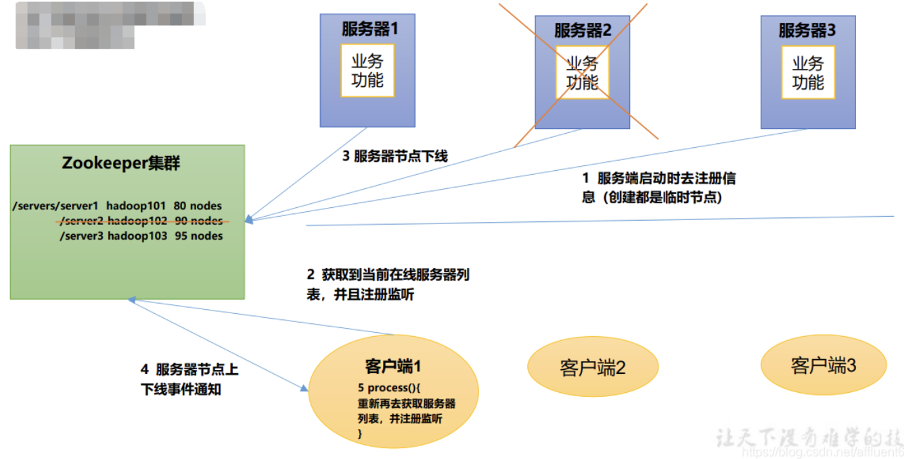
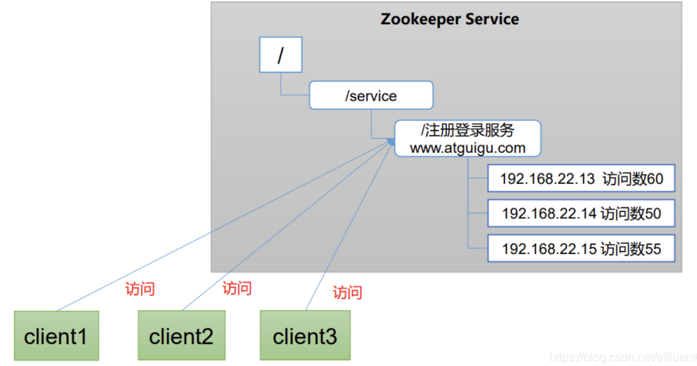

#### zk 是什么

为分布式系统系统协调服务

基于观察者模式设计的分布式服务管理框架, 负责存储大家都关心的数据, 通过事件通知机制给订阅者反馈

整体上可以看作是一个树, 每个节点叫做 znode, 默认存储 1MB 数据.

##### zk 可以提供以下服务

- 统一命名服务 / 服务命名.
  分布式环境下,经常需要对应用/服务进行统一命名. 如 ip 记不住,而域名容易记住

  > 

- 统一配置关系

  > 将信息写入 znode 中
  >
  > 

- 统一管理

  > 分布式系统中,实时掌握每个节点的状态
  >
  > 

- 服务器动态上下线

  > 客户端能实时观察到服务器上下线的变化
  >
  > 

- 软负载均衡

  > zk 中记录每台服务器的访问次数, 让访问次数最少得服务器去处理最新的请求
  >
  > 

这个题比较烂, 应该说 zk 有那些用途. 实际是,只要适合用树去管理的东西,都可以用 zk 搞

- 分布式锁
  - 独占锁. 每个 node 都可以看做是一把锁, 每个 node 只能创建一次
  - 共享锁. 有序 node
- zk 队列
  - 同步队列: 创建临时目录, 监听节点监听子节点数量
  - FIFO 队列: 创建一组节点, 队列中删除序列号最小的节点进行消费. 此场景下Zookeeper 的 znode 用于消息存储，znode 存储的数据就是消息队列中的消 息内容，SEQUENTIAL 序列号就是消息的编号，按序取出即可。由于创建的节点是持久化的，所以不必 担心队列消息的丢失问题。

#### ZK 提供了什么 

文件系统; 通知机制

#### zk 文件系统与 linux 文件系统的差异

zk 文件系统的 node 都可以保存数据, 最大文件大小为 1m. 太大的文件会降低吞吐量

#### zk 提供 4 中 node

- 永久
- 永久顺序
- 临时
- 临时顺序

#### zk 的 watcher 机制

客户端向服务器注册一个事件, 服务端触发这个事件时会向客户端发送一个事件通知, 客户端根据事件做出动作.

回调函数实际上还是注册到客户端的, 拿 epoll 举例就是监听的不是本地事件, 而是远程事件.

##### 特点

- 一次性
  一旦一个事件被触发,zk 都会移除这个事件, 这样可以有效地减轻服务端的压力.  特别是更新非常频繁的节点
- 客户端串行执行
  客户端回调 watcher 的过程是同步串行的
- 轻量
  简单. 只会告知发生了事件,而不是说明时间事件的具体内容.

> 客户端向服务器注册 watcher 的时候并不会真的把 watcher 对象传递到服务端, 仅仅是在客户端请求中使用 boolean 类型进行标记
>
>  
>
> watch event 异步发送 watcher 的通知事件重 server 发送到 client 是异步的. 多 client 并发读取数据时可能会存在不一致.  实际是 zk 只能保证最终一致性. 无法保证强一致性

#### 客户端注册 watcher

- 调用 `getData()/getChildren()/exist()`传入 watcher 对象
- 标记请求 request, 封装 watcher 到 wathcerRegistration
- 封装packet,发送request
- 服务器收到响应后,将 watcher 注册到 ZKWatcherManager
- 请求返回

#### 服务端处理 watcher

#### chroot 特性

客户端可以设置自己的命名空间, 客户端的操作都会被限制到自己的命名空间下. 可用于隔离环境.

#### 服务器角色

- leader
  事务请求的唯一处理者; 集群内部各服务的调度者.
- follower
  处理非事务请求. 转发事务请求到 leader
  参与选举
- observer
  不参加选举的 follower

#### 服务器的状态

- looking: 寻找主节点
- following: 跟随者状态, 表名当前服务器是一个 follower
- leading: leader 状态
- observing: observe 状态.

#### zk 如何保证事务的顺序一致性

全局事务 id. 所有的 proposal 都会加上 zxid.  高 32 位表示 leader 选举自增计数. 低 32 位表示 proposal 递增计数.

#### zk 宕机处理

follower 宕机正常运维处理就行, leader 宕机 zk 会触发选举

#### zookeeper 负载均衡和 nginx 负载均衡区别 

zk 的负载均衡是可以调控，nginx 只是能调权重，其他需要可控的都需要自己写插件；但是 nginx 的吞 吐量比 zk 大很多，应该说按业务选择用哪种方式。

#### zk 支持动态添加机器码

3.5 以后支持动态扩容.

之前的版本需要全部重启,或者灰度重启

#### chubby 是什么

和 zookeeper 比你怎么看？ chubby 是 google 的，完全实现 paxos 算法，不开源。zookeeper 是 chubby的开源实现，使用 zab 协议，paxos 算法的变种。

chubby 是强一致性模型

zk 是最终一致性模型

#### zookeeper 如何保证主从节点的状态同步

zk 的核心是原子广播机制, 保证了各个 server 之间的同步. 实现这个机制的协议叫做 `zab` 协议. zab 有两种模式:

- 恢复模式
  - 服务刚启动或者 leader 崩了. 当新的 leader 被选举出来后, server 需要跟 leader 完成同步
- 广播模式
  - leader 和 fellow 完成同步后, 后面的是进行广播. 当一个新的 server 加入到集群中, 会进行回复模式, 与 leader 进行同步, 之后也进入消息广播.

#### zk 和 dubbo 

zk 的基本使用: 注册服务和负载均衡, 哪个服务由哪个机器提供需要让调用者提前知道, 简单地说就是实现了一个 ip 和 服务的对应关系. 当然,ip 也可以硬编码到服务中, 但是, 如果服务器挂了如果不更新代码,就无法获取最新的地址. zk 使用心跳机制检查机器, 并将挂掉的机器从服务列表中删除.

dubbo: 管理中间层的工具, 在业务层到数据仓库之间有很多服务接入,需要调度. dubbo 提供了一个服务管理框架.

