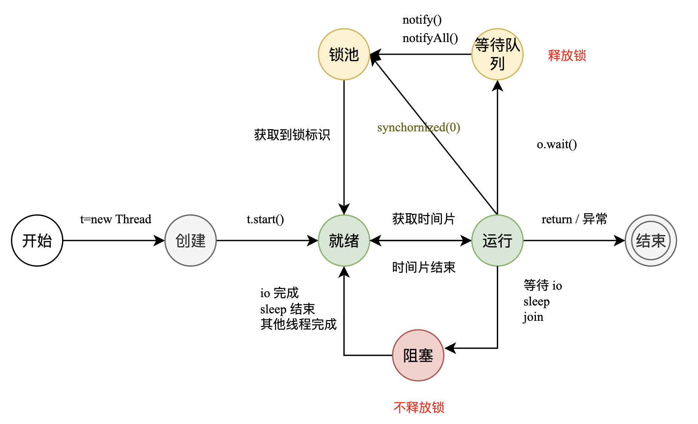
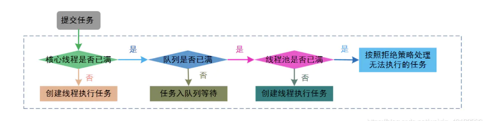

#### 为什么要使用并发编程

- 提升多核 cpu 利用率
- 方便业务拆分,提升应用性能.如提交异步任务,线程可以快速返回,提高了页面响应速度.


#### 并发的潜在问题

- 内存泄漏
- 上下文切换开下
- 线程安全性问题
- 死锁


#### 并发三个必要因素

- 原子性
- 可见性
- 有序性


#### java 中如何保证多线程的运行安全

- 原子性: 加锁,或者内置锁
- 可见性: 加锁,或者 volatile
- 有序性: 加内存屏障


#### 上下文切换

程序可以看做是状态机的执行,每个线程有自己的状态, cpu 是独占资源, 当 cpu 发生时间片切换时需要保存当前运行时 cpu 的状态.


#### 死锁的四个必要条件

- 互斥条件: 资源是独占的.
- 占用且等待: 占有资源,并重新申请其他资源, 且该资源已经被其他线程占有
- 不可抢占
- 循环等待


#### 如何避免死锁

- 避免一个线程使用多个锁
- 避免一个锁锁多个资源
- 使用定时锁
- 获取资源需要按照一定的次序


#### java 中创建线程的方式

- 继承 Thread 类,重写 run()
- 实现 Runnable 接口             
  无返回值.
  只能抛出运行异常
- 实现 Callable 接口
  可以抛出异常
  有返回值, 可以使用 Future 来实现异步

#### run() 和 start() 的区别

run() 是 一个普通方法. start() 是用于启动一个新的线程

调用 start() 方法后,线程处于 就绪状态, 当时间片到了后内部调用 run() 后,现成处于执行状态

new Thread() 现成处理创建状态


#### Callable, Future 和 FutureTask 

FutureTask 表示一个异步任务, Future 代表一个异步任务计算结果. Callable 异步任务的代码.


#### 线程的状态




#### java 中线程调度算法


#### 线程的调度策略

- 显示调度 `yield()` 让出时间片
- 调用 `sleep()`
- `io` 阻塞
- 被另一高优先级抢占
- 时间片用完


#### 线程调度器和时间分片

- 线程调度器是操作系统服务, 负责分配时间片,负责线程的调度
- 时间分片是指将可用的 cpu 时间分配到可用的线程. 分配时间片基于线程的优先级或者线程的等待事件.
- 线程调度不受 jvm 的控制


#### sleep 和 wait 的区别 

- sleep 是线程的静态方法. wait 是 object 的方法
- sleep 不释放锁. wait 释放锁
- 用途不同. sleep 用于暂停线程;  wait 用于线程通讯
- 用法不同. sleep 会自然属性.  wait 则需要其他线程唤醒


\29. 你是如何调用 wait() 方法的？使用 if 块还是循环？为什么？

\30. 为什么线程通信的方法 wait(), notify()和 notifyAll()被定义在 Object 类里？

\31. 为什么 wait(), notify()和 notifyAll()必须在同步方法或者同步块中被调用？

\33. 为什么 Thread 类的 sleep()和 yield ()方法是静态的？


#### Thread 中的 yield 方法的作用

- 使进程由 运行态 变成 就绪态
- 触发操作系统切换现成


#### 如何停止一个正在运行的线程

- 设置 interrupt 
- 设置退出标志, 即 run 方法正常执行完成后终止
- 使用 stop 方法. 但是不推荐这个方法，因为stop和suspend及resume一样都是过期 作废的方法。


#### java 中 interrupted , interrupt

- interrupt 用于中断线程. 将中断标志位置位
  这个方法只会设置中断位,不会停止线程. 需要用户自己监视线程的状态并做处理.
  一些方法其实是支持中断的,即 设置了抛出中断异常的方法,这样就不需要自己写代码检查了, 这种情况, 碰到中断异常,就可以停止了.
- interrupted 用于查看中断标志位是否置位. 执行完后会清除中断位. 其实可以当做清除中断位来看
- isInterrupted 用于查看当前中断位状态


#### 什么是阻塞式方法

在方法执行完成之前不会返回,程序卡在这里无法做其他事


#### 怎么唤醒一个阻塞的线程

`notify()`, `notifyall()`


#### 同步方法和同步代码块

同步代码块是更好的选择, 因为它不会锁住整个对象, 同步方法会锁住整个对象. 哪怕这个类中有很多个不相关的同步方法.

同步块更符合调用开放原则, 只需要锁住部分代码.


#### 什么是线程同步和线程互斥,有哪几种实现方式

当一个线程对共享数据操作时,应使之成为一个原子操作,在没有完成相关操作前,不想允许其他线程打断他,否则会破坏数据的原子性.

- 线程互斥
  对共享资源的访问,线程间具有排他性


线程间的同步方法可以分为两类:

- 内核模式
  利用系统内核对象的单一性进行同步.使用时需要切换内核态和用户态
  事件量,信号量,互斥量
- 用户模式
  而用户模式不需要切换到内核态
  原子操作,临界区


#### 在监视器内部,是如何做线程同步的

Java 的监视器指的是锁, 包括显示锁(`Lock`)和隐式锁(`synchronized`)


#### 如果提交任务时,线程池满会发生什么


#### 什么是线程安全

某个方法在多线程环境中调用时能够正确地处理多线程之前的共享变量


#### servlet 线程安全?

servlet 是单实例多线程的,多个线程访问同一个方法,不能保证其共享的变量是线程安全的

包括 spring mvc 的 controller

#### structs 2 是线程安全的

每个请求都会 new 一个新的实例,是多实例多线程, 显然,性能差


#### java 中线程安全的工具有哪些

- 原子类, atomic
- 锁
- Threadlocal


#### 线程优先级

高优先级的线程调度时会具有优先权,这一操作依赖于操作系统的实现
jvm 实现了jvm 线程优先级到操作系统优先级的映射. 可以通过 `setPriority()` 设置. 但是不一定会准确
jvm 优先级范围 [-1,10]


#### 现成类的构造方法,静态块是被那个线程调用的

被 new 所在的线程调用的, 而 run 方法里面的代码会被线程自身调用


#### java 中怎么获取一个线程的 dump 文件. 如何在 java 中获取线程堆栈

dump 是进程的内存镜像. 通过调试可以获取 dump

- linux: kill -3 pid
- windows:  ctrl+break


#### 一个线程运行时发生异常会怎样


#### java 线程数过高会造成什么异常

- 现成的生命周期开销变高
- 消耗过多的 cpu
  大量的空闲线程会占用更多的内存,给垃圾回收带来压力. 可能导致 outOfMemory
  也会增大竞争 cpu 资源的开销
- 降低 jvm 稳定性
  可创建线程数存在上限


#### 多线程常用的方法

- sleep()
- isAlive
- join
- activeCount()   程序中活跃的线程数
- enumerate()  枚举程序中的线程
- currentThread()
- isDaemon()  是否是守护线程
- setDaemon()
- setName
- wait
- notify
- setPriority


#### java 中垃圾回收的目的

- 对每次中没有引用的对象或超出作用域的对象回收
- 释放不在使用的资源


#### 现成之间如何通讯, 同步

- 通讯

  - 共享内存
  - 消息传递

  java 采用共享内存模型, 线程间的通讯是隐式的.


#### Java 内存模型

jmm 实际上是 **共享内存模型**, jmm 决定了一个线程写入共享变量时能对另一个线程可见.
线程之间共享变量存储在主存中. 每个线程都有一个私有的本地内存, 本地内存存储了该变量的副本. 当写入数据时会把共享变量刷入主存

jmm 定义了一个线程对另一个线程的可见性. 当本地内存没有及时刷入主存就会产生线程安全问题.


#### 如果将对象的引用设置为 null,是否会立即被回收

不会, 设置 null 是说明该对象可被回收, 会在下一个调度周期中清理


#### finalize() 方法, **finalize**() 方法的目的

垃圾回收时会先调用 finalize() 方法,  并在下一次垃圾回收动作发生事回收.

finalization 用来释放内存, 如文件,端口,链接等.  其他情况如掉了 c 语言的 native 方法,可能需要调一下 free


#### 什么是重排

- 代码的实际执行顺序和代码书写顺序不一致, 重排序不会影响最终的结果.
- 对于单线程来说, 重排序对程序无影响, 多线程可能会触发线程安全问题


#### 重排序的步骤

- 编译器优化: 不影响单线程语义的情况下重新安排语句执行顺序
- 指令级并行重排序: 对于不存在数据依赖的执行, 流水线将多条指令并行执行
- 内存重排序: 处理器对 读缓存,写缓存的重排


#### 重排序遵守的规则

as-if-serial

- 不管怎么排,不影响结果
- 不存在数据依赖的可以被编译器和处理器重排
- 一个操作依赖 ab 两个操作, 如果 a b 没有依赖, ab 是可以重排的
- 重排对于单线程无影响, 多线程可能会有问题
  - 因为编译器也好,cpu 也好,是无法感知多线程的依赖性关系的


#### happens-before

happens-before 关系是用来保证多线程程序执行结果语义不变
happens-before 关系为为程序员提供了一个环境: 正确同步的多线程程序按照 happens-before 指定的顺序执行.


#### synchronized

- 修饰非静态方法
- 修饰代码块
- 修饰静态方法, 此时,等价于 synchronized(class).

坑:

对 string 加锁: java 字符串常量具有缓存功能.


#### 单例模式. 双重检查的方式实现单例有什么问题

双锁机制主要是为了解决加锁带来的性能问题.

```java
public class Singleton {
    private volatile static Singleton uniqueInstance;
    private Singleton() {}
    public static Singleton getUniqueInstance() {
        //先判断对象是否已经实例过，没有实例化过才进入加锁代码
        if (uniqueInstance == null) {
            //类对象加锁
            synchronized(Singleton.class) {
                if (uniqueInstance == null) {
                    uniqueInstance = new Singleton();
                }
            }
        }
        return uniqueInstance;
    }
}
```

volatile 修饰是必要的. `uniqueInstance = new Singleton()`实际上分三步

- 为 `uniqueInstance` 分配内存
- 初始化 `uniqueInstance`
- 将`uniqueInstance`指向分配的内存地址

由于执行重排, 执行顺序可能变成 1-3-2. 这样,在多线程环境下, 其他线程就可能拿到未初始化的变量.


#### synchronized 实现

每个对象都有一个监视器锁(monitor).

对于临界区.

1. 如果 monitor 的进入数为 0, 则该线程进入 monitor. 然后进入数+1.
2. 如果线程已经占有该 monitor, 则算重入. 进入数+1
3. 如果其他线程想要进入, 则该线程进入阻塞状态, 直到 monitor 的进入数为 0 后重新尝试获取 monitor 的所有权


#### synchronized 可重入的原理

可重入是指一个线程获取这个锁后, 这个线程可以多次获取这个锁.
原理: 底层维护了一个计数器, 大于 0 表示锁被占用,等于 0 表示未占用, 每次获取时+1,释放时-1.


#### 什么是自旋

- 在多核 cpu 中, 一个 等待状态的线程被唤醒后很有可能在另外一个核心中运行, 这样, cpu 的缓存就失效了.
- 临界区代码很小,比加锁释放的成本小很多.

自旋锁是一种忙等待锁, 不会释放 cpu, 可有效利用核心缓存, 同时, 临界区的快进快出,减小了内核态和用户态的切换成本.

即,加锁失败不会立即进入等待状态, 而是尝试多次.


#### synchronized 锁升级

偏向锁 -> 自旋锁 -> 锁

- 偏向锁: 通过一次 cas 记录当前锁的持有者.

- 自旋锁: 多次 cas 尝试去加锁

- 锁: 加锁失败则变成阻塞状态.


偏向锁和锁的区别就是线程是否会阻塞, 实际上,自己实现一个线程调度器性能会更高吧.

在并发编程中，锁的管理通常是性能瓶颈的关键因素。偏向锁是一种优化锁性能的策略，其核心思想是减少不必要的锁竞争开销. **偏向锁优化了同一个线程获取同一个锁**

偏向锁相对于自旋锁能提升性能的关键在于,减少竞争, 实际上, 偏向锁的应用场景在大多数无竞争条件. 一个锁基本上长时间被一个线程使用. 虽然设计很多的加锁解锁, 但是基本都是同一个线程. 


synchronized 的具体实现:

mark word 中设了 现成 id.是否偏向标志, 偏向标志位等信息.

加锁过程:

- mark word 中 thread id 的值
  - 有值
    - id 是自己. 表示可重入,直接获取.
    - 不是自己. 说明有竞争. 持有锁的进程被挂起,锁变成轻量级锁
  - 没值
    - 资源没有被占用,记录自己的线程 id 到 mark word


现在偏向锁已经被默认禁用了,因为围绕着线程池构建的程序,偏向锁基本上没什么优势了.

https://openjdk.java.net/jeps/374


https://blog.csdn.net/qq_33589510/article/details/123236790


#### 现成 B 怎么知道现成 A 修改了变量

这是一个可见性问题.

- volatile
- synchronized
- lock
- wait/notify


#### 当一个线程进入一个对象的 synchronized 方法 A 之后，其它线程是否可进入 此对象的 synchronized 方法 B

尽量使用同步代码块, 直接对方法加 synchronized 加锁锁的是当前对象.

因此 不能


####  synchronized、volatile、CAS 比较

- synchronized: 悲观锁. 抢占式. 阻塞
- volatile: 提供可见性, 禁止指令重排
- CAS : 基于冲突检查的乐观锁, 非阻塞


#### synchronized 和 lock

- 前者是 jvm 提供的内置锁. lock 是显示锁
- 前者是关键字,lock 是 Java 类
- 前者不需要显示地加锁释放.
- 后者可以判断有没有加锁成功


#### volatile 关键字的作用

- 可见性
- 禁止指令重排,提供了 happens-before 的保证.    保证了对该值的修改会立即同步到主存中,其他线程需要读取的时候,读取的是最新值.
- 常用于多线程环境中单次读写
- 和 cas 结合,保证原子性. 比如各种 atomic 类的实现


#### 可以创建 volatile 数组吗

可以. 但是,只是保证了引用的 可见性. 或者说保证了变量的可见性.  数组内的元素是数组的值, 不保证可见性.

也就是说, 如果这个数组指向了其他数组,是可见的.

修改数组的元素,是受保护的


#### volatile 变量和 atomic 变量有什么不同

atomic 类就是在 volatile 的基础上使用 cas 封装了一些符合操作,使得符合操作也具有原子性. 如 +1


#### volatile 能使一个非原子操作变成原子操作吗

不能. volatile 只保证可见性.

不过,由于 java 的特殊性. volatile 修饰的 long 和 double 可以保证读写的原子性, 主要看 jvm 怎么实现


#### final 不可变对象,对并发应用有什么帮助

即 Immutable Class .

满足以下条件才是不可变的:

- 它的状态不能在创建后再被修改
- 所有属性都是 final 类型, 且没有 this 引用逸出


不可变对象保证了对象的内存可见性,无需同步.


#### lock 接口比 synchronized 的优势

- 公平锁
- 可中断
- 可轮询
- 超时释放


#### 乐观锁, 悲观锁

- 悲观锁. 
  先加锁,再处理. 比如,行锁,表锁. synchronized
- 乐观锁.
  先处理,再加锁.  适用于读多写少的情况.


#### 什么是 CAS

`cas(内存地址(V), 原始值(A), 新值(B))`

- 如果内存地址和原始值相等, 则认为没有发生变化, 替换成 B
- 否是, 本次执行失败, 重试.


#### CAS 的问题

- ABA 问题. 从获取到值到真正执行 CAS 期间, 发生了变化, 但是,又被替换成了 A, 此时, CAS 无法发觉. 虽然对于 A 变量来说, 状态是等价的. 但是, 在此过程中发生的其他状态变化却有可能不等价.
  使用版本号可以解决

- 循环时间开销长. cas 大概率需要自旋来多次尝试
- 只能保证一个变量的原子操作. 如果要对多个变量操作需要使用锁


#### 什么是原子类

支持原子操作类, 单次操作是线程安全的


#### 死锁.活锁.饥饿

- 死锁: 多个线程竞争资源产生的相互等待问题   线程是阻塞的
- 活锁: 任务不满足某种条件,导致的不断尝试.     线程是不阻塞的
- 饥饿: 线程长时间无法满足所需资源导致无法执行
  - 优先级较低, 无法获取时间片


#### 线程池好处

- 降低资源开销: 复用线程, 减少线程的创建和销毁成本
- 提高响应速度: 线程是已经的, 减小了创建线程的时间
- 提高了可维护性: 线程是稀缺资源,使用线程池可以统一分配,调试
- 有效地控制了并发数.避免了资源的过度竞争

如果一个线程执行的事件特别长, 就没必要使用线程池了, 直接创建线程比较好


#### ThreadPoolExecutor 核心参数

- corePoolSize 核心线程数量
- maxiumPoolSize 最大线程数
- keepAliveTime 线程存活时间
- unit 单位, 和上面的参数关联
- workQueue 阻塞队列
- threadFactory 现成工厂
- handler 线程拒绝策略


#### Executors

提供了 4 个常用类型的静态方法, 本质上都是返回了一个 ThreadPoolExecutor 对象实例

- newCachedThreadPool      最大值为 int.max.  超过 core 的会保留一段时间
- newFixedThreadPool          固定大小
- newScheduledThreadPool 带调度功能
- newSingleThreadExecutor  只有一个.


#### Executors, Executor 和 ExecutorService


#### 线程池中 submit 和 execute 有什么区别

- execute 只能执行 runnable 类型的. submit 都可以
- submit 会返回一个 future 对象.
- submit 提交的任务可以抛出异常


#### 什么是线程组，为什么在 Java 中不推荐使用 ?


#### 线程池的拒绝策略

线程池达到了最大线程数量, 且队列已经满了. 无法接收新任务

- AbortPolicy.    直接抛出 RejectedExecutionException来拒绝新任务的处理。
- CallerRunsPolicy. 在调度这的线程中执行. 由于是提交者自己执行的, 性能和效率会低
- DIscardPolicy. 不处理,直接丢掉.
- DiscardOldestPolicy. 丢弃最早未处理的.


#### 线程池执行流程



提交一个任务到线程池中，线程池的处理流程如下： 1. 判断线程池里的核心线程是否都在执行任务，如果不是（核心线程空闲或者还有核心线程没 有被创建）则创建一个新的工作线程来执行任务。如果核心线程都在执行任务，则进入下个 流程。 2. 线程池判断工作队列是否已满，如果工作队列没有满，则将新提交的任务存储在这个工作队 列里。如果工作队列满了，则进入下个流程。 3. 判断线程池里的线程是否都处于工作状态，如果没有，则创建一个新的工作线程来执行任 务。如果已经满了，则交给饱和策略来处理这个任务。


说实话, jdk 实现的逻辑乱七八糟.

应该是先拿一个空闲的线程.


#### 如何分配一个线程池的大小

- cpu 密集型.  没有io 阻塞. cpu 处理大量的计算
- io 密集型. 任务中包含了大量的 io . io 密集型任务适合多线程, 即使在单核 cpu 上,也能达到良好的效果.


线程等待时间比CPU执行时间比例越高，需要越多线程。 
线程CPU执行时间比等待时间比例越高，需要越少线程。

经验来看:

- cpu 型:  cpu 核数
- io 型: 2*cpu 核数


#### 并发容器

- vector: 同一时刻,只能有一个线程能够写 数据.比 ArrayList 性能差很多.
- HashTable. 每个函数都加了 synchronized. 性能很差.
- ConcurrentHashMap
  -  HashTable 是对整个 hash 表加锁. 分段加锁, 允许不同的段并发, 性能更好
  - 读操作不加锁. 但是 HashEntry 的 value 是 volatile 的. 所以保证了可见性. 线程读能够读取最新值
  - 扩容: 分段扩容.


#### ConcurrentHashMap 的扩容过程

- 判断扩容条件: 加载因子大于 0.75
- 创建新的 hash 表, 同时会创建一个新的掩码 ,用于确定元素在新 hash 表中的位置
- 分段迁移数据. 在扩容过程中, 逐段加锁,逐段迁移.
  - 数据迁移中, 逐段迁移.
  - 迁移过程中. 新旧 hash 表并存, 旧 hash 表依旧可以并发读取
- 迁移完成. 更新 hashmap 内部状态, 丢弃旧 hash 表

redis 的渐进式 hash


#### Collects.synchronizedList 的作用是什么

装饰器模式, 所有的接口都被加了 synchronized 代码块包装


#### Java 中 ConcurrentHashMap 的并发度是什么

ConcurrentHashMap 内部采用分段 hash, 所以,并发度就是 分段的数量, 默认值是 16

在 JDK8 后，它摒弃了 Segment（锁段）的概念，而是启用了一种全新的方式实现,利用 CAS 算 法


#### 怎么实现一个并发容器

使用 Collects.synchronizedList 之类的包装类包装.


#### SynchronizedMap 和 ConcurrentHashMap 有什么区别？

- SynchronizedMap 一次锁住整张表来保证线程安全，所以每次只能有一个线程来访为 map。 
- ConcurrentHashMap 使用分段锁来保证在多线程下的性能。每个桶可以被单独的一个线程锁住


#### ConcurrentHashMap 的迭代器设计

并发的时候, 怎么能够保证迭代器的正常迭代.


#### CopyOnWriteArrayList

当写数据是,会发生数据拷贝,与原有的数据发生分离. 复制得来的数组归当前线程所有.


- 设计思想
  - 读写分离
  - 最终一致性
  - 使用新开辟的空间的思路来解决并发冲突


#### 并发队列

多个线程依次有序地共享数据, 并发是也会遵守先进先出


#### 阻塞队列

- 空队列尝试获取数据 会阻塞
- 慢队列尝试添加数据 会阻塞


#### 常用并发队列

- 非阻塞队列

  - ArrayDeque (数组双端队列)
    - 双端队列
    - 不允许 null 值
  - PriorityQueue
    - 不允许 null, 不允许不可比较的
  - ConcurrentLinkedQueue
    - 基于链表的并发队列
    - 无锁,不允许 null

- 阻塞队列

  - LinkedBlockDeque
    - 双端队列
  - DelayQueue
    - 基于时间的优先级队列
  - ArrayBolckQueue
    - 基于数组的
    - 大小有限制
  - LinkedBlockingQueue
    - 基于链表的
    - 默认无界,可以指定大小
  - PriorityBlockingQueue

  


