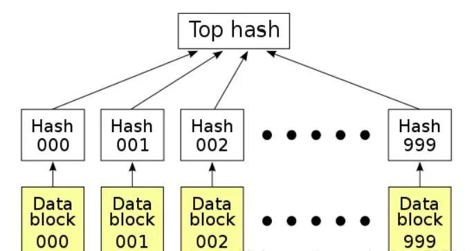
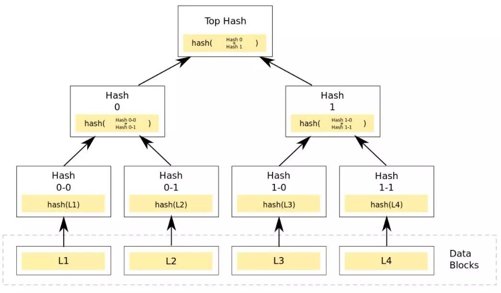

### Hash List 

在点对点网络中作数据传输的时候，会同时从多个机器上下载数据，而且很多机器可以认为是不稳定或者不可信的。

为了校验数据的完整性，更好的办法是把大的文件分割成小的数据块（例如，把分割成2K为单位的数据块）。

这样的好处是，如果小块数据在传输过程中损坏了，那么只要重新下载这一快数据就行了，不用重新下载整个文件。

怎么确定小的数据块没有损坏哪？只需要为每个数据块做Hash。

BT下载的时候，在下载到真正数据之前，我们会先下载一个Hash列表。

那么问题又来了，怎么确定这个Hash列表本身是正确的呢？答案是把每个小块数据的Hash值拼到一起，然后对这个长字符串在作一次Hash运算，这样就得到Hash列表的根Hash(Top Hash or Root Hash)。

下载数据的时候，首先从可信的数据源得到正确的根Hash，就可以用它来校验Hash列表了，然后通过校验后的Hash列表校验数据块。

### Merkle Tree

Merkle Tree可以看做Hash List的泛化（Hash List可以看作一种特殊的Merkle Tree，即树高为2的多叉Merkle Tree）。

在最底层，和哈希列表一样，我们把数据分成小的数据块，有相应地哈希和它对应。

但是往上走，并不是直接去运算根哈希，而是把相邻的两个哈希合并成一个字符串，然后运算这个字符串的哈希，这样每两个哈希就结婚生子，得到了一个”子哈希“。

如果最底层的哈希总数是单数，那到最后必然出现一个单身哈希，这种情况就直接对它进行哈希运算，所以也能得到它的子哈希。

于是往上推，依然是一样的方式，可以得到数目更少的新一级哈希，最终必然形成一棵倒挂的树，到了树根的这个位置，这一代就剩下一个根哈希了，我们把它叫做 Merkle Root。

在p2p网络下载数据之前，先从可信的源获得文件的Merkle Tree树根。一旦获得了树根，就可以从其他不可信的源获取Merkle tree。通过可信的树根来检查接受到的Merkle Tree。如果Merkle Tree是损坏的或者虚假的，就从其他源获得另一个Merkle Tree，直到获得一个与可信树根匹配的Merkle Tree。

Merkle Tree和Hash List的主要区别是，可以直接下载并立即验证Merkle Tree的一个分支。因为可以将文件切分成小的数据块，这样如果有一块数据损坏，仅仅重新下载这个数据块就行了。

如果文件非常大，Merkle Tree可以一次下载一个分支，然后立即验证这个分支，如果分支验证通过，就可以下载其它数据了。而Hash List只有下载整个Hash List才能验证。

Merkle Tree的特点：

MT是一种树，大多数是二叉树，也可以多叉树，无论是几叉树，它都具有树结构的所有特点；

1、Merkle Tree的叶子节点的value是数据集合的单元数据或者单元数据HASH。

2、非叶子节点的value是根据它下面所有的叶子节点值，然后按照Hash算法计算而得出的。

Merkle Tree的应用：

1、数字签名

最初Merkle Tree目的是高效的处理Lamport one-time signatures。

每一个Lamport key只能被用来签名一个消息，但是与Merkle Tree结合可以来签名多条Merkle。

这种方法成为了一种高效的数字签名框架，即Merkle Signature Scheme。

2、P2P网络

在P2P网络中，Merkle Tree用来确保从其他节点接收的数据块没有损坏且没有被替换，甚至检查其他节点不会欺骗或者发布虚假的块。

大家所熟悉的BT下载就是采用了P2P技术来让客户端之间进行数据传输，一来可以加快数据下载速度，二来减轻下载服务器的负担。

如果猜的没错, Merkle Tree 最先可能用于 p2p 网络.   有需求就会有数据结构.

校验某个文件可以用 hash.		想支持分片校验,那么必然就得有分片的 hash.		可以对分段的数据做 hash,也可以对 hash 的 hash 做 hash. 而后者的计算列很小.

使用 hash 的 hash,上层数据将不再依赖具体底层的数据,减少计算压力

梅克尔树（Merkle trees）是[区块链](https://baike.baidu.com/item/区块链/13465666?fromModule=lemma_inlink)的基本组成部分。虽说从理论上来讲，没有梅克尔树的区块链当然也是可能的，只需创建直接包含每一笔交易的巨大区块头（block header）就可以实现，但这样做无疑会带来可扩展性方面的挑战，从长远发展来看，可能最后将只有那些最强大的计算机，才可以运行这些无需受信的区块链。 正是因为有了梅克尔树，以太坊节点才可以建立运行在所有的计算机、笔记本、[智能手机](https://baike.baidu.com/item/智能手机/94396?fromModule=lemma_inlink)，甚至是那些由Slock.it生产的物联网设备之上。

所以,修改一个数据,会影响到根节点路径的全部 hash.   看起来也很有限?   怎么保证全局校验 ?

貌似不能,一个数据的编码,实际上是编码到了根到叶子节点的路径上