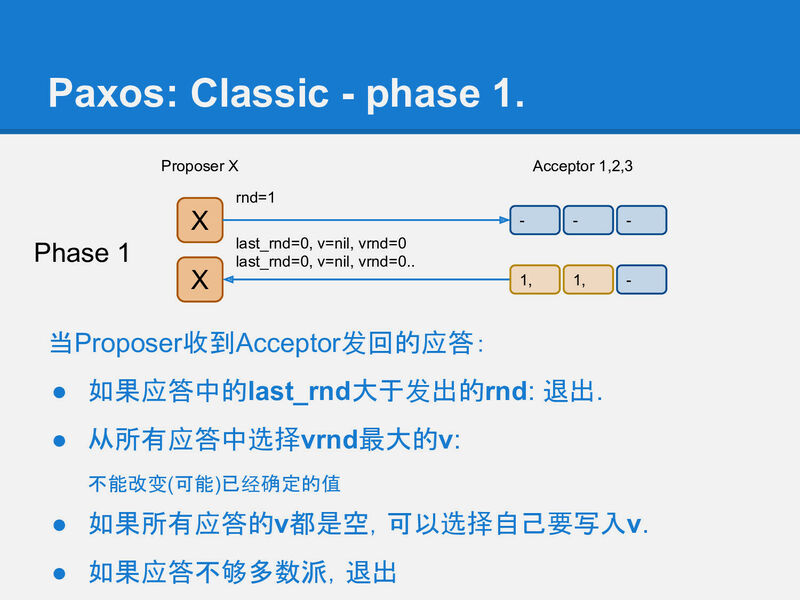

https://blog.openacid.com/algo/paxos


### paxos 是什么

分布式系统中保证多副本强一致性算法

协同一堆机器的算法


### 背景

三台机器组成一个系统, 其中一个机器上上传了一张图片, 保证其他两台机器上也复制了这张图片, 那么, 这三台机器构成的系统可以说是一致的

- 多台机器完成一件事
- 分布式中的唯一问题: 对某事达成一致
- paxos: 分布式系统的核心算法


分布式问题最终都可以归结为分布式存储一致性问题. 磁盘存在故障, 服务器可能宕机, 网络可能丢包. 那么如何在不稳定的硬件上搭建一个稳定的可靠的系统?

### 解决方案

#### 不太完美的复制算法

##### 1.主从异步算法

> 实现起来最为简单, 但是, 显然, 服务端发生数据跟客户端收到数据中间存在一定的间隙, 假设这段时间客户端崩溃了, 复制就会失败. 因此,异步复制是一个不太可靠的算法. 需要加后置检测
>
> 


##### 2.主从同步复制

> 直到数据安全复制到全部的机器上, master 才收到客户端的数据安全确认
>
> 缺点: 一旦有任何机器宕机, 那么整个系统就相当于失败, 无法继续对外提供服务, 即系统的可用性随着副本的提高指数降低
>
> 

##### 3.折中: 半同步

> master 在应答客户端之前必须将数据复制到足够多的机器上. 不需要全部复制, 这样, 一台机器宕机不会让整个系统停止写入
>
> 问题: 数据 a 复制到了 slave1 , 数据 b 复制到了 slave2, 此时, master 挂掉, 需要从两个 slave 中选择一个作为回复数据. 此时,两个 slave 都不能提供完成的数据, 因此数据存在某种不一致
>
> 

##### 4.半同步的改进: 多数派读写

> 半同步实际上是多数派写; 多数派读写要求: 每条数据必须写入一半以上的机器上. 每次读也必须检查一半以上的的机器上是否有这条数据
>
> 在这种策略下, 数据可靠性足够, 宕机容忍足够, 任一机器故障也能读到全部数据.
>
> 

##### 5.后写入优胜

> **多数派读写仍然有 bug**
>
> node1, node2 都写入了 a=x.
> 下次更新时, node2, node3 都写入了 a=y
> 此时, 客户端多数派读, 如果读 1 到 node1,node2, 则结果为未知.
> 为了不进入歧义, 还需要给每笔写入写入一个全局递增时间戳: 忽略更小的时间戳, 这样客户端就会看到a=x₁, a=y₂ 这2条数据, 通过比较时间戳1和2, 发现y是更新的数据, 所以忽略a=x₁. 这样保证多次更新一条数据不产生歧义
>
> 

##### 6.完了吗

> 带时间戳的多数派读写能解决服务都是正常状态下的一致性问题. 但是,服务器崩了呢
>
> a=x₁写入了node-1和node-2, a=y₂时只有node-3 写成功了, 然后客户端进程就挂掉了, 留下系统中的状态如下:
>
> ```
> node-1: a=x₁
> node-2: a=x₁
> node-3: a=y₂
> ```
>
> 这时另一个读取的客户端来了,
>
> - 如果它联系到node-1和node-2, 那它得到的结果是a=x₁.
> - 如果它联系到node-2和node-3, 那它得到的结果是a=y₂.
>
> 整个系统对外部提供的信息仍然是不一致的.
>
> 写一半半途而废, 已经写的该咋办. 
>
> 因此, 需要某种事物性. 
>
> **仔细想一想, 这种就是读未提交 . . .** ,  本身就是不合法的
>
> 这种情况, 除非保证读已提交, 否则是不能保证的. 
> 另外, paxos 算法 不能保证算数运算是一致的, 本质上,这是一个事务,  a=a+1 .  读和写得加锁.  
> paxos 太抽象, 可以想想一下 如何用 zk 完成上面的操作
>
> 


#### paxos 算法


在实现中, set命令直接实现为一个多数派写, 这一步非常简单. 而inc操作逻辑上也很简单, 读取一个变量的值i₁, 给它加上一个数字得到i₂, 再通过多数派把i₂写回到系统中.


如果有2个并发的客户端进程同时做这个inc的操作, 在多数派读写的实现中, 必然会产生一个Y客户端覆盖X客户端的问题. 从而产生了数据更新点的丢失.

而paxos就是为了解决这类问题提出的, 它需要让Y能检测到这种并发冲突, 进而采取措施避免更新丢失.


> 说写丢失并不是说这次写数据不会丢. 而是,写的时候会报错,这样会触发重试.
> 不写当然就不会丢失了

而这个问题可以转化成: i的每个版本只能被写入一次, 不允许修改. 如果系统设计能满足这个要求, 那么X和Y的inc操作就都可以正确被执行了.


直观来看, 解决方法也很简单, 在X或Y写之前先做一次**多数派读**, 以便确认是否有其他客户端进程已经在写了, 如果有, 则放弃.


这里还有个并发问题, X和Y可能同时做这个**写前读取**的操作, 并且同时得出一个结论: 还没有其他进程在写入, 我可以写. 这样还是会造成更新丢失的问题.


为了解决上面的问题, 存储节点还需要增加一个功能, 就是它必须记住谁最后一个做过**写前读取**的操作. 并且只允许最后一个完成**写前读取**的进程可以进行后续写入, 同时拒绝之前做过**写前读取**的进程写入的权限.

可以看到, 如果每个节点都记得谁**读**过, 那么当Y最后完成了**写前读取**的操作后, 整个系统就可以阻止过期的X的写入.

这个方法之所以能工作也是因为多数派写中, 一个系统最多只能允许一个多数派写成功. paxos也是通过2次多数派读写来实现的强一致.


以上就是 paxos 算法的全部思想了

paxos 算法只解决了分布式多线程写是按照某种顺序写的. 不保证读写事务.

一个值只能被写入一次


#### paxos算法描述

接下来的篇幅中我们将用计算机的语言准确的描述整个paxos运行的过程.

##### 首先明确要解决的问题:


我们要介绍的paxos实际上是最朴实的classic paxos, 在这之后我们顺提下几个老爷子对paxos的优化, multi paxso和fast paxos, 它们都是针对paxos的理论层面的优化.


paxos算法中解决了如何在不可靠硬件基础上构建一个可靠的分布式系统的方法. 但paxos核心算法中只解决网络延迟/乱序的问题, 它不试图解决存储不可靠和消息错误的问题, 因为这两类问题本质上跟分布式关系不大, 属于数据校验层面的事情.


本文尽量按照 [Classic Paxos](http://lamport.azurewebsites.net/pubs/pubs.html#paxos-simple) 的术语来描述,

- Proposer 可以理解为客户端.
- Acceptor 可以理解为存储节点.
- Quorum 在99%的场景里都是指多数派, 也就是半数以上的Acceptor.
- Round 用来标识一次paxos算法实例, 每个round是2次多数派读写: 算法描述里分别用phase-1和phase-2标识. 同时为了简单和明确, 算法中也规定了每个Proposer都必须生成全局单调递增的round, 这样round既能用来区分先后也能用来区分不同的Proposer(客户端).


在存储端(Acceptor)也有几个概念:

- last_rnd 是Acceptor记住的最后一次进行**写前读取**的Proposer(客户端)是谁, 以此来决定谁可以在后面真正把一个值写到存储中.
- v 是最后被写入的值.
- vrnd 跟v是一对, 它记录了在哪个Round中v被写入了.

v和vrnd是用于恢复一次未完成的paxos用的. 一次未完成的paxos算法运行可能留下一些没有达到多数派的值的写入(就像原生的多数派写的脏读的问题), paxos中通过vrnd来决定哪些值是最后写入的, 并决定恢复哪个未完成的paxos运行. 后面我们会通过几个例子来描述vrnd的作用.


首先是paxos的phase-1, 它相当于之前提到的写前读取过程. 它用来在存储节点(Acceptor)上记录一个标识: 我后面要写入; 并从Acceptor上读出是否有之前未完成的paxos运行. 如果有则尝试恢复它; 如果没有则继续做自己想做的事情.

我们用类似yaml的格式来描述phase-1的请求/应答的格式:

```yaml
request:
    rnd: int

response:
    last_rnd: int
    v: "xxx",
    vrnd: int
```

phase-1成后, acceptor应该记录X的rnd=1, 并返回自己之前保存的v和vrnd.


Proposer X收到多数(quorum)个应答, 就认为是可以继续运行的.如果没有联系到多于半数的acceptor, 整个系统就hang住了, 这也是paxos声称的只能运行少于半数的节点失效.

这时Proposer面临2种情况:

- 所有应答中都没有任何非空的v, 这表示系统之前是干净的, 没有任何值已经被其他paxos客户端完成了写入(因为一个多数派读一定会看到一个多数派写的结果). 这时Proposer X继续将它要写的值在phase-2中真正写入到多于半数的Acceptor中.

- 如果收到了某个应答包含被写入的v和vrnd, 这时, Proposer X 必须假设有其他客户端(Proposer) 正在运行, 虽然X不知道对方是否已经成功结束, 但任何已经写入的值都不能被修改!, 所以X必须保持原有的值. 于是X将看到的最大vrnd对应的v作为X的phase-2将要写入的值.

  这时实际上可以认为X执行了一次(不知是否已经中断的)其他客户端(Proposer)的修复.



在第2阶段phase-2, Proposer X将它选定的值写入到Acceptor中, 这个值可能是它自己要写入的值, 或者是它从某个Acceptor上读到的v(修复).

同样用类似yaml的方式描述请求应答:

```yaml
request:
    v: "xxx",
    rnd: int

reponse:
    ok: bool
```


当然这时(在X收到phase-1应答, 到发送phase-2请求的这段时间), 可能已经有其他Proposer又完成了一个rnd更大的phase-1, 所以这时X不一定能成功运行完phase-2.

Acceptor通过比较phase-2请求中的rnd, 和自己本地记录的rnd, 来确定X是否还有权写入. 如果请求中的rnd和Acceptor本地记录的rnd一样, 那么这次写入就是被允许的, Acceptor将v写入本地, 并将phase-2请求中的rnd记录到本地的vrnd中.


#### 用例子看paxos运行

好了paxos的算法描述也介绍完了. 这些抽象的算法描述, 其中的规则覆盖了实际所有可能遇到的情况的处理方式. 一次不太容易看清楚它们的作用, 所以我们接下来通过几个例子来看看paxos如何处理各种不同状态并最终使整个系统的状态达成一致.

##### 没冲突的例子不解释了


X和Y同时运行paxos, Y迫使X中断的例子:

- X成功完成了写前读取(phase-1), 将rnd=1写入到左边2个Acceptor.
- Y用更大的rnd=2, 覆盖了X的rnd, 将rnd=2写入到右边2个Acceptor.
- X以为自己还能运行phase-2, 但已经不行了, X只能对最左边的Acceptor成功运行phase-2, 而中间的Acceptor拒绝了X的phase-2.
- Y对右边2个Acceptor成功运行了phase-2, 完成写入v=y, vrnd=2.


继续上面的例子, 看X如何处理被抢走写入权的情况:

这时X的phase-2没成功, 它需要重新来一遍, 用更大的rnd=3.

- X成功在左边2个Acceptor上运行phase-1之后, X发现了2个被写入的值: v=x, vrnd=1 和 v=y, vrnd=2; 这时X就不能再写入自己想要写入的值了. 它这次paxos运行必须不能修改已存在的值, 这次X的paxos的运行唯一能做的就是, 修复(可能)已经中断的其他proposer的运行.
- 这里v=y, vrnd=2 是可能在phase-2达到多数派的值. v=x, vrnd=1不可能是, 因为其他proposer也必须遵守算法约定, 如果v=x, vrnd=1在某个phase-2达到多数派了, Y一定能在phase-1中看到它, 从而不会写入v=y, vrnd=2.

因此这是X选择v=y, 并使用rnd=3继续运行, 最终把v=y, vrnd=3写入到所有Acceptor中.


Paxos 还有一个不太重要的角色Learner, 是为了让系统完整加入的, 但并不是整个算法执行的关键角色, 只有在最后在被通知一下.


#### Paxos 优化

**slide-36**
第一个优化 **multi-paxos**:

paxos诞生之初为人诟病的一个方面就是每写入一个值就需要2轮rpc:phase-1和phase-2. 因此一个寻常的优化就是用一次rpc为多个paxos实例运行phase-1.

例如, Proposer X可以一次性为i₁~i₁₀这10个值, 运行phase-1, 例如为这10个paxos实例选择rnd为1001, 1002…1010. 这样就可以节省下9次rpc, 而所有的写入平均下来只需要1个rpc就可以完成了.

这么看起来就有点像raft了:

- 再加上commit概念(commit可以理解为: 值v送达到多数派这件事情是否送达到多数派了),
- 和组成员变更(将quorum的定义从”多于半数”扩展到”任意2个quourm必须有交集”).


第二个优化 **fast-paxos**:

fast-paxos通过增加quorum的数量来达到一次rpc就能达成一致的目的. 如果fast-paxos没能在一次rpc达成一致, 则要退化到classic paxos.


fast-paxos为了能在退化成classic paxos时不会选择不同的值, 就必须扩大quorum的值. 也就是说fast-round时, quorum的大小跟classic paxos的大小不一样. 同样我们先来看看为什么fast-quorum不能跟classic-quorum一样, 这样的配置会引起classic阶段回复时选择错误的值 y₀:


要解决这个问题, 最粗暴的方法是把fast-quorum设置为n, 也就是全部的acceptor都写入成功才认为fast-round成功(实际上是退化到了主从同步复制). 这样, 如果X和Y两个proposer并发写入, 谁也不会成功, 因此X和Y都退化到classic paxos进行修复, 选任何值去修复都没问题. 因为之前没有Proposer认为自己成功写入了.

如果再把问题深入下, 可以得出, 如果classic paxos的quorum是n/2+1, 那么fast-round的quorum应该是大于¾n, ¾的由来可以简单理解为: 在最差情况下, 达到fast-quorum的acceptor在classic-quorum中必须大于半数, 才不会导致修复进程选择一个跟fast-round不同的值.


下面是一个fast-round中X成功, Y失败的冲突的例子:

X已经成功写入到4(fast-quorum>¾n)个acceptor, Y只写入1个, 这时Y进入classic-round进行息修复, 可以看到, 不论Y选择哪3(classic quorum)个acceptor, 都可以看到至少2个x₀, 因此Y总会选择跟X一样的值, 保证了**写入的值就不会被修改**的条件.


再来看一个X和Y都没有达到fast-quorum的冲突:

这时X和Y都不会认为自己的fast-round成功了, 因此修复过程选择任何值都是可以的. 最终选择哪个值, 就回归到X和Y两个classic-paxos进程的竞争问题了. 最终会选择x₀或y₀中的一个.


