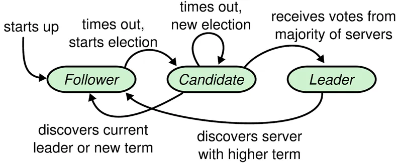

- **Leader**：接受客户端请求，并向Follower同步请求日志，当日志同步到大多数节点上后告诉Follower提交日志。
- **Follower**：接受并持久化Leader同步的日志，在Leader告之日志可以提交之后，提交日志。
- **Candidate**：Leader选举过程中的临时角色。

Raft要求系统在任意时刻最多只有一个Leader，正常工作期间只有Leader和Followers。

Follower只响应其他服务器的请求。如果Follower超时没有收到Leader的消息，它会成为一个Candidate并且开始一次Leader选举。收到大多数服务器投票的Candidate会成为新的Leader。Leader在宕机之前会一直保持Leader的状态。

Raft算法角色状态转换如下：

## 二、Leader选举

Raft 使用心跳（heartbeat）触发Leader选举。当服务器启动时，初始化为Follower。Leader向所有Followers周期性发送heartbeat。如果Follower在选举超时时间内没有收到Leader的heartbeat，就会等待一段随机的时间后发起一次Leader选举。

Follower将其当前term加一然后转换为Candidate。它首先给自己投票并且给集群中的其他服务器发送 RequestVote RPC （RPC细节参见八、Raft算法总结）。结果有以下三种情况：

- 赢得了多数的选票，成功选举为Leader；
- 收到了Leader的消息，表示有其它服务器已经抢先当选了Leader；
- 没有服务器赢得多数的选票，Leader选举失败，等待选举时间超时后发起下一次选举。

选举出Leader后，Leader通过定期向所有Followers发送心跳信息维持其统治。若Follower一段时间未收到Leader的心跳则认为Leader可能已经挂了，再次发起Leader选举过程。

[Raft算法详解 - 知乎 (zhihu.com)](https://zhuanlan.zhihu.com/p/32052223)

