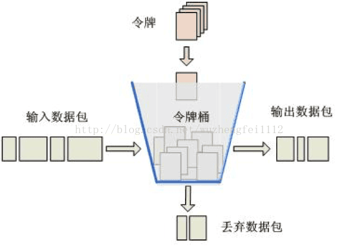
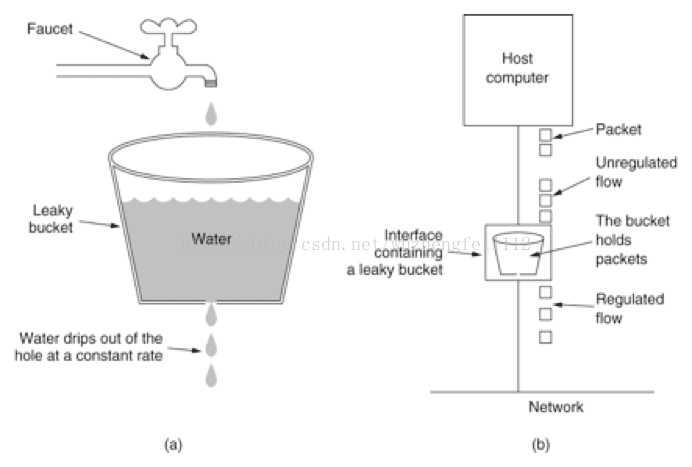

令牌桶(Token Bucket)、漏桶(leaky bucket)和计数器算法是最常用的三种限流的算法：

令牌桶算法是网络流量整形（Traffic Shaping）和速率限制（Rate Limiting）中最常使用的一种算法。先有一个木桶，系统按照固定速度，往桶里加入Token，如果桶已经满了就不再添加。当有请求到来时，会各自拿走一个Token，取到Token 才能继续进行请求处理，没有Token 就拒绝服务。

------

- **漏桶**

水(请求)先进入到漏桶里,漏桶以一定的速度出水(接口有响应速率),当水流入速度过大会直接溢出（访问频率超过接口响应速率),然后就拒绝请求,可以看出漏桶算法能强行限制数据的传输速率。

令牌桶可以允许一定的突发流量；漏桶主要是为了平滑流入速率。

以前我一直在想，为啥不设计成程序始终按照最大的保险速率拉任务，可以保证吞吐量，也达到了限流的目的。

感觉是一回事，拉任务拉不到就 sleep。不管是主动拉还是被动拉其实都一样。

不过，从设计上，漏桶更好一些，这样对客户端无感。客户端从原始的生产者拉还是从漏桶中拉，客户端无感，限流对于客户端是无感的。

或者说，限流应该做在应用的更上一层。

