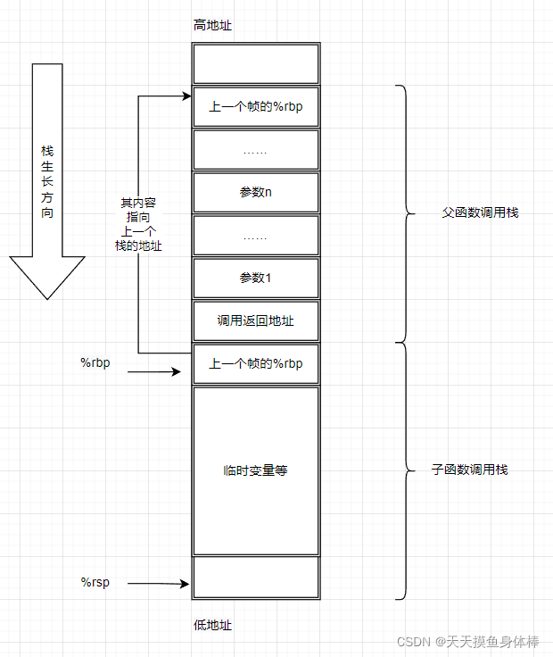
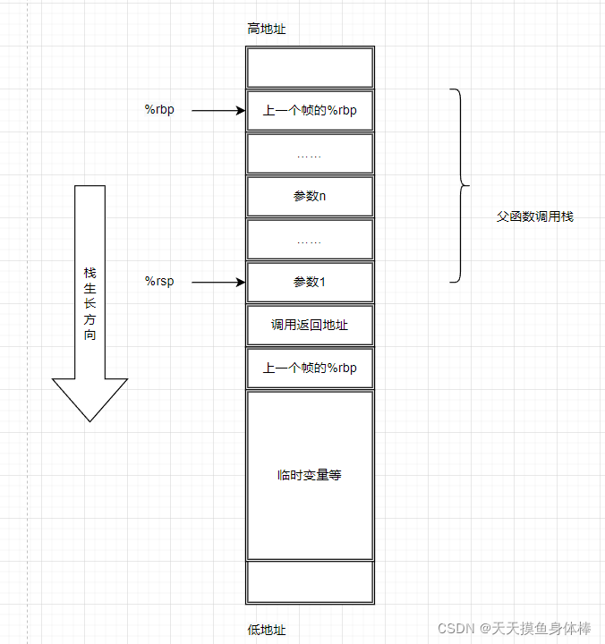
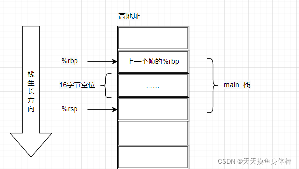
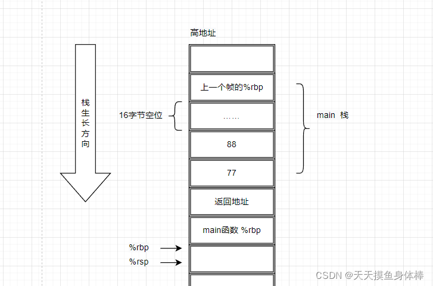
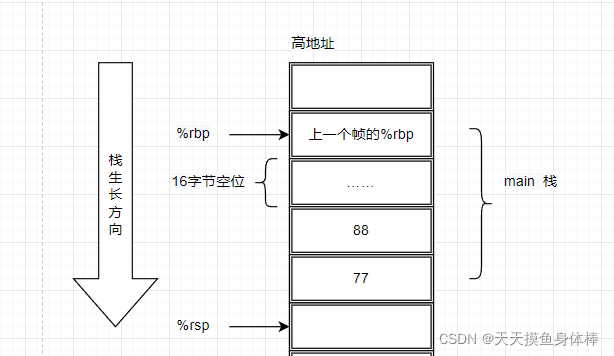
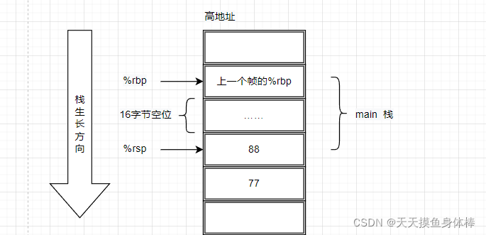
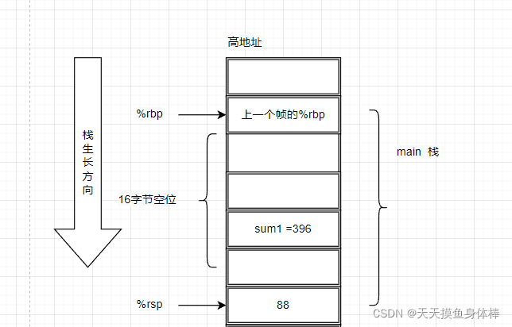
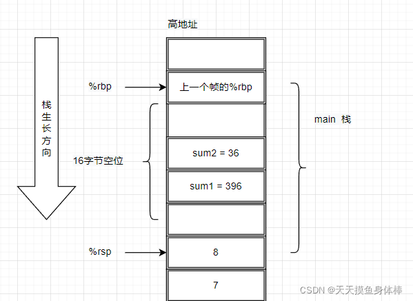
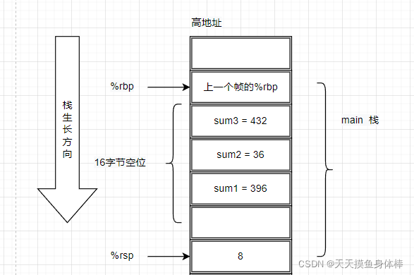

在程序中，函数调用是非常普遍的操作，那么C语言程序在函数调用的过程中，底层执行的汇编代码是怎么样的？寄存器和栈发生了哪些操作呢？
通用逻辑寄存器使用约定

在X86-64架构中，有16个通用的逻辑寄存器，各个寄存器以及其用途如下：
寄存器用途
其中：

- %rax 通常被用作保存返回值的结果，同时也用于乘除法指令之中；在imul指令中，两个64位的乘法会最多会产生128位的结果，所以需要rax以及rdx一起存储结果；同理在idiv指令中，被除数能有128位，所以也需要%rax 和 %rdx一起存储
- %rbp 通常用作栈帧的指针，指向栈起始的地址
- %rsp 通常用作栈顶指针，指向栈顶的地址
- %rdi, %rsi, %rdx, %rcx, %r8, %r9 这6个寄存器通常用于存储函数调用时的前6个参数
- 其他有标记miscellaneous registers的寄存器通用性较为广泛，可以根据需要存储任何数据
  被标记位Callee Save的寄存器，在函数调用的时候，调用者不必主动将寄存器的值进行压栈，在函数调用结束后，这些寄存器的值会恢复到调用之前的状态；而没被标记Callee Save的寄存器被称为Caller Save，表明在函数调用过程中如果会覆盖原寄存器的值的话，需要调用者手动将其保存在堆栈之中，以便后续的恢复。
- 如果使用的是64位寄存器的低32位，则是使用e开头进行表示，如%ebp， %esp等， 如果是%r8-%15，则是在后面加d，如%r8d， %r9d等；

函数调用

函数调用通过Call 指令完成， 主要执行如下动作：

- 在调用子函数的时候，会将调用的参数从右向左依次入栈
- 将调用返回的地址压入栈，实际上也就是将下一条指令地址压入栈
- 跳转到子函数的执行地址，
- 将父函数的栈的起始地址压入栈
- 将%rsp赋值%rbp

转换成汇编代码，相当于执行了如下指令

```assembly
pushq x  # 压入参数
call f 
# 相当于执行了 
# pushq %rip 
# moveq f, %rip 
# 这两条指令

push %rbp   # 将父函数栈低位置入栈
move %rsp, %rbp  # 将当前位置作为新的栈底
```

整个调用过程的栈变化都是由编译器自动完成的，目的都是为了在函数调用结束的时候恢复上一个栈的结构。而对于函数调用的参数，按照约定是从右到左的顺序压入栈中(对于不定长参数来说有好处)。




# 函数返回

函数返回的时候，主要执行的动作如下：

1. 将函数返回值存入%rax中
2. 恢复%rbp为父函数的%rbp，恢复%rsp
3. 跳转到原先的代码位置

转换成汇编代码，相当于执行如下命令：

```assembly
moveq rax  # 保存返回值
leave  # 恢复%rsp 和 %rbp
# leave 执行相当于
# moveq %rbp, %rsp  # 将当前调用栈得栈顶直接移动到栈低
# popq %rbp   # 将父函数的栈底位置赋值给%rbp，
ret  # 相当于popq %rip，跳转到函数返回的代码位置。
```

而之前调用函数时入栈的参数，需要由调用者自己去清理。




# 代码示例

## 测试环境

本次测试代码使用[gcc编译](https://so.csdn.net/so/search?q=gcc编译&spm=1001.2101.3001.7020)成汇编，gcc工具编译的汇编使用使用AT&T语法， 系统使用Ubuntu 7.5.0-3ubuntu1~18.04，使用如下命令进行编译。

```bash
gcc -S main.c -o main.s -O0
```

## 示例

测试使用的C代码如下

```c++
// C代码 很简单的8个数相加
int add(int a, int b, int c, int d, int e, int f, int g, int h) {
  int sum = a + b + c + d + e + f + g + h;
  return sum;
}

int main(void) {
  int sum = add(11, 22,33, 44, 55, 66, 77, 88);
  int sum2 = add(1, 2, 3, 4, 5, 6, 7, 8);
  int sum3 = sum + sum2;
  return 0;
}
```

对应的汇编代码如下：

```assembly
// 删除部分标识

add:
.LFB0:
	// 0. 可以看到函数开始之前， 会主动将父函数的栈内容进行保存
	pushq	%rbp
	movq	%rsp, %rbp
	
	// 1. 将参数按顺序写入栈中
	movl	%edi, -20(%rbp)
	movl	%esi, -24(%rbp)
	movl	%edx, -28(%rbp)
	movl	%ecx, -32(%rbp)
	movl	%r8d, -36(%rbp)
	movl	%r9d, -40(%rbp)
	
	// 2. 依次取出进行运算
	movl	-20(%rbp), %edx
	movl	-24(%rbp), %eax
	addl	%eax, %edx
	movl	-28(%rbp), %eax
	addl	%eax, %edx
	movl	-32(%rbp), %eax
	addl	%eax, %edx
	movl	-36(%rbp), %eax
	addl	%eax, %edx
	movl	-40(%rbp), %eax
	addl	%eax, %edx
	movl	16(%rbp), %eax
	addl	%eax, %edx
	movl	24(%rbp), %eax
	addl	%edx, %eax
	movl	%eax, -4(%rbp)

	// 3. 将返回值赋值给%eax
	movl	-4(%rbp), %eax
	
	// 4. 因为整个过程中没有push指令，所以编译器没调用leave，而是popq ，将父函数的栈还给%rsp，然后ret
	popq	%rbp
	ret

main:
.LFB1:
	pushq	%rbp
	movq	%rsp, %rbp
	subq	$16, %rsp   // 将rsp下移 ，预留空间
	
	// 超过6个的参数，会先入栈
	pushq	$88
	pushq	$77
	movl	$66, %r9d
	movl	$55, %r8d
	movl	$44, %ecx
	movl	$33, %edx
	movl	$22, %esi
	movl	$11, %edi
	call	add
	// 栈顶指针直接上移16个字节，将pushq 的88 和 77 都给清理掉
	addq	$16, %rsp
	
	// 将函数调用结果存入 rbp - 12的位置
	movl	%eax, -12(%rbp)
	
	// 一样的调用方式
	pushq	$8
	pushq	$7
	movl	$6, %r9d
	movl	$5, %r8d
	movl	$4, %ecx
	movl	$3, %edx
	movl	$2, %esi
	movl	$1, %edi
	call	add
	addq	$16, %rsp
	
	// 将调用结果存入 rbp - 8 的位置
	movl	%eax, -8(%rbp)
	
	// 取出之前的调用结果，然后相加，存入rbp - 4位置
	movl	-12(%rbp), %edx
	movl	-8(%rbp), %eax
	addl	%edx, %eax
	movl	%eax, -4(%rbp)

	// return 0
	movl	$0, %eax
	leave
	ret
```

首先要说一下，在汇编命令中，

- 操作数如果是32位的，则是使用l进行结尾，如movl $66，%r9d， 说明指令和寄存器都是32位的
- 操作数如果是64位的，则是使用q进行结尾，如addq $16, %rsp， 说明指令和寄存器都是64位的

因为加分指令的操作数都在int32以内，所以上述示例使用的指令都是32位的，只有在对栈指针进行操作的时候，指令才是64位的。

### main函数

让我们从mian函数开始

```c++
	pushq	%rbp
	movq	%rsp, %rbp
	subq	$16, %rsp   // 将rsp下移 ，预留空间
```

main函数开始保存了调用main函数的父函数栈，然后分配了16字节的空位



### 函数调用1

```assembly
	// 超过6个的参数，会先入栈
	pushq	$88
	pushq	$77
	movl	$66, %r9d
	movl	$55, %r8d
	movl	$44, %ecx
	movl	$33, %edx
	movl	$22, %esi
	movl	$11, %edi
	call	add
	// 栈顶指针直接上移16个字节，将pushq 的88 和 77 都给清理掉
	addq	$16, %rsp
	
	// 将函数调用结果存入 rbp - 12的位置
	movl	%eax, -12(%rbp)
```

调用函数之前开始将参数进行分配，大于6个的参数，从右向左依次入栈，6个以内的参数，分配到对应寄存器上，因为对栈操作都是64位的，所以 88 和77 是以 pushq的方式入栈，而其他参数则是按32位的形式放入到通用寄存器的低32位中。

然后开始执行call add

```assembly
add:
.LFB0:
	// 0. 可以看到函数开始之前， 会主动将父函数的栈内容进行保存
	pushq	%rbp
	movq	%rsp, %rbp
```

在执行到add的前两行后，可以看到栈内数据如下：



 然后开始执行8个参数的加法运算， 并最终将值赋给%eax

```assembly
	// 1. 将参数按顺序写入栈中
	movl	%edi, -20(%rbp)
	movl	%esi, -24(%rbp)
	movl	%edx, -28(%rbp)
	movl	%ecx, -32(%rbp)
	movl	%r8d, -36(%rbp)
	movl	%r9d, -40(%rbp)
	
	// 2. 依次取出进行运算
	movl	-20(%rbp), %edx
	movl	-24(%rbp), %eax
	addl	%eax, %edx
	movl	-28(%rbp), %eax
	addl	%eax, %edx
	movl	-32(%rbp), %eax
	addl	%eax, %edx
	movl	-36(%rbp), %eax
	addl	%eax, %edx
	movl	-40(%rbp), %eax
	addl	%eax, %edx
	movl	16(%rbp), %eax
	addl	%eax, %edx
	movl	24(%rbp), %eax
	addl	%edx, %eax
	movl	%eax, -4(%rbp)

	// 3. 将返回值赋值给%eax
	movl	-4(%rbp), %eax
```

注意第一部分和第二部分，从寄存器往栈内保存的时候，是在从%rbp - 20开始的。

首先为啥是从这个位置开始的呢，因为前面的空间被用作临时变量的存储，类似于main栈，在一开始就会通过subq 16， %rsp， 保留一定字节作为临时变量的存储，而且我们也可以看到最后加法运算的结果保存了一个给临时变量sum， 这个位置就是%rbp-4。

第二点就是为啥不需要像main那样通过subq 的方式去操作%rsp，而且为啥可以直接操作%rbp栈后面的内容呢？

    来自System V AMD64 ABI的标准中的话
    The 128-byte area beyond the location pointed to by %rsp is considered to be reserved and shall not be modified by signal or interrupt handlers. Therefore, functions may use this area for temporary data that is not needed across function calls. In particular, leaf functions may use this area for their entire stack frame, rather than adjusting the stack pointer in the prologue and epilogue. This area is known as the red zone.
    %rsp 指向的位置之外的 128 字节区域被认为是保留的，不应被信号或中断处理程序修改。 因此，函数可以将此区域用于函数调用之间不需要的临时数据。 特别是，叶函数可以将这个区域用于它们的整个堆栈帧，而不是在序言和尾声中调整堆栈指针。 这个区域被称为红色区域。

因为有Red Zone的存在，所以在末端函数（也就是这个函数不再调用其他函数）调用的时候，是可以直接使用%rsp 后的128字节内的空间的。


第三点要注意的是，通过上面的栈可以看出来，中间的空间存放的是函数返回地址以及main栈%rbp，共占16个字节。 所以在取88和77参数的内容的时候，是通过16(%rbp)的位置取到77， 24(%rbp)的位置取到的88。

最后开始执行栈的恢复， 因为这边%rsp，没有变化，所以只要恢复%rbp，将main函数栈底popq给%rbp，然后通过ret将代码指针重新定位到main函数中。

```assembly
// 4. 因为整个过程中没有push指令，所以编译器没调用leave，而是popq ，将父函数的栈还给%rsp，然后ret
	popq	%rbp
	ret
```




 可以看到ret回来之后，栈内还是存在参数的，所以编译器这个时候对%rsp执行了addq操作，对栈进行清理。

```assembly
	call	add
	// 栈顶指针直接上移16个字节，将pushq 的88 和 77 都给清理掉
	addq	$16, %rsp
```

清理完毕后，栈指针如图：


%rsp指向的是下一个可写的位置，所以此时的88已经是无效数据了。

最后将add的结果写入临时变量中

```assembly
	call	add
	// 栈顶指针直接上移16个字节，将pushq 的88 和 77 都给清理掉
	addq	$16, %rsp
	
	// 将函数调用结果存入 rbp - 12的位置
	movl	%eax, -12(%rbp)
```



到此，第一次函数调用结束，将sum1 保存在%rbp - 12 的位置。

### 第二次函数调用结束

第二次函数调用同理，结束后会将结果保存在%rbp - 8 的位置，所以调用结束后的栈如图



### 结果相加

最后将sum1 和sum2 结果相加，然后保存到 %rbp - 4 的位置，栈如图




# 结尾

本文简单介绍了汇编层面下函数调用时栈的变化，并通过简单的C代码汇编结果对调用栈进行了分析，对于了解汇编和理解程序底层运行机制还是很有帮助的。

如果文章中有错误或不理解的地方，还请指出，欢迎大家一起讨论。


