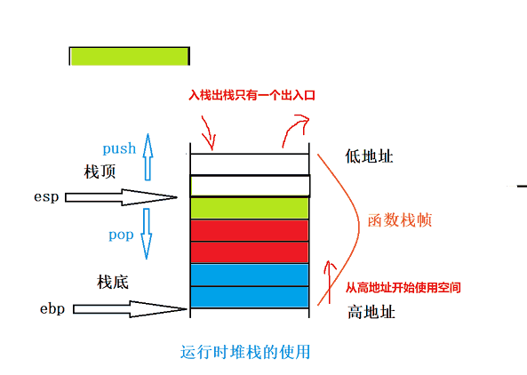

**相关寄存器**

eax：通用寄存器，保留临时数据，常用于返回值				ax

ebx：通用寄存器，保留临时数据										  bx

ebp：栈底寄存器                                                                     bp

esp：栈顶寄存器                                                                      sp

eip：指令寄存器，保存当前指令的下一条指令的地址         ip

**相关汇编命令**

mov：数据转移指令

push：数据入栈，同时esp栈顶寄存器也要发生改变（esp存储地址减小，esp指向上移）

pop：数据弹出至指定位置，同时esp栈顶寄存器也要发生改变（esp存储地址增大，esp指向下移）

sub：减法命令

add：加法命令

call：函数调用，分为两步：1. 向栈压入返回地址(下一条指令,供 ret 指令使用)  2. 指令转入目标函数

jump：通过修改eip，转入目标函数，进行调用

ret：恢复返回地址，向栈压入eip，类似pop eip命令

## 解析函数栈帧的创建和销毁

栈本身是一个连续的空间，人为地将这个空间划分区域，每个区域代表了一个函数调用；每调用一个函数涉及到创建一个栈帧，函数返回则销毁这个栈帧



```c
#include<stdio.h>

int add(int i,int j){
	int ret= i+j;
    return ret;
}

int main(){
	int x=add(1,2);
	return x;
}
```


```assembly
add(int, int):
        push    rbp														# 保存上个函数帧的 beg
        mov     rbp, rsp											# 令栈顶等于栈底。	相当与初始了一个空帧
        mov     DWORD PTR [rbp-20], edi				# 取第一个参数,即 a=[edi]
        mov     DWORD PTR [rbp-24], esi				# 取第二个参数
        
        mov     edx, DWORD PTR [rbp-20]				# 将参数移入到加法器的寄存器
        mov     eax, DWORD PTR [rbp-24]
        add     eax, edx											# 执行加法
        mov     DWORD PTR [rbp-4], eax				# ret=xxx
        mov     eax, DWORD PTR [rbp-4]				# return ret
        pop     rbp														# 恢复上个函数的 beg
        ret																		# 恢复 ip,跳转会调用处(下一条指令)
        																			# ret指令的执行，此时栈顶的值是call指令下一条指令的地址，从栈顶弹出，然后直接跳转到call指令下一条指令的地址处，继续往下执行。
main:
        push    rbp
        mov     rbp, rsp											# 构建 main 的函数帧
        sub     rsp, 16												# 准备调用函数,先预留一定的空间(红灯区), 供子程序存储局部变量，临时数据，已经调试信息等
        																			# add(1,2)
        mov     esi, 2												# 存储参数 2
        mov     edi, 1												# 存储参数 1
        call    add(int, int)									# 跳转到 add 函数的位置
        mov     DWORD PTR [rbp-4], eax				# 将函数返回值赋值给 x
        mov     eax, DWORD PTR [rbp-4]				# return x
        leave																	# 这个指令其实是恢复 rsp.	add 函数执行前后 rsp 不变，所以，不需要这个指令
        ret
```


可以看到，**c 语言中函数实际上是定义了一个传参，取参，跳转的协议：**

- 调用方按照**约定的规则**把参数放到指定位置，然后跳转到子程序起始位置
- 子程序按照**约定的规则**把参数赋值给形参，然后继续执行
- **函数在进行值传递调用的时候，形参其实是实参的一份临时拷贝**，两者所处空间不同。因此对形参的修改不会影响实参。


红灯区

 		其实返回对象时内置类型时，一般都是通过寄存器来带回返回值的，返回对象如果时较大的对象时，一 般会在主调函数的栈帧中开辟一块空间，然后把这块空间的地址，隐式传递给被调函数，在被调函数中通过地址找到主调函数中预留的空间，将返回值直接保存到主调函数的。
		具体可以参考《程序员的自我修养》一书的第10章。

1. 存储函数参数：在调用函数时，需要将函数的参数压入堆栈中。这些参数可能需要占据一定的空间，以便函数内部可以正确地访问它们。因此，在函数调用之前，必须为这些参数在堆栈上分配足够的空间。
2. 存储返回地址：在函数调用完成后，程序需要返回到调用函数的指令继续执行。因此，在函数调用之前，需要在堆栈上分配足够的空间来存储返回地址。
3. 存储函数内部变量和临时数据：函数可能需要在其内部分配一些变量或临时数据。这些数据需要存储在堆栈上，因此，在函数调用之前，必须为这些数据在堆栈上分配足够的空间。


# 接下来展示一段神奇代码

```c++
#include <iostream>
using namespace std;

int add(int a, int b) {
    return a + b;
}

int main() {
    void *func1 = (void *) add;
    auto f0 = reinterpret_cast<int (*)(int, int)>(func1);
    auto f1 = reinterpret_cast<int (*)()>(func1);
    auto f2 = reinterpret_cast<int (*)(int)>(func1);
    auto f3 = reinterpret_cast<int (*)(char, char, char, char)>(func1);
    f0(1, 2);
    f1();
    f2(1);
    f3(1, 2, 3, 4);
}
```


```assembly
add(int, int):
        push    rbp
        mov     rbp, rsp
        mov     DWORD PTR [rbp-4], edi						# 可以看到, add 始终是按照 4 个字节读 int
        mov     DWORD PTR [rbp-8], esi
        mov     edx, DWORD PTR [rbp-4]
        mov     eax, DWORD PTR [rbp-8]
        add     eax, edx
        pop     rbp
        ret
main:
        push    rbp
        mov     rbp, rsp
        sub     rsp, 48
        mov     QWORD PTR [rbp-8], OFFSET FLAT:add(int, int)     # f0
        
        mov     rax, QWORD PTR [rbp-8]													 # 不能直接内存写内存, 得先读再写
        mov     QWORD PTR [rbp-16], rax													 # f1
        
        mov     rax, QWORD PTR [rbp-8]
        mov     QWORD PTR [rbp-24], rax													 # f2
        
        mov     rax, QWORD PTR [rbp-8]
        mov     QWORD PTR [rbp-32], rax													 # f3
        
        mov     rax, QWORD PTR [rbp-8]
        mov     QWORD PTR [rbp-40], rax													 # f4
        
        mov     rax, QWORD PTR [rbp-16]
        mov     esi, 2
        mov     edi, 1
        call    rax																							 # 正常调用 add 
        
        mov     rax, QWORD PTR [rbp-24]													 # 先把函数地址写到寄存器中
        call    rax																							 # 无参调 add
        
        mov     rax, QWORD PTR [rbp-32]
        mov     edi, 1
        call    rax																							 # 传一个参数调 add
        
        mov     rax, QWORD PTR [rbp-40]
        mov     ecx, 4
        mov     edx, 3
        mov     esi, 2
        mov     edi, 1
        call    rax																							 # 传 4 个参数调 add 
        
        mov     eax, 0
        leave
        ret
```

可以看到，c 语言函数调用只是封装了参数传递方式+跳转：

- 函数调用符号`()`定义了怎么传参，按照什么类型传参数。			可以说，函数调用符`(a,b,c)`可以用于控制传参(压栈)
- 参数放到什么位置，这个是约定好的，可以不用管`前 6 个放寄存器，后面的方在栈中，具体可以参考 .函数调用.md`
- 子程序由于汇编代码写死了，所以子程序中指定按照定义的类型去取数据。比如这个，add 无脑取 两个 4 个字节的内存当成操作数。调用方传或不传，传多少，寄存器就在那里，轮到子程序运行，他就去就行了。


# 魔法代码

```c++
int main() {
    int a=1;
    int *p = &a;
    void *func1 = (void *) (p);
    auto f0 = (void (*)(int)) (func1);
    f0(1);
}
```

可以编译，不报错，但是由于 p 并非是真正的函数。因此运行时栈被破坏了


#### 有什么用

从上面的分析可以看到，调用方是可以重新定义传参方式的，只要传的内存是对的，那么被调用的函数就能正常运行

可以将所有的函数封装成统一的调用

std::function 的拙劣实现，暂时不考虑函数对象析构导致 fun 失效的问题

```c++
#include <iostream>
#include "vector"

using namespace std;

int add(int a, int b) {
    cout << "call add: " << a << "+" << b << "=" << a + b << endl;
    return a + b;
}

template<typename return_t, typename... args_t>
struct fun {
    void *call;

    fun(return_t(*f)(args_t...args)) {
        call = (void *) (f);
    }

    return_t operator()(args_t...args) {
        return ((return_t(*)(args_t...)) (call))(args...);
    }
};


int main() {
    fun<int, int, int> f(add);
    f(1, 2);
    auto l = [] {
        cout << "call lambda l" << endl;
    };
    auto m = [] {
        cout << "call lambda m" << endl;
    };
    auto n = [] {
        cout << "call lambda n" << endl;
    };
    fun<void> ff(l);
    ff();

    // 本身，lambda 是一个 class，不同的 lambda 是没法放在一个数组里面的。但是，现在通过 void* 将类型抹除了
    vector<fun<void>> fs;
    fs.emplace_back(l);
    fs.emplace_back(m);
    fs.emplace_back(n);

    for(auto&c:fs){
        c();
    }
}

```


什么是函数栈帧？

    答：函数栈帧（stack frame）就是函数调用过程中在程序的调用栈（call stack）所开辟的空间，用以存放
    
    1.函数参数和函数返回值
    
    2.临时变量（包括函数的非静态的局部变量以及编译器自动生产的其他临时变量）
    
    3.保存上下文信息（调用信息）。

 函数是如何调用的？

    答：先传参，也就是把参数的值分别放在寄存器中，然后再push压入栈中；把主调函数ebp的值和下一条指令的地址push压入栈中，随后进入调用的函数中，创建函数栈帧并初始化，然后执行函数内的语句。

函数调用时参数时如何传递的？传参的顺序是怎样的？

     答：其实传参就是把参数push到栈帧空间中，传参时先压入的是后面参数的值，(参数，参数，...)从右往左压入。

 函数的形参和实参分别是怎样实例化的？（实例化一个对象就是为对象开辟内存空间）

     答：形参通过寄存器的值压栈创建，而实参通过 ebp 存储的地址进行偏移，由编译器决定一块未使用空间创建。

形参和实参又是什么样的关系呢？

     答：形参是实参的一份临时拷贝，改变形参不会影响实参。

 函数的返回值又是如何返回的？

     答：通过寄存器保留副本，不会随栈帧销而销毁，毁待函数调用完栈帧销毁后把寄存器的值拷贝到主调函数中对应的变量里，实现返回值的带回。

 局部变量是如何创建的？

     答：局部变量是在局部变量所在函数的栈帧空间中创建的，通过 ebp 存储的地址进行偏移，由编译器决定一块未使用空间创建。

 为什么局部变量若不人为初始化，内容是随机的？

    答：函数栈帧创建后会自动将空间中存储的值全部初始化为一个特定值（如VS2019下为0xcccccccc），编译器不同值也不同。


