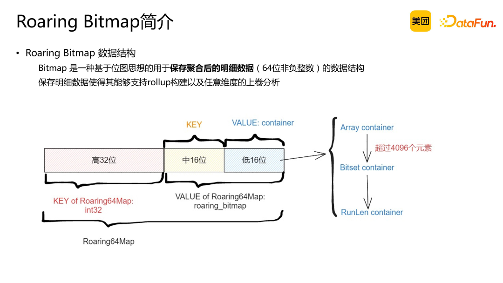

bitmap 本身倒是没有什么可说的,这里面的**分治思想**可以学习一下.

要记录 `[0,63]` 中数值的去重数,显然构造一个一个 `int64` 就能按照 `bit` 位进行计数.如果讲它推广到计算 `N` 个数呢 ?  `N` 的上限为上百亿呢 ? 显然就需要几百亿个 bit 位

roaring bitmap 就是为了解决这个问题搞的

- 分桶.对于离散度很高的数据集,显然,构造出来的 bitmap 会有很多空位,造成很大的空间浪费. 通过分桶, 将一整块 bitmap 分割成若干个小块 bitmap. 这样,按需存储就能减少空间浪费
- 一个分桶下要存多少个数据 ?
- 这实际上是一种分治法.  把原问题的解转化为与他等价的若干个子问题的解的聚合解

实际上,动态规划也是将 原问题划分成若干个子问题, 原问题等于子问题的聚合解

一次管理大的搞不定的话就分段搞.

Bitmap 背后的实现基于 Roaring Bitmap，这是一种用于保存聚合后明细数据的数据结构。它通过两级索引来保存明细数据，简而言之，通过两级索引定位到具体的container，container 中存放着聚合后的明细数据的低16位，它有三种类型：纯数组类型的 Array container、位图类型的 Bitset container 和 RunLen 编码的位图 RunLen container。

当 container 中的元素超过 4096 个时，它会从纯数组类型转换为位图类型。这种转换可以节省空间，因为位图背后的存储是一些比特位。为了进一步减少空间占用，Roaring Bitmap 会对位图进行 RunLen 编码。这意味着，如果位图中存在连续的 1，它们会被合并在一起，只记录起始位置和长度。这样的优化使得 Roaring Bitmap 在高基数场景下具有较高的性能。

这三种不同的 container 有着不同的数据结构，基于不同的数据结构可以算出它们对应的大小。Array Container 的大小是 array 的长度乘以 16 bit，**因为它只需要存储低 16 位，short 就可以把这个整体给存下来**。

Bitset Container 是 65536 bit（2 的 16 次方），相当于每一个 bit 都能映射到对应的数据是否在 Container 中，如果存在，就把这一位比特位置 1，不存在就置 0。RunLen 是基于这个 Bitset 进行了编码优化，让它使用更少的空间存储 Container 的数据。

公式中当 size 大于 4096 的时候，显然使用 Bitset Container 更省空间。所以当整个 size 大于 4096 的时候，Container 会从 Array Container 转成 Bitset Container，再通过 Runlen 编码后能否减少空间决定是否要转为最终存储格式 RunLen Container。

以上图为例，说明如何将一些 64 位的非负整数添加到 Bitmap 中。Bitmap 需要保存聚合后的明细数据，因此我们需要了解数据是如何添加进去的。在第一部分中，提供了一些原始数据值，这些数据值具有以下特点：高 48 位相同，低 16 位变化。这种简化意味着我们只有一个 Container。

在第三部分列出了整体结构，包括索引和 Container 内部的元素类型。可以看到，Array Container 按照元素类型进行排序。这里有 4096 个元素，每当达到 4096 个元素时，内部会将其转换为 bitset。

观察到从 [0x0000, 0xF000) 共计 61440 个元素的在 container 中均不存在，对应到 bitset 中低 61440 个 bit 全为 0；

而[0xF000, 0xFFFF] 这部分共计 4096 个元素均在 container 中，对应到 bitset 中高 4096 个 bit 全为 1。

基于 Bitset 中的内容，还会进行 Run Length 编码，具体不再展开。

接下来，我们可以根据这些数据来分析不同数据类型组合的操作复杂度。对于 array union array，其实就是对两个有序数组进行归并排序，由于这两个数组都是有序的，因此整体操作的时间复杂度大约为 O(m+n)。对于 array union bitset，操作相对简单。我们将数组中的每一位映射到位图中，将其置为 1。根据数组中的元素数量，这个过程的时间复杂度为 O(m)。而 bitset union bitset，可以利用位运算进行加速，其时间复杂度不受容器中元素数量变化的影响，可以理解为常数时间复杂度。至于 runlen union runlen，它是针对编码后的位掩码进行的合并，由于编码后的区间值不会太多，因此运行长度的合并接近于常数时间复杂度。

关于精确去重，得出两个关键结论。首先，精确去重指标在所有聚合指标中往往具有最高的复杂度，容易成为整个 SQL 性能的瓶颈。其次，Bitmap 在精确去重场景中能够兼顾灵活分析，同时性能在一定程度上能满足我们的预期。因此，我们后续的优化重点在于 Bitmap 的优化。

Bitmap 数据结构的优化，有以下几个原则：

- Bitmap 的优化主要面向空间而非计算。从刚刚介绍的三种 Container 中可以看出 Bitmap 的优化目标是减少空间占用，而非提高计算效率。
- 优化时应将大量计算卸载到位运算上，这样可以使用高效的向量化位运算指令加速计算，同时能够减少 Array Container 内存开销。
- Bitmap 数据结构适用于相对密集的数据。数据最好是低位连续的，否则如果数据过于离散，索引到 Container 的代价会很高，同时 Container 的数量也会很多。

在处理两个 Bitmap 时，需要将每个索引相同的 Container 进行合并。Container 数量增多会使索引本身具有一定的复杂度。同时 Container 中元素比较稀疏，大部分 Container 类型是 Array Container 也会增加整体计算时间。

**Bitmap** **聚合性能优化**

上一章节介绍了 Roaring Bitmap 数据结构，总结出一系列针对 Bitmap 聚合性能优化的方法。在本章节中，首先介绍一下 Doris Bitmap 现有的性能瓶颈；之后，将根据 Bitmap 的数据类型特点，对其输入数据布局进行优化；最后，将探讨在计算流程方面如何进行进一步优化，以充分发挥 Bitmap 的空间优势。

首先，来看一下现有 Bitmap 聚合的一些性能瓶颈。

- 非数值类型去重限制

Bitmap 聚合不支持非数值类型进行去重。由于其内部使用 64 位非负整数作为存储单元，因此仅能处理数值类型数据。这限制了其在现实场景中的应用范围。

- 高基数情况下的聚合与吞吐性能问题

在高基数情况下，Bitmap 聚合和吞吐性能较低。特别是当数据分布较为离散时，性能下降尤为明显。

- 内存拷贝开销

由于 Bitmap 对象可能较大，在 Doris 中进行内存拷贝时，开销较高导致整体性能受到一定程度的影响。

针对非数值类型，我们有一些解决方案。通过字典编码将非数值类型映射成数值类型。字典编码的简化操作如上图，例如，当要对 device ID 进行去重处理时，首先会将 distinct values 提取出来，然后根据值从 1 到它的最高基数进行编码。编码完成后，将业务表与编码表进行关联，从而获得编码后的值。这样就实现了非数值到数值的转化。

值得注意的是，如果 device ID 是 string 类型，可以直接通过哈希映射成数值类型。但是哈希函数的离散性会导致计算性能下降，吞吐速度无法满足预期。因此，我们更倾向于在导入数据前使用字典编码的方式进行映射。这样不仅可以将非数值类型转换为数值类型，还能降低离散度，将数据映射到连续的值域空间，提高计算性能。

之前提到过，在高字典基数的情况下，Bitmap 可能会遇到一些问题。假设字典的最大基数 m 达到十亿或百亿级别。在这种情况下，Doris 现有的计算流程可能会面临挑战。

Doris 会对每个分片（tablet 分桶）进行扫描，并在分桶上执行 Streaming Agg 操作。实际上，Doris 的数据计算单位是分桶，由于 device ID 从 1 到 m 分布广泛且离散，分桶中可能包含从 1 到 m 的所有 device ID。

当 m 较大时，会出现以下问题：由于高位上存在许多值，Container 数量会显著增加。上文提到的索引过多会导致性能下降。

另一个问题是，由于非连续性，大部分 Container 中的元素数量较少。这种情况下，可能需要使用 Array Container 进行存储。这样一来，在进行两个 Bitmap 的 union 操作时，会遇到两个瓶颈点：首先，Container 数量较多；其次，Array Container 进行 union 导致额外的内存分配。

针对字典表比较大的问题，我们有一些优化的手段。首先，最简单的就是人为将字典表进行拆分，比如按日期分区，按每一个分区生成一个字典表，这样基数就会有效地降下来。但是这样做的问题是如果业务上有跨日期去重计算，就无法解决了。

上面给出了独立编码的示意图，按天把数据做了一个切分，生成不同的表，最后进行编码，如果没有跨日期去重的需求，其性能提升还是比较高的。

第二种优化方法是正交编码优化。与独立编码不同，正交编码在保持字典表基数不变的前提下，通过分桶策略将大的区间字典分割成多段小区间，并将其分别放入不同 tablet 中。在 Doris 中，我们利用 device ID 字段 值作为分桶区间，将 1 到 n 作为第一个分片数据，后续分片以此类推。这样，通过分桶数量将整个基数降低。

这种优化方法具有两个优势：

- 在一阶段聚合预算过程中，Doris 基于分片数据进行计算。如果 tablet 中的数据连续，则会形成 Bitset Container，从而提高计算效率。
- 在二阶段聚合过程中，不同 tablet 中的数据天然无交集。因此，二阶段仅需将一阶段 shuffle 过来的结果相加即可，无需进行 merge 计算。

然而，这种编码方法也存在一定的局限性：

- 数据按此方式分布，预聚合度较低。因为按照设备 ID 区间分桶，无法保证所有相同 key 的数据集中在同一区间从而分入同一个桶在桶内聚合。
- 冗余倾斜问题。不同设备产生的数据量不同，可能导致某些 device ID 的数据量较大，而其他设备的数据量较小。
- 无法满足多列去重场景。例如，若需按 device ID 和 user ID 进行区间分桶，则无法实现正交。
- 该优化方法基于一定的前提假设，即数据从 tablet 读取后直接进行聚合。若涉及中间 join 操作和 shuffle 过程，则该前提假设不成立，优化效果将减弱。因此，此优化方法对于单表场景具有显著优势。

接下来，对比一下正交编码与独立编码在字典基数较大、数据离散情况下的应用。在独立编码中，每个 Container 中的元素较为离散，导致字典基数较大。而正交编码在这种情况下具有以下优势：

- 索引 keys 数量减少：由于正交编码将数据分散到多个 tablet 中，相同 key 的数据被分布在不同的区间，从而降低了索引 keys 的数量。
- Container 优化：在正交编码中，Container 内的数据相对集中，更多地采用 Bitset 或 Run Length 这类存储大量数据且可用位运算的 Container。

上述优化基于输入数据布局，而在计算流程方面，正交编码同样具有优化空间。通过调整数据布局和利用位运算等技巧，可以进一步提高数据处理效率。

**----------------------------------------下半部分是查询引擎的内容,不用看了----------------------------------------------**

我们曾遇到一个高基数去重场景，其处理速度较慢。经过简化，将该场景转换为仅涉及两列的情况：一列为 city 列，另一列为 user ID 列，其中 user ID 列采用 bitmap 类型。尽管每行的基数不高，但数据分布仍以 Array Container 为主。在按 city 列进行 group by 和聚合操作时，该场景涉及两个阶段：

- 多次 Array Container 做 union：由于 Array Container 数量较多，需要进行多次 union 操作。
- Array Container 转 Bitset：当 Array Container 超过 4096 时，需将其转换为 Bitset。

然而，这种操作存在以下问题：

- 额外内存分配：在 Array Container 过程中，元素上涨可能导致额外内存分配。
- Union 操作繁重：随着 Array Container 元素增多，union 操作变得复杂，且内部元素可能被多次重复合并。

为解决此类问题，我们对高基数高聚合场景进行了优化。在聚合过程中，跳过 Array Container 类型，直接使用 Bitset 进行计算。在聚合完成后，需要将数据 shuffle 到二阶段。此时，需检查是否达到 4096 个元素，若没达到需要将 Bitset 降级为 Array，否则 shuffle 的数据量可能会较大。

**结合 Doris 向量化引擎优化**

接下来介绍结合 Doris 向量化引擎的优化措施，主要包括以下两个方面：

- 优化 bitmap 内存使用和拷贝开销：由于 bitmap 内存使用较大，拷贝开销较高，我们对这部分进行了优化，以降低内存消耗和提高数据处理效率。
- 引入Fast Union：Roaring Bitmap 支持高效接口，即 Fast Union。我们对向量化引擎进行了改造，以利用 Fast Union 进行更快速的 union 操作。

然而，即使实施了上述优化，对于长时间范围的查询，依然无法满足业务预期。因此，我们针对特殊场景进行了聚合下推的优化。

首先，来介绍 Doris 1.1 版本中的内存优化。在该版本中，Doris 进行了向量化的改造，计算逻辑与之前版本有所不同。我们发现，在触发列拷贝的场景中，主要有两点原因：

- 表达式计算过程中的列拷贝：以 SQL 中的 CASE 语句为例，EXPR 执行计算，并将结果放入最后一列。这个过程必然涉及到从device id 列中拷贝bitmap 对象到expr result 列中的操作。由于 bitmap 较大，拷贝过程可能会变得缓慢。
- 多表关联时列拷贝：在 join 操作的 probe 阶段，系统会将 build block 和 probe block 中的数据拼接在一起，然后返回上一层。这个过程同样需要进行一次拷贝。

我们观察到 Bitmap 列拷贝的开销是比较大的。当时打出的一个火焰图可以看到，在表达式计算这个场景里边，EXPR 计算会占到聚合算子的 56% 左右。这里有一个 VExpr execute 操作会调 ColumnNullable 的 insert from，这个操作其实就是把这个数据从另一列插进来的过程，实际聚合的运算是在右半部分，占比不到一半。

这里还有一个并发的问题，如果存在大量的内存拷贝，tcmalloc 在释放内存时会加锁，影响并发性能。

我们对这部分的优化手段主要是用 Jemalloc 替换 Tcmalloc，以减少释放内存加锁带来的影响。

另外 bitmap 它天然支持 copy on write，我们开启了 copy on write，但由于这个 copy on write 是线程不安全的，我们做了对 bitmap 的改造，使得它在多线程计算中不出问题。整体的优化结果是，这个 Expr 表达式的计算时长占比从 56% 降到了 14%。

第二个优化手段是利用 Fast Union 接口提高计算效率。在传统的聚合计算中，数据会逐条从 Scan 节点返回，再更新哈希表。哈希表最初是一个空 Bitmap，更新取决于数据到达的顺序。

RoaringBitmap Fast Union 接口的优点在于，它允许我们先将一批数据放入数组，然后将数组传递给 Fast Union 接口批量更新。主要有两方面的优化：

- 延迟合并：在 Fast Union 中，无需每次合并后都计算 bitmap 的基数，避免了中间计算过程结果的维护开销。计算完成后，直接返回一个 Bitmap，省去了中间变量的维护。
- 减少数据移动次数：在传统方法中，合并顺序不受控制，可能导致将较大的 Bitmap 移动到较小的 Bitmap 上，造成效率低下。Fast Union 则可以优化这一过程，将较小的 Bitmap 移动到较大的 Bitmap 上，降低数据移动次数。

第三个优化针对的是一个特殊场景。问题背景是一些查询超过两年的 SQL 执行速度较慢，主要原因是聚合和 Scan 的吞吐不匹配，导致聚合阶段的初步聚合成为性能瓶颈。为了解决这个问题，我们对 Scan 进行了轻量聚合改造。

由于 Doris 本身的数据存储具有有序性，Scanner 中的数据存储按键（keys）排序。因此，无需使用哈希表进行聚合，只需在 Scan 阶段处理过程中根据 Group By Keys，检查相邻的两个行是否相同。如果相同，则进行聚合操作。这种优化能在很大程度上缓解一阶段聚合造成的性能瓶颈。

同时，由于 Doris 中的 Scan 过程是异步的，并发多个线程可以提高聚合的吞吐能力。然而，这种优化方法有一定局限性，仅适用于超过超大时间范围的查询，并且与查询模式有关。当查询条件中 Group By Keys 是位于表 schema 较后时，这两列很可能不相同，聚合效果会大打折扣。因此，在实际应用中，需要根据具体场景和查询需求来调整优化策略。

**04**

**优化效果与总结**

在我们的集群中，配备了 3 台 FE 和 100 台 BE。首先，我们针对数据分布进行了优化，在独立编码的测试效果中，全局的 10 亿级数据降低到千万级别，测试的 SQL 查询是单个分区，数据行约为 10 亿级，经过优化后，查询性能提升了 5 倍。

其次，我们使用了正交编码，将全局字典的基数从 10 亿降低到每个分桶的千万级别。测试 SQL 中单个分区的行数在千万级别，端到端实现了 10 倍的性能提升。

右图左侧的 ExecTime 约为 4 秒，右侧为 41 秒。这两者基于同一张表，左侧的 Scan 返回的 BytesRead 约为 69 MB，右侧约为 26 MB，可以看出正交分桶后数据量有一定的膨胀。

通过以上优化，实现了显著的性能提升。在实际应用中，可以根据数据分布和查询需求，灵活运用正交编码等优化策略，进一步优化查询性能。

基于计算流程的优化，首先是跳过 Array Container。我们测试的场景中，去重基数限制在亿级别以上，单分区行数也达到亿级别，group by 维度的基数在数十条或数百条。在这种情况下，经过优化后，端到端时延减少了 20%-30%。

其次，我们针对 Doris 引擎和商业化引擎进行了结合优化。在 bitmap 方面，采用了 copy on write 策略，对 bitmap 进行衍生计算，衍生列指标在高并发场景下优化效果显著，性能提升了大约 50%。

最后，通过 fast union 技术对 bitmap 去重进行了优化，整体性能提升了 20%。在聚合下推部分，针对较长的分区，实现了约 20% 的性能提升。

接下来，总结一下 bitmap 去重场景的优化原则。主要有以下几点：

- 使用高效的位运算：优化分为两部分。第一部分是针对输入数据的布局进行优化，提高数据处理效率；第二部分是对 bitmap 计算流程进行改造，提高计算性能。
- 内存优化：使用了更高效的内存分配器和锁机制，降低了内存分配和同步的开销。同时，利用 bitmap 的 copy-on-write 特性，减少了不必要的内存拷贝。
- 支持 bitmap 的 fast union 接口：通过 fast union 操作，提升去重计算吞吐性能。
- 聚合下推优化：针对特殊场景，通过并发优化聚合下推过程，进一步提高了性能。

