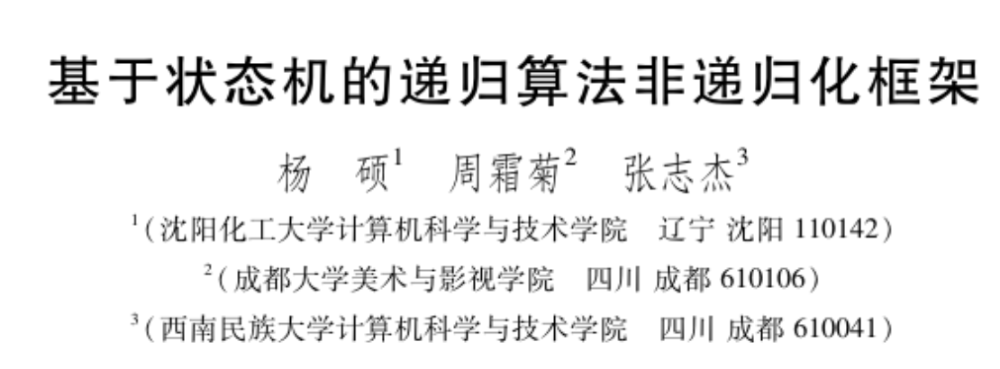
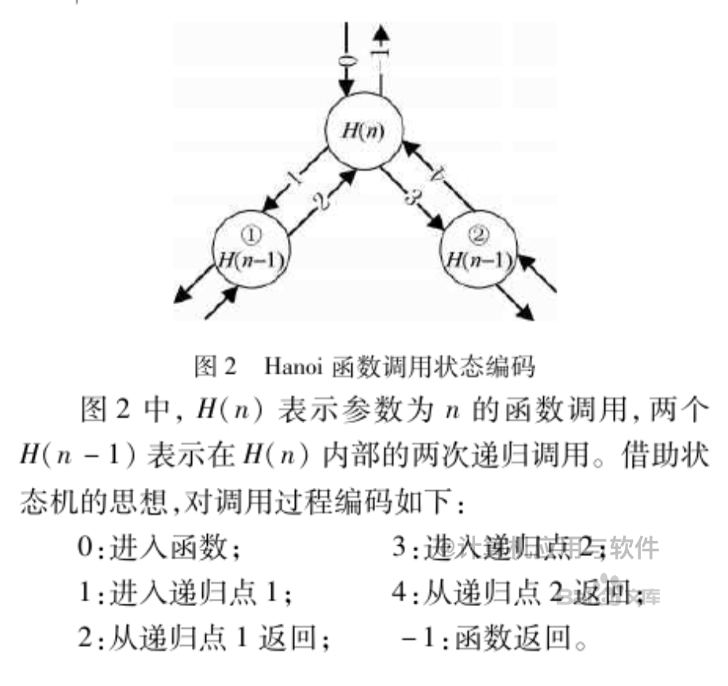
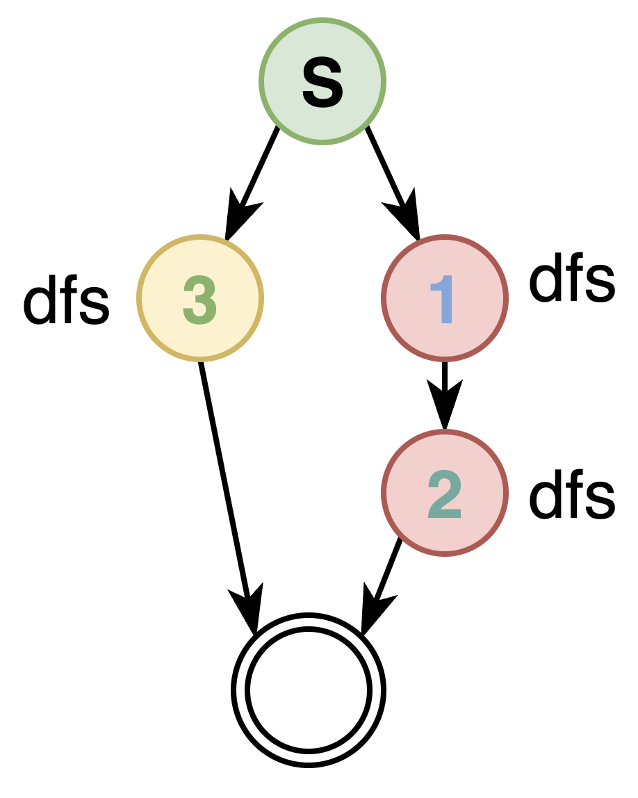

基于状态机的递归算法非递归化框架

将函数调用和返回过程看作是状态的转化，将递归过程模拟为进入函数，进入递归，退出递归等状态。

除此以外，还有 while-while，while-if 框架

函数调用的本质就是数据的入栈和出站过程，因此，可以利用栈模拟将任意递归程序非递归化。

有限状态机最早来自于硬件控制电路，复杂的逻辑拆解成几个稳定状态：通过转化条件来驱动流转，即：下一状态=<当前状态，条件>


以汉诺塔问题展示如何非递归化。

```CPP
void hanoi(int n,char x,char y,char z){
  if(n==1) move(x,1,z);     						// 状态 1. 递归停止条件 			
  else{
    hanoi(n-1,x,z,y);										// 状态 2. 递归点 1
    move(x,n,z);												// 状态 3. 语句 2
    hanoi(n-1,y,x,z);										// 状态 4. 递归点 2
  }
}
```



函数调用和退出函数是两个状态：考虑到外部对本函数的调用，以及内部的两个递归调用。一共有 6 个状态

```cpp
/*
* 算法 2
* 递归到非递归的框架
**/
// push 表示发生一次函数调用，并将参数和局部变量保存到栈
// pop 表示函数返回，state 表示不同的函数调用

push();
while(栈非空){
  if(达到递归停止条件){
  	pop();
  }else if(state==0){					// 进入函数
    state=1;
  }else if(state==1){					// 进入递归点 1
    state=2;
    push();
  }else if(state==2){					// 递归点 1 返回
    state=3;
  }else if(state==3){					// 进入递归点 2
    state=4;
    pop();
  }else if(state==4){					// 递归点 2 返回
    state=-1;
  }else if(state==-1){				// 退出函数
    pop();
  }
}
```

> 算法 2 是完整的非递归框架, 针具具体问题可以优化一些冗余的状态
>
> 规则 1,3 用于去除冗余. 规则 2 用于栈的设计. 规则 4 用于处理函数返回值
>
> > - 规则 1: 递归函数从最后一个递归调用点返回后,将退出递归函数或返回到上一层,因此,可以去除 `state==-1` 的状态,并将其合并到 `state==4` 处
> > - 规则 2: 栈的设计. 除了要保存状态外,根据函数调用流程,还需要保存 3 类参数和变量
> >   - 递归过程中发生变化的形参
> >   - 递归函数本身和递归点的返回值.
> >   - 递归函数中影响递归调用的局部变量
> > - 规则 3: 状态合并规则.   如果某个状态中没有发生递归函数调用(push)或退出(pop),那么,该动作可以跟下一个状态合并. 或者说,每个状态仅能包含一个 push 或 pop 操作,不包含 push 或 pop 的操作状态可以与下一个包含了 push 或 poop 的操作的状态合并
> > - 规则 4. 有返回值的递归函数,需要在栈中保存每个递归点以及递归函数本身的返回值. 令 re 为递归函数的返回值,从上级返回后会保存在 uptop.re 中,则在递归点 x 处接收该返回值的方式是 top.rex=uptop.re


```c++
/*
* 算法 3(通用框架)
* 使用规则 1 化简后的算法 2 如下
**/

push();
while(栈非空){
  if(达到递归停止条件){
  	pop();
  }else if(state==0){					// 进入函数
    state=1;
  }else if(state==1){					// 进入递归点 1
    state=2;
    push();
  }else if(state==2){					// 递归点 1 返回
    state=3;
  }else if(state==3){					// 进入递归点 2
    state=4;
    pop();
  }else if(state==4){					// 递归点 2 返回
    pop();										// 退出函数
  }
}
```


#### 常见算法的非递归化

##### 汉诺塔算法

根据规则 2,栈的设计如下:

- 发生变化的形成:                     $n,x,y,z$
- 函数返回值:                             无
- 影响递归调用的局部变量:      无

因此,最终的栈为

```cpp
struct {
  int state;
  int n;
  char x,y,z;
} stack[max_size];
int ptop=-1;							// 栈顶
// push 函数中,state 被自动初始化为 0
```

```cpp
/*
* 算法 4 非递归汉诺塔程序
*
**/
void hanoi(int n,char x,char y, char z){
  push(n,x,y,z);													// state 在 push 中默认初始化为 0
  while(!empty()){
    if(top.n==1){										// 递归停止条件
      move(x,1,z);									// 语句 1
      pop();												// 函数返回
    }else if(top.state==0){					// 进入函数					
      top.state=1;
    }else if(top.state==1){					// 进入递归点 1
      top.state=2;
      push(top.n-1,top.x,top.z,top.y);
    }else if(top.state==2){					// 递归点 1 返回
      top.state=3;
      move(x,n,z);									// 语句 2
    }else if(top.state==3){					// 进入递归点 2
      top.state=4;
      push(top.n-1,top.y,top.x,top.z);
    }else if(top.state==4){					// 递归点 2 返回
      pop();												// 函数返回
    }
  }
}
/*
* 语句 1 放在递归停止条件内.语句 2 在左枝返回后被执行,因此放在状态 2 这种.
* 另外,语句 2 也可以放在状态 3 中,此时,状态 2 仅做状态转移,并在下一个循环中直接跳到状态 3
* 因此,状态 2 变成了多余状态
* 类似的,状态 0 也是多余状态.
**/
```


```cpp
/*
* 算法 5
* 在算法 4 的基础上应用规则 3 合并状态
**/
void hanoi(int n,char x,char y, char z){
  push(n,x,y,z);										// state 在 push 中默认初始化为 0
  while(!empty()){
    if(top.n==1){										// 递归停止条件
      move(x,1,z);									// 语句 1
      pop();												// 函数返回
    }else if(top.state==0){					// 进入函数; 进入递归点 1			
      top.state=1;
      push(top.n-1,top.x,top.z,top.y);
    }else if(top.state==1){					// 递归点 1 返回 ;  进入递归点 2
      top.state=2;
      move(x,n,z);									// 语句 2			
      push(top.n-1,top.y,top.x,top.z);
    }else if(top.state==4){					// 递归点 2 返回
      pop();												// 函数返回
    }
  }
}
```


#### 带返回值的非递归化

```cpp
// 算法 6
int pnx(int n,int x){
  if(n==0) return 1;
  if(n==1) return 2*x;
  return 2*x*pnx(n-1,x)-2*(n-1)*pnx(n-2,x)
}
```


```cpp
// 算法 7
// 算法 6 中递归位于表达式中,先将递归点单独整理出来
// 
int pnx(int n,int x){
  int re,re1,re2;
  if(n==0) re= 1;					// 递归停止条件
  else if(n==1) re= 2*x;	// 递归停止条件
  else{
    re1=pnx(n-1,x);				// 语句 1,递归点 1
    re2=pnx(n-2,x);				// 语句 2,递归点 2
    re=re1*re2;						// 语句 3
  }
  return re;
}
```

根据规则 2,栈的设计如下:

- 发生变化的形参 n
- 函数返回值 re
- 局部变量 re1,re2

因此栈的设计如下

```cpp
struct {
  int state;
  int n;
  int re,re1,re2;
} stack[max_size];
```

非递归的程序如下

```cpp
int pnx(int n,int x){
  push(n);
  while(!empty()){
    if(top.n<=1){									// 递归停止条件
      if(top.n==0) top.re=1;			
      if(top.n==1) top.re=2*x;
      pop();										  // 函数返回
    }else if(top.state==0){
      top.state=1;								// 进入函数;进入递归点
      push(top.n-1);
    }else if(top.state==1){
      top.state=2;								// 递归点 1 返回;进入递归点 2
      top.re1=uptop.re;						// 语句 1
      push(top.n-2);
    }else if(top.state==2){				// 递归点 2 返回
      top.re2=uptop.re;						// 语句 2
      top.re=2*top.re1-2*(top.n-1)*top.re2;		// 语句 3
      pop();											// 函数返回
    }
  }
  return stack[0].re;
}
// 栈中保存了重第一次调用到当前递归点的完整路径,因此,可用通过 top 来接收递归点的返回值.
```


#### akman 函数(多递归点)非递归化

```cpp
int akm(int m,int n){
  int re,rer1;
  if(m==0) re=n+1;							// 递归停止条件
  else if (n==0) re=akm(m-1,1); // 语句 1,递归点 1
  else {
    re1=akm(m,n-1);							// 语句 2,递归点 2
    re=akm(m-1,re1);						// 语句 3,递归点 3
  }
  return re;
}
```



开始状态是 0,每个递归看作是一个节点. 绘制出节点的依赖关系

栈的设计:

- 发生变化的形参: m,n
- 函数返回值: re,re1
- 影响递归调用的局部变量: 无

```cpp
// 算法 10
// akm 算法的非递归化
int akm(int m,int n){
  push(m,n);
  while(!empty()){
    if(top.m==0){							// 递归停止条件
      top.re=top.n+1;
      pop();
    }else if(top.state==0){		// 进入函数
      if(top.n==0){						// 进入递归点 1
        top.state=3;
        push(top.m-1,1);
      }else{
        top.state=1;					// 进入递归点 2
        push(top.m,top.n-1);
      }
    }else if(top.state==1){		// 递归点 2 返回,进入递归点 3
      top.state=2;
      top.re1=uptop.re1;			// 语句 2
      push(top.m-1,top.re1);
    }else if(top.state==2 || top.state==3){	// 递归点 1,3 返回
      top.re=uptop.re;				// 语句 1,3
      pop();
    }
  }
  return stack[0].re;
}
```


#### N 皇后问题非递归化

```cpp
void n_queen(int r){
  if(r>=n) {							 // 递归停止条件
    print_method();
    sum++;
  } else {
    for(int i=0;i<n;i++){  // for 语句中, int i=0;i<n 是语句 1.  i++;i<n 是语句 4.
      x[r]=i;							 // 语句 2
      if(place(r))
        n_queen(r+1);			 // 语句 3,递归点 1
    }
  }
}
```

栈的设计:

- 发生变化的形参: r
- 函数返回值: 无
- 影响递归调用的局部变量: i

```cpp
// 算法 12
void n_queen(int r){
  push(r);									// i 在 push 时被初始化为 0
  while(!empty()){					// 递归停止条件
    if(top.r>=n){
      print_method();
      sum++;
      pop();
    } else if (top.state==0){	// 进入函数
      top.i=0;							  // 语句 1
      if(top.i<n) top.state=1;// 语句 1
      else pop();
    }else if(top.state==1){		// 进入递归点 1
      top.state=2;
      x[top.r]=top.i;					// 语句 2
      if(place(top.r)) push(top.r+1); // 语句 3
    }else if(top.state==2){		// 递归点 1 返回
      top.i+=1;								// 语句 4
      if(top.i<n) top.state=1;// 语句 4
      else pop();
    }
  }
}
// 在递归算法 11 中,for 语句的 i<n 在首次进入和递归点 1 返回均会执行,因此,将 i<n 同时放在状态 0,状态 2 中
```


#### prem 算法的非递归化

```cpp
void perm(int list[],int k,int m){
  if(k==m) print_list(list,m);			// 递归停止条件
  else {
    for(int i=k;i<=m;i++){
      // for 语句中, int i=k;i<m 是语句 1.  i++;i<m 是语句 4.
      swap(list[i],list[k]);	// 语句 2
      perm(list,k+1,m);				// 递归点 1
      swap(list[i],list[k]);	// 语句 3
    }
  }
}
```

栈的设计:

- 发生变化的形参: k
- 返回返回值: 无
- 影响递归调用的局部变量: i

```c++
void perm(int list[],int k,int m){
  push(k);
  while(!empty()){		
    if(top.k==m){		// 递归停止条件
      print_list(list,m);
      pop();
    }else if(top.state==0){				// 进入函数
      top.i=top.k;								// 语句 1
      if(top.i<=m) top.state=1;		// 语句 1
      else pop();
    }else if(top.state==1){				// 进入递归点 1
      top.state=2;
      swap(list[top.i],list[top.k]);	// 语句 2
      push(top.k+1);
    }else if(top.state==2){					// 递归点 1 返回
      swap(list[top.i],list[top.k]);// 语句 3
      top.i+=1;											// 语句 4
      if(top.i<=m) top.state=1;			// 语句 4
      else pop();
    }
  }
}
```


#### 二叉树的遍历

```cpp
// 算法 15.
// 二叉树的后序遍历
void tree_LRN(tree T){
  push(T);
  while(!empty()){
    if(top.T==nullptr) pop();			// 递归停止条件
    else if(top.state==0){				// 进入函数,进入递归点 1
      top.state=1;								// 语句 1 放这里就是先序遍历
      push(top.T->left);
    }else if(top.state==1){				// 递归点 1 返回进入递归点 2
      top.state=2;								// 语句 1 放这里就是中序遍历
      push(top.T->right);
    }else if(top.state==2){				// 递归点 2 返回
      print(T);										// 语句 1 放这里就是后续遍历
      pop();
    }
  }
}
```


