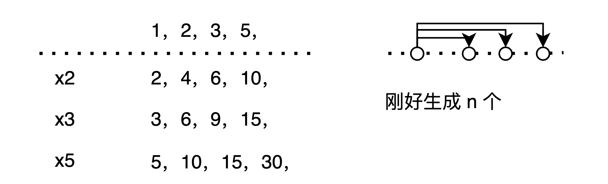

```cpp
/*

超级丑数

输入：n = 12, primes = [2,7,13,19]
输出：32
解释：给定长度为 4 的质数数组 primes = [2,7,13,19]，
前 12 个超级丑数序列为：[1,2,4,7,8,13,14,16,19,26,28,32] 。
*/
int nthSuperUglyNumber(int n, vector<int> &primes) {
  auto data = vector<vector<int>>(primes.size(), vector<int>(n, 1));
  auto ans = vector<int>(n + 1, 1);

  auto index = vector<int>(primes.size(), 0);
  // 当前问题和子问题是交替求解的
  // 子问题依赖当前问题. 当前问题依赖于子问题
  // 正常见的 dp 似乎都是单向依赖的
  // 也不能这么说. 下一个问题和当前问题能够转化到哪里没关系.
  // 而是与子问题的历史求解有关系
  //
  // 对.当前的直接转化不是 next 问题.
  // f(n) 和 f(n+1) 没啥因果关系.
  // f(n+1) 和 全体 f(i) 有关系.
  // 对于这个题来说,是对部分 f(i) 有关系
  for (int i = 0; i < n; i++) {
    // 求用于归并的数据
    for (int j = 0; j < primes.size(); j++) {
      data[j][i] = ans[i] * primes[j];
    }

    // 一次归并逻辑
    auto mm = INT_MAX;
    for (int i = 0; i < primes.size(); i++) {
      auto c = data[i][index[i]];
      mm = min(c, mm);
    }

    for (int i = 0; i < primes.size(); i++) {
      auto c = data[i][index[i]];
      if (c == mm) {
        index[i]++;
      }
    }

    ans[i + 1] = mm;
  }

  return ans[n - 1];
}
// 上面的算法和标准算法的核心上是一样的. 不同的是 data 实际上不用算.
// 每次动态计算就行了

```


假设现在判断的是 [2,3,5] 的丑数

这个问题的难点在于子问题和下一个问题没有严格的绑定关系.

无论是从 N+1 到 N, 还是从 N到 N+1 都没有一个一致性的地推关系.




不过, 这个题也印证了找递归关系是大致正确的:


首先梳理了所有解的特征. 即要不是 x2 得到的, 要不就是 x3, x5 得到的.

即,上图的一个反向映射.   f(n)  <= f(n-1) , 后来发现, 这样没法定位 f(n) 具体由 `(x2,x3,x5)`哪里获得.

于是陷入了一个困境.


现在想一下, 其实就是构造了 3 个列表, 求一个 3 个有序数组的合并.

不同的是, 3 个列表不是一次性求出来的.  合并后的结果也不是一次求完的.

而是, 交替求的.


其实, 这个实际上是构造了两个问题.

A: 一个是 输出丑数的序列.

B:一个是 x2,x3,x5 构成的丑数数列.


A 问题用 B 问题的子问题求解. B 问题用 A 的子问题求解

nice , 理清楚了.


