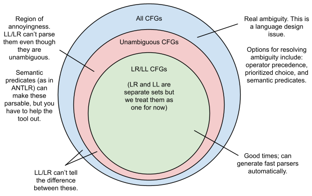

原文链接: https://blog.reverberate.org/2013/09/ll-and-lr-in-context-why-parsing-tools.html


在我上一篇博客文章中，[LL和LR解析揭秘](http://blog.reverberate.org/2013/07/ll-and-lr-parsing-demystified.html)，我们从黑盒的角度探索了LL和LR解析器。我们得出了这些解析器的模型，其中它们的输入和输出都是令牌流，解析器根据波兰语和反向波兰符号酌情插入规则。

在未来的文章中，我想更密切地关注LL和LR算法的细节，但我意识到我应该首先缩小，并给出一些动力，说明为什么有人应该首先关心LL或LR。

当我写这篇文章时，它变成了对“为什么解析很难？”这个问题的回答。或者“为什么每个人都不使用解析器生成器？”LL和LR解析理论在《[编译器：原理、技术和工具](http://www.amazon.com/Compilers-Principles-Techniques-Tools-Edition/dp/0321486811)》（被称为“龙书”，用于许多大学编译器课程中）等书中教授，但后来人们毕业后发现现实世界中的大多数解析器不是这样的。给予什么？这篇文章是我对这个问题的回答。


# 理论与实践

LL和LR解析理论已有近50年的历史：Knuth首次定义LR（k）的[关于语言从左到右翻译的](http://www.cs.dartmouth.edu/~mckeeman/cs48/mxcom/doc/knuth65.pdf)论文于1965年出版。这只是数量惊人的关于解析和语言理论的数学导向论文之一。在过去的50年里，学者们精力充沛地探索了解析的数学维度，但该领域远未尽；即使在过去的五年里，我们也看到了一些全新的重要成果发表。该领域最好的调查之一是《[解析技术：实用指南](http://dickgrune.com/Books/PTAPG_2nd_Edition/)》一书，其[参考书目](http://dickgrune.com/Books/PTAPG_2nd_Edition/Additional.html)包含1700多篇引用的论文！

尽管有如此庞大的理论知识，但当今生产系统中的解析器很少有是该理论的教科书案例。许多人选择完全不基于任何形式主义的手写解析器。语言规范通常以BNF这样的形式主义来定义，但几乎永远无法直接从这种形式主义中生成真正的解析器。[GCC从基于野牛的解析器转移到手写的递归下降解析器](http://gcc.gnu.org/wiki/New_C_Parser)。[Go也是如此](https://www.reddit.com/r/golang/comments/46bd5h/ama_we_are_the_go_contributors_ask_us_anything/d03zx6f)。虽然一些著名的语言实现确实使用Bison（如Ruby和PHP），但许多人选择不使用。

为什么理论和实践之间存在分歧？虽然指责对文献的无知很诱人，但很难解释为什么GCC会*离开*LR解析器。

我认为可以肯定地说，事实证明，*纯粹的*LL和LR解析器在很大程度上不足以用于现实世界的用例。正如我们将看到的，您自然为现实世界用例编写的许多语法都不是LL或LR。两个最受欢迎的基于LL和LR的解析工具（分别为ANTLR和Bison）都以各种方式扩展了纯LL和LR算法，增加了运算符优先级、语法/语义谓词、可选回溯和广义解析等功能。

但即使是目前可用的进化工具有时也会短缺，并且仍在不断发展以解决[解析器发电机的传统痛点](http://mortoray.com/2012/07/20/why-i-dont-use-a-parser-generator/)。ANTLR v4完全重新设计了其解析算法，以使用一种名为[ALL(*)](http://antlr.org/papers/allstar-techreport.pdf)的新算法来提高与ANTLR v3的易用性。Bison正在试验[IELR](http://people.cs.clemson.edu/~malloy/papers/sac08/paper.pdf)，这是2008年出版的LALR的替代品，旨在扩大它能够接受和高效解析的语法数量。有些人探索了LL/LR的替代方案，如解析表达语法（PEG），试图以完全不同的方式解决这些痛点。

这是否意味着LL和LR已经过时？远非。虽然*纯粹的*LL和LR确实在几个方面都很短，但这些算法可以以保留其优势的方式进行扩展，就像多范式编程语言可以提供命令式、功能和面向对象的编程风格一样。我坚信，随着解析器工具随着更好的工具、更好的错误报告、更好的可视化、更好的语言集成等不断改进，它们将成为您今天获得正则表达式时容易获得的东西。这个空间有很多改进的余地，我想帮助实现这一点（我提出的项目[《瞪羚》](http://www.gazelle-parser.org/)是我迄今为止投入努力的地方，我打算做更多事情）。但我离题了。

LL和LR解析器有一些无可争议的优势。它们是周围最有效的解析算法。他们提前执行的语法分析可以告诉你关于语法的重要事情，正确可视化可以帮助您捕捉错误，就像[regexper](http://www.regexper.com/)等正则表达式可视化工具一样。它们在解析时提供了一些最早和最好的语法错误错误报告（这与您在*语法分析*时可能获得的移位/减少和减少/减少错误是分开的）。

即使您不喜欢LL和LR的实用性，了解它们将帮助您更好地了解您最喜欢的解析方法与LL/LR相比做出的权衡。LL/LR的替代品通常被迫放弃LL/LR的一些至少一个优势。

# 澄清“LL解析器”和“LR解析器”

“LL解析器”和“LR解析器”实际上根本不是特定的算法，而是指代算法*家族*的通用术语。您可能见过LR（k）、“full LL”、“LALR（1）、SLR、LL(*）等名称；这些是属于“LL解析器”或“LR解析器”类别的特定算法（或同一算法的变体，取决于您如何看待它）。这些变体在它们可以处理的语法以及由此产生的解析自动机有多大方面有不同的权衡，但它们具有一组共同的特征。

LL和LR解析器*通常*（但并不总是）涉及两个独立的步骤：提前执行的语法分析步骤和在解析时运行的实际解析器。如果可以的话，语法分析会构建一个自动机，否则语法会被拒绝，因为不是LALR/SLL/SLR/什么的。一旦自动机构建起来，解析步骤就会简单得多，因为自动机对语法结构进行编码，这样如何处理每个输入令牌就是一个简单的决定。

那么，使解析器成为LL解析器或LR解析器的显著特征是什么？我们将用一对定义来回答这个问题。如果这些定义对你来说毫无意义，请不要担心；文章的其余部分都致力于解释它们。这些定义没有在文献中给出，因为它们是非正式术语，但它们对应于（例如）查看维基百科页面“LL解析器”或“LR解析器”的一般用法。

**LL解析器**是上下文无关语法的确定性、规范的自上而下的解析器。

**LR解析器**是上下文无关语法的确定性、规范的自下而上的解析器。

任何符合这些定义的解析器都是LL或LR解析器。LL和LR的优势和劣势都概括在这些定义中。

请注意，并非每个名称中带有“LR”或“LL”的解析器实际上都是LR或LL解析器。例如，GLR、LR（k、∞）和分区LL（k）都是解析实际上不是LL或LR的算法的例子；它们是LL或LR算法的变体，但放弃了一个或多个基本的LL/LR属性。

我们现在将更深入地探讨这些定义的关键部分。

# 无上下文语法：强大，但不是全能的

LL和LR解析器使用*上下文无关语法*作为指定正式语言的方式。大多数程序员都见过这种或那种形式的上下文无关语法，可能是[BNF](https://en.wikipedia.org/wiki/Backus–Naur_Form)或[EBNF](https://en.wikipedia.org/wiki/Extended_Backus–Naur_Form)的形式。一种名为[ABNF](https://en.wikipedia.org/wiki/Augmented_Backus–Naur_Form)的紧密变体用于RFC中的协议文档。

一方面，CFG真的很好，因为它们与程序员对语言的看法相匹配。RFC使用类似CFG的抽象来编写文档，这一事实说明了上下文无关语法是多么的可读性。

这是我上一篇文章中的JSON上下文无关语法：

```
object → '{' pairs '}'

pairs → pair pairs_tail | ε
pair → STRING ':' value
pairs_tail → ',' pairs | ε

value → STRING | NUMBER | 'true' | 'false' | 'null' | object | array
array → '[' elements ']'

elements → value elements_tail | ε
elements_tail → ',' elements | ε
```

这读起来太直观了，我甚至懒得解释它。物体是一群被卷曲括号包围的一对。“对”要么是一对，后跟一对tail，要么是空的。它读起来真的很好。

上下文无关语法不仅告诉我们给定字符串是否根据语言有效，还定义了任何有效字符串的树结构。正是树结构帮助我们弄清楚字符串的实际*含义*，这可以说是解析中最重要的部分（一个只说“是的，这是一个有效的程序”的编译器不会非常有用）。因此，编写CFG确实有助于我们解析和分析语言。

另一方面，上下文无关的语法可能会令人沮丧，原因有两个相关：

1. 当直观地编写CFG时，你通常最终会遇到一些模棱两可的东西。
2. 当直观地编写CFG时，您通常最终会遇到一些明确但无法被LL或LR算法解析的东西。

虽然第二个问题是LL/LR的“错误”，但第一个问题只是设计形式语言的固有挑战。让我们先谈谈模棱两可。

# CFG的模糊性

如果语法模棱两可，这意味着至少有一个字符串可以有多个有效的解析树。这是语言设计中一个真正的问题，因为两个有效的解析树几乎肯定具有不同的*语义*含义。如果两者都根据您的语法有效，您的用户无法知道预期哪个含义。

最简单和最常见的例子是算术表达式。写语法的直观方式类似于：

```
expr → expr '+' expr |
       expr '-' expr |
       expr '*' expr |
       expr '/' expr |
       expr '^' expr |
       - expr |
       NUMBER
```

但这种语法非常模糊，因为它没有抓住优先级和关联性的标准规则。如果没有这些规则来消除歧义，像`1+2*3-4^5`这样的字符串具有指数级的有效的解析树，所有这些树都具有不同的含义。

可以重写这个来捕捉优先级和关联性规则：

```
expr → expr '+' term |
       expr '-' term |
       term

term → term '*' factor |
       term '/' factor |
       factor

factor → '-' factor |
         prim

prim → NUMBER |
       NUMBER '^' prim
```

现在我们有一个明确的语法，编码优先级和关联性规则，但阅读语法这些规则一点也不容易或不言而喻。例如，乍一看，*除了*右关联的指数（^）外，这个语法中的所有运算符当然都与左关联。用这种风格写语法并不容易；我有相当多的语法写作经验，但我仍然必须放慢速度，小心谨慎（如果不测试，我甚至不能100%相信我做对了）。

非常不幸的是，文本解析的第一个也是最常见的用例之一是纯上下文无关语法非常糟糕的案例。难怪当看起来应该如此简单的事情最终变得如此复杂时，人们可能会关闭基于CFG的工具。这尤其令人遗憾，因为其他非CFG解析技术，如[分流场算法](http://en.wikipedia.org/wiki/Shunting-yard_algorithm)非常擅长这种运算符优先级解析。这显然是CFG和*纯*LL/LR让我们失望的最明显的例子之一。

实际语法歧义的另一个著名例子是[悬垂的其他问题](http://en.wikipedia.org/wiki/Dangling_else)。对于没有“endif”语句的语言，这意味着什么？

```
if a then if b then s else s2

// Ambiguity: which of these is meant?
if a then (if b then s) else s2
if a then (if b then s else s2)
```

与算术表达式不同，没有标准的优先级/关联性规则来告诉我们这些解释中哪一个是“正确的”。这里的选择几乎是武断的。任何具有这种结构的语言都必须告诉用户哪种含义是正确的。这里的语法模糊是我们的语言有一个令人困惑的情况的*症状*。

模棱两可的最后一个例子，这个来自C和C++。这被称为类型/变量歧义。

```
  // What does this mean?
  x * y;
```

正确的答案是，这取决于`x`之前是否被声明为带有`typedef`的类型。如果`x`是一个类型，那么该行声明一个名为`y`的指向`x`的指针。如果`x`不是类型，那么这条线乘以`x`和`y`并扔掉结果。这个问题的传统解决方案是允许lexer访问符号表，以便它可以lex与常规变量不同的类型名称；这被称为[lexer黑客](https://en.wikipedia.org/wiki/The_lexer_hack)。（虽然这在一篇关于解析器的文章中似乎不正确，但同样的模糊性在C++中表现得非常模糊，不能轻易局限于lexer）。

换句话说，这种模糊性是根据声明的语义上下文来解决的。人们有时将此称为“上下文敏感”（如文章[《C语法的上下文敏感性](http://eli.thegreenplace.net/2007/11/24/the-context-sensitivity-of-cs-grammar/)》，但[上下文敏感语法](http://en.wikipedia.org/wiki/Context-sensitive_grammar)是一个非常具体的术语，在[乔姆斯基](http://en.wikipedia.org/wiki/Chomsky_hierarchy)语言[等级制度中](http://en.wikipedia.org/wiki/Chomsky_hierarchy)具有数学意义。Chomsky的定义指的是*语法*上下文敏感性，这在计算机语言中几乎从未出现过。正因为如此，最好澄清我们正在谈论*语义*语境敏感性，这是完全不同的事情。

关于语义上下文敏感性的一个关键点是，你需要一种图灵完整的语言来正确消除模棱两可的替代方案之间的歧义。这对解析器生成器工具来说意味着，除非您允许用户用图灵完整的语言编写任意消歧义代码片段，否则实际上不可能正确解析此类语言。单独的数学形式主义（不是CFG，不是PEG，也不是运算符语法）都不足以表达这些语言。这是理论和实践分歧的一个非常值得注意的案例。

在ANTLR等工具中，这些明确无误的代码片段被称为“语义谓词”。例如，为了消除类型/变量歧义，每当看到“typedef”时，您需要编写代码来构建/维护符号表，然后使用谓词来查看符号是否在表中。

# 处理CFG中的歧义

无论使用什么解析策略，语言设计师都必须意识到并直接面对语言中的任何歧义。如果可能的话，最好的主意往往是改变语言，以避免歧义。例如，如今大多数语言都没有悬垂的其他问题，因为“if”语句有一个明确的结尾（“endif”关键字或围绕“else”子句中语句的括号）。

如果设计师不能或不想消除歧义，他们必须决定打算采用哪种含义，适当实施歧义解决方案，并将此决定传达给用户。

但要面对模棱两可之处，你必须首先了解它们。不幸的是，这说起来容易做起来难。关于语法（CFG和其他形式主义，如PEG）的巨大遗憾之一是，您可能想问的关于它们的许多有用问题是*不可判定的*（如果您没有研究过计算理论，“不可判定”的粗略近似值是“无法计算”）。不幸的是，确定上下文无关语法是否模棱两可是这些不可决定的问题之一。

如果无法*先验*地计算语法是否模棱两可，我们如何意识到模棱两可并解决它们？

一种方法是使用可以处理模糊语法的解析算法（例如GLR）。这些算法可以处理任何语法和任何输入字符串，并且可以在解析时检测输入字符串是否模糊。如果检测到歧义，它们可以产生所有有效的解析树，用户可以以他们认为合适的方式消除它们之间的歧义。

但有了这种策略，在野外看到模棱两可的字符串之前，你不会了解歧义。你永远无法*确定*你的语法是明确的，因为你可能总是没有看到正确的模棱两可的字符串。几年后，你才能发现你的语法一直存在未知的模糊性。这实际上可以在现实世界中发生；直到该语言已经在技术报告中发表之前，人们才发现ALGOL 60存在“悬垂”问题。

另一种策略是完全放弃上下文无关语法，并使用形式主义，如[解析表达语法](http://en.wikipedia.org/wiki/Parsing_expression_grammar)，其定义明确。解析表达语法通过强制根据*优先*选择定义所有语法规则来避免歧义，因此在多个语法规则与输入匹配的情况下，第一个规则*的定义*是正确的。

```
// PEG solution of the if/else ambiguity:
stmt <- "if" cond "then" stmt "else" stmt /
        "if" cond "then" stmt /
        ...
```

优先选择是解决一些歧义的绝佳工具；它非常适合解决悬垂的其他问题。但是，虽然这给了我们*解决歧义*的工具，但它并没有解决*寻找歧义*的问题。PEG中的每条规则都必须根据优先选择来定义，这意味着每条PEG规则都可能隐藏着“概念”的模糊性：

```
// Is this PEG rule equivalent to a <- c / b ?
a <- b / c

// We can't know (it's undecidable in general),
// so every rule could be hiding an ambiguity we don't know about.
```

我称之为“概念性”歧义，因为尽管基于PEG的工具不认为这模棱两可，但用户看来它仍然模棱两可。另一种思考方式是，你已经解决了歧义，却从未意识到存在歧义，从而剥夺了你思考它并有意识地选择如何解决它的机会。优先选择不会让悬垂的其他问题消失，它只是隐藏了它。用户仍然看到一种可以以两种不同方式解释的语言结构，用户仍然需要被告知解析器将选择哪个选项。

优先选择还要求每次都以相同的方式解决歧义；它不能容纳由语义信息解决的C/C++变量/类型歧义等情况。

与GLR不同，Packrat解析（解析PEG的线性时间算法）即使在解析时也不会告诉你输入字符串是否模糊。因此，使用基于Packrat解析的策略，你真的对语法中是否存在“概念性”模糊性视而不见。PEG的完整替代品或规则也可能无法实现（有关此的更多讨论见[此处](http://article.gmane.org/gmane.comp.parsers.peg.general/2)）。最终结果是，有了PEG，你对语法属性知之甚少。

到目前为止，我们讨论的任何选项实际上都无法帮助我们预先找到歧义。当然，只要语法不是太疯狂，一定有一种方法可以提前分析我们的语法，并证明它不是模棱两可的？确实有，但答案让我们回到了我们开始的地方：LL和LR解析器。

事实证明，仅仅试图为语法构建LR解析器几乎是我们所知道的CFG最强大的模糊性测试。我们知道这不可能是一个完美的测试，因为我们已经说过，测试模糊性是不可决定的。如果语法不是LR，我们不知道它是否模棱两可。但*我们可以*构建LR解析器的每个语法都保证是明确的，作为奖励，您还可以获得一个高效的线性时间解析器。

但是等等，还有更多。让我们回顾一下我们遇到的三种歧义以及解决每种模棱两可的最自然的解决方案：

1. *算术表达式*：理想的解决方案是能够**直接声明优先级/关联性**，而不必在语法层面解决它。
2. *悬而未決*：因为这可以通过始终偏爱一种选择而不是另一种选择来解决，理想的解决方案是**优先选择**。这种情况的另一个例子是C++的[“最令人烦恼的解析](http://en.wikipedia.org/wiki/Most_vexing_parse)”，同样可以通过在两者都有效时简单地更喜欢一种解释而不是另一种解释来解决。
3. *类型/变量歧义*：唯一真正的解决方案是允许图灵完全**语义谓词**解决歧义。C++有一个更极端的版本，因为类型/变量消歧义可能需要任意数量的模板实例化，因此仅仅*解析*C++在技术上是不可决定的（！！），除非你限制模板实例化深度——[这里有更多血腥的细节和一个例子](http://yosefk.com/c++fqa/web-vs-c++.html#misfeature-3)。

好消息是，这三种模糊分辨率策略在某种程度上都可以纳入基于LL或LR的解析器生成器。虽然*纯粹的*LL或LR仅支持上下文无关语法，但完全可以为此类工具添加运算符优先级、优先选择*和*语义谓词，但会受到一些限制。我把这比为多范式编程语言。正如支持程序、OO和功能风格的语言比只提供一种语言更强大、更有表现力一样，CFG+优先级+谓词工具也比只支持CFG的工具更强大。

我们可以用这张文图总结所有这些信息：




为了更充分地了解LL/LR语法分析如何证明语法是明确的（以及我们如何为它们添加非CFG功能，如优先选择），我们将探索确定性解析器的概念。

# 确定性解析器

在不涉及太多细节的情况下，*确定性解析*器是通过构建确定性自动机来工作的解析器（这与正则表达式的自动机理论密切相关，除了解析自动机也有一个堆栈）。这意味着当解析器从左到右读取令牌时，它总是处于一种特定状态，每个令牌都会将其转换为另一个状态。

更非正式地说，我们可以说，确定性解析器是一个不需要做任何猜测或搜索的人。ANTLR的作者Terence Parr经常使用解析作为迷宫的比喻；在迷宫的每个叉子上，确定性解析器总是知道第一次使用哪个叉子。它可能会“向前看”做出决定，但它永远不会做出决定，然后备份（“备份”的解析器被称为“回溯解析器”，并具有指数级的最坏情况运行时间）。

这种决定论实际上是赋予LL/LR优点和缺点的决定性特征。它们是最快的算法，因为它们只是在转换状态机。它们不仅速度快，而且速度快：它们具有*最坏的*O（n）性能。NFA（非确定性有限自动机）或回溯解析器等一些方法在常见情况下表现良好，但在退化的情况下可能会严重（甚至指数级）退化。许多流行的正则表达式引擎都有这个问题（例如，请参阅文章[正则表达式匹配可以简单快捷](https://swtch.com/~rsc/regexp/regexp1.html)）。您可能会认为这些糟糕的案例并不常见，但任何想要DoS攻击您的服务的人都可以找到并利用它们。

除了速度快外，你还可以知道LL/LR语法是明确的，因为模棱两可的语法不允许你构建确定性自动机。要构建自动机，您必须能够证明，对于每个语法状态和每个输入令牌，您只能通过该令牌走一条有效的语法路径。Bison“转移/减少”或“减少/减少”冲突是野牛无法使解析器确定性的案例，因为同一代币的两个状态转换都是有效的。但Bison无法证明这是否是因为语法模糊（在这种情况下，两种过渡最终都可能导致成功的解析），或者这是否是一个不是LR的明确语法（在这种情况下，其中一条路径最终会陷入死胡同。

像GLR和GLL这样的“广义解析”算法可以处理任何语法，因为它们只是同时走两条路径。如果其中一条路径遇到了死胡同，那么我们又回到了一条明确的字符串。但是，如果多个路径都有效，我们有一个模棱两可的字符串，解析器可以为您提供*所有*有效的解析树。

这也为我们提供了如何扩展纯LL/LR算法的额外功能。任何我们可以想到的确定哪条道路是“正确”的方法都是公平的游戏！事实证明，运算符优先级声明可以提供一种解决LR解析器中移位/减少和减少/减少冲突的方法，[Bison以其优先级功能支持这一点](http://www.gnu.org/software/bison/manual/html_node/Precedence.html#Precedence)。在某些情况下，优先选择还可以为我们提供足够的信息，通过确定其中一条路径是正确的来解决不确定性，因为它具有更高的优先级。当所有其他方法都失败时，如果我们能编写自己在解析时运行的谓词，我们可以编写任意逻辑，使用我们可能想要决定哪条路径是正确的任何其他标准。

# 结论：那么为什么解析工具很难呢？

鉴于这一切，我们最初问题的答案是什么？为什么解析工具很难？我认为有两组原因：一些*固有*的原因和一些原因只是当前解析工具的弱点，可以改进。

解析工具的*固有*原因很难与模棱两可有关。更具体地说：

1. 输入语法可能模棱两可，但我们无法有力地检查这一点，因为它是不可决定的。
2. 我们可以使用确定性（LL/LR）解析算法：这为我们提供了快速解析器和证明语法是明确无误的证明。但不幸的是，任何确定性解析算法都无法处理所有明确的语法。因此，在某些情况下，我们被迫调整语法并调试任何非确定性。
3. 我们可以使用像GLL或GLR这样的广义解析算法，可以处理所有语法（甚至模棱两可的语法），但由于（1）我们无法确定语法是否模棱两可。通过这种策略，我们必须始终准备好在解析时获得多个有效的解析树。如果我们不知道这种歧义，我们可能不知道该如何消除歧义。
4. 我们可以使用像解析表达语法这样的形式主义来定义歧义——这将始终给我们一个独特的解析树，但仍然可以隐藏“概念”歧义。
5. 一些现实世界的歧义无法在语法层面解决，因为它们具有语义上下文敏感性。要解析这些语言，*必须*有一种方法将任意逻辑嵌入到解析器中以消除歧义。

虽然这一切可能看起来都很烦人，但歧义是一个真正的语言设计问题，任何设计语言或实现解析器的人都受益于获得关于歧义的早期预警。换句话说，虽然LL和LR工具并不完美，但它们的一些痛苦只是来自*解析*和*语言设计*复杂的事实。虽然滚动自己的解析器将使您免受解析器生成器的错误消息，但它也将防止您了解您可能无意中设计到您的语言中的歧义。

解析工具很难的其他原因是可以现实地改进的东西。这些工具可以受益于更大的灵活性、更可重复使用的语法、更好的编写语言的能力等。这就是机会所在。


