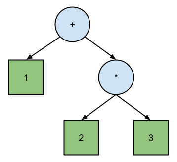
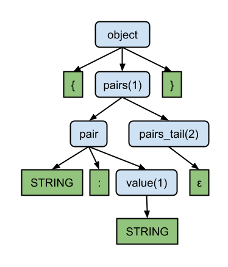
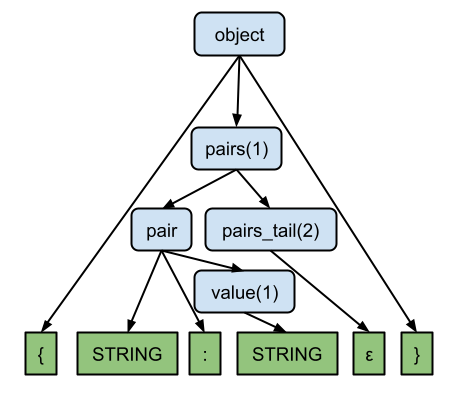
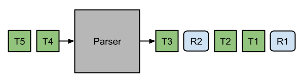
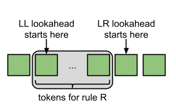
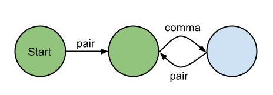

原文链接: https://blog.reverberate.org/2013/07/ll-and-lr-parsing-demystified.html


我在解析理论方面的第一次冒险是在大学里独立学习编程语言时。当我谈到LL、LR等算法及其许多变体（Strong-LL、SLR、LALR等）的部分时，我很着迷。我觉得我正在凝视一些深刻而有力的咒语，这些咒语的意义我还无法欣赏，但我确信有一天，“从左到右，最右推导”这样的术语会非常有意义，我期待着实现这种启蒙。

我现在可以说，10年后，一整套解析书，我非常了解这些算法。但我对他们的看法与我发现的任何文献都完全不同。我认为更多的是实现，而不是数学视角，这可能与它有关。无论如何，我想解释一下我对这些算法的看法；希望有些人会像我一样发现这种观点直观。

本文只会从黑盒的角度解决解析器：其输入/输出是什么，其约束是什么？未来计划中的一篇文章将打开黑匣子，了解有关这些算法内部运作的更多详细信息。

# 解析和波兰符号

如果你在大学学习计算机科学，或者曾经拥有过惠普计算器，你可能会遇到波兰语和反向波兰符号。这些是编写不需要括号或操作顺序规则的数学表达式的方法。我们习惯于将表达式写成中缀，其中运算符位于操作数之间：

```python
  1 + 2 * 3
```

在这种情况下，你怎么知道按什么顺序进行操作？你必须遵循传统规则（PEDMAS），如果你想要不同的顺序，你必须使用括号，比如：

```python
  (1 + 2) * 3
```

波兰语和反向波兰语符号允许您编写这些表达式，而无需任意的操作顺序规则或括号来消除歧义。他们通过将运算符放在操作符之前（波兰语）或之后（反向波兰语）来工作。这些也被称为前缀和后缀符号。

```c
  // First example:
  1 + 2 * 3  // Infix
  + 1 * 2 3  // Polish (prefix)
  1 2 3 * +  // Reverse Polish (postfix)

  // Second example:
  (1 + 2) * 3  // Infix
  * + 1 2 3    // Polish (prefix)
  1 2 + 3 *    // Reverse Polish (postfix)
```

除了不需要括号或定义的操作顺序外，波兰语和反向波兰语更容易编写评估员（也许惠普计算器的设计师决定使用反向波兰语，这样他们可以在巴哈马呆一周）。这是Python中一个简单的反向波兰评估器。

```python
# Functions that define the operators and how to evaluate them.
# This example assumes binary operators, but this is easy to extend.
ops = {
  "+": (lambda a, b: a + b),
  "-": (lambda a, b: a - b)
}

def eval(tokens):
  stack = []

  for token in tokens:
    if token in ops:
      arg2 = stack.pop()
      arg1 = stack.pop()
      result = ops[token](arg1, arg2)
      stack.append(result)
    else:
      stack.append(int(token))

  return stack.pop()

print "Result:",  eval("7 2 3 + -".split())
```

通常描述的波兰语和反向波兰符号确实要求所有运营商都具有已知的*arity*。Arity只是运算符接受的操作数。例如，这意味着一元减号需要是与减法不同的算子。否则，当我们看到运算符时，我们不知道要从堆栈中弹出多少操作数。

避免这个问题的类似公式类似于Lisp的s表达式。S表达式（以及XML等类似编码）通过明确标记每个表达式的开头和结尾来避免对固定运算符的确定性的需求：

```lisp
  ; Lisp-style prefix notation; the same operator can be used
  ; for different numbers of arguments.
  (+ 1 2)
  (+ 1 2 3 4 5)

  ; Lisp equivalents of our first two examples:
  ; Prefix: + 1 * 2 3
  (+ 1 (* 2 3))

  ; Prefix: * + 1 2 3
  (* (+ 1 2) 3)
```

这个变体的权衡略有不同（我们用固定的真数换取所需的括号），但解析/处理这些的底层算法非常相似，因此一般来说，我们会认为这是前缀符号的次要变体。

看起来我可能偏离了主题，但我一直在偷偷摸摸地谈论LL和LR。在我看来，波兰语和反向波兰语符号分别与LL和LR解析直接对应。但要充分探索这个想法，我们首先需要描述我们期望从解析器那里得到什么样的输出。

*为了进行有趣的练习，请尝试实现将波兰语转换为反向波兰符号的算法。看看你是否可以先将整个表达式构建成树；你可以单独用堆栈来做。现在说你想做相反的事情（反向波兰语到波兰语）——你可以在输入上运行相同的算法，但要向后！当然，你也可以构建一个中间树，但这需要O（输入长度）空间，而仅堆栈的解决方案只需要O（树深度）空间。去fix to postfix怎么样？有一种非常聪明和高效的算法，称为[分流场算法](http://en.wikipedia.org/wiki/Shunting-yard_algorithm)。*


# 解析器及其输出

我们都可以同意，对解析器的输入是令牌流（可能来自lexer，但我们可以改天再讨论那部分）。但解析器的输出是什么？您可能倾向于说“解析树”，虽然您当然可以使用解析器来构建解析树，但也可以在根本不实际构建树的情况下消耗解析器的输出。例如，[这个野牛示例评估与解析一致的算术表达式。](http://www.gnu.org/software/bison/manual/html_node/Infix-Calc.html#Infix-Calc)每次识别子表达式时，都会立即对其进行评估，直到最终结果只是一个数字。从来没有明确构建过解析树。

因此，说解析器的输出是解析树还不够普遍。相反，我声称解析器的输出，至少对于我们今天讨论的LL和LR的情况来说，是解析树*遍历*。

如果我引发了任何人的胡说八道探测器，请道歉。我可以听到人们抗议树木遍历是一种算法；一种你在树上执行的操作。我怎么能说解析器*输出*树遍历呢？答案在于回想波兰语和反向波兰符号。这些通常被认为只是数学表达式的符号，但我们可以更普遍地将它们视为树遍历的平面（序列化）*编码*。

回想一下我们的第一个例子`1 + 2 * 3`以下是写成树的表达：




[正如维基百科上解释的那样](http://en.wikipedia.org/wiki/Tree_traversal#Depth-first)，穿越二叉树有三种方式[：](http://en.wikipedia.org/wiki/Tree_traversal#Depth-first)顺序、预购和后期订购。它们在您是否在（预购）之前、之后（订购后）或该父节点的子节点之间访问（按顺序）访问父节点方面有所不同。这三点与后缀、波兰语和反向波兰符号完全对应：

```c
  1 + 2 * 3  // Infix expression; in-order traversal.
  + 1 * 2 3  // Polish (prefix) expression; pre-order traversal.
  1 2 3 * +  // Reverse Polish (postfix) expression; post-order traversal.
```

因此，波兰语和反向波兰符号完全编码树结构以及您穿越它所采取的步骤。这些编码与*实际*解析树的主要区别在于波兰语和反向波兰语编码不是随机访问。使用真正的树，您可以选择跟随内部节点到其右子树、左子树，甚至（对于许多树）其父树。有了这些线性编码，就没有这样的灵活性：你必须遵循遍历，因为它已经被编码了。

但从好的方面来说，这允许解析器的输出成为可以在解析发生时消耗的流。这就是之前的野牛例子如何在不实际建造树的情况下评估算术表达式。如果实际上需要一棵成熟的树，线性树遍历可以很容易地建造一棵树。但在事实并非这样的情况下，可以避免建造成本。

这把我们带到了一个关键点：

**LL和LR解析器操作方式的主要区别在于LL解析器输出解析树的预序遍历，LR解析器输出后顺序遍历。**

这相当于这些更传统但（在我看来）更令人困惑、更少直观的区别解释：

- “LL解析器产生最左边的推导，而LR解析器产生反向最右边的推导。”
- “LL解析器自上而下构建树，而LR解析器从自下而上构建树。”
- LL解析器通常被称为“预测解析器”，而LR解析器通常被称为“移位减少解析器”。


# 解析树的形状

到目前为止，我们一直在使用的算术表达树并不是真正的解析树，因为它与语法不对应。要检查实际的解析树，我们需要一个真正的语法。不幸的是，为固定算术表达式编写语法并不像你想象的那么简单或优雅。将优先级和关联性规则编码成明确（并且可以由LL和LR解析器处理）的语法非常丑陋和不直观。这就是为什么LL和LR解析器通常扩展的功能允许您指定运算符优先级的原因之一；例如，请参阅[Bison的优先级特征](http://www.gnu.org/software/bison/manual/html_node/Precedence.html#Precedence)。但为了本文的目的，我们想讨论纯粹的LL和LR。

因此，我们需要放弃我们的算术表达式示例，转而选择更容易书写语法的东西。我们将使用JSON，因为它非常简单，但足够复杂，很有趣。

```yacas
object → '{' pairs '}'

pairs → pair pairs_tail | ε
pair → STRING ':' value
pairs_tail → ',' pairs | ε

value → STRING | NUMBER | 'true' | 'false' | 'null' | object | array
array → '[' elements ']'

elements → value elements_tail | ε
elements_tail → ',' elements | ε
```

对于字面令牌，我使用了单引号字符串，对于拼写可能不同的令牌使用了`STRING`（例如，“abc”和“”都是有效的STRING令牌）。所有小写名称都是语法规则（也称为“非终端”）。

您可能想知道为什么我做这个`pairs_tail`和`elements_tail`业务，而不是使用许多像ANTLR这样的解析器生成器支持的重复结构。他们让你写一些东西：

```
elements → value (',' value)*
```

虽然这更方便，并导致更简单的语法，但它使解析树在概念上更加复杂，因为给定语法规则的儿童数量可能会有所不同。此外，LR解析器不能支持重复运算符（例如，Bison不支持它们），而我上面写的语法可以与LL和LR解析器一起使用。所以我们现在将使用这个稍微复杂的语法。

现在我们有了语法，我们可以看看令牌流和由此产生的解析树的例子。

```
{"message":"Hello, World!"}
```

此文本的令牌流是：

```
{ STRING : STRING }
```

根据我们的语法，解析树是：




请注意，叶子节点（绿色）都是令牌，与输入给我们的解析器的令牌序列完全对应。（我通过将`ε`变成叶节点来稍微作弊，但正如我们将看到的，这被证明是非常干净和有原则的）。

我之前声称，LL解析器输出预序遍历，LR解析器输出后订单遍历。由此，我们可以说出鉴于此输入，*我们希望*从LL和LR解析器中获得什么输出：


> 正如下面所说的, LL 或 LR 是在 合适 的位置插入适当的规约规则(或者说非终结符).
>
> 对于 LL. 补齐的非终结符在 token 之前,因此,在解析之前就得需要知道要解析的是什么
> 对于 LR. 补齐的非终结符在 token 之后,因此,在解析之后才需要判定当前解析的是什么
>
> 对于 LL 很好理解. 对于 LR 实际上做的就是根据前面的 token,结合后面的 token 补全前面 token 的剩余部分


由于叶子节点总是完全按照输入顺序输入令牌本身，因此解析器真正做的就是*将*内部节点*插入*适当的位置。另一种看待它的方式是，解析树只是一堆在输入令牌序列之上定义的结构。如果我们稍微重新排列之前的图表，我们可以更清楚地看到这一点：



注. 

> 终结符一定是叶子结点,我们输入的待解析串实际上是叶子节点构成的 token 流. 语法解析的工作就是根据文法规则生成一个树.

还是比较神奇的,如果文法没有二义性,那么,根据叶子节点是可以唯一构造一个树的

我们正在汇聚一个关于LL和LR解析器如何运作的非常简单的模型。两者都读取输入令牌流并输出相同的令牌流，在适当位置插入规则，以实现解析树的预序（LL）或订单后（LR）遍历。




在这里，我们看到了从波兰语和反向波兰符号的角度考虑解析器的输出的另一个优势。它让我们将解析器的输入和输出建模为简单、平坦的流。这比将解析器的中间输出状态视为部分构建的树要简单得多——目前还不清楚您如何有意义地消费或检查它。


# 展望未来

LL和LR解析器是“在线的”，这意味着它们可以在仍在消耗输入时开始产生输出。但在许多情况下，流位置*之前的*令牌不包含足够的信息，让解析器知道它是否应该插入规则（或者如果是，它应该插入哪条规则）。因此，解析器将在流中“向前看”，在做出决定之前查看下一个令牌是什么。当您看到LL（1）、LR（0）等名称时，括号中的数字是展望令牌的数量。

请注意，展望是相对于应该插入规则的位置，（正如您将记住的）在LL解析器的该规则令牌*之前*或LR解析器的该规则令牌*之后*。这意味着LL瞻望从规则令牌的*开始开始*计算，而LR瞻望从*结束*开始计算。这给了LR解析器一个巨大的优势，因为他们在必须做出决定之前可以看到规则的所有令牌（也许还有一些展望），而LL解析器只能看到规则的前几个令牌。




这就是为什么有LR(0)解析器这种东西，而LL(0)解析器是不可能的；它没有信息来知道对以下令牌使用什么规则！

> lr 算法获取的字符更多,因此获取了更多的信息.


# 后果

凭借对LL与LR解析的理解，我们可以就为什么某些事情是这样的得出一些非常重要的结论。这些说明了LL与LR解析的许多利弊。

## LR解析器可以处理更多的语法

这是从上一节关于展望的后续。由于LR的展望从规则的末尾开始，LR（1）解析器在做出决定时比LL（1）解析器拥有严格的更多信息。因此，LR（1）解析器可以严格解析比LL（1）更多的语法（仅模块LL语法扩展；见下文）。LR解析器还可以处理[左递归](http://en.wikipedia.org/wiki/Left_recursion)，而LL解析器无法处理。

**优势：LR**

另一方面，由于**LL解析器在解析该规则的令牌之前承诺解析它们正在解析的规则**，并且LL解析器知道它在解析令牌时正在解析的内容的上下文。虽然这是更困难的工作（因为他们要继续的信息较少），但它也带来了一些重要的优势。

> 也就是说,LL 在解析前就需要确定要解析的内容应该用什么文法, 而 LR 是解析到一定程度才知道需要用那个文法.


## LL解析器可以在语法中支持类似正则表达式的运算符

了解解析上下文使得使用丰富的类似正则表达式的运算符扩展语法成为可能，如重复、任何地方交替（不仅仅是在顶层）等。基本上，每条规则都可以形成一个[DFA](http://en.wikipedia.org/wiki/Deterministic_finite_automaton)。这可以通过自上而下的解析实现，因为解析器知道它在什么规则中，并且可以在解析时逐步通过该规则的状态机。我认为自下而上的解析是不可能的（即使你可以以某种方式让解析表做正确的事情，“减少”步骤也指望减少具有固定的 arity）。这是LL的一个非常好的优势，因为有了这些丰富的语法扩展，语法通常更易读。在实践中，这有助于减轻LL更严格的语法规则，因为许多你想要左递归的东西都可以使用重复运算符来代替。

```c
// LR Grammar: nothing fancy allowed, alternation only allowed
// at the top-level.
//
// This is only allowed because it is equivalent to:
// pairs → pair pairs_tail
// pairs → ε
pairs → pair pairs_tail | ε

// Extended LL grammar; possible because we can build each
// rule into a DFA.
pairs → (pair (',' pair)*)?
```

后一条规则可以内置到类似DFA中（绿色国家是“接受”州）：




了解上下文还允许中间规则操作（在规则的任何两个元素之间运行的自定义代码）。[Bison支持这一点](http://www.gnu.org/software/bison/manual/html_node/Mid_002dRule-Actions.html)，但只能通过内部重写语法，这使得它在任何类型的可视化中看起来都更加复杂。

**优势：LL**

## LL解析器支持继承的属性

了解上下文还允许基于LL的应用程序在构建时将属性/元数据传递到树上（这有时被称为“继承属性”。（LL和LR解析器都可以支持传递到树上的“合成属性”）。

**优势：LL**

# 结论

我描述了一个LL和LR解析器的替代模型，该模型相当于，但比大多数文献更直观（至少对我来说）。我们可以将解析器视为一个黑匣子，根据预购或订单后符号输入和输出令牌和规则流。到目前为止，我们根本没有探索这些解析器的内部运作；我们只是考虑了它们的黑匣子，我们不知道它们如何在内部工作。我们没有探讨他们可以处理哪些语法，哪些不能处理的问题。我们也没有探索LL和LR的变体（Strong-LL、SLR、LALR等）。我希望在后续文章中更全面地探讨这些问题，包括示例代码。


