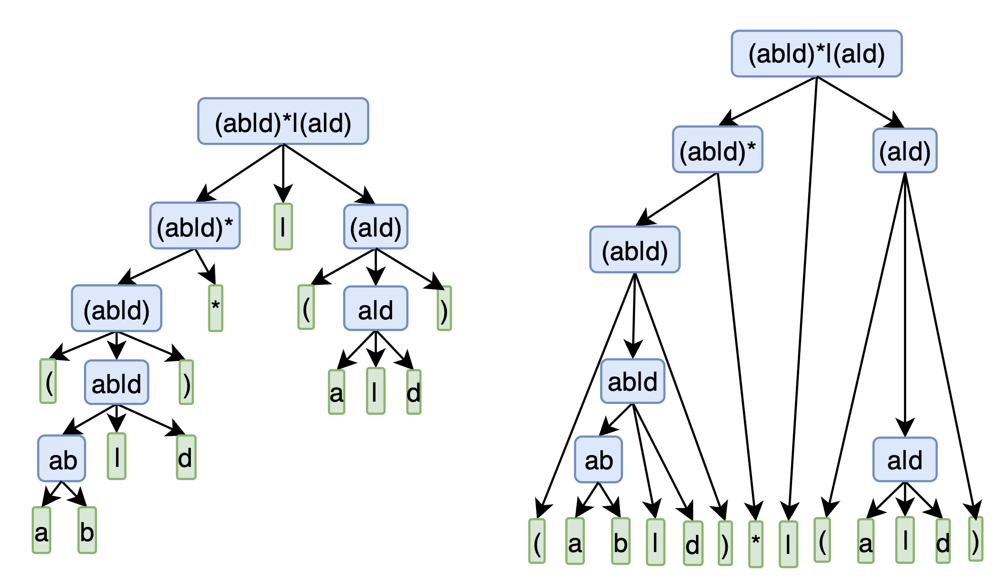
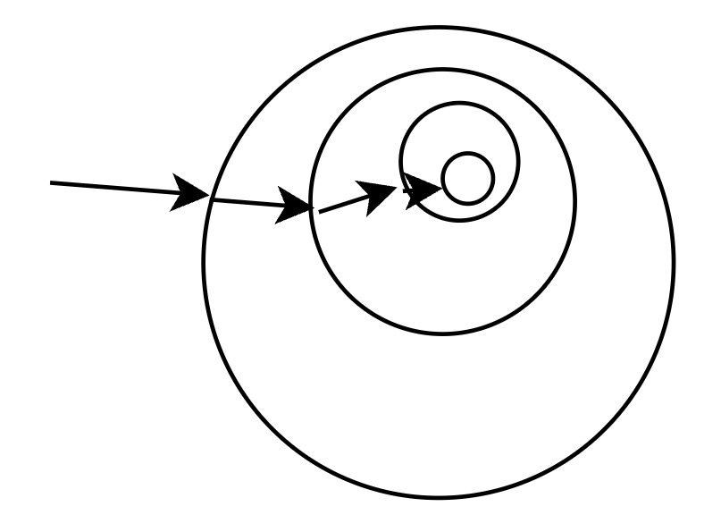

## 正则表达式文法

只考虑 2 个基本构造+3 个闭包构造 (参考汤普森构造法)

直观上,正则表达式有以下几种形式

```yacas
文法 A

S=char
S=(' S )'
S=S *'
S=SS
S=S |' S
```

其中. 3,4,5 产生式不是提取左公共因子能解决的.因为他们是非终结符前缀相同.

因此,这是一个二义性文法.

改写文法不太现实,设一个优先级比较容易.

> 先看一眼标准的正则表达式文法
>
> ```yacas
> 文法 B
> 
> regex= term |' regex | term
> term= factor term | factor
> factor= base *' | base
> base= char | \'char | (' regex )'
> ```
>
> 结果惊人地类似,但是,显然当时不会化简. 不会处理优先级


举一个例子




虽然第一版的文法有歧义,但是,一眼就能看出怎么去分解这个正则表达式.

给定一个具体的表达式很容易知道该用什么样的产生式.表达式的一般情况怎么确定. 即文法 A 中 S的产生式都是 S的一般情况, 应该优先匹配那个.

**隐约中可以感知到,能用下层第一个产生式的,一定能用父节点的产生式**,所以,越往上层,产生式所代表的集合越大.

比如下图,一直往最左子节点转,就会不断地到一个更小的集合范围.同时,范围更大的优先被推导




再看一个经典例子

```yacas
文法 C

E=E+E
E=E*E
E=(E)
```

同样的, 存在两个二义产生式. 正确的产生式就不说了,说一下怎么才能推导出正确的产生式. 书本上只给结论却没有行之有效的消除二义性的方法, 只说添加优先级却没有如何添加优先级:

`E=E+E`和`E=E*E`是两个存在歧义的产生式,但是他们本身又是不同的.为啥不独立看待

```yacas
E=T|Q
T=Q
Q=T

T=T+T			# 设 T 是加法的项,	即可以出现在 + 两边的东西
Q=Q*Q			# 设 Q 是乘法的项,	即可以出现在 * 两边的东西
```

比较优先级的一种方式就是把对方带进来看看是否能够当成一个整体来看待.

```yacas
T=T+Q*Q		| Q*Q+Q*Q | Q*Q+T			# 本质上 T+T 代表了可以无限扩展,因此,实际上只需要分析第一种即可,剩下的都是等价的
Q=Q*T+T		| T+T*T+T	| T+T*Q
```

可以看到, 将乘法表达式带入加法表达式后,乘法表达式依旧可以当成独立的一块被处理.

而将加法表达式带入到乘法表达式后,加法表达式被瓜分,不能保持独立了.

结论就是 乘法的项可以作为加法的项出现,而加法的项不能作为乘法的项.	因此,次序就出来了. 是乘法的项一定是加法的项.


结论,

- 优先级越低的产生式越靠近根节点, 匹配时,优先匹配优先级低的
- 优先级越低的适应范围更大(集合越大)
- 通过独立,如果能独立存在了,说明当前项的限制更多,集合更小,优先级越高

```yacas
# 原始文法
low = low ...
high = high ...

# 按照这样串联起 low -> higt 就可以保证优先级了

low = low high | high			 # 大集合由小集合闭包构成
high = ...								 # 小集合优先级更高, 小集合在大集合中可以独立存在

# 小集合必然是大集合的子集,因此可以带入到大集合中继续保持独立
# 而大集合包含了非小集合的部分,因此,带入到小集合会导致被分割
```


其他博客也有类似的总结:

> 博客 1
>
> 将乘法运算和加法运算拆分,其思路是,既然乘法表达式优先结合,那么索性将其放在加法表达式的前面分析,先分析的表达式必然先结合,调整后的文法如下:
>
> ```text
> MUL -> digit | digit '*' MUL
> ADD -> MUL | MUL '+' ADD
> S -> ADD
> ```
>
> 
>
> 博客 2
>
> 优先级是通过在语法推导中的层次来决定的,优先级越低,越先尝试推导
> 把乘法规则作为加法规则的子规则，这样在解析形成 AST 时，乘法节点就一定是加法节点的子节点，从而被优先计算。


回到正则文法

```yacas
T=T|T				# T 是 或的两项
R=RR				# R 是 与的两项
Q=Q*
```

可以分析具体的例子,不过直接分析文法也是一样的,把文法字符当成普通字符就是一个具体的例子了

以 `T=T|T`和 `R=RR`为例说明

```yacas
T=RR|T			# RR 可以保持独立分析
R=RT|T			# T|T 不能保持独立
```


**正则文法是上下文无关文法的一个子集**。它们的区别呢，就是**上下文无关文法允许递归调用，而正则文法不允许**。

**上下文无关的意思是，无论在任何情况下，文法的推导规则都是一样的**。比如，在变量声明语句中可能要用到一个算术表达式来做变量初始化，而在其他地方可能也会用到算术表达式。不管在什么地方，算术表达式的语法都一样，都允许用加法和乘法，计算优先级也不变。好在我们见到的大多数计算机语言，都能用上下文无关文法来表达它的语法。

其实也有**上下文相关的情况**需要处理，但那不是语法分析阶段负责的，而是放在语义分析阶段来处理的。


