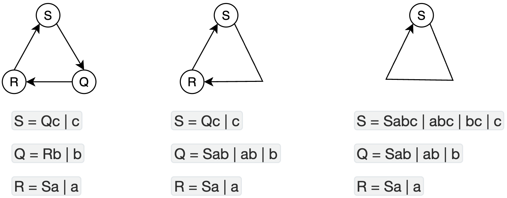

### 消除直接左递归

给定文法 `G(T)`

`T=Ta|Tb|c|d|E`

消除后的结果为

`T=cT'|dT'|ET'`

`T'=aT'|bT' | ε`

直接左递归就是可以不断地重复 T 后的内容, 某个时间可以放一个无递归的产生式

代码实现也很容易

按照产生式划分递归产生式和非递归产生式. 

然后 

- 将递归产生式的第一个拿掉,后面换成 T' 加入到新的集合中.
- 非递归的产生式后面放一个 T' 加到新的集合中

### 消除间接左递归

给定文法`G(S)`

`S = Qc | c`

`Q = Rb | b`

`R = Sa | a`

`S => Qc => Rbc => Sabc`  即 SQR 具有一个环

倒着完成表达式的带入. 将 R 带入到 SQ, 这样, SQ 就不会推导出 R 了. 

同理,将 R 带入到 S 中,这样, S 就不会推导出 R 了.

因此, SRQ 构成的环被处理成三个独立的产生式.

最初我以为是将一个环打平到一个产生式. 就面临着要打平到哪一个. 但是实际上 SRQ 每一个可能都会被需要. 因此,每一个都需要打平.

SRQ 随便按照一个顺序排列,如果,SRQ 之间存在左递归,那么,一定会有 S 出现在 R|Q 的右边第一个. 那么,先把 R|Q 到 S 的路径打断. 打断的方式就是让 R|Q 独立, 即将 R|Q 带入到 S 中.

即使,中间又多了一个其他产生式,如 A=AB 这种无关文法,也不影响正确性.

理论上,所有的符号都替换一遍,那么每个产生式都是独立的了

实践上可能不需要全部都替换,只把可能出现左递归的文法处理一下.
实践中,会对非终结符排序,然后再做替换,这样,保证相同的文法总能产生相同的结果

`第零步`

`S = Qc | c`

`Q = Rb | b`

`R = Sa | a`

`第一步`

`S = Qc | c`

`Q = ( Sa | a ) b | b = Sab | ab | b`

`R = Sa | a`

`第二步`

`S = ( Sab | ab | b ) c | c = Sabc | abc | bc | c`

`Q = ( Sa | a ) b | b = Sab | ab | b`

`R = Sa | a`

