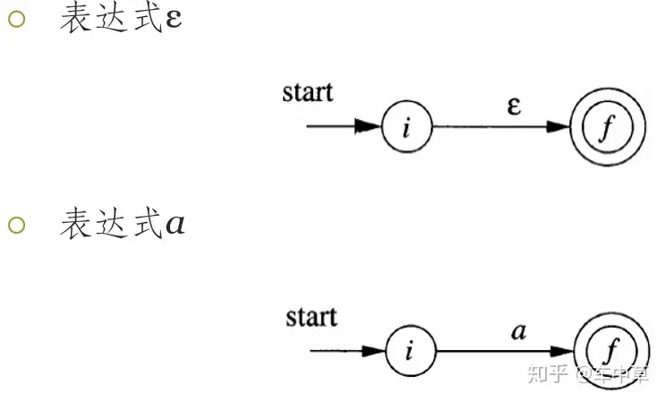
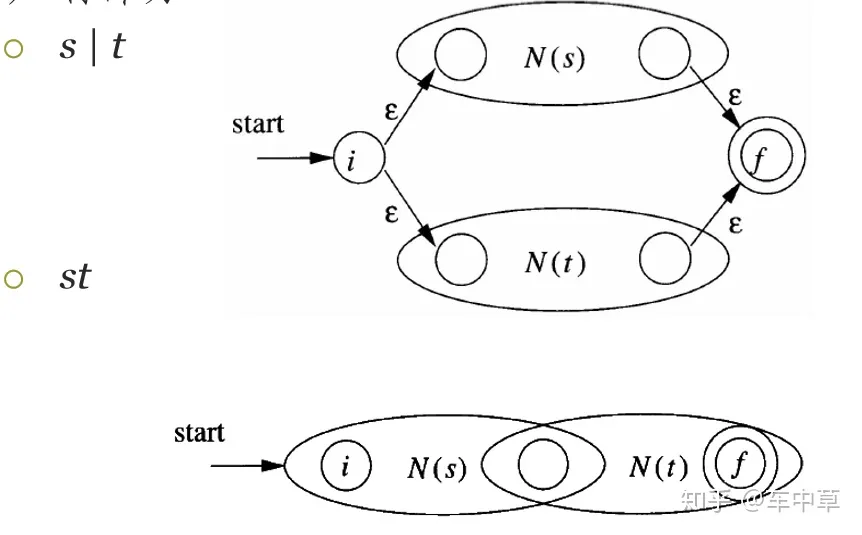
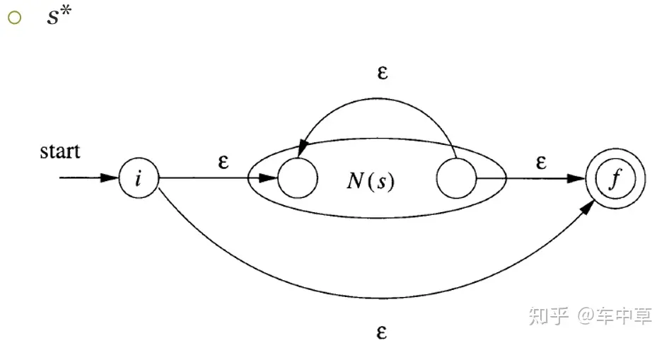
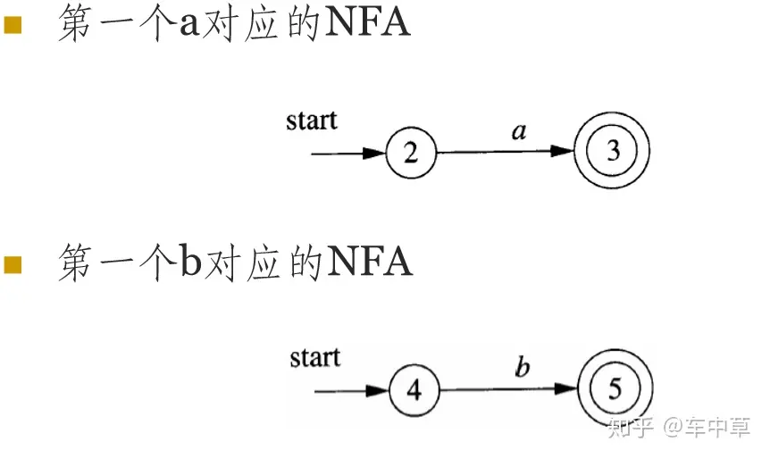
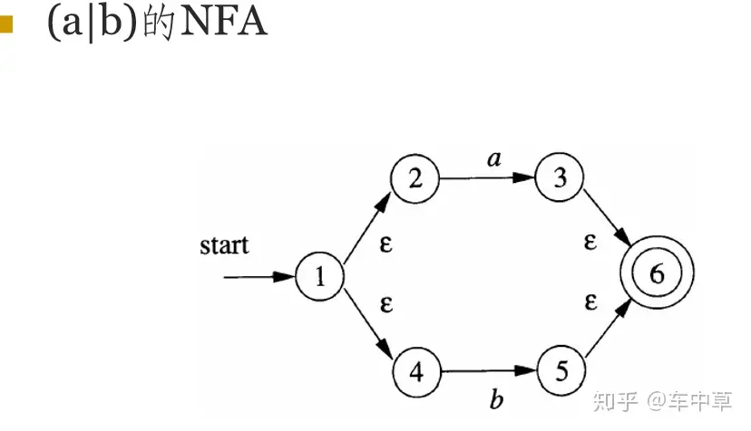
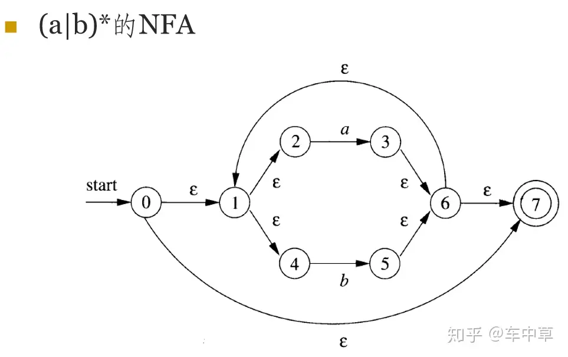

汤普森构造法是C语言&Unix之父之一的肯·汤普森(Ken Thompson)提出的构造识别正则表达式ε-NFA的方法，其原理非常简单，先构造识别子表达式的ε-NFA，再通过几个简单的规则将ε-NFA合并，最终得到识别完整正则表达式的ε-NFA。汤普森构造法的优点是构造速度快，且构造的ε-NFA状态数较少。

1.有两条基本的规则：

2.归纳部分

3.给定一个任意复杂的正则表达式，从左至右依次建立每个符号或子表达式的ε-NFA，再通过上述几个规则合并，最终能构造出识别完整正则的ε-NFA。

**正则表达式（a|b）\*构造其对应的NFA举例。**

Thompson 算法每个节点的转化只会有两种情况:

- ε 转化
- 单字符转化

