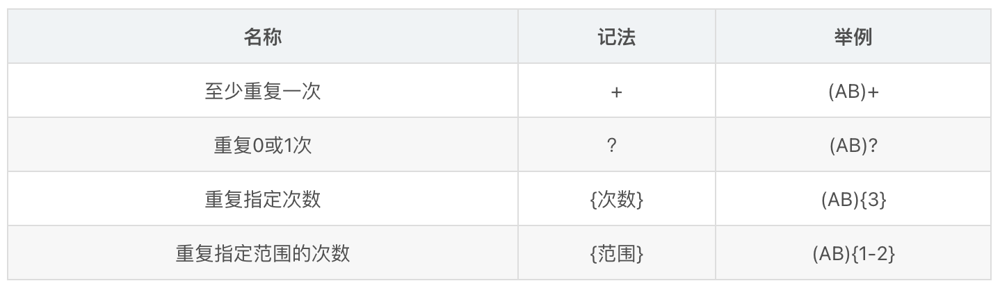

来自 Algorithms 4th Robert Sedgewick. Kevin Wayne

正则表达式是一种进行非确定性模式匹配的方式。

算法只是根基，是数理理论与工程学层次框架下的活的灵魂，也是培养系统观的产物。
正则表达式的部分应用

理论计算机科学的第一堂入门课程就应该是找出正则表达式所能指定的语言集合。你可能会意外它可以进行取余操作：(0 | 1( 01 * 0)*1)*描述的所有由0和1组成的字符串都是3的倍数的二进制表示！11、110、1001和1100都在这个语言中。

正则表达式可以高效、简洁地描述处理词法单元时用到的模式类型。
正则描述模式

语言指代一个字符串的集合，模式指代一种特定语言的详细规格说明。模式的描述由3种基本操作和作为操作数的字符组成，与大家熟悉的算术表达式的规则十分类似。

**连接操作**：AB； 当我们写出AB时，就定义了它是含有A和B连接而成的字符串。

**或操作**： 可以指定多种可能的匹配。用竖线来表示：A|E|I|O|U 为指定任选其中一个。连接操作的优先级高于或操作，因此AB|BCD指定的集合是{AB,BCD}；或操作是唯一的二元操作符，这将为后续代码实现的间简洁性埋下重要伏笔。

**闭包操作**：可以将模式的部分重复任意的次数。模式闭包是将自身连接任意多次（包括零次）得到的字符串集合。我们将 * 标记在需要被重复的模式之后，以表示闭包。闭包操作的优先级高于连接操作，因此 AB*是由A和0个或多个B的字符串组成。

**括号**：改变默认的优先级顺序！如(AB)*是由将AB连接的任意多次得到的所有字符串和空字符串组成的 { ϵ  , AB , ABAB , …}。空字串的记号是 ϵ 。

正则表达式的形式语义

- 空字符串 ϵ 
- 单个字符
- 包含在括号中的另一个正则表达式
- 两个或多个连接起来的正则表达式
- 由或运算符分割的两个或多个正则表达式
- 由闭包运算标记的一个正则表达式

描述一种语言可以有许多中不同的方法，我们必须给出最简洁的模式，进而实现高效算法一样。

/image-20231225132258613.png)

缩略写法

一般程序都在基本规则的基础上增加了各种额外的规则，以力求简洁地描述实际应用中所需的语言。我们会发现限制一件事物，往往能获得意想不到的收益，如同上世纪60年代针对与结构化设计原理有悖的goto语句的颠覆。下面是一些基本操作的实用扩展（缩略写法），能简洁地写出强大的模式。
字符集描述符

只要一两个字符来直接表示一系列字符集时常能带来方便

/image-20231225132450843.png)

闭包的简写

实际应用中，我们不仅希望能复制任意多次，更愿意可以灵活指定重复的次数或范围。




转义序列

以上用到的构造正则表达式的特殊字符称为元字符，我们开头加上反斜杠开头的转义序列来区分元字符和字母表中的字符。

有穷自动机

- 本质上和状态转换图相同，但有穷自动机只回答Yes/No
  - 不确定的有穷自动机（NFA）：边上的标号没有限制，一个符号可出现在离开同一个状态的多条边上，ε可以做标号 
  - 确定的有穷自动机（DFA）：对于每个状态和没个符号，有且只有一条边
- 两种自动机都识别正则语言
      对于每个可以用正则表达式描述的语言，均可用某个NFA或DFA来识别；反之亦然

NFA的定义：

    一个有穷的状态集合SS
    一个输入符号集合Σ
    转换函数：对于每个状态和符号，给出相应的后继状态集合
    S中的某个状态s_0被指定为开始状态/初始状态
    S的一个子集F被指定为接受状态集合
NFA的表示方式：

    状态转换图
    转换表

一个NFA能够接受字符串，当且仅当对应的转换图中存在一条从开始状态到某个接受状态的路径，且该路径各条边上的标号按顺序组成该字符串。

NFA接受的语言：从开始状态到达接受状态的所有路径的标号串的集合，即该NFA接受的字符串的集合。

一个NFA被称为DFA，如果

    没有标号为 ε \varepsilon ε的转换，并且
    
    对于每个状态s和每个输入符号a，有且仅有一条标号为a的离开s的边
非确定有限状态自动机

相比KMP的有限状态自动机可根据文本中的字符改变自身的状态，当且仅当自动机达到停止状态时它找到匹配或确定不匹配，每种状态的转换完全由文本中的字符决定，是确定的。而正则表达式则要一种更加强大的抽象自动机，因为或操作的存在，自动机无法根据一个字符就判断出模式是否出现；因为闭包存在，自动机甚至无法知道需要检查多少字符才会出现匹配失败。为了克服这一困难，我们需要非确定性的自动机（NFA ）。

    kleene定理 是理论计算机科学中一个重要结论，它证明了对于任意正则表达式都存在一个 与之对应的非确定有限状态自动机（反之亦然）。

正则表达式模式匹配程序的总体结构与KMP算法基本一致：

    构造和给定正则表达式相对应的非确定有限状态自动机
    模拟NFA在给定文本上的运行轨迹

我们来看看NFA的性质和操作，NFA是用来判断一段文本是否包含在正则表达式所描述的语言中。

NFA有着以下特点：

    长度为M的正则表达式中的每个字符在所对应的NFA中都有且只有一个对应的状态。NFA的起始状态为0并含有一个（虚拟的）接受状态M。
    字母表中的字符所对应的状态都有一条从它指向的边，这条边指向模式中的下一个字符所对的状态。
    元字符" ( “，” ) “，” | “和” * "所对应的状态至少含有一条指出的边（红色边）
    有些状态有多条指出的边，但一个状态只能有一条指出的黑色边

例子： ( ( A ∗ B ∣ A C ) D ) ((A*B|AC)D) ((A∗B∣AC)D)所对应的NFA （约定所有模式包含在括号里）/format,png.png)


这里引入两种状态转换

    匹配转换：当前状态和字母表中的一个字符相对应且文本中的当前字符和该字符相匹配，自动机可以扫过文本中的该字符转换到下一个状态。
    ϵ \epsilon ϵ转换：匹配空字符，转换到另一个状态而不扫描文本中任何文本。 比如* 或 | 等等。

所以不确定性指的是离开状态的转移可能有多种，即使不扫描任何字符，它在不同时间所进行的状态转移也可能是不同的。

NFA必须能猜测文本的转换才能到接受状态。实际上从给定文本位置0到EOF，如果进行一系列状态转换并最终到达接受状态，则称NFA识别了一个文本字符串，否则扫描所有字符后的NFA处于未接受状态。证明存在性可跟踪NFA处理文本字符串的轨迹，确定转换序列。对于找到一个序列，或者证明不存在这样一个序列，这些问题可以用遍历——即系统地尝试所有可能 解决！
模拟NFA运行
自动机数据结构表示

字符数组！存放正则表达式本身，表示了所有状态名，表示了匹配转换！ $\epsilon $转换由有向图表示！！！
自动机模拟

模拟NFA运行轨迹，我们会记录自动机在检查当前输入字符时可能遇到的所有状态集合。多点可达性的算法实现是保障了 ϵ \epsilon ϵ转换可达的状态集合。初始化集合是由状态0通过 ϵ \epsilon ϵ转换可达的状态构成。

往NFA中输入字符，去尝试匹配每一个状态，匹配则进入下一状态。实例NFA中初始状态集合为{0,1,2,3,4,6}，如果第一个输入字符为A，那么NFA通过匹配转换可能到达的状态是{3，7}，然后它可能进行3到2或3到4的 ϵ \epsilon ϵ转换，因此可能与第二个字符匹配的状态集合为{2,3,4,7}；迭代上述过程直到文本结束可能有两种结果：

    含有接受状态
    不含有接受状态
最坏情况下的成本为文本和模式的长度之积，这与初级字符串匹配算法的成本是相同的！

```java
public boolean recognizes(String txt){
        Bag<Integer> pc=new Bag<Integer>();
        DirectDFS dfs =new DirectDFS(G,0);

        for (int i = 0; i <txt.length() ; i++) {
            Bag<Integer> match =new Bag<>();
            for (int v:pc) {
                if(v<M)
                    if(re[v] == txt.charAt(i) || re[v]=='.')
                        match.add(v+1);
            }
            pc=new Bag<Integer>();
            dfs=new DirectDFS(G,match);
            for (int j = 0; j <G.V() ; j++) {
                if(dfs.marked(j)) pc.add(j);
            }
        }
        for (int v: pc) {
            if(v==M)
                return true;
        }
        return false;
    }
```

构造与正则表达式对应的NFA

正则表达式转化为NFA过程类似于Dijkstra的双栈算法对算术表达式的处理。

不同之一是正则表达式的构造只要一个栈就可以了！

根据NFA数据结构的表示，字符数组和有向图G一个都不能少。我们将会用栈了记录左括号和或运算符的位置，栈极为擅长处理嵌套结构。

下面给出核心操作构造实现：

连接操作：太容易实现了！状态的匹配转换和字母表中的字符的对应关系就是连接操作的实现。

括号：左括号压栈，右括号弹出符号。

闭包操作：1.*出现在单个字符后，字符于 * 添加两条 ϵ \epsilon ϵ转换形成闭环 2.*出现在右括号后，将对应的左括号和 * 之间添加两条 ϵ \epsilon ϵ转换形成闭环。

或操作：作为唯一一个二元操作符，直接放图，还是有向图里的 ϵ \epsilon ϵ转换

/format,png-20231225132828801.png)


```java
public class NFA {
    private char[] re;
    private DiGraph G;
    private int M;

    //构造regexp的NFA
    public NFA(String regexp){
        Stack<Integer> ops=new Stack<Integer>();
        re=regexp.toCharArray();
        M=re.length;
        G=new DiGraph(M+1);

        for (int i = 0; i <M ; i++) {
            int lp=i;
            if(re[i] == '(' || re[i]=='|')
                ops.push(i);
            else if(re[i]==')'){
                int or=ops.pop();
                if(re[or]=='|'){
                    lp=ops.pop();
                    G.addEdge(lp,or+1);
                    G.addEdge(or,i);
                }
                else lp=or;
            }
            if( i<M-1 && re[i+1] == '*'){
                G.addEdge(lp,i+1);
                G.addEdge(i+1,lp);
            }
            if(re[i] == '(' || re[i]=='*' || re[i]== ')')
                G.addEdge(i,i+1);
        }
    }

    public boolean recognizes(String txt) //上文
}
```


https://blog.csdn.net/Fzidx/article/details/108135785


